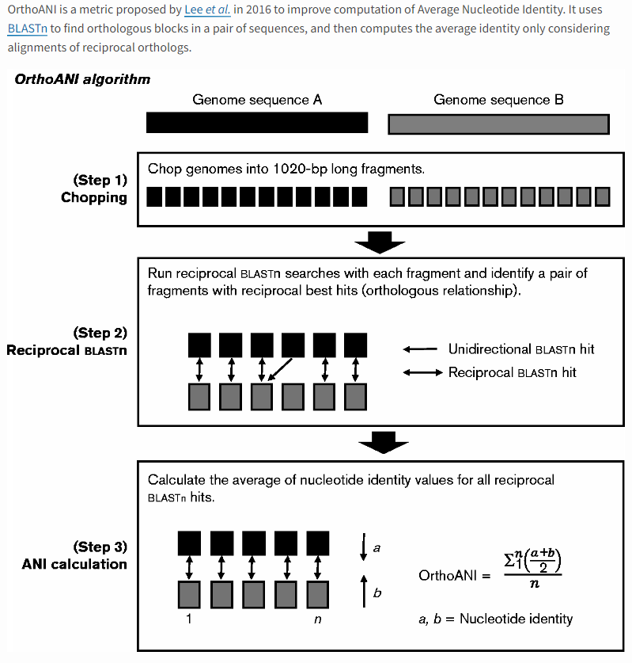

<style>
img{
    width: 60%;
}
</style>


基因组相似性计算:
* ANI(Average **Nucleotide** Identity): FastANI
* AAI(Average **Amino acid** Identity): compareM
* DDH(DNA-DNA hybridization): GGDC    

通常种间的界定阈值为DDH=70%，ANI=95%，AAI=95%  


### FastANI
Install： 

* 如果Conda不行，则按照：https://github.com/ParBLiSS/FastANI
```
conda create --name FastANI
conda activate FastANI
conda install -c bioconda fastani
```
用法：  
```
fastANI -q [QUERY_GENOME] -r [REFERENCE_GENOME] -o [OUTPUT_FILE]
fastANI -q [QUERY_GENOME] --rl [REFERENCE_LIST] -o [OUTPUT_FILE]
fastANI --ql [QUERY_LIST] --rl [REFERENCE_LIST] -o [OUTPUT_FILE] --fragLen 1000 -t 10 --matrix
```

REFERENCE_LIST示例
```
S1.fa
S2.fa
S3.fa
```

非matrix情况下OUTPUT_FILE某一行示例
```
S1.fa   S2.fa   <ANI>   <Aligned_fragment_num_in_S1>  <Aligned_fragment_num_in_S2>
S1.fa   S3.fa   97.7507   1303  1608
```

matrix情况下OUTPUT_FILE某一行示例
```
S1.fa   
S2.fa   97.7507
S3.fa   77.6630   99.7707
```


### ANI v.s. OrthoANI
* ANI:
* Step1: Split Genome_A to fragments and map to Genome_B, **ANI_A2B** = average(match identity of match fragments); **match** means sequence identity >= 30%, length >= 70% * 1020bp   
* Step2: **ANI_B2A**    
* Step3: ANI_AB = average(ANI_A2B,ANI_B2A)   
* **注：FastANI只计算了ANI_A2B, 是以调换Ref、Query会有不同结果**   

* OrthoANI: Matching fragments    



### 参考
ANI: https://www.jianshu.com/p/9a8bdf141c27   
ANI计算汇总：https://blog.csdn.net/weixin_43799332/article/details/125970297    
**ANI计算原理**：https://blog.csdn.net/songyi10/article/details/118378233     
FastANI：https://www.jianshu.com/p/ebce09e3fd20   
FastANI：https://github.com/ParBLiSS/FastANI   
其它：https://www.jianshu.com/p/ebce09e3fd20    


