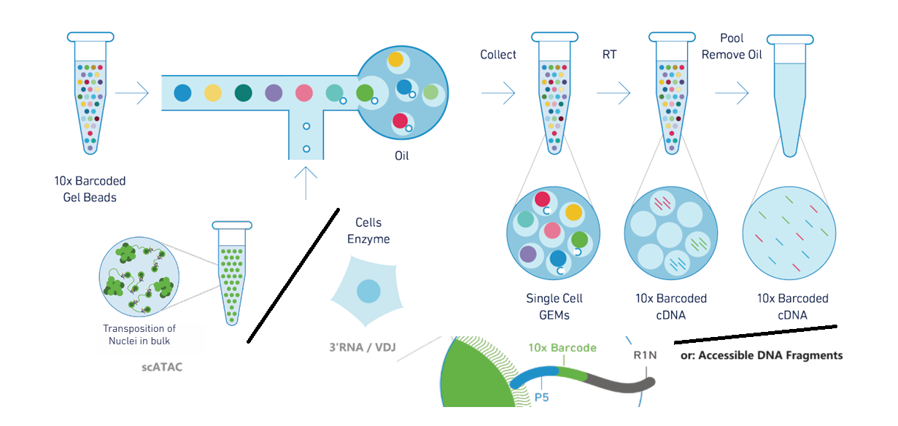

<style>
img{
    width: 60%;
}
</style>


10x Genomics 单细胞测序数据处理工具，默认示例为scRNA的处理选项

**注意**：下方代码中换行只是为了看起来方便，实际使用如果出错则删掉换行

## Chromium

10x Chromium平台提供单细胞水平的以下测序： [3' gene expression](https://cdn.10xgenomics.com/image/upload/v1660261285/support-documents/CG000360_GettingStartedSingleCell3-GeneExpression_RevA.pdf)，[5' gene expression alongside V(D)J repertoire profiling](https://cdn.10xgenomics.com/image/upload/v1660261285/support-documents/CG000361_GettingStartedImmuneProfiling_RevA.pdf)，[ATAC](https://cdn.10xgenomics.com/image/upload/v1660261285/support-documents/CG000362_GettingStartedSingleCellATAC_Rev_B.pdf)


其原理大致为：将待测物质放入带有barcode的小液珠中进行标记，随后统一进行测序。




## Install
参考[Installing Cell Ranger tutorial](https://support.10xgenomics.com/single-cell-gene-expression/software/pipelines/latest/using/tutorial_in)，填写个人信息后可下载得到压缩包，$PWD中解压：
```
tar -xzf cellranger-7.1.0.tar.gz
export PATH=$PWD/cellranger-7.1.0:$PATH
```
注意，它依赖bcl2fastq:
```
conda install -c dranew bcl2fastq
```
之后使用sitecheck测试系统与硬件要求，testrun选一个小数据集试测。


## mkfastq
将bcl转换为fastq，输出的fq文件位于output_folder/outs/中
```
cellranger mkfastq       
  --id=<output_folder>        ## output folder
  --run=<bcl_folder>          ## bcl folder (provided by illumina)
  --csv=<bcl_csv>             ## bcl csv    (provided by illumina)
```
*详见[link](https://support.10xgenomics.com/single-cell-gene-expression/software/pipelines/latest/using/tutorial_fq)*


## mkgtf/mkref
生成 10x-compatible transcriptome reference
```
## Filter GTF
cellranger mkgtf <input.gtf> <filtered.gtf>  
  --attribute=<key:value>                       ## attributes to be kept in the GTF file
  --attribute=gene_biotype:protein_coding     
  --attribute=gene_biotype:IG_LV_gene     


## make transcriptome ref
cellranger mkref           
  --genome=<name>               ## Unique genome name(s), used to name output folder; if multiple, output folder will be <name1>_and_<name2>
  --fasta=<ref1.fa>             ## Path(s) to FASTA file; if multiple fa, specifying --fasta multiple times
  --genes=<filtered.gtf>        ## Path(s) to genes GTF file; if multiple gtf, specifying --genes multiple times
```
*详见[link](https://support.10xgenomics.com/spatial-gene-expression/software/pipelines/latest/advanced/references#header)*；其中attribute可参考：[gene_biotype](https://www.gencodegenes.org/pages/biotypes.html), [GTF attributes](https://support.10xgenomics.com/single-cell-vdj/software/pipelines/latest/advanced/references#input-gene)  


## count
将reads映射至参考基因组(STAR进行比对)，分选计数，并且生成 .cloupe file 以供 Loupe Browser中的可视化和分析；**Naming convention:**  (Sample_A_S1_L00X_R1_001.fastq.gz), sample_PREFIX(Sample_A), Lane(L00X)；最好存在sample_PREFIX_xxx/文件夹中   
```
cellranger count 
   --id=<output_folder>             
   --fastqs=<fastq_folder>        
   --sample=<sample_PREFIX>         ## select sample from <fastq_folder>
   --transcriptome=<ref_folder>

## cellranger count --help 查看更多filter选项（lane、长度、等等）
## --target-panel 计算Targeted Gene Expression，见下文
```
*详见[link](https://support.10xgenomics.com/single-cell-gene-expression/software/pipelines/latest/using/tutorial_ct)*


* 结果于output_folder/outs中 
```bash
├── analysis/                         ## clustering, diffexp, pca, tsne, umap
├── cloupe.cloupe                     ## downstream: Loupe Browser
├── filtered_feature_bc_matrix/       ## downstream: monocle, Seurat, ...
│   ├── barcodes.tsv.gz
│   ├── features.tsv.gz
│   └── matrix.mtx.gz  
├── filtered_feature_bc_matrix.h5
├── metrics_summary.csv
├── molecule_info.h5                  ## for other cellranger pipe
├── possorted_genome_bam.bam
├── possorted_genome_bam.bam.bai
├── raw_feature_bc_matrix/
├── raw_feature_bc_matrix.h5
└── web_summary.html
```


## aggr (opt.)
整合多个Cell Ranger counts的结果；  
**举例**：除开Cell Multiplexing情况，一份样品(sample)放在一个GEM well中，多个GEM well的情况下必须为每个well分别运行count操作  

准备一个h5.csv (h5为count结果中molecule_info.h5):
```
sample_id,molecule_h5
AA,abs_path_AA_h5
BB,abs_path_BB_h5
```

run: 
```
cellranger aggr --id=<output_folder> --csv=<h5.csv>
```
*详见[link](https://support.10xgenomics.com/single-cell-gene-expression/software/pipelines/latest/using/tutorial_ag)*

output_folder:
```
├── aggregation.csv
├── count
│   ├── analysis/
│   ├── cloupe.cloupe
│   ├── filtered_feature_bc_matrix/
│   ├── filtered_feature_bc_matrix.h5
│   └── summary.json
└── web_summary.html
```

## multi (opt.)
Cell Multiplexing情况下使用。简单来说就是许多样本各自加上CMO tag后pool到一起，加到同一个GEM well中 (可以想象多样本加到lane中的情况，只不过GEM well是生成小液滴的步骤)。  
准备一个config.csv，可用 **cellranger multi-template** 生成示例
```
[gene-expression]
ref,<ref_folder>

[libraries]
fastq_id,fastqs,lanes,feature_types
MM_1_gex,<MM_1_gex_fastqs>,any,Gene Expression
MM_1_multiplexing_capture,<MM_1_multiplexing_capture_fastqs>,any,Multiplexing Capture

[samples]
sample_id,cmo_ids,description
S1,CMO301,SampleN1
S2,CMO302,SampleN2
```

结果生成在output_folder/outs/中: 
```
cellranger multi --id=<output_folder> --csv=<config.csv>
```
*详见[link](https://support.10xgenomics.com/single-cell-gene-expression/software/pipelines/latest/using/tutorial_cp)*


## targeted-depth (opt.)
给定WTA(whole transcriptome analysis)数据集、目标基因集，计算目标基因的在WTA中占比、在cell中均值; 其结果有助于计算目标基因表达实验的测序深度

molecule_info.h5为count操作输出，target_panel可从Cell Ranger安装目录中target_panels/中找到（human only），或参考[Panel Selection](https://support.10xgenomics.com/targeted-gene-expression/panel-selection/overview)  
```
cellranger targeted-depth   --molecule-h5  <molecule_info.h5>  --target-panel  <target_panel.csv>
```
注意reference，否则:
```
error: The gene b'ENSG00000286070' from the target panel csv is not present
in the reference transcriptome used by the molecule info h5 file.
```
*详见[link](https://support.10xgenomics.com/single-cell-gene-expression/software/pipelines/latest/using/targeted-depth)*


## targeted-compare (opt.)
需要同时先对WTA(称parent) 与 target-panel(称target, 可视为**hybrid capture的结果**) 进行count，注意：reference必须一致、target_panel.csv也要相符
```
cellranger count --id=target --target-panel <target_panel.csv> ...

cellranger count --id=parent ...
```

评估target的富集程度、于parent的占比: 
```
cellranger targeted-compare 
    --id=<output_folder>
    --targeted=<target_molecule_info.h5>
    --parent=<parent_molecule_info.h5>
    --target-panel <target_panel.csv>

```
*详见[link](https://support.10xgenomics.com/single-cell-gene-expression/software/pipelines/latest/using/targeted-compare)*


## Other Opt
```
vdj                 Assembles single-cell VDJ receptor sequences from 10x Immune Profiling libraries
reanalyze           Re-run secondary analysis (dimensionality reduction, clustering, etc)
mkvdjref            Prepare a reference for use with CellRanger VDJ
mat2csv             Convert a gene count matrix to CSV format
```

## scATAC

参考[Cell Ranger ATAC](https://support.10xgenomics.com/single-cell-atac/software/pipelines/latest/what-is-cell-ranger-atac)，其流程类似上文scRNA数据的处理：

```
cellranger-atac mkfastq           ## BCL => FASTQ
cellranger-atac count             ## Mapping & PeakCalling & PeakFiltering
```

对于Multiplexing情况依旧有 ```cellranger-atac aggr``` 对多样本生成统一的count matches(peaks)，但由于数据质量差异较大的情况，建议分群后再用 MACS2 重新进行 PeakCalling

## V(D)J

参考[Cell Ranger V(D)J](https://support.10xgenomics.com/single-cell-vdj/software/pipelines/latest/tutorial/tutorial-vdj)


## 10x Fastq格式示例
* I1：Sample Index (opt.)
```
@A00228:279:HFWFVDMXX:1:1101:8486:1000 1:N:0:NCATTACT
NCATTACT
+
#FFFFFFF
@A00228:279:HFWFVDMXX:1:1101:10782:1000 1:N:0:NCATTACT
NCATTACT
+
#FFFFFFF
```

* R1：cell barcode + UMI (16bp + 12bp)
```
@A00228:279:HFWFVDMXX:1:1101:8486:1000 1:N:0:NCATTACT
NGTGATTAGCTGTACTCGTATGTAAGGT
+
#FFFFFFFFFFFFFFFFFFFFFFFFFFF
@A00228:279:HFWFVDMXX:1:1101:10782:1000 1:N:0:NCATTACT
NTCATGAAGTTTGGCTAGTTATGTTCAT
+
#FFFFFFFFFFFFFFFFFFFFFFFFFFF
```

* R2：插入片段
```
@A00228:279:HFWFVDMXX:1:1101:8486:1000 2:N:0:NCATTACT
NACAAAGTCCCCCCCATAATACAGGGGGAGCCACTTGGGCAGGAGGCAGGGAGGGGTCCATTCCCCCTGGTGGGGCTGGTGGGGAGCTGTA
+
#FFFFFFFFFFFFFFF:FFFFFFF:FFFFFFFFFFFFFFFFFFFFFFFFFF:FFFFFFFFFFFFFFFF:FFFFFFFFFFFFFFFFFFFFFF
@A00228:279:HFWFVDMXX:1:1101:10782:1000 2:N:0:NCATTACT
NTTGCAGCTGAACTGGTAAACTTGTCCCTAAAGAGACATAAGAATGGTCAACTGGAATGTGGATTCATCTGTAACATTACTCAGTGGGCCT
+
#FFFFFFFFFFFFFFFFFFFFFFFFFFFFFFFFFFFFFFFFFFFFFFFFFFFFFFFFFFFFFFFFFFFFFFFFFFFFFFFFFFFFFFFFFF
```


## 参考导航

比较有用的导航：[Tutorial](https://support.10xgenomics.com/single-cell-gene-expression/software/pipelines/latest/using/tutorial_ov), [Outputs解释](https://support.10xgenomics.com/single-cell-gene-expression/software/pipelines/latest/output/overview ), [Glossary of Terms](https://support.10xgenomics.com/single-cell-gene-expression/software/pipelines/latest/glossary), [Matrix HDF5 Format](https://support.10xgenomics.com/single-cell-gene-expression/software/pipelines/2.0/advanced/h5_matrices)  

之后需要了解的: [vdj(T/B Cell)](https://support.10xgenomics.com/single-cell-vdj/software/pipelines/latest/using/vdj), LoupeBrowser, ... 


