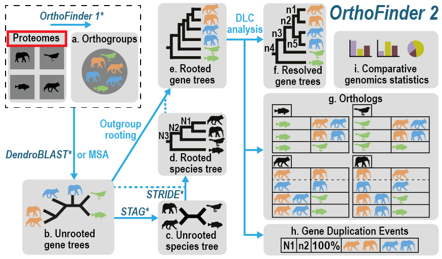

<style>
img{
    width: 80%;
}
</style>




### Concepts
* LCA: Last Common Ancestor
* (形容一对基因间的关系)
* Homologs: 来源于**共同祖先**的相似序列
    * Ortholog: 因**物种形成**而分支进化的基因 (i.e. 来源于**2个**物种的LCA中某个基因的一对基因)
    * Paralogs: **同一物种**中由于**复制**形成的基因，可能会进化出与原功能相关的功能
    * Xenologs: 通过共生或病毒侵染导致的**水平基因转移**，基因在**跨度巨大的物种间**跳跃转移
* COG: Clusters of Orthologous Groups of proteins, NCBI
    * 原核生物: COG数据库
    * 真核生物: KOG数据库
* (Species-specific) Orthogroup: 来自**一组三个及以上物种**的LCA中某个基因的一组基因
* Single-copy gene: 在生物的一个染色体组中只有一份拷贝的基因 (对比：Multi-copy gene)
* Single-copy Orthologs (SC-OGs): Ortholog，且表现为单拷贝形式


### Install
conda: 
```
conda create -n orthofinder2 -c bioconda orthofinder -y
conda activate orthofinder
conda deactivate
```

use [releases](https://github.com/davidemms/OrthoFinder/releases) if conda fails
```
wget https://github.com/davidemms/OrthoFinder/releases/download/2.5.5/OrthoFinder.tar.gz
tar xzvf OrthoFinder.tar.gz
export PATH=$PWD/OrthoFinder/:$PATH
```
如果GLIBC版本报错，可于[Tricks](../../../Tricks/Linux)中搜索关键词

### Usage
FAA_folder/中存放proteomes fasta，每个species一个文件; 先用其自带的ExampleData/
```
FAA_folder=OrthoFinder/ExampleData/

orthofinder -f $FAA_folder
```


### Results
output会在FAA_folder/OrthoFinder/Results_*/中, 官方解读见[exploring-orthofinders-results](https://davidemms.github.io/orthofinder_tutorials/exploring-orthofinders-results.html), 推荐一个[中文解读](https://www.jianshu.com/p/bef97d10928d),示例结果文件夹：[Results_Jun30.zip](../OrthoFinder/Results_Jun30.zip)  


列出需要注意的文件，其中tree可用[ETE Toolkit tree viewer](http://etetoolkit.org/treeview/)在线查看：
```
Comparative_Genomics_Statistics/
    - Statistics_PerSpecies.tsv          ## QC
    - Duplications_per*.tsv
    - 
Species_Tree/
    - SpeciesTree_rooted.txt             ## buikt by STAG, rooted by STRIDE
    - SpeciesTree_rooted_node_labels.txt ## tree node labled 'N0'...（for checking Gene_Duplication_Events）
Orthologues/
    - Orthologues_A_B/*.tsv              ## find SpeA_GeneX's orthologue in SpeB (& belong to which Orthogroup)
    - *.tsv                              ## find SpeA_GeneX's orthologue in other Spes (& belong to which Orthogroup)
Orthogroups/                             
    - Orthogroups.tsv                    ## Each Orthogroups contains wich gene from which Spe
Gene_Trees/
    - OG*******_tree.txt                 ## Gene tree for each Orthogroups
Gene_Duplication_Events/
    - SpeciesTree_Gene_Duplications_0.5_Support.txt    ## tree node labled 'N0_35'... 35:well-supported duplication events
    - Duplications.tsv                   ## Check where Duplication happened
Resolved_Gene_Trees/
    - OG*******_tree.txt                 ## Gene tree node labled 'N0'...（for checking Gene_Duplication_Events）
Orthogroup_Sequences/
    - OG*******.fa                       ## sequences for the genes in orthogroup


Single_Copy_Orthologue_Sequences/        ## 单拷贝直系同源组序列

Phylogenetic_Hierarchical_Orthogroups/
Phylogenetically_Misplaced_Genes/
Putative_Xenologs/
```


### 注意
* STAG(默认)比-M msa更严格
* SpeciesTree_rooted不正确不会影响orthogroup inference，但可能会影响orthologue inference (如果有gene duplication events)。此情况需手动修改tree，然后在修改后物种树的基础上使用(-ft and -s options)
    ```
    -s <file>       User-specified rooted species tree
    ``` 
    ，
    ```
    -ft <dir>         Start OrthoFinder from pre-computed gene trees in <dir>
    ```
* Gene-duplication events are considered ‘well-supported’ if at least 50% of the descendant species have retained both copies of the duplicated gene
* Resolved_Gene_Trees/ 因使用Duplication-Loss-Coalescence analysis而更加parsimonious，可能与gene_trees/有细微不同


### 参考
Tutorial:  https://davidemms.github.io/   
友好阐释：https://blog.csdn.net/sinat_41621566/article/details/112320002   
newick：https://www.jianshu.com/p/80f0b8ebf2a5    
结果阐释：https://www.jianshu.com/p/82d4cf6c3eda  


