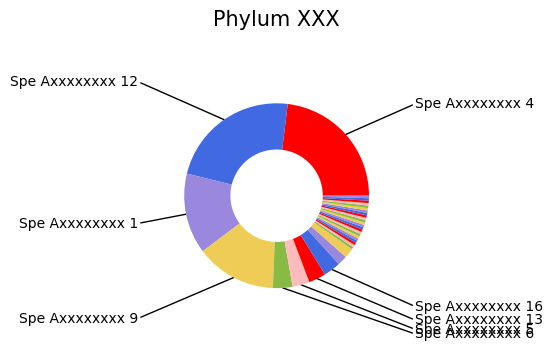
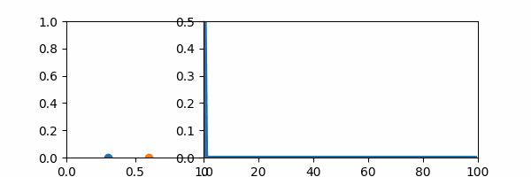

<style>
img{
    width: 50%;
}
</style>


* Scripts：[ploting_func.py](Matplotlib/ploting_func.py)   
* Example Usage：[Gallary.ipynb](Matplotlib/Gallary.ipynb)  

## import packages
```
import numpy as np
import matplotlib.pyplot as plt
from matplotlib import cycler

from ploting_func import *
```


## Set color list (optional)
```
cycler_colors = plt.cycler(color=['#FF0000', '#4169E1', '#9988DD','#EECC55', '#88BB44', '#FFBBBB'])
plt.rc('axes', facecolor='black', edgecolor='b',prop_cycle=cycler_colors)

# or: plt.style.use('ggplot')
```


### bar_of_pie_plot

```
## Example Input
pie_values = [271,560,170]
pie_labels = ['Phylum A', 'Phylum B', 'Unspecified']
bar_values = [33,1,1,54,7,8,1,1,33,1,1,54,7,4,1,7,4,1,1]
bar_labels = ['Spe {}'.format(i+1) for i in range(len(bar_values))]


## Plot and save
fig = bar_of_pie_plot(pie_values,pie_labels,bar_values,bar_labels,
                    figsize=(9, 5),
                    con_color = [0,0,0], ## R G B
                    con_linewidth = 1.5,
                    anno_y_min_gap = 0.05,    ## prevent label text overlap, adjust on y axis & decide if to show bar_label
                    sort_bar_values = True
                    )
```


### donut_pie_plot

```
## Example Input
pie_values = [33,1,1,54,7,8,1,1,33,1,1,54,7,4,1,7,4,1,1,1,1,1,1,1,1,1,1,1,1,1,1,1,1]
pie_labels = ['Spe Axxxxxxxx {}'.format(i+1) for i in range(len(pie_values))]
title_text = 'Phylum XXX'

## Plot and save
fig = donut_pie_plot(pie_values,pie_labels,title_text,
                   figsize=(6, 3),
                   title_fontsize = 15, 
                   startangle = 0,
                   donut_width = 0.5,      ## pie: 1
                   connectionstyle='arc3', ## bar arc 'angle' angle3  arc3
                   text_min_ang = 360*0.02,
                   sort_values = True
                  )
```


### Heatmap

```
import seaborn as sns
import pandas as pd
df = pd.DataFrame(np.random.randint(1,100,size = (8, 5)),
                  columns=['col_{}'.format(i) for i in range(5)],
                  index=['idx_{}'.format(i) for i in range(8)])
fig = sns.clustermap(df, figsize=(3, 3))
plt.savefig('img/heatmap.png',bbox_inches='tight')
```


### Animation


<details>
<summary> 示例一 </summary>
```
from matplotlib.animation import FuncAnimation
from scipy.stats import binom

fig, (ax1, ax2) = plt.subplots(
    ncols=2,
    sharey=False,
    figsize=(6, 2),
    gridspec_kw=dict(width_ratios=[1, 2], wspace=0),
)

## Init objects to be updated at each frame
### if Init with values, x/ylim will be calculated based on that
point, = ax1.plot([], [], marker='o')
point_line, = ax1.plot([], [], marker='o')
line_pmf,  = ax2.plot([], [], lw=3)

## optional
def animate_init():
    point.set_data(0,0)
    point_line.set_data([0],[0])
    line_pmf.set_data([k for k in range(100)], [0 for k in range(100)])
    ax1.set_xlim(0,1)
    ax1.set_ylim(0,1)
    ax2.set_ylim(0,0.5)
    ax2.set_xlim(0,100)
    
## what to plot at each frame;  i:value of frames
## .set_data([],[]) for ax.plots
## .set_text('')/.set_position((x,y)) for ax.text
def animate_func(i): 
    x = [k for k in range(100)]
    y_pmf = [binom.pmf(k=k,n=100,p=i) for k in x]
    point.set_data(0.3,i)
    point_line.set_data(0.6,[ii*0.01 for ii in range(101)if ii*0.01<=i])
    line_pmf.set_data(x,y_pmf)


ani = FuncAnimation(fig,
                    animate_func,
                    frames=[i*0.01 for i in range(101)],
                    init_func=animate_init,
                    fargs=None,
                    save_count=None,
                    cache_frame_data=True)

ani.save('img/animation.gif', fps=25, writer='pillow')
```
</details>


<details>
<summary> 示例二 </summary>

```
from matplotlib.animation import FuncAnimation
from matplotlib.gridspec import GridSpec
from matplotlib.ticker import MultipleLocator
import numpy as np
import matplotlib.pyplot as plt


angels = [k for k in range(360)]  #0-359
circle_x = np.cos([a*np.pi/180 for a in angels])
circle_y = np.sin([a*np.pi/180 for a in angels])


fig = plt.figure(figsize=(15, 5))
gs1 = GridSpec(nrows=3,ncols=9,left=0.05)
ax11 = fig.add_subplot(gs1[0,:6])
ax12 = fig.add_subplot(gs1[1,:6])
ax13 = fig.add_subplot(gs1[2,:6])
ax2 = fig.add_subplot(gs1[:3,6:])

#### ax1 sin cos tan cot
for j in range(-2,2):
    pi_angels = np.linspace(j*np.pi,(j+1)*np.pi,100)
    sin_y = np.sin(pi_angels).tolist()
    cos_y = np.cos(pi_angels).tolist()
    tan_y = np.tan(pi_angels).tolist()
    ax11.plot(pi_angels, sin_y,color='black')
    ax12.plot(pi_angels, cos_y,color='black')
    ax13.plot(pi_angels[:50],tan_y[:50],color='black')
    ax13.plot(pi_angels[50:],tan_y[50:],color='black')

ax11.set_ylabel(r'$sin=\frac{y}{r}$',rotation=90,fontdict={'size': 16})
ax12.set_ylabel(r'$cos=\frac{x}{r}$',rotation=90,fontdict={'size': 16})
ax13.set_ylabel(r'$tan=\frac{y}{x}$',rotation=90,fontdict={'size': 16})
sin_point = ax11.plot([], [], marker='o',color='orange')
cos_point = ax12.plot([], [], marker='o',color='orange')
tan_point = ax13.plot([], [], marker='o',color='orange')


### ax2 Circle Animation
ax2.set_aspect(1)
ax2.plot(circle_x,circle_y)
ax2.plot([-1,1],[0,0],color='gray')

r_line = ax2.plot([], [])
y_line = ax2.plot([], [])
x_line = ax2.plot([], [])
inner_circle = ax2.plot([], [])
angel_text = ax2.text(0,-0.1,r'$\theta$')
x_text = ax2.text(0,1,'x')
y_text = ax2.text(1,0,'y')
r_text = ax2.text(1,1,'r')


def animate_init():
    animate_func(20)


def animate_func(a): 
    x = np.cos(a*np.pi/180)
    y = np.sin(a*np.pi/180)
    ### ax1 points
    sin_point[0].set_data([a*np.pi/180],[y])
    cos_point[0].set_data([a*np.pi/180],[x])
    if (a%90!=0):
        tan_point[0].set_data([a*np.pi/180],[np.tan(a*np.pi/180)])
    
    ### ax2 Circle
    r_line[0].set_data([0,x],[0,y])
    y_line[0].set_data([x,x],[0,y])
    x_line[0].set_data([0,x],[0,0])
    inner_circle[0].set_data(circle_x[0:a%360]*0.2,circle_y[0:a%360]*0.2)   ### circle_x，circle_y above a is alsp their index
    x_text.set_position((0.5*x,0))
    y_text.set_position((x,0.5*y))
    r_text.set_position((0.5*x,0.5*y))
    if (a%10==0):
        angel_text.set_text(r'$\theta$={}*$\pi/180$'.format(a))


ani = FuncAnimation(fig,
                    animate_func,
                    frames=angels[20:],
                    init_func=animate_init,
                    fargs=None,
                    save_count=None,
                    cache_frame_data=True)

ax2.axis('off')
ax13.set_xlabel(r'$\theta in \pi$',rotation=0,fontdict={'size': 16})
plt.gca().xaxis.set_major_locator(MultipleLocator(np.pi))
ani.save('animation_sin.gif', fps=25, writer='pillow')
```


</details>
