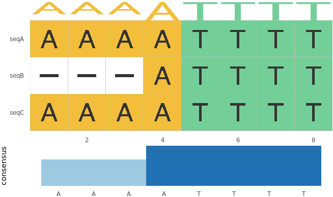

<style>
img{
    width: 49%;
}
</style>


输入对齐的序列（MSA结果），绘制示意图

```R
##### conda create -n testenv -c conda-forge proj4
##### sudo apt-get -y install libproj-dev
## Sys.setenv("PROJ_LIB"="/home/a/miniconda3/envs/testenv/include/proj.h")
## BiocManager::install("proj4",force=TRUE)
## BiocManager::install("ggmsa")
library(ggmsa)
ggmsa(‘sample.fa’, start = 1, end = 8, char_width = 0.5, seq_name = TRUE) + geom_seqlogo() + geom_msaBar()
```


sample.fa
```
>seqA
AAAATTTTCCCCGGGG
>seqB
---ATTTTCCCCGGGG
>seqC
AAAATTTTCCCCGGGG
```



参考1：https://github.com/YuLab-SMU/ggmsa   
参考2：https://cloud.tencent.com/developer/article/1590207   
