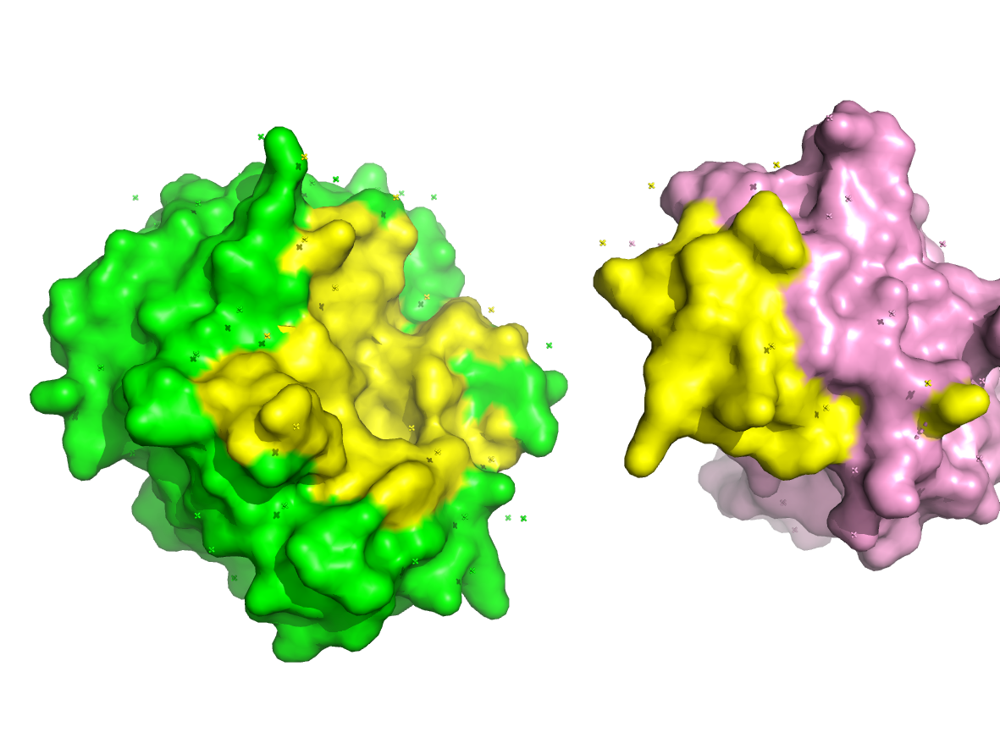

<style>
img{
    width: 50%;
}
</style>


查看分子的3D结构; 常见GUI：DIscovery Studio Visuliazer，PyMOL，ICM Browser，UCSF Chimera等; python也可用nglview。


## Pymol
### Install open-source
从pymol-open-source下载（见：参考）；注：我的py是3.10，安装时注意版本。
```

pip install pymol-2.6.0a0-cp310-cp310-win_amd64.whl        ## pymol

pip install pymol_launcher-2.5-cp310-cp310-win_amd64.whl   ## pymol python api

```

### CLI
Example:按照顺序尝试了如下命令
```bash
pymol            ## or: pymol 1fpu.pdb

## or: load http://www.rcsb.org/pdb/files/xxx.pdb
## or: fetch 1oky 1t46 1fpu 1AVX
load pdb/1oky.pdb 
load pdb/1t46.pdb 
load pdb/1fpu.pdb 
load pdb/1AVX.pdb

### Set Styles/layouts
set cartoon_cylindrical_helices = 1
set cartoon_smooth_loops = on
set cartoon_discrete_colors = on
set_color color1, [167,219,247]
set label_distance_digits, 2


### Print Chains
print(pymol.cmd.get_chains('model 1oky') )      ## ['A']
print(pymol.cmd.get_chains('model 1t46') )      ## ['A']
print(pymol.cmd.get_chains('model 1fpu') )      ## ['A','B']
print(pymol.cmd.get_chains('model 1AVX') )      ## ['A','B']


### Print Fasta
fasta_1AVX_A = cmd.get_fastastr("model 1AVX and chain A")
print(fasta_1AVX_A)

### align (structures to structure)
### 1t46's A Button-->align-->to molecule-->1oky
cmd.align('model 1oky', 'model 1t46')
cmd.align('model 1fpu', 'model 1t46')


### Select Objs
select selc_resA = chain A and (not resi 125) and (model 1AVX)
select selc_resB = ((resi 1-90+100+102+108-111) and model 1AVX)
select selc_resC = chain A and model 1AVX


### Unselect Objs
disable selc_resA selc_resB selc_resC 1AVX


### Delete Objs
### ALL: delete all
delete 1oky 1fpu 1t46 


### show/hide 一个命令plot一次，不需要就hide
show ribbon
show mesh
hide ribbon
hide mesh
pymol.cmd.show('mesh','model 1AVX')
pymol.cmd.hide('mesh','model 1AVX and chain A')
hide mesh
pymol.cmd.show('surface','model 1AVX')


### seperate Chains
create A_1AVX=(model 1AVX and chain A)
create B_1AVX=(model 1AVX and chain B)
delete 1AVX

### Coloring
color green,A_1AVX
color pink,B_1AVX

### Highlight Interface 
### !!! affected by movement btw A_1AVX B_1AVX
### show sph interface_AB
select interface_AB = (byres ((A_1AVX within 5 of B_1AVX)\or (B_1AVX within 5 of A_1AVX)))
color yellow,interface_AB
disable interface_AB              ## Unseen


### label a selection
## !! a resi has 7 atom, will plot 7 label if not limit CA
select selc_resi_100 = name CA and resi 100
label selc_resi_100, 'my anno text'


### Rotate (mouse-left click-drag) 
### Move (mouse-roll press-drag)
### Zoom (mouse-right click-drag)
orient
origin A_1AVX
rotate y, -45, A_1AVX
translate [-10,0,0], A_1AVX           # [x,y,z]
origin B_1AVX
rotate y, 45, B_1AVX
translate [10,0,0], B_1AVX           # [x,y,z]
zoom interface_AB                 


### ray & Save
png 1.png,10cm,dpi=300,ray=1  
```



### Python
Example
```python
import pymol

### or http://www.rcsb.org/pdb/files/xxx.pdb
pymol.cmd.load('pdb/1fpu.pdb')
pymol.cmd.load('pdb/1AVX.pdb')

pymol.cmd.get_chains('model 1AVX')                  ## ['A', 'B']
pymol.cmd.get_fastastr("model 1AVX and chain A")    ## '>1AVX_A\nIVGGYTCAAN..\n'

pymol.cmd.remove('solvent')                         ## or anything, e,g, model 1fpu

pymol.cmd.show('mesh','model 1AVX')
pymol.cmd.hide('mesh','model 1AVX')

### select selc_res = ((resi 1-90+100+102+108-111) and model 1AVX)
pymol.cmd.select('selc_res','(resi 1-90+100+102+108-111) and model 1AVX')
pymol.cmd.color('yellow','selc_res')


### label a selection, 
pymol.cmd.label(selection='name CA and selc_res',expression = 'resn')  ## expr: res index/name ...

### Q: how to set my lables?? using pseudoatom
pymol.cmd.pseudoatom(selection='name CA and selc_res',name='PS1',label = 'PS1 anno')


pymol.cmd.png('py_pymole.png',ray=1)                 ## PNG is the only image format supported by PyMOL
pymol.cmd.save('py_pymole.pse')                      ## save as pymol session

```
expr:
```markdown
       The symbols defined in the label name space for each atom are:

            name, resi, resn, resv, chain, segi, model, alt, q, b, type,
            index, rank, ID, ss, vdw, elec_radius, label, elem, geom,
            flags, color, cartoon, valence, formal_charge, partial_charge,
            numeric_type, text_type, stereo
```


## 参考
pymol-open-source:  https://www.lfd.uci.edu/~gohlke/pythonlibs/#pymol-open-source   
PyMOL by Schrödinger: https://pymol.org/2/    
PyMOL Doc: https://pymol.org/dokuwiki/doku.php?id=loading    
**PyMOL Usage_1**: https://zhuanlan.zhihu.com/p/490972358     
**PyMOL Usage_2**: https://zhuanlan.zhihu.com/p/494570068    
PyMOL cmd usage: https://pymol.org/pymol-command-ref.html    
PyMOL cmd usage: https://zhuanlan.zhihu.com/p/416707495    
[**PyMOL美化**](https://mp.weixin.qq.com/s?__biz=MzkzNjIzMTU0Nw==&mid=2247522165&idx=1&sn=c0a3156da0a02649acccdb2b235d7951&chksm=c2a30061f5d48977fb69e596343bc52b5a9538c38317dff9e189135cfdf6bcd64b740879eb26&cur_album_id=2273186699705024520&scene=189#wechat_redirect)   
Pymol-align-rmsd: https://zhuanlan.zhihu.com/p/347743101  

