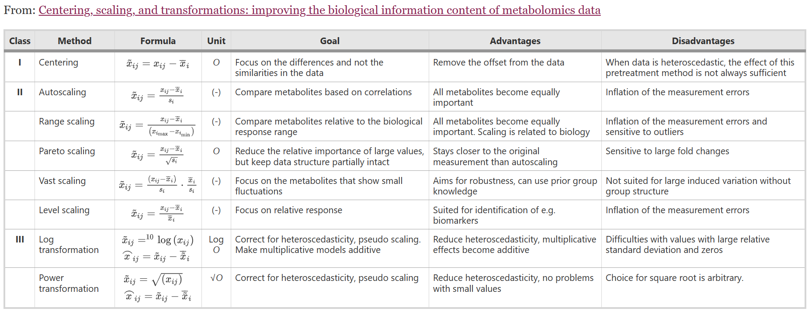

<script>
MathJax = {
  tex: {
    inlineMath: [['$', '$'], ['\\(', '\\)']]
  },
  svg: {
    fontCache:   'global'   // 'local',or 'global' or 'none'
  }
};
</script>
<script type="text/javascript" id="MathJax-script" async
  src="https://cdn.jsdelivr.net/npm/mathjax@3/es5/tex-svg.js">
</script>

<style>
img{
    width: 100%;
}
table th:nth-of-type(2) {
    width: 35%;
}
</style>

一些生信常见的 Normalization 方法


## Scaling

[](https://doi.org/10.1186/1471-2164-7-142)


## Read Counts

```
Gene             ==========================================================
      >>>>>>>>>-----------<<<<<<<<<       >>>>>>>>>-----------<<<<<<<<<     

Read Counts      : 3     Mapped 到 Gene/Contig 上的Reads数
Fragment Counts  : 2     至少有一端 Mapped 到 Gene/Contig 上的 PE_reads pairs 数
```
Read Counts 通常是raw OTU 丰度单位；但理论上，长度更长的Gene有机会产生更多Reads，如果想要定量基因的丰度，则需要关于基因长度进行Normalize

### CPM

1. Scaled by Sequencing_Depth (All_Mapped_Reads)
$$CPM_{Gene_i}=\frac{MappedReads_i}{\sum(MappedReads)}\times 10^6$$

也称RPM

### TPM

1. Scaled by GeneLength
$$A_i=\frac{MappedReads_i}{Length(Gene_i)}\times 10^3$$
2. Scaled by Sequencing_Depth (All_Mapped_Reads)
$$TPM_{Gene_i}=\frac{A_i}{\sum(A)}\times 10^6$$

常见于RNA定量

### RPKM/FPKM

RPKM 使用 Mapped_Read_Counts 而 FPKM 使用 Mapped_Fragment_Counts，而Fragment只存在于双端测序数据中。


$$FPKM=\frac{MappedFragments_i\times 10^9}{\sum(MappedFragments)\times Length(Gene_i)}$$
$$=\frac{MappedFragments_i}{AllMappedFragments(per10^6)\times Length_{Gene_i}(kb)}$$


它们与TPM的区别只在Scale的先后顺序，最终：多样本情况下，单个样本TPM值的总和相等，而单个样本RPKM值的总和会有不同。因此**某Gene的TPM可以理解为其占总体表达量的相对比例，更适合RNA定量分析**。（RPKM再scale by RPKM_SUM一下也许可以达成相似效果？？）


### [ARGs-OAP](https://doi.org/10.1093/bioinformatics/bty053)

使用了自定义的丰度定量单位：

- ppm = ARG_reads * 1e6 / All_reads   
- copies of ARG per copy of 16S rRNA     (一般一个单拷贝细胞有一个16S rRNA copy??)
- copies of ARG per prokaryote’s cell


