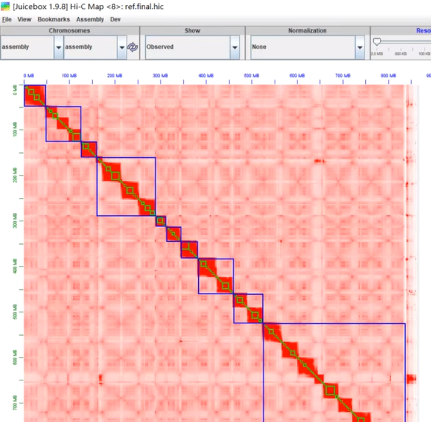
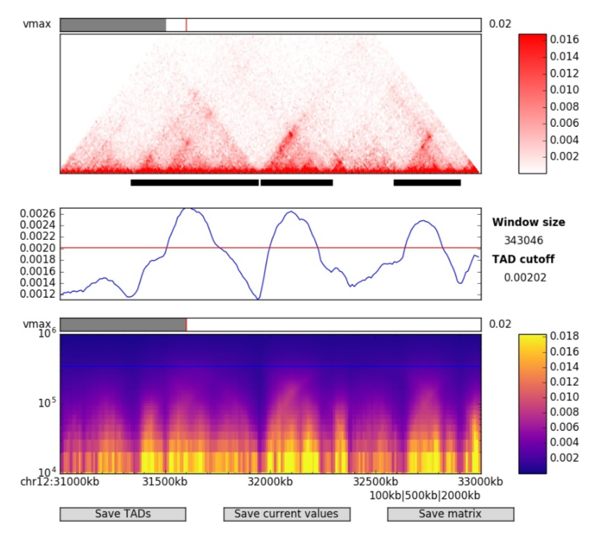

## 示意图

HiC相比3/4/5C可以做到全基因组范围的互作；将DNA用蛋白交联固定后，水解得到蛋白周边的DNA片段，连接DNA片段的末尾。如此，一个测序Interval中，前半段与后半段将会被map到基因组中两个不同的位置，提示这两个位置在三维空间中接近。  

## Pipeline
最常用的工具集可能是Juicer与Hic-pro

### Preprocess
背景：一般而言，对于一组PE reads，R1与R2将各自比上某个区域；但是，有时一些单侧Read过长、跨越了link site，如此它可能会匹配到两个区域。

除了常规的QC与Trimming，可以使用 [HiCUP](https://github.com/StevenWingett/HiCUP) 修正一些跨越link site的单侧reads：  

1. 指定Type Ⅱ限制性内切酶切割参考基因组，生成整个参考基因组的酶切位点文件
2. 通过酶切位点文件得到link site的序列，对跨越link site的单侧reads去除link site后的片段
3. mapping，使用bowtie2
4. 参照酶切位点文件，去除常见错误模式的HiC片段
5. 去除PCR重复

### 互作矩阵
准备好 refGenome，随后将reads比对，将比对结果展示为互作矩阵(Valid Pair)；
HICUP(hicup_mapper), Juice, hiclib, HiC-Pro 都对bwa或bowtie2进行了优化设置；  

### A/B compartment
互作矩阵-->z-scale-->PCA(取PC1)，其(正/负)=>(A/B) ; 工具：Juicebox, cworld-dekker

### TAD
互作矩阵-->TAD边界鉴定-->TAD图 ; 工具：tadtool, cworld-dekker

## Scaffolding and Phasing

HiC可用来辅助进行染色体级别基因组的组装；不过HiC组装的染色图其实存在大量错误，需要用更精细的遗传连锁图谱进行纠正

| 工具 | 流程 | 说明 |
| -- | -- | -- |
| LACHESIS | 1.根据contact将reads分组；2.组内reads ordering、组装；3.contigs orient | 经典，但停止更新 |
| [3D-DNA](https://github.com/aidenlab/3d-dna) + Juicer | 1.切割与HiC数据相悖的contigs；2.Juicer 得到Hi-C maps；3.3D-DNA 根据map重新链接；4.juicerbox 手动矫正 | 二倍体效果最佳 |
| All-HiC | -- | 针对多倍体和高杂合度的情况 |
| chromap+YaHS | 1.chromap快速mapping；2.YaHS scaffolding | 更快，似乎排序更准确 |

* 其余：HiFiasm 可直接基于HiC数据进行组装，上表只是辅助
* 评估方法：准确度(how?)，挂载率(草图中有多少比例的base被包含在染色体中)

## Meta HiC
[hicSPAdes](../Blocks/SPAdes.md#hicspades-meta), [HiCBin](../Blocks/HiCBin.md)等使用HiC技术辅助Binning

## 参考
A/B 染色质区室： https://cloud.tencent.com/developer/article/1556901      
PMC：https://www.ncbi.nlm.nih.gov/pmc/articles/PMC4490074/   
HiC辅助组装：https://maimengkong.com/m/?post=1178   

