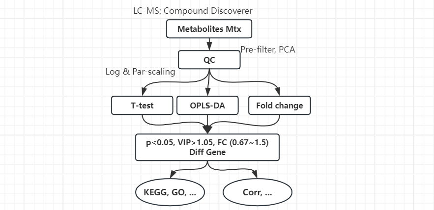

质谱原始数据经过 [Compound Discoverer](https://www.thermofisher.cn/order/catalog/product/cn/zh/OPTON-31055) 进行峰提取、峰对齐、峰校正、标准化后可以得到正/负compounds 的定性/定量数据矩阵 共4个文件

## 广泛靶向代谢组

* 化合物预筛选
    - QC 样本由每个待测样本贡献相同体积液体混合而成，被多次检测；计算多次QC中每个 Compound 的 RSD (Relative Standard Deviation) 值，选取 RSD < 0.3 的化合物；如果一个样本中有超过70%的化合物 RSD < 0.3，说明 QC 稳定，代谢物峰面积可直接除以QC中均值进行标准化
    - 缺失值不能太多，最好选取>50%样本含有的化合物

* 分别对正/负compounds进行PCA，展示研究采用的仪器和方法是否具有良好的稳定性和重复性
* 对数据进行log转换与Par-scaling
* 分别对正/负compounds的不同组间进行两两比较(e.g. A vs B)，筛选差异基因：t-test's p<0.05, OPLS-DA's VIP>1.05, Fold change  (0.67~1.5)
* 对差异基因进行通路分析：KEGG
* 使用差异基因进行相关性分析...

## 参考
LCMS文件示例：https://www.bilibili.com/video/BV1rh411h7To/   
代谢组学数据标准化：https://zhuanlan.zhihu.com/p/79373522   
mzCloud 质谱库      
液相色谱质谱分析 (LC-MS)     
