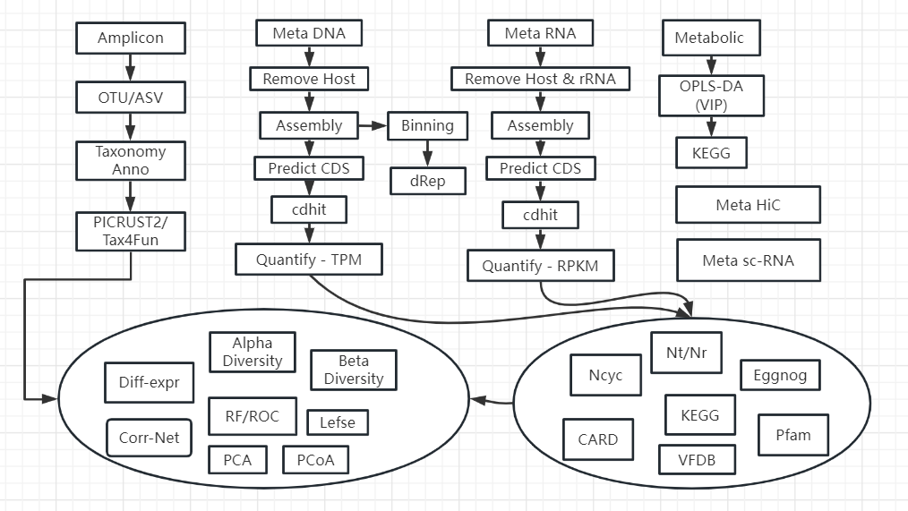

 

* 在需要准确定量的项目如ATAC、转录组中，可以加入去除PCR重复的步骤。例如scRNA使用的UMI技术，或者通过samtools/picard去除duplicate
* RNA项目可以使用RSeQC进行测序饱和度分析，以确保有效检测
* 定量单位可以有TPM、FPKM... （TBA）

## Basic
不同数据的基本流程，暂时还没想好分配给哪个主题

| -- | -- | -- |
| -- | -- | -- |
| [Genome](./Basic/Genome.md) | 组装基因组，并且预测基因；准备上传NCBI的格式 | 其它：Haplotype-based组装；结合HiC数据的组装 |
| Transcriptomics | 转录组 | Bulk：[RNA-seq](./Basic/RNA.md) Single Cell：[scRNA-seq](./Basic/scRNA.md) Spatial：[Spatial_RNA](./Basic/Spatial_RNA.md) |
| Proteomics | -- | -- |
| [Metabolomics](./Basic/Metabolomics.md) | 代谢组 | -- |
| [HiC](./Basic/HiC.md) | 细胞内3D空间距离信息 | 可能Epi也常用？ |
| 重测序 | 获取SNP、InDel、SV等信息 | 群体遗传 |

## Metagenomics

关注环境中物种组成，或者功能基因的比例；病毒由于含量少，另有工具（TBA）

## Epi

常见的[表观遗传修饰](https://zhuanlan.zhihu.com/p/616493908)包括：DNA甲基化、组蛋白修饰（影响染色质的暴露）、RNA甲基化...

这些修饰可能是影响基因表达的潜在因素，一般与转录起始位点的3D空间距离一起分析；此外，这些信息可以用来寻找 发育、疾病、衰老的 marker

| DNA水平 | -- | -- |
| -- | -- | -- |
| [ATAC-seq](./Epi/ATAC-seq.md) | -- | -- |
| [Chip-seq](./Epi/Chip-seq.md) | -- | -- |

* MeDIP-seq：免疫共沉淀
* BS-seq：Bisulfate(BS)处理DNA序列后，可将暴露状态的C变成U(再一轮复制后变成T)，而甲基化的C则不受改变
    - Opt1(WGBS)：用 BSMAP 将全基因组[BS-seq测序](https://www.illumina.com.cn/techniques/sequencing/methylation-sequencing.html)数据 map 至 参考基因组上，可得到全基因组水平的甲基化信息
    - Opt2(Chip)：Illumina提供[Infinium 芯片](https://www.illumina.com.cn/techniques/microarrays/methylation-arrays.html)，以bp分辨率检测CpG位点；[GenomeStudio软件](https://www.illumina.com.cn/techniques/microarrays/array-data-analysis-experimental-design/genomestudio.html )可对Illumina芯片平台生成的数据进行可视化与分析

