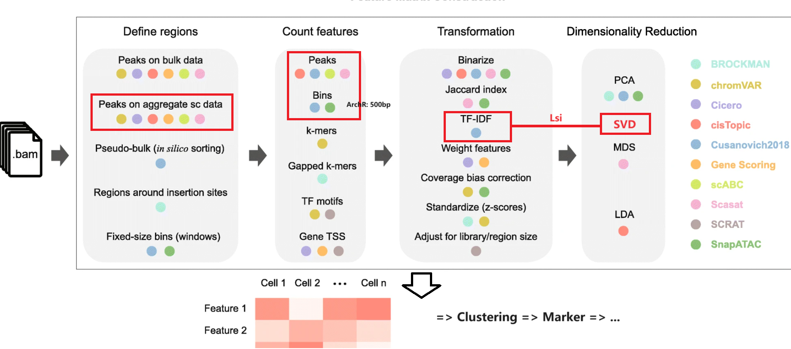

<style>
img{
    width: 60%;
}
</style>


原理参考 [10x Genomics Support](https://www.10xgenomics.com/support)

oligo文库注：Cell Hashing 技术基于 CITE-seq，可同时测定单细胞RNA、表面蛋白标记物，情形类似：
```
## 每个单克隆抗体都与一个短DNA寡核苷酸结合，被称为hashtagoligo(HTO)==AntibodyBarcode

CapturedRNA--------UMI-----------CellBarcode---
                                               |--Beads
CapturedProtein-----Antibody-----HTO-----------            
```


## scRNA


| 任务 | 工具 |
| -- | -- |
| ```filtered_feature_bc_matrix/``` | [CellRanger](../Blocks/CellRanger.md) |
| PIPELINE |  R: [Seurat](../Blocks/Seurat.md)<br>Py: [Scanpy](../Blocks/Scanpy.md) |
| CellType Anno | R: SingleR, Metacell, Cellassign |
| Batch Integration | R: Seurat, Harmony, LIGER |
| MultiOmics Integration | R: Seurat |
| Doublet Detection | R: DoubletFinder, DoubletDecon<br>Py: DoubletDetection, Scrublet |
| PseudoTime(Traj) | R: monocle3<br>Py: Scanpy(paga) |
| RNA Velocity | Py: scVelo |
| GO GSEA / KEGG Enrichment | R: clusterProfiler |
| [**SeuratObj <--> Scanpy_h5ad**](https://satijalab.org/seurat/archive/v2.4/conversion_vignette.html) | Seurat: Convert() |

此外，inferCNV 分析CNV以判断是否是肿瘤细胞，hdWGCNA 分析基因模块，SNV分析（META-CS实验技术改进），...

Bulk mRNA 数据可以帮助验证scRNA数据的完整性；如果还有其它bulk多组学数据，也可以尝试算一下相关性

### R:Seurat+SingleR

* Seurat对每个细胞统计符合pattern的基因量，然后可以根据这个统计量进行Filtering，或者在Scale时候消除这个统计量的影响（RegressOut），e.g.
```R
pbmc[["percent.mt"]] <- PercentageFeatureSet(pbmc, pattern = "^MT-")                      ## Calculating
pbmc <- subset(pbmc, subset = nFeature_RNA > 200 & nFeature_RNA < 2500 & percent.mt < 5)  ## Filtering
pbmc <- ScaleData(pbmc, features = rownames(pbmc), vars.to.regress = "percent.mt")        ## RegressOut
```

| Data QC | 说明 | pattern |
| -- | -- | -- |
| Filter off Genes | Appear in >3 Cells | -- |
| Filter off Cells | Not Doublet: via Detectors <br> minGeneNum > 200-500 <br> maxGeneNum < X, X decided via 'VlnPlot()' <br> (Doublet may contain more genes)  | -- |
| Filter off Cells + RegressOut | Mitochondrial Genes <15% | ```"^MT-"``` |
| Filter off Cells + RegressOut | Ribosomal Genes <5% | ```"^RP[SL]"``` |
| Filter off Cells + RegressOut | Hemoglobin Genes <br> ```"HBA1","HBA2","HBB","HBD","HBE1","HBG1","HBG2","HBM","HBQ1","HBZ"``` | ```^HB[^(P)]``` |
| Filter off Cells + RegressOut | Cell-Cycle: 见下文  | cc.genes + CellCycleScoring() |


* 根据Variance选出**HVGs:** GeneA_cellA v.s. GeneA_Overall
    - Opt. If dataset is large, use HVGs for afterward analysis

* (Opt.)根据HVGs进行 [Cell-Cycle Scoring and RegressOut](https://satijalab.org/seurat/articles/cell_cycle_vignette.html)：Pick HVGs --> Load privided Cell Circle Genes ```cc.genes``` --> CellCycleScoring() --> ScaleData()
    - Opt.1: vars.to.regress = c("S.Score", "G2M.Score")
    - Opt.2: vars.to.regress = c("CC.Difference")；CC.Difference = S.Score - G2M.Score
    - 注意，Opt.1不适合关注细胞分化的实验，因为会完全消除非周期细胞和周期细胞之间的区别；Opt.2 将保持二者间细胞周期差异，仅消除二者内部细胞周期差异
    - Tips：可以通过查看对PC贡献最多的基因是否是细胞周期相关基因来判断影响

* 随后进行Clustering，假设每个Cluster代表一种Cell-type；再次对Cell-type进行Clustering，可得到细胞的分型。
    1. Find marker genes --- **Diff-expr genes:** cluster v.s. clusters
    2. Annotate clusters based on marker genes

| -- | DB for SingleR() | -- | Tips |
| -- | -- | -- | -- |
| Cell-Type | HumanPrimaryCellAtlasData(label.main), [CellMarker](http://biocc.hrbmu.edu.cn/CellMarker/index.jsp), [PanglaoDB](https://panglaodb.se/index.html), SingleR datasets, Papers | e.g.Tcell/Bcell/... | 在这个水平上进行一些常规的分析(cluster间的比较)，比方说KEGG、GO富集分析，差异基因表达分析（cell-type间） |
| Cell-Subtype | MonacoImmuneData(label.fine) | e.g.对CD4细胞细致分类 | 在这个水平上进行一些更加细致的操作，比如：拟时序分析，RNA velocity |


### Meta
对宏基因组使用scRNA与Basic Pipeline不同；Basic Pipeline中已知样本来自某一生物，所以可以很简单的使用参考基因组进行每个细胞内、每个基因的定量；而宏基因组的潜在参考基因集过于庞大，耗费过量资源；且宏基因组使用scRNA技术的目的之一是希望得到更准确的细胞组成信息（现有Binning有时准确度堪忧），需求是对每一个cell进行准确的物种注释。

为了尽量缩小潜在参考基因集范围，可以参考相似研究的Meta Bulk注释提到的基因组；Tips: GTDB使用ANI进行分类，可以使用本地储存的文件，不用去NCBI再下载

其单细胞QC步骤一如前文所述。有两种或许可行的注释、定量方法： 

* Anno via FastANI：当需要注释的细胞数量较少时，可以将其比对参考DB，根据ANI确定可能Taxa范围
* Anno via Mapping：通过cdhit等对参考基因集进行去重，然后将scRNA数据map上去，根据细胞的mapping信息决定其物种注释(也许可以使用cellranger)

Tips：有时如果物种注释结果不理想，我们也可以进行单细胞水平的功能注释(GO,ARG,pathway...)

### STOmics

BGI STOmics 的v1实验流程与 10X Genomics 类似，将磁珠(beads: CellBarcode_UMIs)与细胞裹入同一液滴中，液滴回收、破乳、反转录、扩增、测序，所得到的reads可以带有beads上的信息。理想状态下 1液滴=1磁珠+1细胞，但如果bead浓度太低则部分液滴中无bead，导致细胞回收率低；但如果bead浓度太高则1液滴中有多个beads，在后续分析中会被标识为多个细胞。（相应的，如果细胞浓度过高，则1液滴中有多个细胞，即Doublet）

[BGI STOmics 的v2实验流程](https://www.bilibili.com/video/BV1rV411A7w7)改进为使用2种磁珠，大磁珠(CellBarcode_UMIs)可捕获RNA/oligo、同时可结合环境中的各种小磁珠(Index_UMIs)。1液滴=n小磁珠+n大磁珠+1细胞，位于同一液滴的大磁珠具有相似的小磁珠结合pattern（因空间靠近、微环境相似），于是可基于此信息将大磁珠捕获的RNA合并回完整的Cell；如是通过增加磁珠浓度提高细胞回收率。

情形类似：
```
                                                             |---SmallBead_IndexA   
CapturedRNA--------UMI-----------CellBarcode---              |---SmallBead_IndexA
                                               |-- BigBead --|---SmallBead_IndexC
CapturedProtein-----Antibody-----HTO-----------              |---SmallBead_IndexB
                                                             |---SmallBead_IndexA
```

rawReads数据处理的流程：QC/UMI Filtering-->Mapping-->PISA Gene anno-->Beads Filtering-->**Beads Merging**-->Gene_Expr_Mtxs，格式同CellRanger的结果


## scATAC

[](https://doi.org/10.1186/s13059-019-1854-5)

推荐ArchR一站式分析。此外常见Signac、SnapATAC。

### Feature Matrix
已知reference情况下，可通过 [CellRanger](../Blocks/CellRanger.md) 得到每个细胞的 Peak 信息。由于Peak数据一般十分稀疏，因此某些处理流程会选择合并，例如 [Ansuman T. Satpathy (2019)](https://doi.org/10.1038/s41587-019-0206-z) 的QC流程：

```
1. 去除低质量细胞
    - TSS enrichment score 指所有基因TSS位点测序深度的平均值，一般取TSS上下游1000-2000bp的值为基准
    - Unique fragment > 1000
2. 降低分辨率：2.5kb为一个bin合并Peak数目，生成TileMatrix
3. 生成 Pseudo-bulk ATAC 数据：根据TileMatrix的聚类信息合并而成
4. 对每一个 Cluster 所对应的 Pseudo-bulk 数据进行 Peak Calling (MACS2)
5. 根据bulk得到的Peak信息，选取单细胞数据中的高质量Peaks
```

* scATAC一般不直接Normalize，而是使用TF-IDF挖掘Feature
* Doublet
    - ArchR: 模拟双细胞，随后在低维空间中识别与之相近者为双细胞
    - scDblFinder
* [Batch Integration](https://doi.org/10.1038/s41592-021-01336-8): Harmony, LIGER


### CellType Anno

Clustering后，[10x 提供关于CellType Anno的建议](https://www.10xgenomics.com/support/single-cell-atac/documentation/steps/sequencing/cell-type-annotation-strategies-for-single-cell-atac-seq-data): 


**Opt 1.** 寻找Cluster间有accessibility差异的Peaks，其下游最近的基因为Marker Gene

**Opt 2.** 用户自定义 Cell Type-Specific Feature Set。常见[将Peak Matrix 转换为 Gene Scores Matrix](https://www.archrproject.com/bookdown/calculating-gene-scores-in-archr.html)（可以理解为基于表观数据预测出的基因表达值）, 随后用SingleR 等进行细胞类型注释

**Opt 3.** Seurat TransferData 将携带注释的scRNA数据与scATAC数据在低维空间对齐


### Downstream
得到Marker Peaks/Genes 后: 

| Task | 说明 | Tool |
| -- | -- | -- |
| ... | GO/KEGG、轨迹分析、细胞速率、... | - 同scRNA<br> - [GREAT](http://great.stanford.edu/public/html/index.php)有些类似对差异Peak进行GO Term分析 |
| 调控网络分析 | Peak-Peak Co-accessibility | - Cicero <br> - Pando+scRNA |
| Motif Analysis  | 寻找某个TF的 binidng site 的特征基序（随后可以在全基因组范围内寻找符合motif的潜在binding site） | [chromVAR](https://github.com/GreenleafLab/chromVAR) |
| Footprint Analysis | 潜在的TF binidng site是否结合TF：如果某一开发区域已经被转录因子结合，则此区域不会被测得，表现为peak中间有凹陷 | [TOBIAS](https://www.hdsu.org/chipatac2020/07_ATAC_Footprinting.html) |


## 参考

各种单细胞测序技术： https://zhuanlan.zhihu.com/p/569346733

数据集汇总： https://www.jianshu.com/p/49e5cf91f819  

NBIS: https://www.jianshu.com/p/1e29e3b9a4ab  

Doublet: https://zhuanlan.zhihu.com/p/376439628

HVGs: https://www.jianshu.com/p/3d40c56e5fc8

Cell Circle： https://zhuanlan.zhihu.com/p/82654538   

Batch: https://www.jianshu.com/p/ebc328f9fb73   

GREAT: https://www.jianshu.com/p/7f6ce4f238cb   


