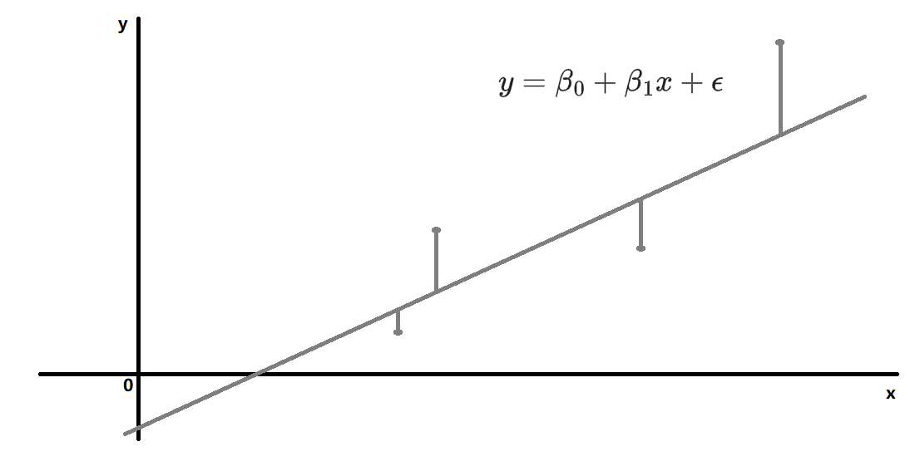

<!-- src="https://cdn.jsdelivr.net/npm/mathjax@3/es5/tex-svg.js" -->
<!-- src="http://127.0.0.1:8000/Bioinfo/Statistics/Basis/tex-svg.js" -->

教材：《统计学（原书第五版）》    
**关联：[点估计$\hat{\theta}$、置信区间](../Basis/#_10)，[离散分布](../Basis/#_5)**

 

* 因变量：被预测的变量，也称响应变量；一般用符号 $y$ 表示
* 自变量：用来预测因变量 $y$ 的变量；一般用符号 $x_1, x_2, x_3, ...$ 表示

* 笔记一
    - 误差(Error)：模型的$\epsilon$
    - 离差(Deviation)：$d_i = y_i - \overline{y}$，与均值的差
    - 残差(Residual)：$e_i = y_i - \hat{y}$，与预测值的差

* 笔记二
    - $SSE=\sum\limits_{i=1}^{n}w_i(y_i-\hat{y_i})^2$，和方差、残差平方和
    - $MSE=SSE/n$，均方误差
    - $RMSE=\sqrt{MSE}$，均方根误差
    - $RMS=\sqrt{\frac{\sum\limits^n_{i=1}{x_i}}{n}}$，均方根值、有效值

## 简单线性回归

 

* n为样本大小
* $SS_{xy}=\sum\limits_{i=1}^{n}(x_i-\overline{x})(y_i-\overline{y})$
* $SS_{xx}=\sum\limits_{i=1}^{n}(x_i-\overline{x})^2$
* $SS_{yy}=\sum\limits_{i=1}^{n}(y_i-\overline{y})^2$
* $SSE=\sum\limits_{i=1}^{n}(y_i-\hat{y_i})^2=\sum\limits_{i=1}^{n}(y_i-(\hat\beta_0+\hat\beta_1x))^2$；误差平方和 

### 分析步骤

1. 假设联系y与x的概率模型 $y=\beta_0+\beta_1x+\epsilon$
2. 最小二乘法估计模型参数 $\beta_0$, $\beta_1$，得到最小二乘模型 $\hat{y}=\hat\beta_0+\hat\beta_1x$
3. 估计误差 $\epsilon$ 的分布的标准差 $\sigma_{\epsilon} \approx s_{\epsilon}$
4. 评估（最小二乘）模型效用：相关系数$r$，决定系数$r^2$，斜率$\beta_1$
5. 使用（最小二乘）模型

### 参数估计

使用最小二乘法：令 $SSE$ 最小

* $\frac{\partial SSE}{\partial \hat{\beta_1}}=0$
* $\frac{\partial SSE}{\partial \hat{\beta_0}}=0$

化简得到 $\beta_0$, $\beta_1$ 的点估计：

* $\hat{\beta_1}=\frac{SS_{xy}}{SS_{xx}}$
* $\hat{\beta_0}=\overline{y}-\hat{\beta_1}\overline{x}$

### 标准差估计

$\epsilon$ 的 假定

1. $\epsilon$ 概率分布的均值为0，i.e.对无限长试验序列误差的平均是0 
2. $\epsilon$ 概率分布的方差为一个常数，即 $\sigma^2$
3. $\epsilon$ 概率分布是正态的
4. 任意两个不同观测值关联的误差是独立的，即：与一个y值关联的$\epsilon$不会影响与其它y值关联的$\epsilon$

推断（见363）

* $\sigma^2$ 的点估计 $s^2=\frac{SSE}{df}=\frac{SSE}{n-2}$
* y值符合正态分布：均值为 $E(y)=\beta_0+\beta_1x $，方差为 $\sigma^2$
* $\hat\beta_0$, $\hat\beta_1$ 符合正态分布的抽样分布：均值为0，方差为 $\sigma^2_{\hat{\beta_0}}=\frac{\sigma^2}{n}\frac{\sum x^2_i}{SS_{xx}}$，$\sigma^2_{\hat{\beta_1}}=\frac{\sigma^2}{SS_{xx}}$

### 评估模型效用

| $\hat\theta$ | $\sigma_{\hat\theta}$ | $H_0$ | 统计检验量 | $(1-\alpha)$置信区间 |
| -- | -- | -- | -- | -- |
| $\hat\beta_1$ | $\sigma_{\hat{\beta_1}}=\sqrt\frac{\sigma^2}{SS_{xx}}\approx\frac{s}{\sqrt{SS_{xx}}}=s_{\hat{\beta_1}}$ | $\beta_1=0$，x对y的预测不贡献信息 | $T=\frac{\hat\beta_1 -0}{s_{\hat{\beta_1}}}$ | $\hat\beta_1 \pm t_{\alpha/2}s_{\hat\beta_1}$ |
| $r$ | -- | $r=0$，x与y无相关性，意味着$\beta_1=0$ | $T=\frac{r\sqrt{n-2}}{\sqrt{1-r^2}}$ | -- |

* Pearson 相关系数 $r=\frac{SS_{xy}}{\sqrt{ SS_{xx}SS_{yy} }}=\hat{\beta_1}\sqrt{SS_{xx}/SS{yy}}$  表示x与y间线性关系强度；与$\hat{\beta_1}$**只是尺度不同**
* 决定系数 $r^2=\frac{SSR回归平方和}{SST离差平方和}=\frac{SS_{yy}-SSE}{SS_{yy}}=1-\frac{SSE}{SS_{yy}}$；$r^2=0.6$表示模型可以解释60%的Variance

### 使用模型

对单个x值$x=x_p$，估计**y的均值**E(y)

| $E(y)$的估计量$\hat{y}$的抽样分布的标准差 |  $(1-\alpha)$**置信区间** |
| -- | -- |
| $\sigma_{\hat{y}}=\sigma\sqrt{\frac{1}{n}+\frac{(x_p-\overline{x})^2}{SS_{xx}}} \approx s_{\hat{y}}=s\sqrt{\frac{1}{n}+\frac{(x_p-\overline{x})^2}{SS_{xx}}}$ | $\hat{y} \pm t_{\alpha/2}s_{\hat{y}}$ |

对单个x值$x=x_p$，预测**单个y值**$\hat{y}$

| 单次预测误差$(y-\hat{y})$的抽样分布的标准差 |  $(1-\alpha)$**预测区间** |
| -- | -- |
| $\sigma_{(y-\hat{y})}=\sigma\sqrt{1+\frac{1}{n}+\frac{(x_p-\overline{x})^2}{SS_{xx}}} \approx s_{(y-\hat{y})}=s\sqrt{1+\frac{1}{n}+\frac{(x_p-\overline{x})^2}{SS_{xx}}}$ | $\hat{y} \pm t_{\alpha/2}s_{(y-\hat{y})}$ |

其中$\sigma$指误差 $\epsilon$ 的标准差

## 多重回归

### 分析步骤

1. 选择与y相关的自变量x...(e.g. 对参数$\beta$进行统计检验)
2. 假设**一般线性模型** $y=\beta_0+\beta_1x_1+\beta_2x_2+...+\beta_kx_k+\epsilon$；或含**交互**作用项、**高阶**项的模型 $y=\beta_0+\beta_1x_1x_2+\beta_2x_2^2+...+\beta_kx_k^k+\epsilon$
3. 最小二乘法估计模型参数 $\beta_0,\beta_1,...,\beta_k$
4. 估计误差 $\epsilon$ 的标准差 $\sigma_{\epsilon} \approx s_{\epsilon}$
5. 评估（最小二乘）模型效用
6. 使用（最小二乘）模型

### 参数估计

使用最小二乘法：令 $SSE$ 最小

* $\frac{\partial SSE}{\partial \hat{\beta_1}}=0$
* $\frac{\partial SSE}{\partial \hat{\beta_0}}=0$
* ....

解法：将一般线性模型表示为矩阵形式：$Y=XB+E$

$
\begin{bmatrix}
y_1 \\\\
y_2 \\\\
y_3 \\\\
... \\\\
y_n
\end{bmatrix}
$ =  $
\begin{bmatrix}
1 & x_{11} & x_{12} & ... & x_{1k} \\\\
1 & x_{21} & x_{22} & ... & x_{2k} \\\\
... \\\\
1 & x_{n1} & x_{n2} & ... & x_{nk} 
\end{bmatrix}
$ $
\begin{bmatrix}
\hat\beta_0 \\\\
\hat\beta_1 \\\\
... \\\\
\hat\beta_k
\end{bmatrix}
$+$
\begin{bmatrix}
\epsilon_1 \\\\
\epsilon_2 \\\\
\epsilon_3 \\\\
... \\\\
\epsilon_n
\end{bmatrix}
$

转写为最小二乘矩阵方程：$(X'X)\hat{B}=X'Y$

得到最小二乘矩解：$\hat{B}=(X'X)^{-1}X'Y$

### 标准差估计

$\epsilon$ 的假定[同上文](./#_4)，$SSE=Y'Y-\hat{B}'X'Y'$，$\epsilon$ 标准差的点估计为 $s=\frac{SSE}{n-模型中\beta参数个数}$

将矩阵记为：$ (X'X)^{-1} = 
\begin{bmatrix}
c_{00} & c_{01} & c_{02} & ... & c_{0k} \\\\
c_{10} & c_{11} & c_{12} & ... & c_{1k} \\\\
c_{20} & c_{21} & c_{22} & ... & c_{2k} \\\\
... \\\\
c_{k0} & c_{k1} & c_{k2} & ... & c_{kk} 
\end{bmatrix}
$

$\hat\beta_i$的抽样分布是正态分布，且有：$E(\hat\beta_i)=\beta_i$，$\sigma_{\hat\beta_i}=\sigma\sqrt{c_{ii}}$，$Cov(\hat\beta_i,\hat\beta_j)=c_{ij}\sigma^2$

### 评估模型效用

| $\hat\theta$ | $\sigma_{\hat\theta}$ | $H_0$ | 统计检验量 | $(1-\alpha)$置信区间 | -- |
| -- | -- | -- | -- | -- | -- |
| $\hat\beta_i$ | $\sigma_{\hat\beta_i}=\sigma\sqrt{c_{ii}}$ $\approx s_{\hat\beta_i}=s\sqrt{c_{ii}}$ | $\beta_i=0$ | $T=\frac{\hat\beta_i}{s_{\hat\beta_i}}$ | $\hat\beta_i \pm t_{\alpha/2}s_{\hat\beta_i}$ | 单个模型参数的检验 |
| $R^2$ | -- | $R^2=0$，意味着$\beta_1=..=\beta_k=0$ | $F=\frac{MS_{Model}}{MSE}$ $=\frac{(SS_{yy}-SSE)/k}{SSE/(n-k-1)}$ $=\frac{R^2/k}{(1-R^2)/[n-(k+1)]}$ | （拒绝阈：$F > F_{\alpha}$） | 全局检验 |

* 样本多重决定系数 $R^2=1-\frac{SSE}{SS_{yy}}$ 定义同上文[决定系数 $r^2$](./#_5)
* 调整后的多重决定系数 $R_a^2 = 1- \frac{(n-1)}{n-(k+1)}(\frac{SSE}{SS_{yy}})= 1- \frac{(n-1)}{n-(k+1)}(1-R^2)$

### 使用模型

一组样本$(y,a)$的参数的记为：$a=[1,x_1,x_2,...,x_k]$，代入最小二乘模型后得到 $\hat{y}=\hat\beta_0+\hat\beta_1x_1+...+\hat\beta_kx_k$

估计E(y)

| $E(y)$的估计量$\hat{y}$的抽样分布的标准差 |  $(1-\alpha)$**置信区间** |
| -- | -- |
| $\sigma_{\hat{y}}\approx s_{\hat{y}}=s\sqrt{a'(X'X)^{-1}a}$ | $\hat{y} \pm t_{\alpha/2}s_{\hat{y}}$ |

预测**单个y值**$\hat{y}$

| 单次预测误差$(y-\hat{y})$的抽样分布的标准差 |  $(1-\alpha)$**预测区间** |
| -- | -- |
| $\sigma_{y-\hat{y}}\approx s_{y-\hat{y}}=s\sqrt{1+a'(X'X)^{-1}a}$ | $\hat{y} \pm t_{\alpha/2}s_{(y-\hat{y})}$ |

其中$\sigma、s$指误差 $\epsilon$ 的标准差、的点估计

### Tips

* 模型效力的显著性可以通过F检验计算
* $x_k=p$ 时 $y$ 的**边际** 指 $E(y)=\beta_0+\beta_1x_1x_2+\beta_2x_2^2+...+\beta_kx_k^k$ 关于 $x_k$ 的变化率在 $x_k=p$ 的估值：$\frac{dE(y)}{dx_k}$ 代入$x_k=p$
* 异方差性（见463）：**残差** $e_i = y_i - \hat{y}$ 随 $\hat{y}$ 的增大而增大 (即$y$的方差随之增大)；此时考虑变换$y$：
    - $y$ 服从泊松分布：$y^{*}=\sqrt{y}$
    - $y$ 服从二项分布：$y^{*}=sin^{-1}\sqrt{y}$
    - $y$ 服从乘积分布：$y^{*}=ln(y)$
* 绝对值大于$3s$的**残差**是异常的，可以切除这个样本来评价它对回归分析的影响（刀切法）
* 数据为**时间序列**时，误差$\epsilon$ 的**独立性经常不成立**（**残差分布**可看出趋势），故模型受到怀疑
* 参数的**可估性**：不同数值的$x$至少比 $\beta_{0,1,2,..k}$数目多1，即 $\ge (k+1)$
* 参数解释：相关性不保证因果，需要通过[试验设计](./#_14)确定$y$变化的真正原因
* **多重共线性**：当两个及以上自变量相关时候，可能它们单个$\beta$的t值不显著、但交互项的$\beta$的t值显著，此时应该保留它们
* **外推**至样本数据范围外的预测可能会有各种问题

## 模型设计

* 各种示例见467-
* **编码**指将一个自变量集变换为一个新的自变量集，例如：$Normalize(x)$
* 对于**定性**变量，可以0/1组合编码，例如：（见486）
    - 描写$k水平(A,B,C,...)$的一元定性变量模型$E(y)=\beta_0+\beta_1x_1+...+\beta_{k-1}x_{k-1}$
    - 其中 $ x_i= \begin{cases} 1 \quad 定性变量取i+1水平  \\\\ 0 \quad Otherwise \end{cases} $，若$x_1$=0则表示取中1水平(即A)
* （见492）主效应($\beta_1x_1+\beta_2x_2$)、交互作用($\beta_3x_1x_2+\beta_4x_2x_3$)
* 嵌套：完全模型包括了简化模型及至少一个附加项
    - 简化模型：$E(y)=\beta_0+\beta_1x_1+...+\beta_gx_g$
    - 完全模型：$E(y)=\beta_0+\beta_1x_1+...+\beta_gx_g+\beta_{g+1}x_{g+1}+...+\beta_{k}x_{k}$
* 嵌套模型间的比较可以用F检验：
    - $H_0: \beta_{g+1}=...=\beta_{k}=0$
    - $H_a: \beta_{g+1},...,\beta_{k}$ 至少一个不为0
    - $F=\frac{（SSE_{简化}-SSE_{完全}）/(k-g)}{SSE_{完全}/[n-(k+1)]}$
    - 如果不能拒绝$H_0$，基于节俭原则，选择简化模型（虽然II型错误率未知）
    - 注意，**非**嵌套模型间的比较**不**能使用F检验！！，必须基于$R_a^2,s$等统计量选择最优模型
* 数据分离（或交叉确认）评估模型：模型的**有效性**(Validation) 需要通过新数据进行评估，可以考虑用新数据进行预测后得到的$\hat{y}$计算$R^2_{pred}, MSE_{pred}$等 （见505）
* 刀切估计评估模型：用删除观察值 $i$ 后计算得到的 $\hat{y_{(i)}}$ 代替$\hat{y}$以计算$R^2_{jackknife}, MSE_{jackknife}$等
* 逐步回归筛选潜在自变量（见506）：一步一步加入使新模型最优（根据每个$\beta_i$的T值，或模型F值）的$\beta_i$，过程中还会删除不再显著的$\beta_i$

## 试验设计

原理见523，

### 完全随机化设计

### 随机化区组设计

### 析因设计

