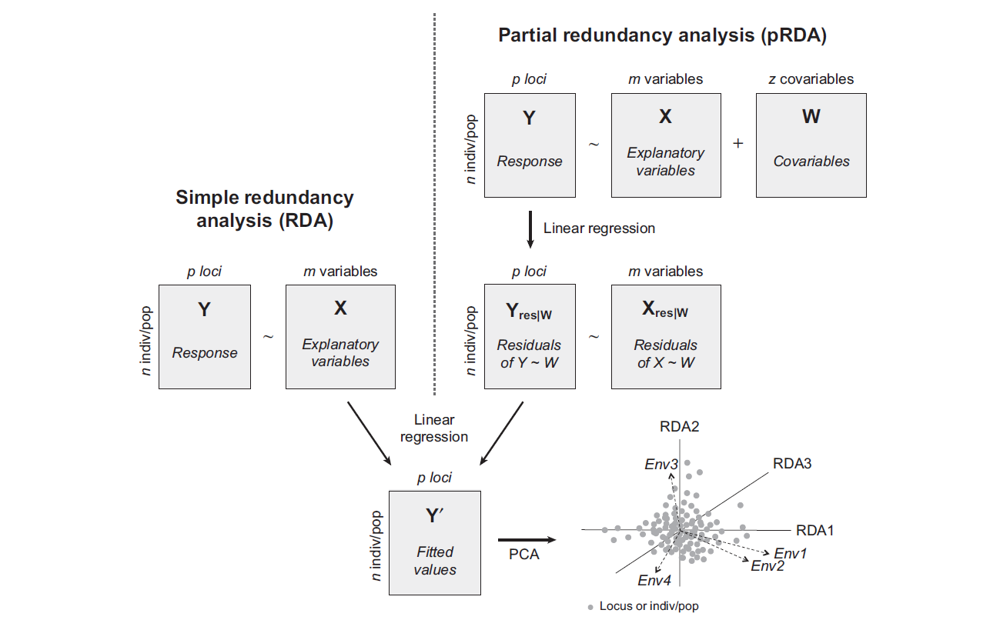

<script>
MathJax = {
  tex: {
    inlineMath: [['$', '$'], ['\\\\(', '\\\\)']]
  },
  svg: {
    fontCache:   'global'   // 'local',or 'global' or 'none'
  }
};
</script>
<script type="text/javascript" id="MathJax-script" async
  src="https://cdn.jsdelivr.net/npm/mathjax@3/es5/tex-svg.js">
</script>
<script type="text/javascript" id="MathJax-script" async
  src="http://127.0.0.1:8000/Bioinfo/Statistics/Basis/tex-svg.js">
</script>
<script type="text/javascript" id="MathJax-script" async
  src="https://github.com/Jiarong-L/notes/blob/main/docs/Bioinfo/Statistics/Basis/tex-svg.js">
</script>
<!-- src="https://cdn.jsdelivr.net/npm/mathjax@3/es5/tex-svg.js" -->
<!-- src="http://127.0.0.1:8000/Bioinfo/Statistics/Basis/tex-svg.js" -->


<style>
img{
    width: 60%;
}
</style>


数据降维


## Recall

### Eigen

假设对于$n$阶矩阵 $A \in R^{n \times n}$，存在非零列向量 $\vec{v} \in R^{n}$ 使得 $A\vec{v}=\lambda\vec{v}$，则 $\lambda \in R$ 为矩阵$A$的一个**特征值**，$\vec{v}$ 为为矩阵 $A$ 的一个**特征向量**

求解过程：

* $A\vec{v}-\lambda\vec{v}=0$
* $A\vec{v}-\lambda I \vec{v}=0$，$(\because \vec{v}=I\vec{v})$
* $(A-\lambda I)\vec{v}=0$
* $A-\lambda I=0 $，$(\because \vec{v}非零)$
* $
\begin{bmatrix}
a_{11}-\lambda & a_{12} & ... & a_{1n} \\\\
a_{21} & a_{22}-\lambda & ... & a_{2n} \\\\
... & ... & ... & ... \\\\
a_{n1} & a_{n2} & ... & a_{nn} 
\end{bmatrix} = 0
$ 可求得多个解 $\lambda_1,\lambda_2,...$
* 将$\lambda_i$代入原式，计算$\vec{v_i}$


[参考1](https://zhuanlan.zhihu.com/p/625791671), [参考2](https://zhuanlan.zhihu.com/p/104980382)

### SVD
（奇异值分解）[参考1](https://zhuanlan.zhihu.com/p/29846048),[参考2](https://zhuanlan.zhihu.com/p/629013736)

$$
\begin{bmatrix}
a_{11} & ... & a_{1n} \\\\
a_{21} & ... & a_{2n} \\\\
... &  ... & ... \\\\
... &  ... & ... \\\\
a_{m1}  & ... & a_{mn} 
\end{bmatrix} = 
\begin{bmatrix}
| & | & ... & ... & ... & | \\\\
| & | & ... & ... & ... & | \\\\
\vec{u_1} & \vec{u_2} & ... & ... & ... & \vec{u_m} \\\\
| & | & ... & ... & ... & | \\\\
| & | & ... & ... & ... & |
\end{bmatrix}
\begin{bmatrix}
\sigma_1 & 0 & ... \\\\
0 & \sigma_2 & ... \\\\
0 & 0 & ...  \\\\
... & ... & ...  \\\\
0 & 0 & ...  
\end{bmatrix}
\begin{bmatrix}
.- & \vec{v_1} & -. \\\\
... & ... & ... \\\\
.- & \vec{v_n} & -.
\end{bmatrix}
$$

任意实矩阵 $A \in R^{m \times n}$ 都可以分解为 $A=U \Sigma V^T$，其中

* $U \in R^{m \times m}, U^TU=I$
* $\Sigma \in  R^{m \times n}, (\Sigma)_{ii}=\sigma_i$ 依次增大，其余部分为0
* $V \in R^{n \times n}, V^TV=I$


解法：

* $(A^TA)\vec{v_i}=\lambda_i\vec{v_i}$，对$(A^TA) \in R^{n \times n}$ 求特征值得$\vec{v_i}$与$\lambda_i$

* $(AA^T)\vec{u_i}=\lambda_i\vec{u_i}$，对$(AA^T) \in R^{m \times m}$ 求特征值得$\vec{u_i}$与$\lambda_i$

* $A\vec{v_i}=\sigma_i\vec{u_i}$ 求解奇异值 $\sigma_i = \sqrt{\lambda_i}$


用法：可以用$\Sigma$中最大的k个奇异值来近似表达原矩阵：$A_{m \times n} \approx A_{m \times k} = U_k\Sigma_kV^T_k$


### MDS

假设 $m$ 个样本在原始空间的距离矩阵 $D \in R^{m \times m}$，其 $i$ 行 $j$ 列的元素 $dist_{ij}$ 表示样本 $x_i$ 到 $x_j$ 的距离，多维缩放(Multiple Dimensional Scaling, MDS)的目标是获得样本在 $d'<m$ 维空间的表示，并且**任意样本在低维空间中的距离等于原始空间中的距离**（欧式距离/其它）


* $dist_{i-}^2=\frac{1}{m}\sum\limits_{j=1}^{m}dist_{ij}^2$
* $dist_{-j}^2=\frac{1}{m}\sum\limits_{i=1}^{m}dist_{ij}^2$
* $dist_{--}^2=\frac{1}{m^2}\sum\limits_{i=1}^{m}\sum\limits_{j=1}^{m}dist_{ij}^2$
* 内积矩阵$B$，其元素 $b_{ij} = -\frac{1}{2}(dist_{ij}^2-dist_{i-}^2-dist_{-j}^2+dist_{--}^2)$
* 对内积矩阵$B$进行特征值分解，取 $\Lambda$ 为 $d'$ 个最大特征值构成的对角矩阵，$V$ 为相应的特征向量矩阵
* 得到新矩阵 $\Lambda V^{1/2} \in R^{m \times d'}$，每行是一个样本的低维坐标


## PCA
（主成分分析: 如果一个特征的**方差**很大，则说明这个特征上带有大量的**信息**）[参考1](https://zhuanlan.zhihu.com/p/448641448),[参考2](https://zhuanlan.zhihu.com/p/478417013),[参考3](https://www.cnblogs.com/banshaohuan/p/13308723.html),[示例1](https://davidzeleny.net/anadat-r/doku.php/en:pca_examples)，[scores](https://rdrr.io/cran/vegan/man/scores.html)


1. 预处理（标准化/中心化/归一化）矩阵数据 $A_{m \times n}$：m_Sample，n_Feature
2. 对 $A^TA \in R^{n  \times n}$ 进行特征值分解，得到$n$组特征值与特征向量 $(\lambda_i \in R,\vec{v_i}\in R^{n})$，即：$PC_i$上保留方差的比例与最大方差的方向
3. 计算m_Sample在$PC_i$上的坐标：$A\vec{v_i} = \vec{d_i} \in R^{m}$
4. 计算n_Feature在$PC_i$上的坐标，则对 $AA^T \in R^{m  \times m}$ ...(略)

```
A = iris[,-5]
res_pca <- prcomp(A)
loadings <- scores (res_pca, display = 'both', scaling = 'species')
biplot (res_pca, display = 'both', scaling = 'species')

## res_pca$sdev：各PC上保留方差的比例
## loadings$species=res_pca$rotation：n_Feature在PC上的相对坐标
## loadings$sites=res_pca$x: m_Sample在PC上的相对坐标
```


## PCoA

关注距离，[示例](https://blog.csdn.net/qq_47369980/article/details/122644823)

1. 对样本集生成距离矩阵 $D$，生态学中常见使用 Jaccard, Bray-Curtis, Unifrac, ...
2. MDS：```cmdscale(D,k=nrow(D)-1,egi=TRUE)```


## NMDS

关注距离的秩次，[示例](https://zhuanlan.zhihu.com/p/559725141)


1. 对样本集生成距离矩阵 $D$，
2. ```metaMDS(D,k=nrow(D)-1)```


## Canonical Analysis
[典型相关分析（Canonical Analysis）](https://www.sciencedirect.com/science/article/abs/pii/B9780444538680500113) 

* Asymmetric：RDA、CCA、LDA；  
* Symmetric：CCorA、CoIA、Proc


### RDA
[参考1](https://www.researchgate.net/publication/354709037_Redundancy_Analysis_RDA_a_Swiss_Army_knife_for_landscape_genomics)，[参考2](https://r.qcbs.ca/workshop10/book-en/redundancy-analysis.html)，[参考 vegan](https://vegandevs.github.io/vegan/reference/cca.html)，[参考 RDA_CCA](https://davidzeleny.net/anadat-r/doku.php/en:rda_cca)，仅当y与x为**线性**关系时使用RDA，否则可以考虑逻辑回归、梯度森林、polynomial RDA...

 

* 输入：（centered, standardized, transformed, normalized）
  - Response Matrix $Y$：n样本，p物种/loci/...
  - Explanatory Matrix $X$：n样本，m环境因子/任何变量/...
  - Conditioning variables $W$：n样本，z限制因子(e.g. 群体结构参数，ancestry coefficients，PC axes，spatial
eigenvectors)
* $Y$在$X$上进行多元回归 $y_{ii}=\beta_1x_{i1}+\beta_2x_{i2}+...$，得到拟合值矩阵：$\hat{Y}=X[X'X]^{-1}X'Y$ 与 残差矩阵$Y_{res}=Y-\hat{Y}$
  - 对$\hat{Y}$进行PCA分析，得到约束轴(constrained)$RDA_i$上展示的信息
  - 对$Y_{res}$进行PCA，得到非约束轴(unconstrained)$PC_i$上展示的信息
  - 轴的总数量为(n_sample-1)，其中约束轴数目为(explain_x_level)，余下为非约束轴；其中 explain_x_level = quantitative_x数目 + (categorical_x中类别数-1)

```
data(dune)
data(dune.env)


## cca(X, Y, Z) 等于 
## cca(X ~ Y + Condition(Z))
## DataMatrix ~ ConstrainVar1 + Condition(Var)
## Y, Z can be missing

####################################### Only X = Only PCA
x_rda <- rda(dune)
biplot(x_rda,type = c("text","points"))  
summary(x_rda)


####################################### With constrains Y
c_rda <- rda(dune ~ A1, dune.env)  ## dune ~ .
ordiplot(c_rda) 
summary(c_rda)


####################################### With constrains Y & condition Z
z_rda <- rda(dune ~ A1 + Condition(Manure), dune.env) 
ordiplot(z_rda) 
summary(z_rda)


## Species scores: spe/loci(dune列名)在各轴上的顶点坐标
## Site scores: 样本点(dune行名)在各轴上的坐标 (weighted sums of species scores)
## Site constraints: 样本点的fitted Site scores (linear combinations of constraining variables)
## Biplot scores for constraining variables：constrains在各轴上坐标
```
* 注：PCA过程中分解$\hat{Y}^T\hat{Y}$得到特征向量矩阵$U$
  - Site scores $YU$：ordination in the space of Y
  - Site constraints $\hat{Y}U$：ordination in the space of X 


### CCA
[参考](https://zhuanlan.zhihu.com/p/52717082)


