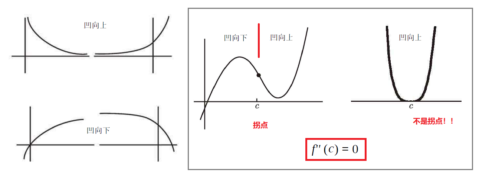
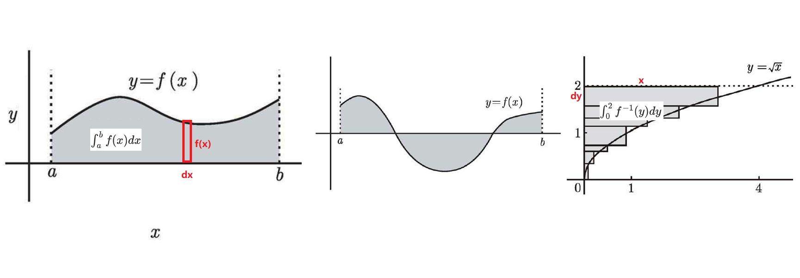
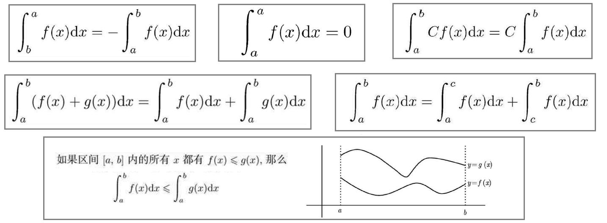

教材：《普林斯顿微积分读本》

省略：13章介绍使用导数求解最优化问题（牛顿法：13.3）

不确定：**瑕点**包括极点(函数在该点处取无穷值)和奇点(函数在该点处不连续)

## 函数

* $f:A \rightarrow B$ 是一个函数，也可以看作是一个变换规则，$f(x)=y$表示将这个变换规则应用于变量$x$后得到$y$
* $x$的取值范围$A$称为定义域，$y$的值域（所有可能输出的集合，受$x$取值范围的限制）是上域$B$的一个子集
    - 例：$f(x)=x^2$的定义域$R$，上域$R$，值域$R^+$
* 函数$f$的反函数$f^{-1}$
    - $f(x)=y$，$f^{-1}(y)=x$
    - (图像以 $y=x$ 为镜面翻转)
* 复合函数：$f(x)=m(k(j(x)))=m \circ k \circ j$
    - 例：$f(x)=m(k(j(x)))=m \circ k \circ j$
* 一个函数可以是奇函数/偶函数/非奇非偶/即奇又偶；对取值范围内所有的$x$：
    - 奇函数：$f(-x)=-f(x)$ 图像原点对称
    - 偶函数：$f(-x)=f(x)$ 图像沿$y$轴对称
* 函数**有界**：对于定义域内的任意的$x$，存在常数 $m$、$M$ 使得 $m \le f(x) \le M$
* 函数$f$在$[a,b]$区间内的平均值 $=\frac{1}{b-a}\int_a^b f(x)dx$

## 极限

* $f(x)$在$x=a$处时，左极限$\lim\limits_{x \rightarrow a^-}f(x)=L$，右极限$\lim\limits_{x \rightarrow a^+}f(x)=L$，则极限$\lim\limits_{x \rightarrow a}f(x)=L$
    - 上图$h(x),x=3$处因左右极限不相等，其极限不存在(DNE)
    - 上图$g(x),x=2$处极限=1
    - 上图$sin(\frac{1}{x}),x=0$处大幅震荡，其极限不存在(DNE)

* 水平渐近线：（x趋向无穷时）  

* 三明治定理/夹逼定理：（判定极限存在/求极限）  

* 如果 $\lim\limits_{x \rightarrow a}=f(a)$，函数$f(a)$在$x=a$处**连续**

* 介值定理：（e.g. 用来证明某个方程有解）  

* 如果$f$在$[a,b]$上连续，则$f$在$[a,b]$上至少有一个最大值和最小值  

### 求极限

* **求极限方法示例**：  

* **洛必达法则**：利用导数的知识求极限的值    

| 场景 | -- | $x \rightarrow ?$ 时 | 方法 | -- |
| -- | -- | -- | -- | -- |
| A | $\lim\limits_{x \rightarrow ?}\frac{f(x)}{g(x)}$ | $\frac{0}{0}$   $\frac{\pm \infty}{\pm \infty}$ | $\lim\limits_{x \rightarrow ?}\frac{f(x)}{g(x)}=\lim\limits_{x \rightarrow ?}\frac{f'(x)}{g'(x)}$ | **求导过程中不能使用商法则！**   [解释示例](./Calculus/14-1.png) |
| B1 | $\lim\limits_{x \rightarrow ?}[f(x)-g(x)]$ | $\pm (\infty-\infty)$ | 转换为场景A：通分或乘除共轭表达式 | [示例](./Calculus/14-2.png) |
| B2 | $\lim\limits_{x \rightarrow ?}f(x)g(x)$ | $0 \times \pm\infty$ | 转换为场景A：$\lim\limits_{x \rightarrow ?}f(x)g(x)=\lim\limits_{x \rightarrow ?}\frac{f(x)}{1/g(x)}$ | 建议选较简单的函数取倒数 |
| C | $\lim\limits_{x \rightarrow ?}f(x)^{g(x)}$ | $1^{\pm \infty}$   $0^0$   $\infty^0$ | 先取对数，可转化为场景B，求得其对数的极限：$$\lim\limits_{x \rightarrow ?}\ln[f(x)^{g(x)}]$$    $$=\lim\limits_{x \rightarrow ?}g(x)\ln[f(x)]$$    $$=L$$   然后返回原式的极限： $$\lim\limits_{x \rightarrow ?}f(x)^{g(x)} = e^L$$ | -- |

## 导数

使用导数来求解微分问题

* 导数的定义：  

* 二阶导数就是关于x导二次，三阶就是三次（见上图·示例），...
    - 区分：$(\frac{dy}{dx})^2$ 一阶导的平方, $\frac{d^2y}{dx^2}$关于$x$的二阶导, $\frac{dy}{d(x^2)}$关于$x^2$的一阶导
    - 注：$f^{(n)}(x)$表示n阶导数

* 可导性：如果$f(x)$在$(a,b)$内可导并且在$a^+$和$b^-$处的导数都存在，则称$f(x)$在闭区间在$[a,b]$上可导；如果一个函数在$x$上可导，那么它在$x$上连续

* 如果对于定义域内的所有$x$，函数$f$可导、且单调，则$f$的**反函数**$f'$**存在**：
    - $f'(x) >0$，则$f(x)$单调递增，反函数存在
    - $f'(x) <0$，则$f(x)$单调递减，反函数存在
    - 如果满足 $f'(x) = 0$ 的 $x$ 个数有限，也可以放宽到$\ge 0$或$\le 0$的情况

### 求导

常用求导法则：  

**隐函数求导**：（关于$x$求导的方程还包含变量$y$，希望求$y$随$x$的变化关系$\frac{dy}{dx}$）

* 示例：求圆 $x^2+y^2=4$ 在圆上各点 $(x,y)$ 处斜率$\frac{dy}{dx}$
    1. 公式两边加上 $\frac{d}{dx}$，两边各自关于$x$求导：$\frac{d}{dx}(x^2+y^2)=\frac{d}{dx}(4)$ 
    2. （隐函数）令$u=y^2$，则$\frac{d}{dx}(y^2)=\frac{du}{dy}\frac{dy}{dx}=2y\frac{dy}{dx}$
    3. $2x +2y\frac{dy}{dx}=0$，则 $\frac{dy}{dx}=-\frac{x}{y}$
    * （拆分 & 使用链式法则）
* 示例：求**反函数** $y=f^{-1}(x)$ **的导数**
    1. 公式可写为 $f(y)=x$，两边关于$x$隐函数求导
    2. $\frac{d}{dx}f(y)=\frac{d}{dx}x=1$
    3. 设 $u=f(y)$，则 $\frac{d}{dx}f(y)=\frac{du}{dx}=\frac{du}{dy}\frac{dy}{dx}=f'(y)\frac{dy}{dx}$
    4. 可知 $\frac{dy}{dx}=\frac{1}{f'(y)}$  即：$\frac{d}{dx}f^{-1}(x)=\frac{1}{f'(f^{-1}(x))}$

### 导数与函数图像

* 导数$f'(x)$的几何定义是：函数$y=f(x)$在点$(x,y)$处切线的斜率

* **极值定理**：如果函数 $f$ 的定义域 开区间$(a,b)$ 内有一点 $c$ 为函数的**局部**最大值或最小值，则点 $c$ 一定为该函数的临界点，即，$f'(c)=0$ 或 不存在
  - 可以从多个临界点中寻找**全局**最大值或最小值

* **罗尔定理**：假设函数 $f$ 在闭区间$[a,b]$ 内连续、在开区间$(a,b)$ 内可导，如果 $f(a)=f(b)$，则开区间$(a,b)$ 内至少存在一点 $c$，使得 $f'(c)=0$ （即：$c$是拐点、或 $f$ 的图像是水平线段）

* **中值定理**：假设函数 $f$ 在闭区间$[a,b]$ 内连续、在开区间$(a,b)$ 内可导，则开区间$(a,b)$ 内至少存在一点 $c$，使得 $f'(c)=\frac{f(b)-f(a)}{b-a}$，即函数图像在点$c$处的**切线**与$a,b$两点间的**连线**平行（斜率相同）
    - 
    - 推论：如果对于 $(a,b)$ 内任意 $x$，都有 $f'(x)=0$，则函数在此区间为常函数（水平线段）
    - 推论：如果对于定义域内任意 $x$，都有 $f'(x)=g'(x)$，则 $f(x)=g(x)+C$（$C$表示任意常数）

* 二阶导数$f''(x)$的符号意味着函数的凹性
    - 
    - 区间内始终$f''(x) > 0$：凹向上
    - 区间内始终$f''(x) < 0$：凹向下
    - $f''(x) = 0$：可能是**拐点**，也可能不是（如果左右两边点的二阶导数符号相同，说明凹性没有改变、不是拐点）

* 一阶导数 $f'(c)=0$ 时的几种情况
    - 
    - 使用二阶导数进一步判断
        * $f''(c)<0$ 局部最大
        * $f''(c)>0$ 局部最小
        * $f''(c)=0$ 无法判断
    - 使用左右点的一阶导数进一步判断（切线斜率的变化）
        * 左正-->右负：局部最大
        * 左负-->右正：局部最小
        * 左右符号一致：水平拐点

## 积分

* 函数 $y=f(x)$ 积分的几何意义：函数 $y=f(x)$ 与$x$轴之间的有向面积（正/负）
    - 反函数 $x=f^{-1}(y)$ 积分：函数 $y=f(x)$ 与$y$轴之间的有向面积（正/负）
    - **定积分**：指定区间内的面积，例如 $\int_a^b f(x)dx$
    - **不定积分**：“函数$f$的反导数的集合”，例如 $\int f(x)dx$、$\int_a^x f(x)dx$
    - **反常积分**：$f$在区域内无界，或者变量$x$范围无穷，例如  $\int_{-\infty}^{0} f(x)dx$

* **微积分第一基本定理**：如果函数$f$在闭区间$[a,b]$上连续，定义$$F(x)=\int_a^x f(t)dt,\quad x \in [a,b]$$ 则$F$在开区间$(a,b)$内可导，且 $F'(x)=f(x)$，即 $$\frac{d}{dx}\int_a^x f(t)dt = f(x)$$

* **微积分第二基本定理**：如果函数$f$在闭区间$[a,b]$上连续，$F$是$f$关于$x$的任意反导数，则有 $$\int_a^b f(x)dx=F(b)-F(a)$$

### 定积分

* **定积分**（黎曼积分）：将$[a,b]$区间分割成 $n \rightarrow \infty$ 块（$mesh  \rightarrow 0$）来求 $\int_a^b f(x)dx$ 

  
示例

$$\int_0^2 x^2dx = \lim\limits_{n \rightarrow \infty}\sum\limits_{j=1}^n{f(x_j)\frac{1}{n}}=\lim\limits_{n \rightarrow \infty}\sum\limits_{j=1}^n\frac{8j^2}{n^3}=\lim\limits_{n \rightarrow \infty}\frac{8}{n^3}\frac{n(n+1)(2n+1)}{6}=\frac{8}{3}$$
$x_j$可以在当前$mesh$中的任何位置取值（e.g.上和、下和），但只要它足够小，任何取值都将趋近

  
求$\sum\limits_{j=1}^nj^2$

伸缩求和法：$\sum\limits_{x=a}^b[f(x)-f(x-1)]=f(b)-f(a-1)$
$$\sum\limits_{j=1}^n [j^2-(j-1)^2] = \sum\limits_{j=1}^n (2j-1) = n^2 \therefore \sum\limits_{j=1}^nj = \frac{n(n+1)}{2}$$
$$\sum\limits_{j=1}^n [j^3-(j-1)^3] = \sum\limits_{j=1}^n (3j^2-3j+1) = n^3 \therefore \sum\limits_{j=1}^nj^2 = \frac{n(n+1)(2n+1)}{6}$$

* 定积分**可积**：有限个不连续点、函数有界    

* 定积分的性质：  

* 积分的**中值定理**：假设函数 $f$ 在闭区间$[a,b]$ 内连续，则开区间$(a,b)$ 内至少存在一点 $c$，使得 $f(c)=\frac{1}{b-a}\int_a^b f(x)dx$（函数$f$在此区间的平均值）

* 对积分式求导、求极限时，一些变形的例子：  

### 不定积分

**不定积分**其实是关于$x$的函数：$\int f(x)dx = F(x) + C$，其中 $\frac{d}{dx}F(x)=f(x)$

**Hints 1：**

$F(x)=\int_0^x t^2dt$

$G(x)=\int_a^x t^2dt$

$F(x)=\int_0^a t^2dt+G(x)=C+G(x)$

**Hints 2：**($h \rightarrow 0$)

$F(x+h)-F(x) = \int_x^{x+h}f(t)dt \approx hf(x)$

### 反常积分

| 场景如上图示 | 如果极限存在，则积分收敛；否则积分发散 |
| -- | -- |
| $[a,b]$区间内积分，但a附近无界 | $\int_a^bf(x)dx=\lim\limits_{\epsilon \rightarrow 0^+}\int_{a+\epsilon}^bf(x)dx$ |
| $[a,b]$区间内积分，但b附近无界 | $\int_a^bf(x)dx=\lim\limits_{\epsilon \rightarrow 0^+}\int_{a}^{b-\epsilon}f(x)dx$ |
| $[a,\infty]$区间内积分 | $\int_a^{\infty}f(x)dx = \lim\limits_{N \rightarrow \infty}\int_a^Nf(x)dx$ |
| $[-\infty,b]$区间内积分 | $\int_{-\infty}^bf(x)dx = \lim\limits_{N \rightarrow \infty}\int_{-N}^bf(x)dx$ |
| $[-\infty,\infty]$区间内积分 | $\int_{-\infty}^{\infty}f(x)dx=\int_{-\infty}^{0}f(x)dx+\int_{0}^{\infty}f(x)dx$ |
| Tips | 如果函数有多处瑕点，可以**拆成多个积分，保证每部分积分只有一处瑕点**；不过只有当每部分积分都收敛时，积分才收敛 |
| [示例](./Calculus/20-2.png) | 实际上常数项可以随意按需拆分，主要关心的还是能否收敛 |

* 使用**比较判别法**判断积分是否收敛：（假设--仅当$f,g$非负时）
    - 已知 $\int_a^bg(x)dx$ 发散，如果 $[a,b]$ 区间内 $f(x)$ 的图像包裹住 $g(x)$，则确定 $\int_a^bf(x)dx$ 也发散
        * $0 \le g(x) \le f(x)$
    - 已知 $\int_a^bg(x)dx$ 收敛，如果 $[a,b]$ 区间内 $f(x)$ 的图像被 $g(x)$ 包裹，则确定 $\int_a^bf(x)dx$ 也收敛
        * $0 \le f(x) \le g(x)$
    - （有点类似夹逼定理，不过没那么严格）

* 使用**极限比较判别法**判断积分是否收敛：准备一个与 $f(x)$ 在瑕点处近似（敛散性一致）的函数
    - 当 $x \rightarrow a$ 时, $f(x) \sim  g(x)$ 即 $\lim\limits_{x \rightarrow a}\frac{f(x)}{g(x)}=1$
    - 通常使用 $g(x) = \frac{1}{x^p}$ 的形式，称为 [p判别法](./Calculus/20-3.png)
        * 对于有限值 $a>0$，积分 $\int_a^{\infty}\frac{1}{x^p}dx$ 在 $p>1$ 时收敛，在 $p \le 1$ 时发散
        * 对于有限值 $a>0$，积分 $\int_0^a\frac{1}{x^p}dx$ 在 $p<1$ 时收敛，在 $p \ge 1$ 时发散
    - [一些寻找近似函数的 Tips & 示例](./Calculus/20-4.png)

* **绝对收敛判别法**：如果 $\int_a^b|f(x)|dx$ 收敛，那么 $\int_a^bf(x)dx$ 也收敛

### 求积分

利用导数和积分可以相互抵消的性质，可以计算积分：  

**一些求反导数$F(x)$的技巧：18章**

**换元法**

设 $t=g(x)$，则 $\frac{dt}{dx}=g'(x)$ 即 $dt=g'(x)dx$

于是可以将形似如下的方程化简：$$\int f(g(x))g'(x)dx = \int f(t)dt = F(t) + C = F(g(x)) + C$$

  
 求 $\int x^2 cos(x^3)dx$，设 $t=x^3$ 

由 $\frac{dt}{dx}=\frac{dx^3}{dx}=3x^2$ 可知 $x=t^{1/3}$、$dx=\frac{dt}{3x^2}=\frac{dt}{3t^{2/3}}$，于是：
  
 $\int x^2 cos(x^3)dx = \int t^{2/3} cos(t) \frac{dt}{3t^{2/3}} = \frac{1}{3} \int cos(t)dt = \frac{1}{3} sin(t) = \frac{1}{3} sin(x^3)$

  
定积分：注意不要混淆$x$、$t$范围

$\int_0^{(\pi)^{1/3}} x^2 cos(x^3)dx = \int_{t=0}^{t=\pi} cos(t)dt$
  
对于定积分，建议计算出用$x$表示的不定积分后再代入范围数值

**分部积分法**

$$\int udv = uv - \int vdu$$

  
推导过程

$$\frac{d}{dx}(uv) = v\frac{du}{dx} +u\frac{dv}{dx}$$
$$\int\frac{d}{dx}(uv)dx = \int v\frac{du}{dx}dx +\int u\frac{dv}{dx}dx$$
$$uv = \int vdu +\int udv$$
$$即  \int udv = uv - \int vdu$$

  
$\int x e^xdx = xe^x - \int e^xdx$

$u=x$ ，对$u$求导得到 $du=dx$
  
$dv=e^xdx$ ，对$dv$求积分得到 $v=e^x$

  
$\int x^2sin(x)dx$

$u=x^2$ ，对$u$求导得到 $du=2x$
  
$dv=sin(x)dx$ ，对$dv$求积分得到 $v=-cos(x)$
  
然后对 $2\int(-cos(x))xdx$ 再来一次分部积分法

  
$\int tan^{-1}(x)dx$

$u=tan^{-1}(x)$ ，对$u$求导得到 $du=\frac{1}{1+x^2}dx$
  
$dv=dx$ ，对$dv$求积分得到 $v=x$

**部分分式**

$$\int \frac{p(x)}{q(x)}dx=\int \frac{p(x)}{(\dots)(\dots)(\dots)}dx=\int (\frac{a}{(\dots)} + \frac{b}{(\dots)} + \frac{c}{(\dots)})dx$$

[拆解Tips](./Calculus/18-1.png)

  
$\int \frac{x+2}{x^2-1}dx$

$$\int \frac{5x^2+x-3}{x^2-1}dx=\int (5+\frac{x+2}{x^2-1})dx = 5x+\int \frac{x+2}{x^2-1}dx$$
$$\int \frac{x+2}{x^2-1}dx = \int \frac{x+2}{(x-1)(x+1)}dx = \int \frac{3/2}{x-1}dx + \int \frac{-1/2}{x+1}dx$$
随后可以用换元法$t=(分母)^n$求解各部分

## 常见函数

### 三角函数

* $\pi=180度$  

* 定义与一些换算：  

* 一些值：  

* 求极限：  

| 导数 | 不定积分 | -- |
| -- | -- | -- |
| $\frac{d}{dx}sin(x)=cos(x)$ | $\int cos(x)dx=sin(x)+C$ | [求导推理](./Calculus/7-2.png) |
| $\frac{d}{dx}cos(x)=-sin(x)$ | $\int sin(x)dx=-cos(x)+C$ | -- |
| $\frac{d}{dx}tan(x)=sec^2(x)$ | $\int sec^2(x)dx=tan(x)+C$ | [求导推理](./Calculus/7-2.png) |
| $\frac{d}{dx}sec(x)=sec(x)tan(x)$ | $\int sec(x)tan(x)dx=sec(x)+C$ | -- |
| $\frac{d}{dx}cot(x)=-csc^2(x)$ | $\int csc^2(x)dx=-cot(x)+C$ | [求导推理](./Calculus/7-2.png) |
| $\frac{d}{dx}csc(x)=-csc(x)cot(x)$ | $\int csc(x)cot(x)dx=-csc(x)+C$ | -- |

### 反三角函数

三角函数的反函数，$sin^{-1}(x)$ 就是 $arcsin(x)$；导数、不定积分 详见[百科](https://baike.baidu.com/item/%E5%8F%8D%E4%B8%89%E8%A7%92%E5%87%BD%E6%95%B0/7004029)与第十章（此笔记略）  

* 常用隐函数求导
    - 示例：$y=sin^{-1}(x)$
    - 其导数 $\frac{dy}{dx}=\frac{1}{sin'(y)}=\frac{1}{cos(y)}=\frac{1}{cos(sin^{-1}(x))}$

### 指数函数-对数函数

* 指数函数：$b^x$，对数函数：$\log_b(x)$
* $e=\lim\limits_{h \rightarrow 0^+}(1+h)^{1/h}=\lim\limits_{n \rightarrow \infty}(1+\frac{1}{n})^n$
* $e^x=\lim\limits_{n \rightarrow \infty}(1+\frac{x}{n})^n$ 仅当$n$很大时成立
* $\ln(e)=1$

* 求极限：   

| 导数 | 不定积分 |
| -- | -- |
| $$\frac{d}{dx}a^x=a^x\ln(a)$$ | $\int a^x dx=\frac{a^x}{\ln(a)}+C$ |
| $$\frac{d}{dx}e^{kx}=e^{kx}\ln(e^{k})=ke^{kx}$$ | -- |
| $$\frac{d}{dx}log_a(x)=\frac{1}{x \ln(a)}$$ | -- |
| $$\frac{d}{dx}\ln(x)=\frac{1}{x}$$ | $\int \frac{1}{x}dx=\ln(\|x\|)+C$ |

对于$f(x)^{g(x)}$形式的方程，一般取它的对数后再隐函数求导：
$$y=x^{sin(x)}$$
$$u=\ln(y)=\ln(x^{sin(x)})=sin(x)\ln(x)$$
$$\frac{d}{dx}(\ln(y))=\frac{d}{dx}(sin(x)\ln(x))$$
$$\frac{1}{y}\frac{dy}{dx}=cos(x)\ln(x)+\frac{six(x)}{x}$$
$$\frac{dy}{dx}=[cos(x)\ln(x)+\frac{six(x)}{x}]y$$
  注：$\frac{du}{dx}=\frac{du}{dy}\frac{dy}{dx}=\frac{1}{y}\frac{dy}{dx}$

### 双曲函数

双曲函数算是指数函数的一种，虽然从名字上看有点像三角函数

| $sinh(x)=\frac{e^x-e^{-x}}{2}$ | $cosh(x)=\frac{e^x+e^{-x}}{2}$ | $tanh(x)=\frac{sinh(x)}{cosh(x)}$ |
| -- | -- | -- |
| $csch(x)=\frac{1}{sinh(x)}$ | $sech(x)=\frac{1}{cosh(x)}$ | $coth(x)=\frac{1}{tanh(x)}$ |

| 导数 | 不定积分 |
| -- | -- |
|$\frac{d}{dx}sinh(x)=cosh(x)        $|$cosh(x)dx=sinh(x)+C        $|
|$\frac{d}{dx}cosh(x)=sinh(x)        $|$sinh(x)dx=cosh(x)+C        $|
|$\frac{d}{dx}tanh(x)=sech^2(x)      $| ... |
|$\frac{d}{dx}coth(x)=-csch^2(x)     $| ... |
|$\frac{d}{dx}sech(x)=-sech(x)tanh(x)$| ... |
|$\frac{d}{dx}csch(x)=-csch(x)coth(x)$| ... |

## 数列

* **数列** {$a_n$} 可能是有限项，也可能有无穷项；一般可以用一个公式表示
    - 等比数列：{2,4,6,...}  即  $a_n=r^n$   
    - 交错数列：{1,-2,3,-4,...}  正负项交替出现
    - 若 $\lim\limits_{n \rightarrow \infty}a_n$ 存在，则数量**收敛**；否则数列发散
    - （数列有点类似变量取正整数的函数）函数的求极限技巧也适用于数列

* **极数** $A_N=\sum\limits_{n=1}^{N}a_n$ 是数列所有项的和
    - 若无穷数列的级数 $\lim\limits_{N \rightarrow \infty}A_N$ 存在，则级数收敛；否则级数发散
    - **第n项判别法**：当 $\lim\limits_{n \rightarrow \infty}a_n \neq 0$ 或不存在时级数发散（但 $\lim\limits_{n \rightarrow \infty}a_n = 0$ 级数不一定收敛！例如 $a_n=\frac{1}{\sqrt{n}}$）
    - 比较判别法、极限比较判别法、绝对收敛判别法 也可用来判断级数的收敛与否（借助另一个确定级数收敛性的 $b_n$，参考 [反常积分](./#_10)）
        * **积分判别法**：假设 $f(n)=a_n$ **恒为正且递减**，极数 $A_N$ 与 $\int_1^{\infty}f(x)dx$ 同时收敛/发散
        * **交错级数判别法**：若 $|a_n|$ 的级数收敛，则 $a_n$ 的级数也收敛
    - **比式判别法**：设 $b_n=\frac{|a_{n+1}|}{|a_{n}|}$ 为 {$a_n$} 相邻两项的绝对值比值
        * 若 $\lim\limits_{N \rightarrow \infty}b_n = C < 1$，极数 $A_N$ 收敛
            - 对于收敛的**等比数列** $a_n=c^n$, (几何级数) $A_N = \lim\limits_{N \rightarrow \infty}\frac{a_1}{1 - a_{n+1}/a_n}$
        * 若 $\lim\limits_{N \rightarrow \infty}b_n = C > 1$，极数 $A_N$ 发散
        * 若 $\lim\limits_{N \rightarrow \infty}b_n = 1$ 或不存在，无法得出结论
    - **根式判别法**：设 $b_n=|a_n|^{1/n}$ 为 {$a_n$} 是第n项绝对值的n次方根
        * 若 $\lim\limits_{N \rightarrow \infty}b_n = C < 1$，极数 $A_N$ 收敛
        * 若 $\lim\limits_{N \rightarrow \infty}b_n = C > 1$，极数 $A_N$ 发散
        * 若 $\lim\limits_{N \rightarrow \infty}b_n = 1$ 或不存在，无法得出结论
    - 特殊情况：$a_n=\frac{1}{n^p}$ 当 $p>1$时极数收敛、$p \le 1$时极数发散；但不能用以下判别法判断：
        * $\lim\limits_{n \rightarrow \infty}a_n = 0$ （第n项判别法）
        - 比值极限为1（比式判别法）
        - 第n项绝对值的n次方根等于1（根式判别法）

* 一个有用的极限： 
    - $\lim\limits_{n \rightarrow \infty} \frac{x^n}{n!}=0$ （因其相邻项比值趋近于0）

## 泰勒多项式

* **泰勒近似定理**：若函数 $f$ 在 $x=a$ 处光滑，则可以用N 次泰勒多项式 $P_N(x)=\sum\limits_{n=0}^N\frac{f^{(n)}(a)}{n!}(x-a)^n$ 来近拟 $f$ 在 $x=a$ **附近**的值
    - **泰勒定理**：关于 $x=a$ 的 N阶余项（i.e. 误差） $R_N=\frac{f^{(N+1)}(c)}{(N+1)!}(x-a)^{N+1}$，其中 $c$ 是介于 $x$ 与 $a$ 之间的一个数，依赖于 $x$ 与 $N$，一般不能确定
    - $f(a) = P_N(a) + R_N(a)$
    - $f^{(n)}(a) = P_N^{(n)}(a)$
    - $N \rightarrow \infty$ 时 $P_N(x)$ 称为**泰勒级数**

* 泰勒级数在 $x=a$ 处一定收敛于 $f(x)$，但对于 $x \neq a$ 处则未必！甚至可能误差巨大，请参照N阶余项的极限（此外，尽量使N很大）
    - 示例：$\sum\limits_{n=0}^{\infty}n!x^n$只在 $x=a$ 处收敛 
    - **计算收敛范围**（比式判别法）：$\lim\limits_{n \rightarrow \infty}\frac{a_{n+1}(x-a)^{n+1}}{a_{n}(x-a)^{n}}=L|x-a|<1$ 时收敛，可依此计算 $x$ 在何范围收敛

* **麦克劳林级数**：函数 $f$ 关于 $x=0$ 的泰勒级数

| 麦克劳林级数 ($a=0$ 附近) | -- | 收敛范围 |
| -- | -- | -- |
| $e^x = \sum\limits_{n=0}^{\infty}\frac{x^n}{n!} $ | $1+ x + \frac{x^2}{2!}+ \frac{x^3}{3!} + ...$ | 所有实数 |
| $sin(x)= \sum\limits_{n=0}^{\infty}\frac{(-1)^nx^{2n+1}}{(2n+1)!}$ | $x-\frac{x^3}{3!}+\frac{x^5}{5!}-\frac{x^7}{7!}+...$ | 所有实数 |
| $cos(x)= \sum\limits_{n=0}^{\infty}\frac{(-1)^nx^{2n}}{(2n)!}$ | $x-\frac{x^2}{2!}+\frac{x^4}{4!}-\frac{x^6}{6!}+...$ | 所有实数 |
| $\frac{1}{1-x} = \sum\limits_{n=0}^{\infty} x^n$  | （比数列求和） | $-1<x<1$ |
| $\ln(1+x)=\sum\limits_{n=1}^{\infty}-\frac{(-1)^nx^n}{n}$ | $x-\frac{x^2}{2}+\frac{x^3}{3}-\frac{x^4}{4}+...$ | $-1 < x \le 1$ |
| $\ln(1-x)=\sum\limits_{n=1}^{\infty}-\frac{x^n}{n}$ | $-x-\frac{x^2}{2}-\frac{x^3}{3}-\frac{x^4}{4}-...$ | $-1 \le x < 1$ |

* 可以通过变量代换的方式**得到新的泰勒级数**
    - 设 $b=x-1$，则对于 $-1 < b \le 1$ 即 $0 < x \le 2$，$\ln(1+b)=\sum\limits_{n=1}^{\infty}-\frac{(-1)^nb^n}{n}$ 
    - 即是 关于 $x=1$ 的泰勒级数 $\ln(x) = \sum\limits_{n=0}^{\infty}-\frac{(-1)^n(x-1)^n}{n}$

