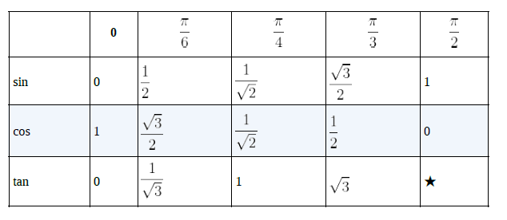
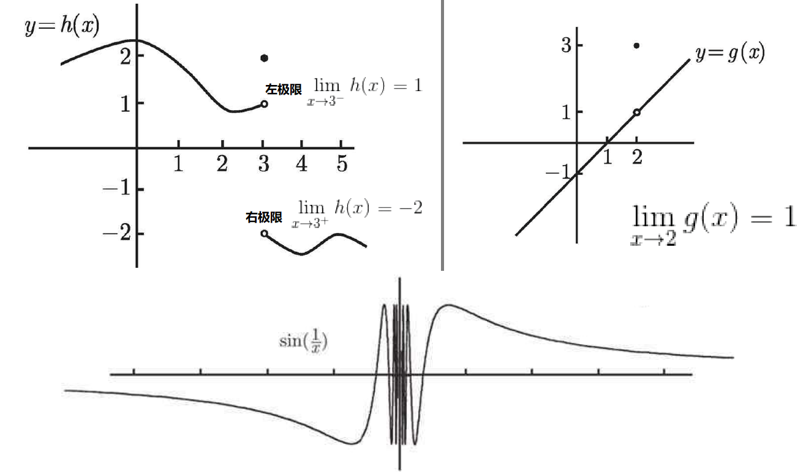
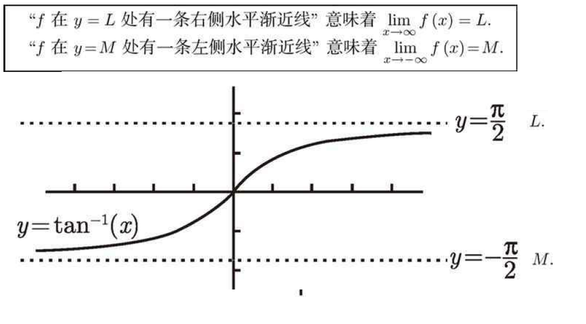

教材：《普林斯顿微积分读本》

## 函数

* $f:A \rightarrow B$ 是一个函数，也可以看作是一个变换规则，$f(x)=y$表示将这个变换规则应用于变量$x$后得到$y$
* $x$的取值范围$A$称为定义域，$y$的值域（所有可能输出的集合，受$x$取值范围的限制）是上域$B$的一个子集
    - 例：$f(x)=x^2$的定义域$R$，上域$R$，值域$R^+$
* 函数$f$的反函数$f^{-1}$
    - $f(x)=y$，$f^{-1}(y)=x$
* 复合函数：$f(x)=m(k(j(x)))=m \circ k \circ j$
    - 例：$f(x)=m(k(j(x)))=m \circ k \circ j$
* 一个函数可以是奇函数/偶函数/非奇非偶/即奇又偶；对取值范围内所有的$x$：
    - 奇函数：$f(-x)=-f(x)$ 图像原点对称
    - 偶函数：$f(-x)=f(x)$ 图像沿$y$轴对称

## 三角函数

## 极限

* $f(x)$在$x=a$处时，左极限$\lim\limits_{x \rightarrow a^-}f(x)=L$，右极限$\lim\limits_{x \rightarrow a^+}f(x)=L$，则极限$\lim\limits_{x \rightarrow a}f(x)=L$
    - 上图$h(x),x=3$处因左右极限不相等，其极限不存在(DNE)
    - 上图$g(x),x=2$处极限=1
    - 上图$sin(\frac{1}{x}),x=0$处大幅震荡，其极限不存在(DNE)

* 水平渐近线：（x趋向无穷时）  

* 三明治定理/夹逼定理：（求极限）  

* **求极限示例**：  

* 如果 $\lim\limits_{x \rightarrow a}=f(a)$，函数$f(a)$在$x=a$处**连续**

* 介值定理：（e.g. 用来证明某个方程有解）  

* 如果$f$在$[a,b]$上连续，则$f$在$[a,b]$上至少有一个最大值和最小值

## 微分

* 可导性：如果$f(x)$在$(a,b)$内可导并且在$a^+$和$b^-$处的导数都存在，则称$f(x)$在闭区间在$[a,b]$上可导；如果一个函数在$x$上可导，那么它在$x$上连续

* 常用求导法则：  

* 如何画出导数的图像：6.7节

