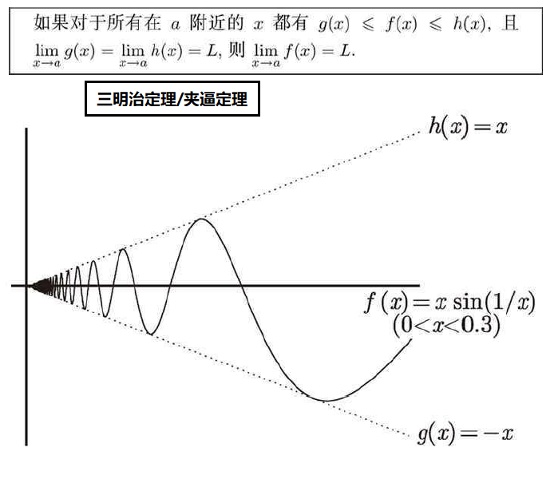
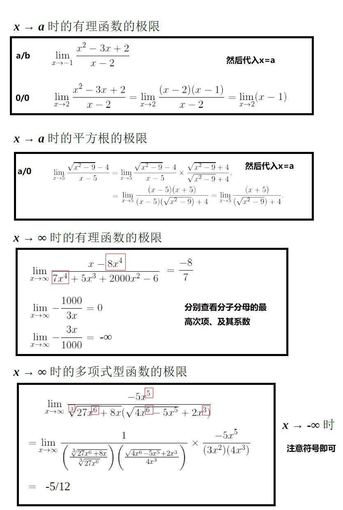
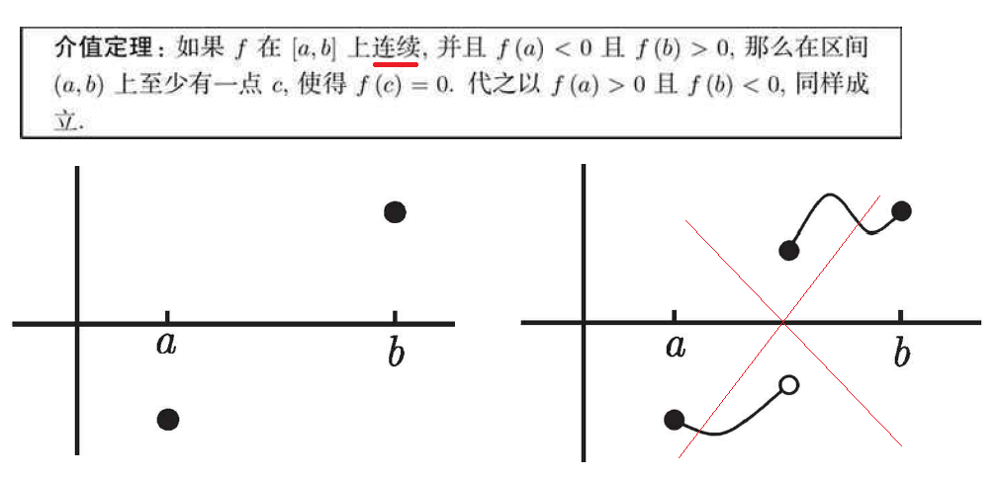
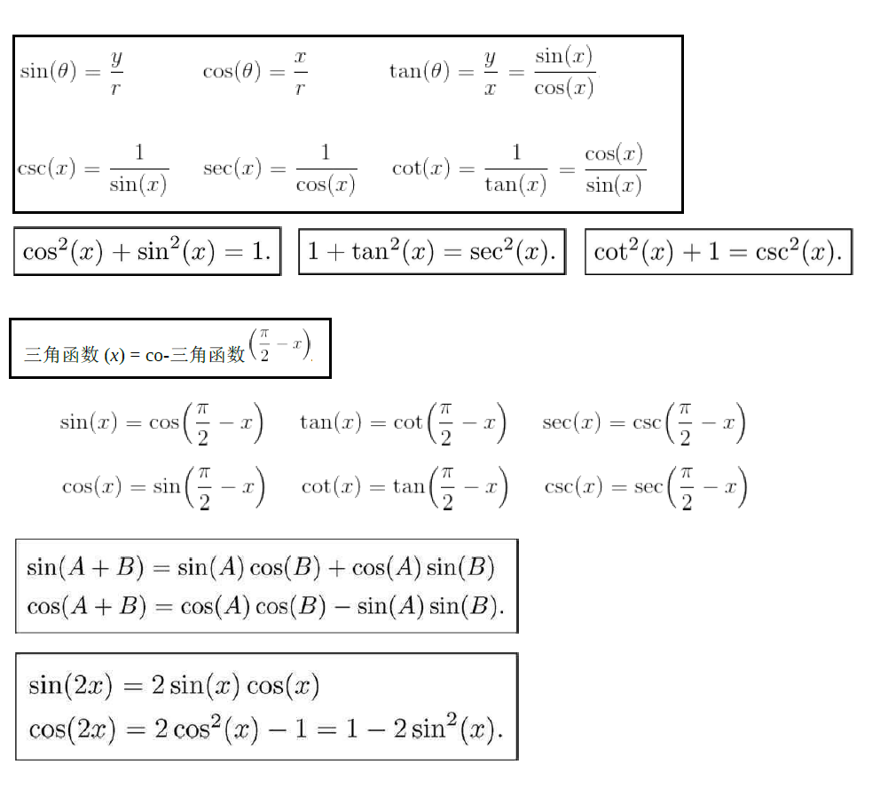
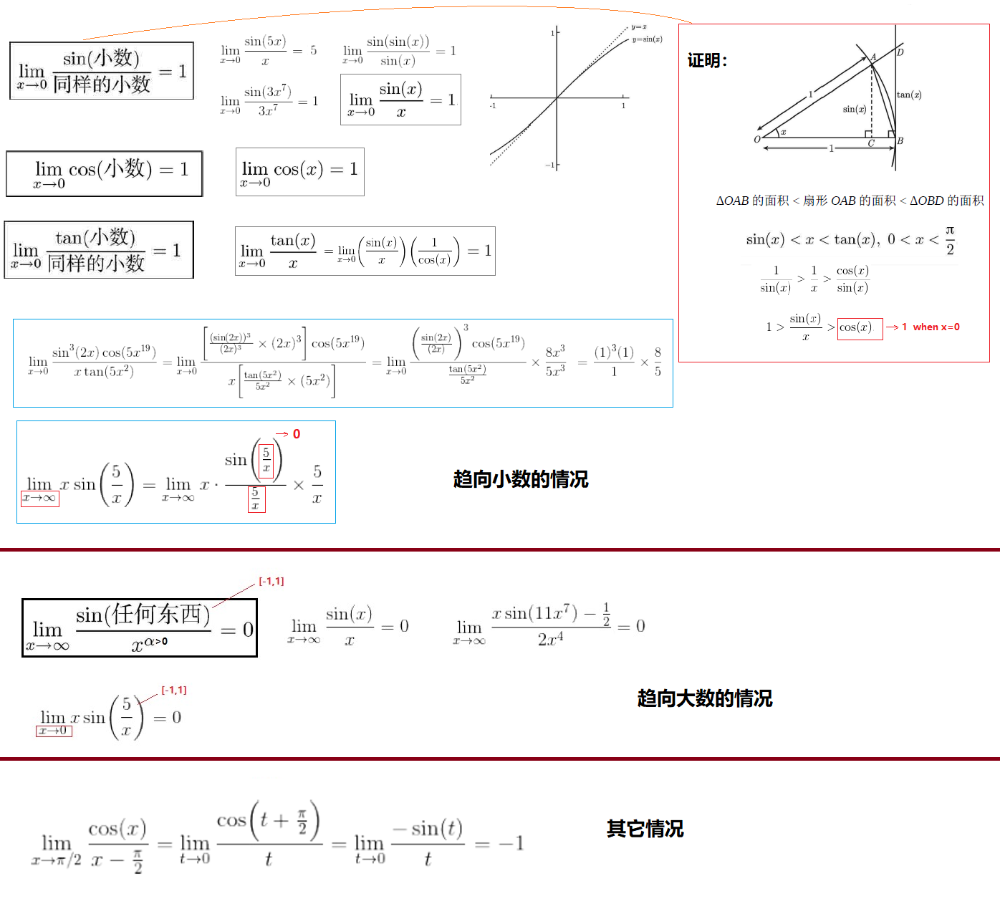
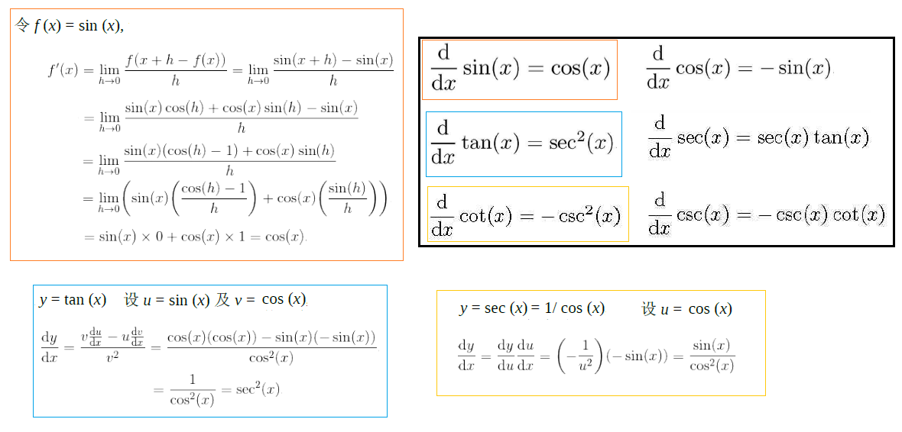
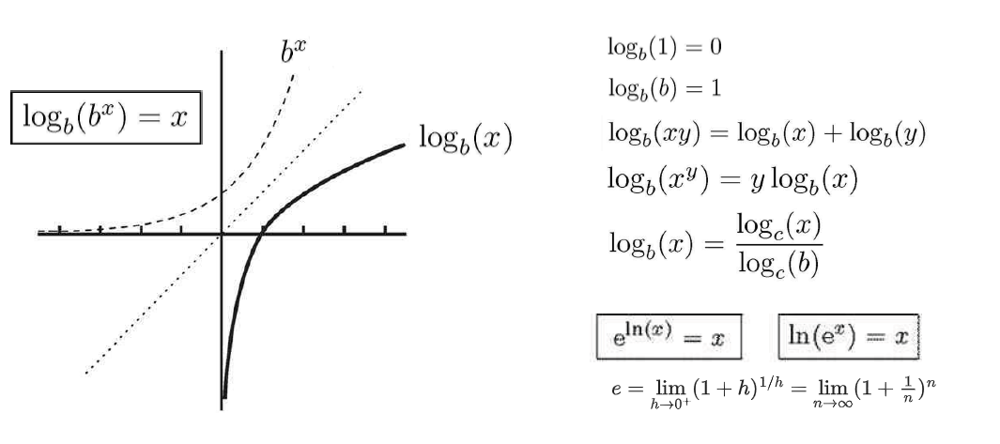

教材：《普林斯顿微积分读本》

## 函数

* $f:A \rightarrow B$ 是一个函数，也可以看作是一个变换规则，$f(x)=y$表示将这个变换规则应用于变量$x$后得到$y$
* $x$的取值范围$A$称为定义域，$y$的值域（所有可能输出的集合，受$x$取值范围的限制）是上域$B$的一个子集
    - 例：$f(x)=x^2$的定义域$R$，上域$R$，值域$R^+$
* 函数$f$的反函数$f^{-1}$
    - $f(x)=y$，$f^{-1}(y)=x$
* 复合函数：$f(x)=m(k(j(x)))=m \circ k \circ j$
    - 例：$f(x)=m(k(j(x)))=m \circ k \circ j$
* 一个函数可以是奇函数/偶函数/非奇非偶/即奇又偶；对取值范围内所有的$x$：
    - 奇函数：$f(-x)=-f(x)$ 图像原点对称
    - 偶函数：$f(-x)=f(x)$ 图像沿$y$轴对称

### 极限

* $f(x)$在$x=a$处时，左极限$\lim\limits_{x \rightarrow a^-}f(x)=L$，右极限$\lim\limits_{x \rightarrow a^+}f(x)=L$，则极限$\lim\limits_{x \rightarrow a}f(x)=L$
    - 上图$h(x),x=3$处因左右极限不相等，其极限不存在(DNE)
    - 上图$g(x),x=2$处极限=1
    - 上图$sin(\frac{1}{x}),x=0$处大幅震荡，其极限不存在(DNE)

* 水平渐近线：（x趋向无穷时）  

* 三明治定理/夹逼定理：（求极限常用）  

* **求极限方法示例**：  

* 如果 $\lim\limits_{x \rightarrow a}=f(a)$，函数$f(a)$在$x=a$处**连续**

* 介值定理：（e.g. 用来证明某个方程有解）  

* 如果$f$在$[a,b]$上连续，则$f$在$[a,b]$上至少有一个最大值和最小值

### 微分

* 可导性：如果$f(x)$在$(a,b)$内可导并且在$a^+$和$b^-$处的导数都存在，则称$f(x)$在闭区间在$[a,b]$上可导；如果一个函数在$x$上可导，那么它在$x$上连续

* 二阶导数就是关于x导二次，三阶就是三次（见上图·示例），...
  - 区分：$(\frac{dy}{dx})^2$ 一阶导的平方, $\frac{d^2y}{dx^2}$关于$x$的二阶导, $\frac{dy}{d(x^2)}$关于$x^2$的一阶导

* 常用求导法则：  

* **隐函数求导**：（关于$x$求导的方程还包含变量$y$，希望求$y$随$x$的变化关系$\frac{dy}{dx}$）
  - 使用示例：求圆 $x^2+y^2=4$ 在圆上各点 $(x,y)$ 处斜率$\frac{dy}{dx}$
    1. 公式两边加上 $\frac{d}{dx}$，两边各自关于$x$求导：$\frac{d}{dx}(x^2+y^2)=\frac{d}{dx}(4)$ 
    2. （隐函数）令$u=y^2$，则$\frac{d}{dx}(y^2)=\frac{du}{dy}\frac{dy}{dx}=2y\frac{dy}{dx}$
    3. $2x +2y\frac{dy}{dx}=0$，则 $\frac{dy}{dx}=-\frac{x}{y}$
    * （拆分 & 使用链式法则）

## 三角函数

$\pi=180度$

### 极限

### 微分

## 指数函数-对数函数

* 指数函数：$b^x$，对数函数：$\log_b(x)$
* $e=\lim\limits_{h \rightarrow 0^+}(1+h)^{1/h}=\lim\limits_{n \rightarrow \infty}(1+\frac{1}{n})^n$
* $e^x=\lim\limits_{n \rightarrow \infty}(1+\frac{x}{n})^n$ 仅当$n$很大时成立
* $\ln(e)=1$

### 极限

### 微分

| 导数 | -- |
| -- | -- |
| $$\frac{d}{dx}a^x=a^x\ln(a)$$ | $$\frac{d}{dx}e^{kx}=e^{kx}\ln(e^{k})=ke^{kx}$$ |
| $$\frac{d}{dx}log_a(x)=\frac{1}{x \ln(a)}$$ | $$\frac{d}{dx}\ln(x)=\frac{1}{x}$$ |

对于$f(x)^{g(x)}$形式的方程，一般取它的对数后再隐函数求导：
$$y=x^{sin(x)}$$
$$u=\ln(y)=\ln(x^{sin(x)})=sin(x)\ln(x)$$
$$\frac{d}{dx}(\ln(y))=\frac{d}{dx}(sin(x)\ln(x))$$
$$\frac{1}{y}\frac{dy}{dx}=cos(x)\ln(x)+\frac{six(x)}{x}$$
$$\frac{dy}{dx}=[cos(x)\ln(x)+\frac{six(x)}{x}]y$$
  注：$\frac{du}{dx}=\frac{du}{dy}\frac{dy}{dx}=\frac{1}{y}\frac{dy}{dx}$

### 双曲函数

| $sinh(x)=\frac{e^x-e^{-x}}{2}$ | $cosh(x)=\frac{e^x+e^{-x}}{2}$ | $tanh(x)=\frac{sinh(x)}{cosh(x)}$ |
| -- | -- | -- |
| $csch(x)=\frac{1}{sinh(x)}$ | $sech(x)=\frac{1}{cosh(x)}$ | $coth(x)=\frac{1}{tanh(x)}$ |

| 导数 |
| -- |
|$\frac{d}{dx}sinh(x)=cosh(x)        $|
|$\frac{d}{dx}cosh(x)=sinh(x)        $|
|$\frac{d}{dx}tanh(x)=sech^2(x)      $|
|$\frac{d}{dx}coth(x)=-csch^2(x)     $|
|$\frac{d}{dx}sech(x)=-sech(x)tanh(x)$|
|$\frac{d}{dx}csch(x)=-csch(x)coth(x)$|

