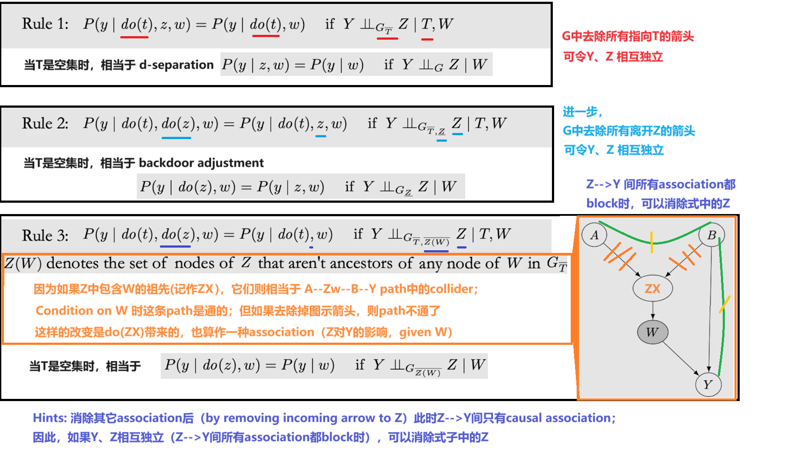

---
header-includes:
  - \usepackage{MnSymbol}      ## $\upmodels$ 失败
  - \usepackage{amssymb}
  - \usepackage{amsfonts}
  - \usepackage{fdsymbol}      ## $\Vbar$ 失败
output:
  pdf_document:
    keep_tex: true
---

<!-- https://bearnok.com/grva/en/knowledge/software/mathjax -->
<!-- https://tex.stackexchange.com/questions/562924/how-to-add-latex-packages-to-markdown -->

<!-- $\perp\\!\\!\\!\\!\perp$ for mathjax-->
<!-- $\perp\!\!\!\!\perp$ for kalatex-->

此处笔记为 [《因果推理导论》课程(2020) by Brady Neal](https://www.bilibili.com/video/BV1nZ4y1K78i) 的简短摘要

## L1-Intro

* 为什么要进行 Randomized control trials（RCT）？为了防止有 [Confounders C](./Causal_Inference/n01-1.png) 同时对自变量T与因变量Y施加影响，导致T与Y的相关性不置信，此时 Association $\neq$ Causation  

* 但只有观测数据时，如果可以找到合适的要素集 W 阻断 Confounding Path，也可以达成 $do(T=t)$ 的效果: $E[Y|do(T=t)] = E_w[E[Y|t,w]] = \sum\limits_w E[Y|t,w]P(w) $

## L2-ATE所需的假设

假设有如下图所示的观测数据。

| -- | [Estimand](./Causal_Inference/n02-4.png) |
| -- | -- |
| ITE (Causal Effect) | $Y_i(1)-Y_i(0)$ |
| ATE | $E[Y_i(1)-Y_i(0)]=E[Y(1)]-E[Y(0)]$ |
| Associational Difference (Conditional Expectations) | $E[Y\|T=1]-E[Y\|T=0]$ |
| -- | *ITE: Individual treatment effect*   *ATE: Average treatment effect* |

由于一个样本只能进行一种 Treatment，所以 Causal Effect 无法直接求得，只能近似其期望值 ATE。由于 **Causal Association与 Confounding Association** 同时存在，所以所以需要一些假设才能[用 Associational Difference 近似 ATE](./Causal_Inference/n02-3.png)

Hints：也可以通过训练模型（e.g.regression）的方式计算 Estimand，只要训练数据按需拆分了即可

| -- | 假设 | （以1为例，0同理） | Hint |
| -- | -- | -- | -- |
| -- | -- | -- | potential outcomes $Y(1)$意味着$Y(T=1)$ |
| Ignorability | $Y(1) \perp T$ Treatment assignment T is independent to the potential outcomes Y（T/Y之间无Confounders） | $E[Y(1)]$=$E[Y(1)\|T=1]$ | Y(T=1)在T=1组中的期望等同于在全体样本中的期望（统计时可忽略T=1不包含的数据） |
| (Exchangeability) | Y(T=1)在T=1组中的期望与在T=2组中的一致，交换样本不会对结果造成影响 | $E[Y(1)]$=$E[Y(1)\|T=1]$=$E[Y(1)\|T=0]$ | 同Ignorability一样，为了应对“**Confounders 可能会影响T的分组，造成T=0/1中样本分配不均，统计时condition on T会造成bias**”的担忧 |
| Unconfoundedness (Conditional Exchangeability) | 寻找一组 $X$ 令 $(Y(1) \perp T \| X)$ | $E[Y(1)\|X]$=$E[Y(1)\|T=1,X]$ | 于是可以 conditioning on X 计算边缘概率 $E[Y(1)]$=$E_X[E[Y(1)\|T=1,X]]$ --- 注意，Unconfoundedness 不可测试，因为 Confounders 未知 |
| Identifiability | 因果问题可转变为统计问题 | $E[Y(1)\|T=1]$=$E[Y\|T=1]$ | 如果 causal quantity $E[Y(t)]$ 可以被 statistical quantity $E[Y\|t]$ 表达，则称其 identifiable |
| Positivity | $0 \lt P(T=1\|x) \lt 1$ | -- | 关于任何 Covariates x 进行拆分/分层后，每部分都需要同时包含T=1和T=0的结果，避免因只有T=1数据而导致T=0的结果无法预测；如果违反了 Positivity，各部分样本T的分布显著不同，则只能进行 [Extrapolation](./Causal_Inference/n02-2.png) |
| No interference | $Y_i(t_1,...,t_n)$=$Y_i(t_i)$ | -- | 实验个体间互不干扰 |
| Consistency | $(T=t) \Rightarrow (Y=Y(t))$ | -- | 干预效果对所有的个体而言都是相同的 示例：当T=1时，$Y_i(1)=1$，$Y_j(1)=1$ **反例**：当T=1时，$Y_i(1)=1$，$Y_j(1)=0$；表明T=1的效果不恒定 |

## L3-Graph Models

如果尝试使用有向无环图（DAG）$X_1 \rightarrow X_2 \rightarrow X_3$ 对分布 $P(x_1,x_2,x_3)=P(x_1)P(x_2|x_1)P(x_3|x_2,x_1)$ 进行化简，则需要遵从如下假设：

* (Define Statistical independencies) Local Markov assumption: Given its parents in the DAG, a node X is independent of all of its non-descendants；注意，X 与 parents 间也可以是独立的，所以需要补丁
* (Define Statistical dependencies) Minimality assumption: Adjacent nodes in the DAG are dependent

于是可以化简统计式：$P(x_3|x_2,x_1)=P(x_3|x_2)$

如果希望进一步将统计式转换为因果概念，则需要遵从如下假设：

* (Define Causal dependencies) Causal Edges Assumption: In a directed graph, every parent is a direct cause
of all its children

常见有 Chain/Fork/Immoralities 三种结构，图示绿色线条表示 XY 间有 association Path，红色则表示 Path 被阻断。[对于 Chain/Fork 可以通过 Condition on Z 阻断通路](./Causal_Inference/n03-1.png)，即 $P(X,Y|Z)$；但对于 Immoralities 则正相反，Condition on Z 反而会使[原本阻塞的 Path](./Causal_Inference/n03-2.png) 联通

* **d-separation**: Two (sets of) nodes X and Y are d-separated by a set of nodes Z if all of
the paths between (any node in) X and (any node in) Y are blocked by Z，即 $(Y \perp X | Z)_G$

* 图中G的 independence $(Y \perp X | Z)_G$，也意味着分布P中的 independence $(Y \perp X | Z)_P$

* [不建议 condition on post-treatment nodes (G中T的后代)，且pre-treatment也并不完全保险](./Causal_Inference/n04-5.png)

## L4-干预 do()

| [v.s.](./Causal_Inference/n04-1.png) | Interventional | Observational |
| -- | -- | -- |
| -- | 设计实验时按某一条件分配样本 | 将已有数据按某一条件 Conditioning |
| Notation | $P(Y(t)=y)$ $P(Y=y\|do(T=t))$ $P(y\|do(t))$ | $P(Y=y\|T=t)$ $P(y\|t)$ |
| ATE | $E[Y\|do(T=1)]-E[Y\|do(T=0)]$ | 见 L2 |

* [Modularity](./Causal_Inference/Modularity.png): If intervene on a set of nodes S, setting them to constant values, 
    - If $i \notin S$, then $P(x_i | pa_i)$ remains unchanged
    - If $i \in S$, then $P(x_i | pa_i) = 1$ if $x_i$ equals to the settled value; otherwise $P(x_i | pa_i) = 0$
    - 因此化简: $P(x_1,...,x_i|do(S=s))=\prod\limits_{i \notin S}P(x_i|pa_i)$ or 0

* [Backdoor Adjustment](./Causal_Inference/n04-2.png): A set of nodes W satisfies the **backdoor criterion** relative to T and Y if
    - W blocks all backdoor paths from T to Y
    - W does not contain any descendants of T

* 满足 backdoor criterion 后，remove all outgoing edges from T，则可以达成 d-separation: $Y\perp_{G_{\underline{T}}} T | W$

* [Structural Causal Models (SCMs)](./Causal_Inference/n04-3.png)
    - [Interventions 修改了G，也即修改了 SCM 中被intervene参数的方程（由于 Modularity Assumptions） ](./Causal_Inference/n04-4.png)

## L5-do calculus

* [Randomized control trial (RCT)](./Causal_Inference/n05-1.png) 随机分配样本，令 covariates $X$ 在每一组 $T$ 中的分布都相同，即 $P(X|T=t)\stackrel{\text{d}}{=}P(X)$，即 $T \perp X$，相当于达成了 Exchangeability 假设，也相当于消除了 confounding association (backdoor paths)；于是 $P(y|do(t))=P(y|t)$

* 当 Backdoor Adjustment 无法达成时，可使用 [Frontdoor Adjustment](./Causal_Inference/n05-2.png) 对 Path 进行分步计算

* Pearl's rules of do-calculus
    - 

## L6-Estimation

