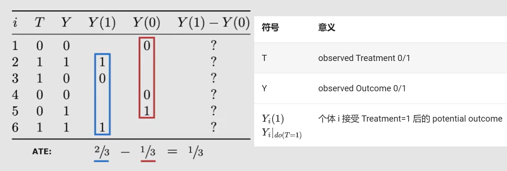
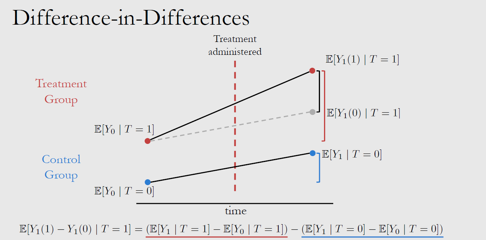
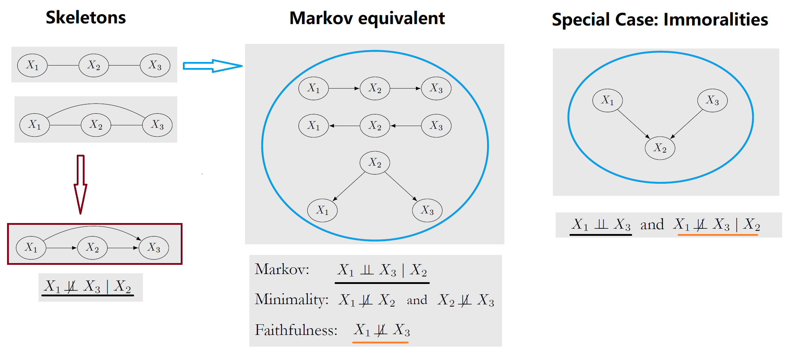

---
header-includes:
  - \usepackage{MnSymbol}      ## $\upmodels$ 失败
  - \usepackage{amssymb}
  - \usepackage{amsfonts}
  - \usepackage{fdsymbol}      ## $\Vbar$ 失败
output:
  pdf_document:
    keep_tex: true
---

<script>
MathJax = {
  tex: {
    inlineMath: [['$', '$'], ['\\(', '\\)']]
  },
  svg: {
    fontCache:   'global'   // 'local',or 'global' or 'none'
  }
};
</script>
<script type="text/javascript" id="MathJax-script" async
  src="https://cdn.jsdelivr.net/npm/mathjax@3/es5/tex-svg.js">
</script>


<style>
img{
    width: 60%;
}
</style>

<!-- https://bearnok.com/grva/en/knowledge/software/mathjax -->
<!-- https://tex.stackexchange.com/questions/562924/how-to-add-latex-packages-to-markdown -->


<!-- $\perp\\!\\!\\!\\!\perp$ for mathjax-->
<!-- $\perp\!\!\!\!\perp$ for kalatex-->


此处笔记为 [《因果推理导论》课程(2020) by Brady Neal](https://www.bilibili.com/video/BV1nZ4y1K78i) 的简短摘要，[SLides](https://www.bradyneal.com/causal-inference-course)

```
T=Treatment   Y=Outcome   Y(1) = Y(T=1)
E[...|T=1] 只是指代样本分组 即 E[...|T=G]  故而可以有 E[Y(0)|T=1] 这样的Counterfactual 

ITE: Individual treatment effect
ATE: Average treatment effect* |
ATT: ATE over T=1 samples
```

## L1-Intro

* 为什么要进行 Randomized control trials（RCT）？为了防止有 [Confounders C](./Causal_Inference/n01-1.png) 同时对自变量T与因变量Y施加影响，导致T与Y的相关性不置信，此时 Association $\neq$ Causation  

* 但只有观测数据时，如果可以找到合适的要素集 W 阻断 Confounding Path，也可以达成 $do(T=t)$ 的效果: $E[Y|do(T=t)] = E_w[E[Y|t,w]] = \sum\limits_w E[Y|t,w]P(w) $


## L2-Causal to Statistical

假设有如下图所示的观测数据。




| -- | [Estimand](./Causal_Inference/n02-4.png) |
| -- | -- |
| ITE<br>(Causal Effect) | $Y_i(1)-Y_i(0)$ |
| ATE<br>(Statistical) | $E[Y_i(1)-Y_i(0)]=E[Y(1)]-E[Y(0)]$ |
| Associational Difference<br>(Conditional Expectations) | $E[Y\|T=1]-E[Y\|T=0]$ |


由于一个样本只能进行一种 Treatment，所以 Causal Effect 无法直接求得，只能近似其期望值 ATE。由于 **Causal Association与 Confounding Association** 同时存在，所以所以需要一些假设才能[用 Associational Difference 近似 ATE](./Causal_Inference/n02-3.png)

Hints：也可以通过训练模型（e.g.regression）的方式计算 Estimand，只要训练数据按需拆分了即可


| -- | 假设 | （以1为例，0同理） | Hint |
| -- | -- | -- | -- |
| -- | -- | -- | potential outcomes $Y(1)$意味着$Y(T=1)$ |
| Ignorability | $Y(1) \perp T$<br>Treatment assignment T is independent to the potential outcomes Y（T/Y之间无Confounders） | $E[Y(1)]$=$E[Y(1)\|T=1]$ | Y(T=1)在T=1组中的期望等同于在全体样本中的期望（统计时可忽略T=1不包含的数据） |
| (Exchangeability) | Y(T=1)在T=1组中的期望与在T=2组中的一致，交换样本不会对结果造成影响 | $E[Y(1)]$=$E[Y(1)\|T=1]$=$E[Y(1)\|T=0]$ | 同Ignorability一样，为了应对“**Confounders 可能会影响T的分组，造成T=0/1中样本分配不均，统计时condition on T会造成bias**”的担忧 |
| Unconfoundedness<br>(Conditional Exchangeability) | 寻找一组 $X$ 令 $(Y(1) \perp T \| X)$ | $E[Y(1)\|X]$=$E[Y(1)\|T=1,X]$ | 于是可以 conditioning on X 计算边缘概率 $E[Y(1)]$=$E_X[E[Y(1)\|T=1,X]]$ --- 注意，Unconfoundedness 不可测试，因为 Confounders 未知 |
| [**Identifiability**](./Causal_Inference/n05-4.png) | 因果问题可转变为统计问题: Causal $\Rightarrow$ Statistical | $E[Y(1)\|T=1]$=$E[Y\|T=1]$ | 如果 causal quantity $E[Y(t)]$ 可以被 statistical quantity $E[Y\|t]$ 表达，则称其 identifiable |
| Positivity | $0 \lt P(T=1\|x) \lt 1$ | -- | 关于任何 Covariates x 进行拆分/分层后，每部分都需要同时包含T=1和T=0的结果，避免因只有T=1数据而导致T=0的结果无法预测；如果违反了 Positivity，各部分样本T的分布显著不同，则只能进行 [Extrapolation](./Causal_Inference/n02-2.png) |
| No interference | $Y_i(t_1,...,t_n)$=$Y_i(t_i)$ | -- | 实验个体间互不干扰 |
| Consistency | $(T=t) \Rightarrow (Y=Y(t))$ | -- | 干预效果对所有的个体而言都是相同的<br>示例：$Y_i(1)=1$，$Y_j(1)=1$<br>**反例**：$Y_i(1)=1$，$Y_j(1)=0$；表明T=1的效果不恒定 |


## L3-Graph Models

如果尝试使用有向无环图（DAG）$X_1 \rightarrow X_2 \rightarrow X_3$ 对分布 $P(x_1,x_2,x_3)=P(x_1)P(x_2|x_1)P(x_3|x_2,x_1)$ 进行化简，则需要遵从如下假设：

* (Define Statistical independencies) Local Markov assumption: Given its parents in the DAG, a node X is independent of all of its non-descendants；注意，X 与 parents 间也可以是独立的，所以需要补丁:
* (Define Statistical dependencies) Minimality assumption: Adjacent nodes in the DAG are dependent

于是可以化简统计式：$P(x_3|x_2,x_1)=P(x_3|x_2)$

如果希望进一步将统计式转换为因果概念，则需要遵从如下假设：

* (Define Causal dependencies) Causal Edges Assumption: In a directed graph, every parent is a direct cause
of all its children


常见有 Chain/Fork/Immoralities 三种结构，图示绿色线条表示 XY 间有 association Path，红色则表示 Path 被阻断。[对于 Chain/Fork 可以通过 Condition on Z 阻断通路](./Causal_Inference/n03-1.png)，即 $P(X,Y|Z)$；但对于 Immoralities 则正相反，Condition on Z 反而会使[原本阻塞的 Path](./Causal_Inference/n03-2.png) 联通


* **d-separation**: Two (sets of) nodes X and Y are d-separated by a set of nodes Z if all of
the paths between (any node in) X and (any node in) Y are blocked by Z，即 $(Y \perp X | Z)_G$

* 图中G的 independence $(Y \perp X | Z)_G$，也意味着分布P中的 independence $(Y \perp X | Z)_P$

* [不建议 condition on post-treatment nodes (G中T的后代)，且pre-treatment也并不完全保险](./Causal_Inference/n04-5.png)


## L4-do() Backdoor 


| [v.s.](./Causal_Inference/n04-1.png) | Interventional | Observational |
| -- | -- | -- |
| -- | 设计实验时按某一条件分配样本 | 将已有数据按某一条件 Conditioning |
| -- | Causal Estimand | Statistical Estimand |
| Notation | $P(Y(t)=y)$<br>$P(Y=y\|do(T=t))$<br>$P(y\|do(t))$ | $P(Y=y\|T=t)$<br>$P(y\|t)$ |
| ATE | $E[Y\|do(T=1)]-E[Y\|do(T=0)]$ | 见 L2 |


* [Modularity](./Causal_Inference/Modularity.png): If intervene on a set of nodes S, setting them to constant values, 
    - If $i \notin S$, then $P(x_i | pa_i)$ remains unchanged
    - If $i \in S$, then $P(x_i | pa_i) = 1$ if $x_i$ equals to the settled value; otherwise $P(x_i | pa_i) = 0$
    - 因此化简: $P(x_1,...,x_i|do(S=s))=\prod\limits_{i \notin S}P(x_i|pa_i)$ or 0


* [Backdoor Adjustment](./Causal_Inference/n04-2.png): A set of nodes W satisfies the **backdoor criterion** relative to T and Y if
    - W blocks all backdoor paths from T to Y
    - W does not contain any descendants of T

* 满足 backdoor criterion 后，remove all outgoing edges from T，则可以达成 d-separation: $Y\perp_{G_{\underline{T}}} T | W$


* [Structural Causal Models (SCMs)](./Causal_Inference/n04-3.png)
    - [Interventions 修改了G，也即修改了 SCM 中被intervene参数的方程（由于 Modularity Assumptions） ](./Causal_Inference/n04-4.png)


## L5-do() Frontdoor 

* [Randomized control trial (RCT)](./Causal_Inference/n05-1.png) 随机分配样本，令 covariates $X$ 在每一组 $T$ 中的分布都相同，即 $P(X|T=t)\stackrel{\text{d}}{=}P(X)$，即 $T \perp X$，相当于达成了 Exchangeability 假设，也相当于消除了 confounding association (**backdoor paths**)；于是 $P(y|do(t))=P(y|t)$


* 当 Backdoor Adjustment 无法达成时，可使用 [Frontdoor Adjustment](./Causal_Inference/n05-2.png) 对 Path 进行分步计算


* [Unconfounded children criterion](./Causal_Inference/n05-4.png) 是 Identifiability 的充分条件，[Pearl's rules of do-calculus](./Causal_Inference/n05-3.png)是 Identifiability 的充分必要条件


## L6-Estimation

| -- | Causal Estimand | Statistical Estimand |
| -- | -- | -- |
| ATE | $E[Y(1)-Y(0)]$ | $$E_W[E[Y\|T=1,W]-E[Y\|T=0,W]]$$ Given W is a sufficient adjustment set |
| CATE<br>(Conditional ATE) | $E[Y(1)-Y(0)\|X=x]$ | $$E_W[E[Y\|T=1,X=x,W]-E[Y\|T=0,X=x,W]]$$ Given W+X is a sufficient adjustment set |


**训练模型以预测CATE Estimands (模型可以是回归/深度学习/...)**

* [Conditional outcome modeling (COM)](./Causal_Inference/n06-1.png)/ G-formula/ S-learner/ ...
    - 训练一个模型 $\mu(t,w,x)$ for $E[Y|T,X,W]$
    - 不足：模型中 T 参数的权重可能会趋于0，导致T不影响模型结果


* Grouped COM (GCOM)
    - 为每个T训练一个模型 $\mu_t(w,x)$ for $E[Y|T=t,X,W]$
    - 不足：数据利用效率太低

* TARNet
    - 训练一个模型 $\mu(t,w,x)$ for $E[Y|T,X,W]$，但模型强制最后一层的heads指向不同的T

* X-Learner
    1. GCOM得到 $\mu_1(x)$、$\mu_0(x)$ 的预测
    2. 计算ITEs = Observe_Y - Predict
        * 对每个T=1样本 $\tau_{1,i}=Y_i(1)-\mu_0(x_i)$
        * 对每个T=0样本 $\tau_{0,i}=\mu_1(x_i)-Y_i(0)$
    3. 训练模型以预测$\tau_t$
        * $\tau_1(x)$ for $x_i$ in Group T=1
        * $\tau_0(x)$ for $x_i$ in Group T=0
    4. $\tau(x)=g(x)\tau_0(x)+[1-g(x)]\tau_1(x)$，此处$g(x)$推荐使用 Propensity score


[**Propensity score**](./Causal_Inference/n06-2.png) $e(W) = P(T=1|W)$ 是对高维W的一种简化，以满足 Unconfoundedness 假设，即：{$Y(t) \perp T | W$}  ==> {$Y(t) \perp T | e(W)$}；但由于 Confounders 未知，最多只能 model Propensity score；用例: [**Inverse Probability Weighting (IPW)**](./Causal_Inference/n06-3.png)


## L7-Bounds

一般来说不可能完全去除 Confounder，因此 不太可能得到 $E[Y(1)-Y(0)]$ 的准确值，但是可以[通过 Observational-Counterfactual Decomposition 推导其在不同assumption情况下的取值区间](./Causal_Inference/n07-1.png)


此外，还可以[通过 Counter Plots 进行 Sensitivity Analysis](./Causal_Inference/n07-2.png) 以评估未去除 Confounder 情况下 $E[Y(1)-Y(0)]$ 计算结果与真值的差距


## L8-do() Instrument

前文已述将causal问题转化为statistical问题的各种过程 (Identifiability)：理想情况下使用 Backdoor Adjustment，当 Unobserved Confounding 存在时使用 Frontdoor Adjustment 等方法。这些方法都是 **Nonparametric**，即我们无需对生成变量Y的 causal equations/mechnisms 进行假设。


**Instrumental Variables Z** 是另一项应对 Unobserved Confounding U 的方法。对于 **General ATE** 它只能是 **Parametric**：[binary Z 用例](./Causal_Inference/n08-1.png)、[通过 regress T on Z 去除U的影响](./Causal_Inference/n08-2.png)
```
1. Z has a causal effect on T
2. Z--Y 间的 causal effect 完全由 T 介导
3. Z is unconfounded (no unblockable backdoor paths from Z to Y)，如果Z--Y间有backdoor，block住则没事

          U
        /   \(e)    
Z ---> T ---> Y       （假设）causal equation Y:= dT + eU  ()
  (c)    (d)     

Cov(Y,Z) = E[YZ] - E[Y]E[Z]              (for Continuous Z)  
         = E[(dT+eU)Z] - E[dT+eU]E[Z]
         = dCov(T,Z) + eCov(U,Z)
         = dCov(T,Z)                     (since Z is unconfounded)
故而 d = Cov(Y,Z)/Cov(T,Z)               （想象一下dc/c）

**一个固定的equation意味着T对于每个实验个体的影响一致，过于严格，因此更希望Nonparametric方法
```

对于 **Local ATE**（部分样本的ATE），**Instrumental Variables Z** 也可以是 **Nonparametric**。
```
以 binary 数据为例，
      ATE  =  E[Y(T=1)-Y(T=0)]
Local ATE  =  E[Y(T=1)-Y(T=0) |T(Z=1)=1,T(Z=0)=0]

拆分数据，只取用 Compiliers 样本，
Compiliers   T(Z=1)=1,T(Z=0)=0    
   Defiers   T(Z=1)=0,T(Z=0)=1    违反 Monotonicity Assumption T(Z=1)>T(Z=0)
   Always    T(Z=1)=1,T(Z=0)=1    对于这部分样本，Z不会影响T，即Z--T间无path
    Never    T(Z=1)=0,T(Z=0)=0    对于这部分样本，Z不会影响T，即Z--T间无path


  E[Y(Z=1)-Y(Z=0)]
= Compiliers
= E[Y(Z=1)-Y(Z=0) |T(Z=1)=1,T(Z=0)=0] * P[T(Z=1)=1,T(Z=0)=0]
= E[Y(T=1)-Y(T=0) |T(Z=1)=1,T(Z=0)=0] * P[T(Z=1)=1,T(Z=0)=0]   因为Compiliers中T/Z处理一致
= Local_ATE * P[T(Z=1)=1,T(Z=0)=0]
= Local_ATE * (1 - P(T=0|Z=1) - P(T=1|Z=0) )
= Local_ATE * (    P(T=1|Z=1) - P(T=1|Z=0) )
= Local_ATE * (    E(T|Z=1)   - E(T|Z=0)   )

Local_ATE =  E[Y(Z=1)-Y(Z=0)] / E[T(Z=1)-T(Z=0)]   

**在满足Monotonicity Assumption的情况下，Local_ATE 与 General_ATE 一致（binary Z 用例，Wald estimand）
```


## L9-DD



引入了时间下标 $\tau$ 的 [Difference in Differences](https://www.sciencedirect.com/topics/economics-econometrics-and-finance/difference-in-differences) 所需假设及[上图公式推导](./Causal_Inference/n09-2.png)：(使用了Counterfactuals)

1. Consistency Assumption Extended to Time: 干预效果对所有时间的所有个体而言都是相同的，即 $\forall \tau$，$(T=t) \Rightarrow (Y_{\tau}=Y_{\tau}(t))$
2. Parallel Trends Assumption: 假如没有进行干预，二组理论上 Time difference 应保持一致，即$E[Y_1(0)-Y_0(0)|T=1]=E[Y_1(0)-Y_0(0)|T=0]$
3. No Pretreatment Effect (at $\tau=0$) 即 $E[Y_0(1)|T=1] = E[Y_0(0)|T=1]$

现实中，可以提供控制其它变量 W 以达成 Parallel Trends 假设；

注意，scale(Y) 会对 Parallel Trends 造成影响


## L10-Causal Discovery from Observational Data

Two graphs are **Markov equivalent classes (Essential Graph)** if and only if they have the same
**skeleton** and same **immoralities**



| Assumption | 可获得 Essential Graph | -- |
| -- | -- | -- |
| Markov | $(X \perp _G Y \| Z) \Rightarrow (X \perp _P Y \| Z)$ <br> Causal Graph $\Rightarrow$ Data  | + Minimality (L3) |
| Faithfulness | $(X \perp _G Y \| Z) \Leftarrow (X \perp _P Y \| Z)$ <br> Causal Graph $\Leftarrow$ Data  | [Violation: paths can be cancelled out](./Causal_Inference/n10-1.png) |
| Causal Sufficiency | no unobserved confounders | -- |
| Acyclicity | no cycles in the graph | -- |


**[PC Algorithm](./Causal_Inference/n10-3.png) 推断 Causal Graph**: 对 conditional independence testing 的 accuracy 有较高要求

1. 从 Complete Undirected Graph 中移除 edges，得到 Skeleton
    - 如果 $X \perp Y | Z$，可移除 (X,Y) 间 edge
    - Z从空集逐步增加，直至Z包含其余所有nodes、或达成移除
2. 定义 Immoralities
    - 如果 (X,Y) 间 edge 已被移除，且 conditioning on node Z 令 (X,Y) 相关联，则可以确定一个 Immorality
3. 对于余下的path，顺应其上游方向（由 Immorality 得），**猜测**其方向

此外，还有一些减少 Assumption 限制的方法：FCI algorithm (Not causal sufficiency), CCD algorithm (Not acyclicity), SAT-based causal discovery (Neither causal sufficiency nor acyclicity)

至此，虽然我们可以定义 Essential Graph，但有时很难**定义 edge 方向**，需要增加 **Semi-Parametric Assumptions**：
```
X --> Y         or        X <-- Y  
Y: f(X)+Ux      or        X: f(Y)+Uy       linear/non-linear, 也可以 Y: f(X+Ux)
```
在 linear non-Gaussian setting 中，只有一个SCM可以生成符合P(x, y)分布的数据，观测：[Residuals 是否随着自变量而变化](./Causal_Inference/n10-4.png)


## L11-Causal Discovery from Interventions


如下图示，至少需要2次 Single-Node **Hard Interventions** 来确定 2个 nodes 的 Causal Graph

对于 n>2 nodes，[最多需要 n-1 次 Single-Node Intervention](./Causal_Inference/n11-2.png)，或者 log2(n)+1 次不限单次干扰数量的 Multiple-Node Intervention 来确定 Causal Graph (Complete Graph 是最坏情况)


Two graphs augmented with single-node interventions are **Interventional Markov Equivalent** if any only if they have the same skeletons and immoralities: 通过 Single-Node **Soft Intervention** [引入 Immoralities 以确定部分 edges 的方向](./Causal_Inference/n11-4.png)


## L12-Transfer Learning


