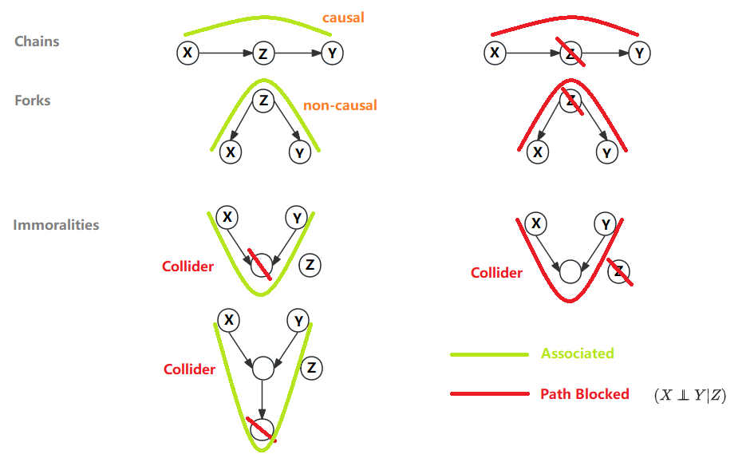

---
header-includes:
    - \usepackage{MnSymbol}      ## $\upmodels$ 失败
    - \usepackage{amssymb}
    - \usepackage{amsfonts}
    - \usepackage{fdsymbol}      ## $\Vbar$ 失败
output:
  pdf_document:
    keep_tex: true
---

<!-- https://bearnok.com/grva/en/knowledge/software/mathjax -->
<!-- https://tex.stackexchange.com/questions/562924/how-to-add-latex-packages-to-markdown -->

<!-- $\perp\\!\\!\\!\\!\perp$ for mathjax-->
<!-- $\perp\!\!\!\!\perp$ for kalatex-->

此处笔记为《因果论（第二版）Judea Pearl》的读书笔记

## 基础概念

* 考虑 $n$ 个变量的联合分布 $P(x_1,...,x_n)$，如果知晓每个变量只依赖其他小部分变量，则可以实现可观的化简；图可以清晰刻画出其中相互关联的变量：无向图（Markov networks）主要用于表示对称的空间关系，有向图（Bayesian networks）区分了推理过程中的因与果
    - 本书主要关注有向无环图（DAG）
    - G表示图，P表示分布

* 考虑 $n$ 个有序变量的联合分布 $P(x_1,...,x_n)= \prod\limits_jP(x_j|x_1,...,x_{j-1})$，其中 $x_1,...,x_{j-1}$ 称为 $x_j$ 的前驱变量
    - 假设前驱变量中有一最小子集可使 $x_j$ 独立于其它前驱变量，则这一子集记为 $pa_j$，称为 $x_j$ 的马尔可夫**父代变量集**
    - 原式化简为 $P(x_1,...,x_n)=\prod\limits_jP(x_j|pa_j)$
    - 如果概率函数 P 容许有向无环图 G 有[上述化简](./Causal_Inference/1-2.png)，即 以$pa_j$为条件时$x_j$独立于其所有前驱节点（/非后代节点）；则称：G表示P，G与P相容，P与G马尔可夫相关

* 路径$p$ 被**节点集**$Z$ **d-分离**（**d-Separation**，阻断）的三种情况如图所示
    - 
    - 如果与P相容的G满足 $(Y \perp X | Z)_G$，则有 $(Y \perp X | Z)_P$
    - 如果对于**所有**与G相容的P都满足 $(Y \perp X | Z)_P$，则有 $(Y \perp X | Z)_G$
  

| 图胚公理 | -- | $\perp$表示相互独立（默认：Z条件下） |
| -- | -- | -- |
| $(X \perp Y \| Z) \Rightarrow (Y \perp X \| Z)$ | 对称性 | “从节点子集X到节点子集Y的路径均被节点子集Z阻断” |
| $(X \perp YW \| Z) \Rightarrow (X \perp Y \| Z)$ | 分解性 | 如果YW与X无关，其拆分项W、Y也都与X无关 |
| $(X \perp YW \| Z) \Rightarrow (X \perp Y \| ZW)$ | 弱联合性 | 由 分解性 可知拆分项W、Y都与X无关，那么，得知W并不能使Y变得与X相关 |
| $(X \perp Y \| Z) \& (X \perp W \| ZY)$ $\Rightarrow (X \perp Y \| Z) \& (X \perp W \| Z)$ $\Rightarrow (X \perp YW \| Z)$ | 收缩性 | 如果得知与X无关的Y后判定W与X无关，那么，得知Y之前W也与X无关 |
| $(X \perp W \| ZY) \& (X \perp Y \| ZW) \Rightarrow (X \perp YW \| Z)$ | 相交性 | 如果得知W后Y与X无关 且 得知Y后W与X无关，则W、Y都与X无关 |

* Observational $P(Y|X=x)$ 是将已有数据按某一条件 Conditioning，Interventional $P(Y|do(X=x))$ 是设计实验时样本按某一条件分配
    - 干预 $do(X_j=x)$ 会消除 G 中 $X_j$ 与其父节点的链接，[例如图示中，干预X3消除了X1->X3的链接](./Causal_Inference/1-4.png)，不能再从X3的状态反向推断X1
    - 观察 $X_j=x$ 则不会改动 G，其效应可以通过普通的贝叶斯取条件获取

