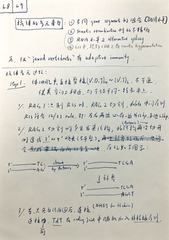
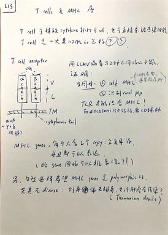
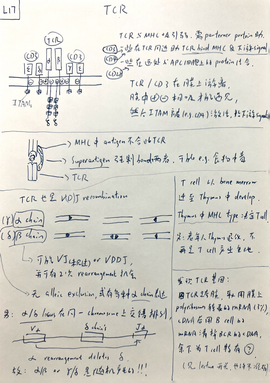
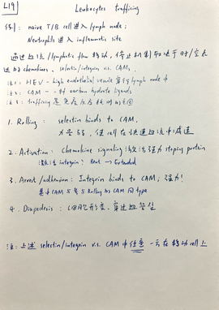
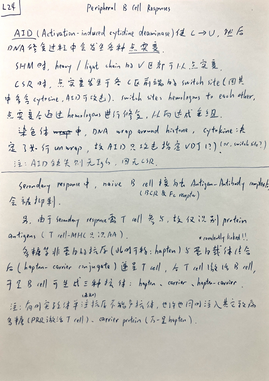
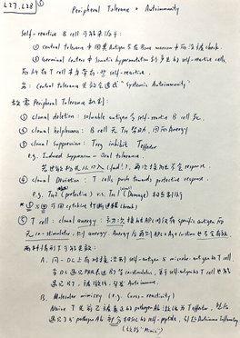
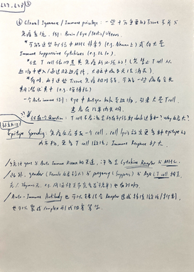
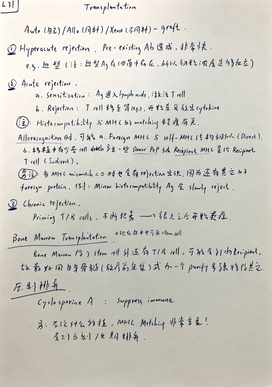

<style>
img{
    width: 9%;
}
</style>


课程描述：德鲁大学-2019   
配套教材：Kuby Immunology 8e.   
视频链接：https://www.bilibili.com/video/BV1xK4117717/


### 手写笔记-个人留念 [PDF](Immunology/PDF/Immunology_notes.pdf)

[](Immunology/img/1.png)
[](Immunology/img/2.png)
[](Immunology/img/3.png)
[](Immunology/img/4.png)
[](Immunology/img/5.png)
[](Immunology/img/6.png)
[](Immunology/img/7.png)
[](Immunology/img/8.png)
[](Immunology/img/9.png)
[](Immunology/img/10.png)
[](Immunology/img/11.png)
[](Immunology/img/12.png)
[](Immunology/img/13.png)
[](Immunology/img/14.png)
[](Immunology/img/15.png)
[](Immunology/img/16.png)
[](Immunology/img/17.png)
[](Immunology/img/18.png)
[](Immunology/img/19.png)
[](Immunology/img/20.png)
[](Immunology/img/21.png)
[](Immunology/img/22.png)
[](Immunology/img/23.png)
[](Immunology/img/24.png)
[](Immunology/img/25.png)
[](Immunology/img/26.png)
[](Immunology/img/27.png)
[](Immunology/img/28.png)
[](Immunology/img/29.png)
[](Immunology/img/30.png)


### 免疫组库

免疫组库(Immune Repertoire)即特定时间内、某个体循环系统中所有功能的多样性T细胞和B细胞的总和，也可以视为 TCR/BCR 的研究。其多元化来自细胞发育过程中的DNA重排，而单个细胞表达的 TCR/BCR 是一致的。

TCR/BCR 的亚基都由轻链(L/α/γ)和重链(H/β/δ)组成，而每条链可划分为一个可变区(Variable)和和三个恒定区(Constant)。可变区转录翻译的蛋白位于链的前端，负责识别，其中CDR区变化丰富，尤其关注横跨VDJ的CDR3区。

```
       |---------------------------Variable---------------------------|...-------Constant-----...|
L/α/γ  |-----------------------V------------------------|------J------|...
H/β/δ  |----------------------V-----------------------|-D-|-----J-----|...
       |--FR1---|--CDR1--|--FR2---|--CDR2--|--FR3---|--CDR3--|--FR4---|...
 ..  ..     ..
  \\//      ||              | 表示链
   ||       ||              . 标注链前端的CDR区组成的Loops
 BCR/Ab     TCR


 LH  HL         αβ            γδ
  \\//          ||            ||
   ||           ||            ||          
 BCR/Ab         TCR           TCR

```

B细胞受到抗原刺激后分化为浆细胞，而浆细胞分泌对应的抗体(Ig)，Ig即游离态的BCR。

95%的T细胞为αβ型，同时也会表达协同受体CD4(辅助型T细胞)或CD8(Killer)；5%的T细胞为γδ型，不表达CD4/8。

MHC-I广泛存在于各种细胞表面，呈递内源性抗原，由CD8辅助TCR与之结合；MHC-II主要存在于APC表面，呈递外源性抗原，由CD4辅助TCR与之结合。

APC细胞包括巨噬细胞、树突状细胞和B细胞等，可吞噬/消化细胞外的抗原，合成MHC-抗原复合物，呈递给T细胞。


[推荐笔记](https://zhuanlan.zhihu.com/p/628794689)，也可以自由查询多种免疫细胞的标志物，[例如](https://zhuanlan.zhihu.com/p/567861716)各种T细胞亚群的标志
