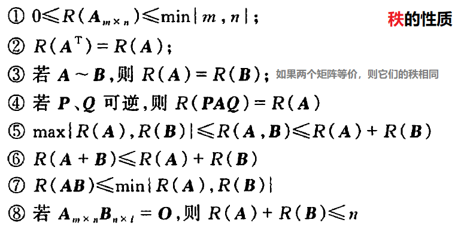
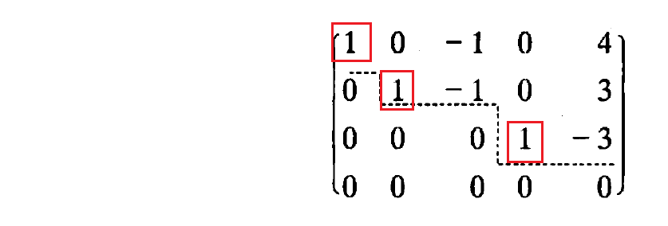

教材：《线性代数（同济）》

## 基本概念

* 先**规定**$n$个不同的元素之间的**标准次序**；在这$n$个元素的当前排列中，某**一对**元素的先后次序与标准次序不同，则构成**1个逆序**；当前排列中所有**逆序的总数**称为这个排列的**逆序数**
    - e.g. 规定标准次序为: 123456..., 某一排列：321 的逆序数=0+1+2
    - 逆序数为奇数的排列称为**奇排列**，需要进行奇数次元素**对换**才能变为标准排列（偶排列 同理）

### 行列式

$$D=
\begin{vmatrix}
a_{11} & a_{12} & \dots & a_{1n} \\\\
a_{21} & a_{22} & \dots & a_{2n} \\\\
 \dots & \dots & \dots & \dots  \\\\
a_{n1} & a_{n2} & \dots & a_{nn} 
\end{vmatrix}=
k \begin{vmatrix}
a_{11}/k & a_{12} & \dots & a_{1n} \\\\
a_{21}/k & a_{22} & \dots & a_{2n} \\\\
 \dots & \dots & \dots & \dots  \\\\
a_{n1}/k & a_{n2} & \dots & a_{nn} 
\end{vmatrix}
$$

$$D=
\begin{vmatrix}
a+b & c+d \\\\
a_{21} & a_{22} 
\end{vmatrix}=
\begin{vmatrix}
a & c \\\\
a_{21} & a_{22} 
\end{vmatrix} + 
\begin{vmatrix}
b & d \\\\
a_{21} & a_{22} 
\end{vmatrix}=
\begin{vmatrix}
a+b+a_{21} & c+d+a_{22} \\\\
a_{21} & a_{22} 
\end{vmatrix}
$$

* $n$阶行列式$D$中，每一个元素$a_{ij}$称为行列式的**元**

* 计算：$D=\sum(-1)^t a_{1p_1}a_{2p_2} \dots a_{np_n}$，其中$p_j$是列标序号，$t$是列标序号排列的逆序数
    - e.g. 二阶行列式 = $(-1)^0a_{11}a_{22}+(-1)^1a_{12}a_{21}$；$p_j$排列分别为(12)、(21)
* 性质（345参考上方示例）
    1. 行列式$D$与它的**转置**行列式$D^T$相等
    2. 对换行列式的两行（列），行列式变号
        * 推论：如果行列式有两行（列）完全相同，则此行列式=0
    3. 行列式**某一行（列）的公因子**可以提取到行列式记号外侧
    4. 若行列式某一行（列）的元素都是两数之和，则可以拆成两个行列式
    5. 将行列式某一行（列）乘以某一数后、按位置加到另一行（列）上，行列式不变

* $(i,j)$元$a_{ij}$的**余子式** $M_{ij}$ 是行列式消除$i$行、$j$列后的(n-1)阶行列式，**代数余子式** $A_{ij}=(-1)^{i+j}M_{ij}$  
    - 
* 展开：行列式等于它的任一行（列）的各元素与其对应的代数余子式乘积之和
    - $D=\sum\limits_{j=1}^na_{ij}A_{ij}$ 按第$i$行
    - $D=\sum\limits_{i=1}^na_{ij}A_{ij}$ 按第$j$列
    - 如果是第$i$行的元与第$k \neq i$行的代数余子式：$\sum\limits_{j=1}^na_{ij}A_{kj}=0$

### 矩阵

$$A_{m \times n}=
\begin{bmatrix}
a_{11} & a_{12} & \dots & a_{1n} \\\\
a_{21} & a_{22} & \dots & a_{2n} \\\\
 \dots & \dots & \dots & \dots  \\\\
a_{m1} & a_{m2} & \dots & a_{mn} 
\end{bmatrix} = 
\begin{bmatrix}
B_{r \times c} & B_{r \times (n-c)}  \\\\
B_{(m-r)  \times c} & B_{(m-r) \times (n-c)} 
\end{bmatrix}
$$

**单位矩阵** $E$ 或者 $I=
\begin{bmatrix}
1 & 0 & \dots \\\\
0 & 1 & \dots \\\\
 \dots & \dots & \dots 
\end{bmatrix}$
**零矩阵** $O=
\begin{bmatrix}
0 & 0 & \dots \\\\
0 & 0 & \dots \\\\
 \dots & \dots & \dots 
\end{bmatrix}
$  

  
克拉默法则求解方程组

有$n$元线性方程组 $AX=B$：若 $R(A) \lt R(A,B)$  无解；若 $R(A)=R(A,B)=n$ 有唯一解；若 $R(A)=R(A,B) \lt n$ 有无穷多解

$$\begin{cases} 
a_{11}x_1 + a_{12}x_2 + \dots +  a_{1n}x_n = b_1 \\\\ 
a_{21}x_1 + a_{22}x_2 + \dots +  a_{2n}x_n = b_2 \\\\ 
\dots \\\\ 
a_{n1}x_1 + a_{n2}x_2 + \dots +  a_{nn}x_n = b_n
\end{cases} $$

如果 $|A|=
\begin{vmatrix}
a_{11} & a_{12} & \dots & a_{1n} \\\\
a_{21} & a_{22} & \dots & a_{2n} \\\\
 \dots & \dots & \dots & \dots  \\\\
a_{n1} & a_{n2} & \dots & a_{nn} 
\end{vmatrix} \neq 0
$，则有唯一解 $x_i = \frac{|A_i|}{A}$，其中 $|A_i|$ 表示用 $[b_1,b_2,\dots,b_n]$ 取代$|A|$中第$|i|$列  

* $n$阶矩阵意味着 $n \times n$ 的方阵
* 元素都是实数的矩阵称为**实矩阵**，元素是复数的矩阵称为**复矩阵**
* 两个矩阵的行数、列数都相等，称为**同型矩阵**
* 运算：
    - $A_{m \times n} + B_{m \times n} = C_{m \times n}$ 每个位置的元相加：$c_{ij}=a_{ij}+b_{ij}$
    - $A_{m \times n}B_{n \times k} = C_{m \times k}$，其中$c_{ij}=\sum\limits_{k=1}^s a_{ik}b_{ki}$，即 $A$的第$i$行、$B$的第$j$列 元素依次相乘后的和 相加
        * $A^k_{n \times n}=AA...A$，即 $k$个方阵$A$连乘
        * $PA$是$P$**左乘**$A$，$AQ$是$Q$**右乘**$A$
        * $\begin{bmatrix} cos(\theta)  & -sin(\theta)  \\\\ sin(\theta) & cos(\theta)  \end{bmatrix} \begin{bmatrix} x    \\\\ y    \end{bmatrix}$ 意味着将向量$(x,y)$逆时针旋转 $\theta$ 一次
        * 矩阵**分块**后运算法则不变：$AB=\begin{bmatrix} A_{11} & A_{12} \\\\ A_{21} & A_{22} \\\\ A_{31} & A_{32} \end{bmatrix}\begin{bmatrix} B_{11} & B_{12} & B_{13} \\\\ B_{21} & B_{22} & B_{23} \end{bmatrix} = \begin{bmatrix} A_{11}B_{11}+A_{12}B_{21} & \dots & \dots \\\\ \dots & \dots & \dots \\\\ \dots & \dots & \dots \end{bmatrix}$
* 转置：
    - $(A^T)^T=A$
    - $(A+B)^T=A^T+B^T$
    - $(AB)^T=B^TA^T$
    - 如果 $A^T=A$，说明$A$是**对称矩阵**
* 方阵$A$的行列式记为 $det A$ 或 $|A|$，当 $|A|=0$ 时 $A$称为**奇异矩阵**，否则称为非奇异矩阵
* 由行列式$|A|$各元素的代数余子式$A_{ij}$组成**伴随矩阵** $A^{\ast}$
    - $A^{\ast}=\begin{bmatrix} A_{11} & A_{21} & \dots \\\\ A_{12} & A_{22} & \dots \\\\  \dots & \dots & \dots  \end{bmatrix}$，$AA^{\ast}=A^{\ast}A=|A|E$

* **逆矩阵**$A^{-1}$
    - $AA^{-1}=A^{-1}A=I$
    - $A^{-1}=\frac{1}{|A|}A^{\ast}$ (使用伴随矩阵求逆矩阵)
    - 大型矩阵可以分块成 **分块对角矩阵**(i.e.除对角线外为零矩阵) 后求小矩阵的逆
* 可逆性
    - 方阵$A$可逆的充分必要条件是：$|A| \neq 0$，即可逆矩阵是非奇异矩阵
    - (方阵$A$可逆的充分必要条件是：存在有限个初等矩阵$P_i$，使$A=P_1P_2...P_n$，即$A$与单位矩阵$I$ 行等价)
    - 可逆矩阵是满秩矩阵

  
逆矩阵应用示例1

$AXB = C$，求$X$   
$$A^{-1}AXBB^{-1} = A^{-1}CB^{-1}$$ 
$$IXI = A^{-1}CB^{-1}$$ 
$$X = A^{-1}CB^{-1}$$ 

  
逆矩阵应用示例2

$AP = P\Lambda$，求$A^n$   
$$APP^{-1}=P\Lambda P^{-1}$$
$$A=P\Lambda P^{-1}$$
$$A^n=P\Lambda P^{-1}P\Lambda P^{-1}P\Lambda P^{-1} \dots P\Lambda P^{-1}$$
$$A^n=P\Lambda^nP^{-1}$$

* **对角矩阵** $\Lambda = diag(\lambda_1,\lambda_2,\dots,\lambda_n) = 
\begin{bmatrix}
\lambda_1 & 0 & \dots& 0  \\\\
0 & \lambda_2 & \dots& 0  \\\\
 \dots & \dots & \dots & \dots  \\\\
0 & 0 & \dots& \lambda_n  
\end{bmatrix}
$
    - $\Lambda^k = diag(\lambda_1^k,\lambda_2^k,\dots,\lambda_n^k)$

* **秩**: 任取矩阵$A$中的$k$行、$k$列，得到$A$的$k$阶子式（e.g.取第1,5,6行、1,2,3列，得到3阶行列式）；如果$A$的$r$阶子式是其**最高阶非零子式**，则矩阵$A$的秩为$r$，记为$R(A)=r$
    - **如果两个矩阵等价，则它们的秩相同**
    - Tips：行列式含有零行时，其值=0，所以只有无零行的方阵值不为0；
    - **满秩矩阵（奇异矩阵）** 就是本身无零行的方阵，它的秩等于它的阶数；相对的，**降秩矩阵（非奇异矩阵）** 本身有零行

#### 初等变换

* 如果矩阵$A$经有限次初等**行变换**变成矩阵$B$，则二者**行等价**，记作$A \overset{r}{\underset{}{\sim}} B$（即$PA=B$）；如果矩阵$A$经有限次初等**列变换**变成矩阵$B$，则二者**列等价**，记作$A \overset{c}{\underset{}{\sim}} B$（即$AQ=B$）；如果矩阵$A$经有限次**初等变换**变成矩阵$B$，则二者**等价**，记作$A \overset{}{\underset{}{\sim}} B$（即$PAQ=B$）
    - $P$，$Q$都可逆
    - 反身性：$A \sim A$
    - 对称性：若 $A \sim B$ 则 $B \sim A$
    - 传递性：若 $A \sim B$、$B \sim C$ 则 $A \sim C$

| 初等行变换r | 同理，初等列变换c | 
| -- | -- |
| 对换 $i$,$j$ 两行 | $r_{i} \overset{}{\underset{}{\leftrightarrow}} r_{j}$ |
| 第$i$行乘$k$ | $r_{i} \times k$ |
| 第$i$行所有元加到第$j$行的对应位置上 | $r_{j} + r_{i} \times k$ |

* 由**单位矩阵**$I$经过**一次**初等变换的矩阵称为**初等矩阵**
    - ($I_rA$)：行变换的初等矩阵$I_r$左乘$A$相当于对$A$施加一致的行初等变换
    - ($AI_c$)：列变换的初等矩阵$I_c$右乘$A$相当于对$A$施加一致的列初等变换

* **行阶梯矩阵** 如下图所示， 
    - 
    - 如果$A$每一行的**首非零元**（红框）值为1、且其所在列其余位置皆为0，则$A$是**行最简形矩阵**
    - 对**行最简形矩阵**施加**列**初等变换，可以将其转换成**标准型** $F=\begin{bmatrix} I & O \\\\ O & O \end{bmatrix}$

  
求 行最简形矩阵

已知$A$，求$A$的 行最简形矩阵 $F$，并求一个可逆矩阵$P$，使$PA=F$

$$
(A_{3 \times 3},I_{3 \times 3}) = \begin{bmatrix}
2 & -1 & -1 & 1 & 0 & 0 \\\\
1 & 1 & -2 & 0 & 1 & 0 \\\\
4 & -6 & 2 & 0 & 0 & 1  
\end{bmatrix}

\overset{r}{\underset{}{\sim}}

\begin{bmatrix}
1 & 0 & -1 & -3 & 3 & 1 \\\\
0 & 1 & -1 & 3 & -2 & -1 \\\\
0 & 0 & 0 & 10 & -8 & -3  
\end{bmatrix} = (F_{3 \times 3},P_{3 \times 3}) 
$$

### 向量

