

Guyton and Hall Textbook of Medical Physiology 摘要、笔记

## Ch 1 概览

* **Human Physiology**: explain the specific characteristics and mechanisms of the human body that make it a living being
* The basic living unit of the body is the **cell**. Each **tissue or organ** is an aggregate of many different cells held together by intercellular supporting structures (相同微环境).
* 人体60%是液体，包含：
    - Intracellular fluid：相对静止的；potassium, magnesium, phosphate ions
    - Extracellular fluid：持续流动的；sodium, chloride, bicarbonate ions, nutrients (oxygen, glucose, fatty acids, amino acids), waste products (carbon dioxide, wastes to kidneys....)
        * Interstitial fluid
        * Circulatory system：血液、淋巴液系统
* **Homeostasis**: maintenance of nearly constant conditions in the internal
environment (extracellular fluid)
* **Disease**: A disruption to homeostasis；Extreme dysfunction leads to death; moderate dysfunction leads to sickness
* 代偿：身体为了回归稳态所尝试的努力；有时为了某个tissue的稳态可能会打破另一个地方的稳态，因此有时难以区分primary cause与代偿反应
* 获取nutrients
    - Respiratory System：oxygen
    - Gastrointestinal Tract：carbohydrates, fatty acids, amino acids
    - Liver and Other Organs That Perform Primarily Metabolic Functions：分泌酶、储存 
    - Musculoskeletal System：获取食物
* 排出waste products
    - Lungs：Carbon Dioxide
    - Kidneys：血液中大部分wastes
    - Gastrointestinal Tract：Undigested materials
    - Liver：drugs and chemicals
* 身体机能的调控系统
    - Nervous System：sensory input portion + central nervous system (or integrative portion) + motor output portion
    - Hormone Systems：transported in the extracellular fluid to other parts of the body to help regulate cellular function
* Control Systems
    - Negative Feedback Loop：超出正常范围会有抑制机制；维持稳态
    - Positive Feedback Loop：其提升会刺激进一步提升；(e.g. 受伤召唤凝血因子、Childbirth、nerve signals)；受Negative Feedback抑制、防止升级至危险状态
* Adaptive Control：大脑发送前馈信号控制peripheral parts进行动作，即，信号传递至外围部位后，活动部位返回sensory nerve signals，大脑会依据状况修正后续动作

* [Extracellular Fluid 的主要组成](Medical_Physiology/1-1.png)  

## Ch 2 细胞器

* [动物细胞](Medical_Physiology/2-2.png) 
    - Protoplasm
        * water: 占70%~85%
        * electrolytes: potassium, magnesium, phosphate, sulfate, bicarbonate, and sodium, chloride, and calcium
        * proteins: structural, functional
        * lipids: phospholipids, cholesterol
        * carbohydrates: 提供能量或合成glycoprotein
    - [Cell Membrane](Medical_Physiology/2-3.png)：双重磷脂
    - [Endoplasmic Reticulum](Medical_Physiology/2-4.png)：Rough ER 合成蛋白，Smooth ER 合成 lipids   
    - [Golgi apparatus](Medical_Physiology/2-14.png)：接收ER生成物，生成碳水化合物，下一步可形成 Lysosomes 等分泌小泡   
    - [Mitochondria](Medical_Physiology/2-15.png)：数量不定，生成ATP   
    - [Cytoskeleton](Medical_Physiology/2-8.png)：Filament and Tubular Structures   
    - [Nucleus](Medical_Physiology/2-9.png)：遗传物质   

* Endocytosis（胞吞）：Pinocytosis（胞饮），Phagocytosis（胞吃/吞噬）
* Autophagy（自噬）：移除老化organelles
* 细胞移动：
    - Ameboid motion：细胞一端伸出假足将自己固定到新的区域，向这个方向形变（后方发生吞噬、于前方Exocytosis，则成功挪动这一部分细胞膜）
    - Cillary movement 纤毛运动，需要ATP与appropriate ionic conditions；e.g. 呼吸系统分泌粘液

## Ch 3 蛋白合成与细胞复制

<!--    -->
<!-- 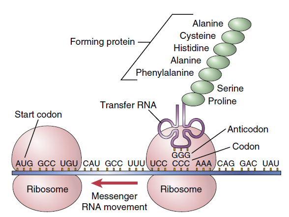    -->
<!-- 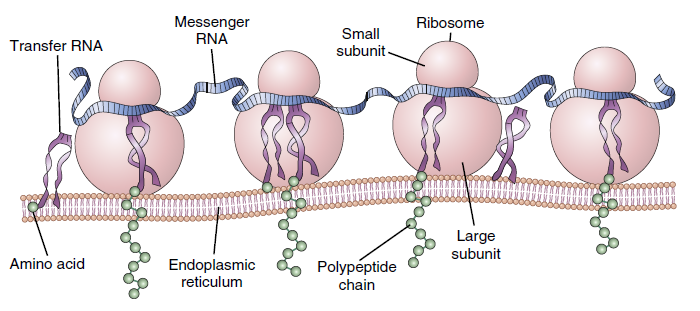    -->

* RNAs
    - Small nuclear RNA (**snRNA**) directs the splicing of pre-mRNA
to form mRNA（去除introns）
    - **mRNA** 指导合成蛋白（消耗ATP）：Transfer RNA (**tRNA**) 运输AA，Ribosomal RNA (**rRNA**) 提供核糖体结构框架
    - MicroRNAs (**miRNAs**) 与mRNA结合(blocking)，调节转录和翻译
* Polyribosomes：由多个核糖体串连在一条mRNA分子上高效地进行肽链的合成
* [ATCG化学式](Medical_Physiology/3-3.png)    
* [Codon Table](Medical_Physiology/3-1t.png) 详见 [NCBI-The Genetic Codes](https://www.ncbi.nlm.nih.gov/Taxonomy/Utils/wprintgc.cgi)，同一种氨基酸具有两个或更多个密码子（简并密码子）     
* [Gene transcription in eukaryotic cells](Medical_Physiology/3-13.png)  
* [细胞通过 Mitosis 进行复制](Medical_Physiology/3-14.png)  
    - Interphase：interval between mitosis，其占细胞95%以上生命周期。DNA在分裂开始前约10h开始复制，并且需要通过 Proofreading (是否与模板一致) 与 DNA Repair 以降低错误率。不过，假定人类30年一代，预计依旧会累计10个以上的Mutation 给下一代
    - Prophase 前期：纺锤体形成，染色体被压缩
    - Prometaphase 前中期：核膜消失，microtubule aster 结合着丝粒，将成对的chromatids 向两极施加拉力
    - Metaphase 中期：asters 相互挤压、形成纺锤体，chromatids 于赤道面排列
    - Anaphase 后期：chromatids 被拉开
    - Telophase 末期：两边各自形成新的核膜，microfilaments 形成 contractile ring 将细胞分开
    - Mitosis的调节：Growth Factors，细胞密度（相互挤压、环境中 cell's own secretion 的浓度） 
* 细胞寿命：每次复制端粒（Telomeres）会变短，骨髓中的端粒酶可修复端粒长度
* Apoptosis：细胞程序性死亡：shrink，condense，disassemble cytoskeleton，在表白加上标记、以便免疫细胞及时清除
* Necrosis：细胞被动死亡，内容物释放到微环境
* Oncogene 一般是促进细胞生长的基因、缺乏抑制，因此 Cancer 中细胞无度生长、与正常细胞争夺养分；Cancer 可能来源：Ionizing radiation，Chemical substances，Physical irritants 如持续磨损，家族遗传，Certain types of oncoviruses

## Ch 4 跨膜运输

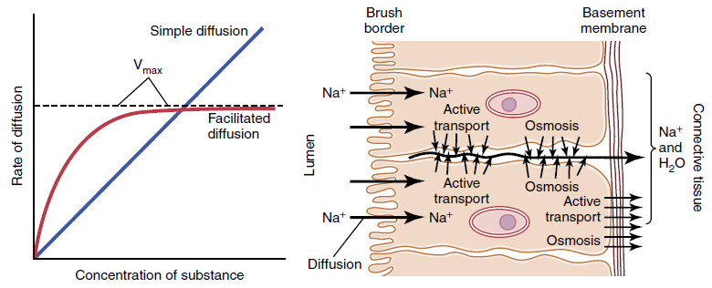   

* Diffusion 由物质浓度、电离浓度综合驱动
    - 脂类可通过细胞膜扩散；水溶性小分子可通过 protein “pores” (aquaporins) 渗透，比水大20%，渗透效率降低1000倍
    - Protein channels 有两个特性：
        1. selectively permeable（e.g. K离子专用通道）
        2. electrical signals / chemicals 控制 gates 开合（voltage-gated / ligand-gated）
    - 受限于Carrier protein 的形变速度，Facilitated diffusion 有速度上限（上图所示Vmax）
    - Nernst equation：EMF (in millivolts) = ±61*log(C1/C2)；EMF 指细胞膜内外 voltage；C1、C2 指细胞膜内外待扩散物质的浓度；此式满足则达成扩散平衡
    - Osmosis：水分子也可以渗透通过细胞膜；由渗透压驱动
        * 1 osmole = 1mol osmotically active solute 存在于1L溶剂中；e.g. 1mol某物质溶于水形成 2mol ions，则 2 osmoles；若不分解成ions，则依旧 1 osmole
        * 区别：Osmolality（osmoles per kilogram of water），Osmolarity（osmoles per liter of solution）

* Active transport 可逆浓度梯度转运物质，由载体蛋白消耗能量驱动
    - Primary：消耗ATP运输某种物质；e.g. Na-K Pump 维持平衡，Ca Pump 储钙于内质网中，H Pump 胃酸生成   
    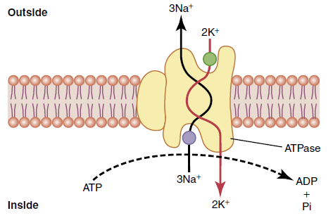
    - Secondary：形成浓度梯度/...，以运输另一种物质
        1. Co-Transport   
        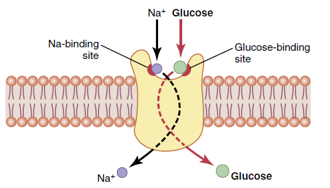    
        2. Counter-transport   
        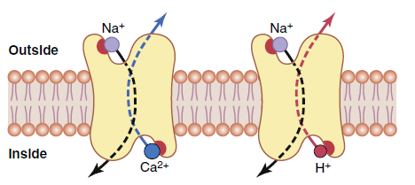

## Ch 5 动作电位

**本章节关注 Nerve Cells**；Cardiac Cells 也有电位（Ca，此处不述）

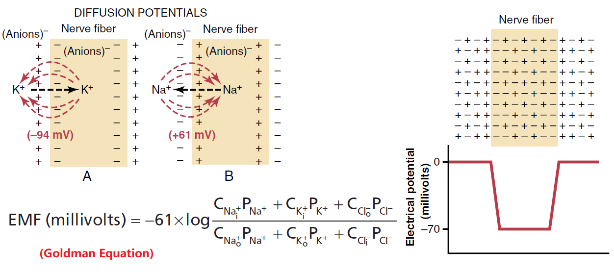  

* 上图，静息状态表格指膜内电位相对于膜外电位，e.g. -60mv 表示膜内电位负于膜外 60mV

* 静息状态时达成平衡，Nerve fiber 细胞内部含有大量K，细胞外部含有大量Na。因为多种离子的平衡电位不同 (K:–94 mV,Na:+61mV)，**静息电位**可用 Goldman equation 计算，其值为负，因：
    - Na-K pump: 泵出3 Na+, 泵入2 K+
    - K "leak" channels: 渗出 K+
* 将电位从−70mV提升至10mV的**测试**中，可以发现Na、K 通道的反应速度不同   

* 标准动作电位示意图（左）；带节律的动作电位（中）调节心脏节律，Hyperpolarization 与 K 流出有关；Plateau（右）延长了去极化的时间（与Ca通道有关），使心脏肌肉的收缩时间相同    

* **动作电位**激发后 Na 涌入细胞，到达电位顶点后通道迅速关闭；随后 K 加速流出细胞，到达平衡电位后通道关闭     
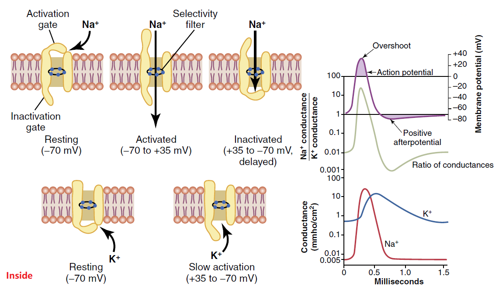
* 动作电位可沿着 conductive fiber 向两侧传导；也可 Saltatory conduction （跳跃式传导，更快）：Schwann cell 包裹 nerve fiber，间隔着留下 Node of Ranvier 以供跳跃式传导       
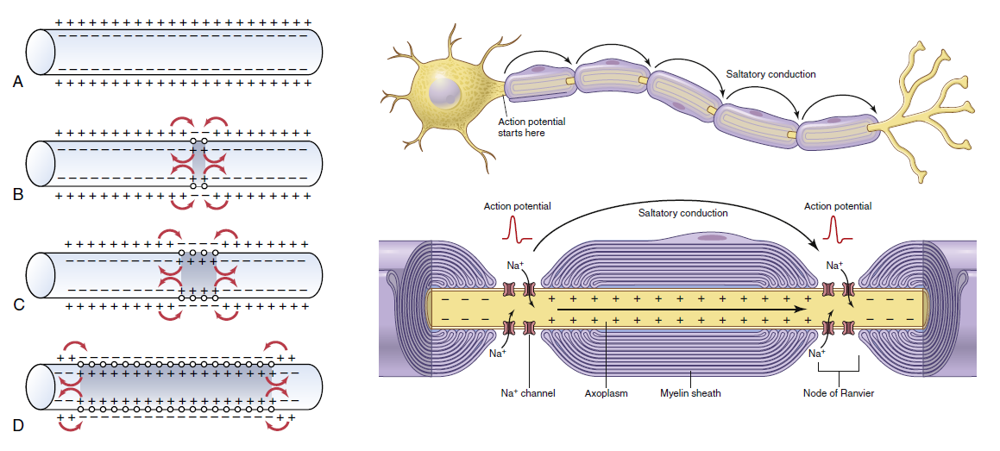
* 当前一个动作电位未结束时，后一个电位不会被激活，因为激活后不久Na通道就会关闭，直至再次达到静息电位前都不能再激活；下图（B）无法被激活，因为此时正处于 absolute refractory period (1/2500 second for nerve fibers)；下图（A）因为impulse未达到动作电位而未能激活     

* 细胞外液钙离子浓度高会降低细胞膜对钠离子的通透性，因此 Ca 是 stabilizer
* 一些麻醉药提高Na通道的激活难度（提高 excitability threshold）

## Ch 6,7  骨骼肌

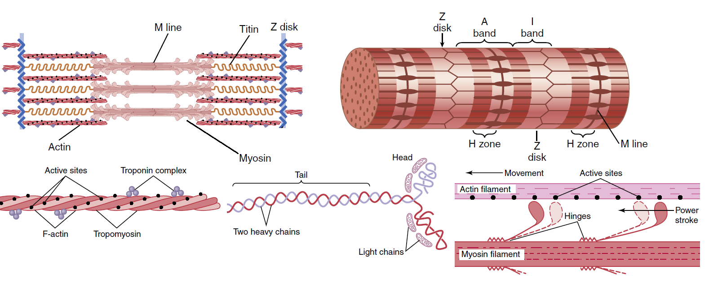

* 骨骼肌（Skeletal Muscle）的肌肉纤维束（Muscle fasciculus）由许多肌纤维（Muscle fiber）组成；每一根肌肉纤维外由肌膜（Sarcolemma）包裹、延申成横向的 T小管（Transverse tubule） 使动作电位得以快速传递，由肌浆（Sarcoplasm）填充、纵向的肌浆网（Sarcoplasmic Reticulum）调节钙离子；纤维内依次排列着多个肌节（Sarcomere）  
    - 
* 骨骼肌收缩
    - 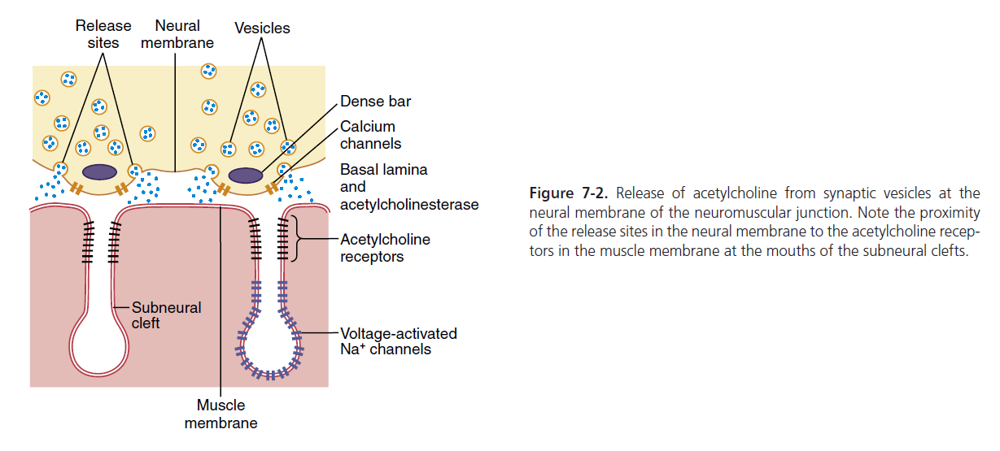
    - 动作电位由 Nerve 传递至肌纤维，Nerve 分泌少量神经递质 乙酰胆碱（acetylcholine）
    - 乙酰胆碱打开通道，大量Na离子涌入肌膜内侧、导致局部去极化，进一步打开钠离子通道，在膜上产生动作电位
    - 动作电位继续扩散，并且至肌纤维的中心、释放肌浆网内钙离子
    - 受钙离子刺激，Actin and Myosin filaments 开始滑动，肌肉收缩
        * （当 Active sites 未暴露时）Myosin Head 裂解ATP，产生 ADP+Pi+能量，此时其与Actin**垂直** 
        * 钙离子结合 Troponin complex，其形变拉动 tropomyosin 露出 Active sites 以结合 Myosin
        * Myosin 结合 Active sites 后形变**倾斜**，达成牵拉
        * 牵拉后释放ADP+Pi，结合新ATP，重复...
    - 在几分之一秒后，钙离子抽回肌浆网，肌肉收缩停止
    - e.g.骨骼肌）收缩时，Motor unit 指被一个Nerve（多个末梢）控制的一束纤维，它们同时收缩
* 骨骼肌能量来源：phosphocreatine（5-8s即可用），glycolysis（水解glycogen以用于生成ATP），oxidative metabolism（最慢）
* 两种肌纤维
    - slow fiber (red muscle)：更小，血管发达、供氧更好（偏向 oxidative metabolism），nerve 更少
    - fast fiber (white muscle)：更大，更偏向使用 glycolysis 等可以无氧代谢的快速能源（线粒体更少），存储大量钙离子
* 骨骼肌张力（Tone）：即使处于休息状态，通常也会有一定程度的紧绷，由来自脊髓的低频率神经冲动引起
* Muscle Remodeling
    - Hypertrophy and Atrophy（肥大/萎缩）：当肌肉蛋白合成加速/泛素水解时发生；肌肉失去神经支持也会快速萎缩（失去收缩能力后很难再恢复弹性）
    - Adjustment of Muscle Length：当肌肉被拉伸过长时发生
    - Hyperplasia of Muscle Fibers：纤维数量的增加（不是纤维肥大），分裂自此前已变大的纤维

* 运动终板（Motor End Plate）：神经元与肌纤维相接触的部位，被多个 Schwann cells 覆盖，使其与周围的液体隔绝（神经信号 乙酰胆碱不会快速发散，只能从 synaptic cleft 走）。
    - 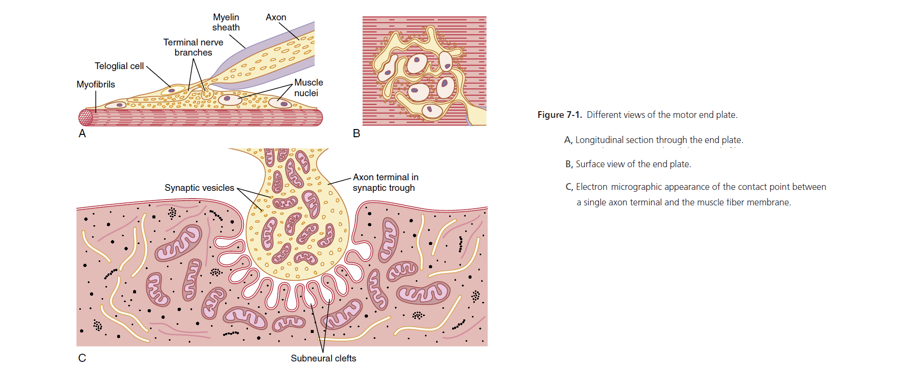
    - 乙酰胆碱会被迅速分解，因此信号不会一直持续
    - 肉毒杆菌毒素（botulinum toxin）：使神经末梢减少释放乙酰胆碱
    - Fatigue of the Junction：持续释放乙酰胆碱后，乙酰胆碱储备不足
    * carbachol、nicotine 作用类似乙酰胆碱，且代谢缓慢；这样的持久刺激可能造成肌肉痉挛（spasm）；一些使乙酰胆碱酯酶失活（使之不能快速分解）的药物也可能达成这样的效果
* 骨骼肌的动作电位与神经元的相似（参考Chapter 5），一些参数不同：
    - 静息膜电位约比神经元更负10到20毫伏
    - 动作电位持续时间为 1-5 ms （更长）
    - 传导速度为 3-5m/s（更慢）

## Ch 8 平滑肌

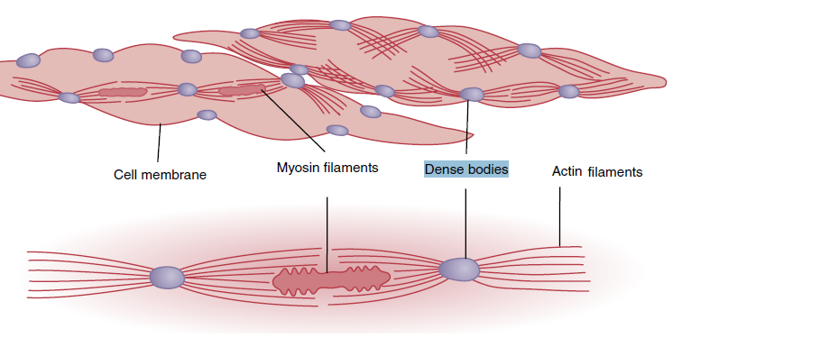

* 平滑肌（Smooth Muscle）一般有两种型态
    - Multi-Unit：每一根纤维都独立地运作、受神经控制；在需要精细控制的地方出现，e.g.眼睛
    - Unitary (Visceral)：纤维成片、束排列为一个整体，细胞膜相互粘附、离子可以通过这些缝隙连接在细胞间流通；出现在内脏壁、血管导管处（Stress-Relaxation、reverse stress-relaxation：压力缓冲的能力很强，例如膀胱壁）
* 平滑肌收缩：
    - 神经冲动/递质-->动作电位（仅Unitary有，Multi-Unit太小了、故无）-->钙离子泵
    - CaM 结合钙离子后激活 MLCK，使 Myosin 磷酸化、附着 Actin，肌肉收缩
    - 钙离子被泵出后 Myosin 不再磷酸化，同时 Myosin phosphatase 进行去磷酸化，肌肉放松
    - 对比骨骼肌收缩：
        * 神经递质因器官而异；此外，Unitary 通常可以由非神经施加的刺激引起收缩（e.g.stretch使阈值更易达到、于是自动节律的电位也可以造成收缩）（e.g.激素，氧气）
        * 钙离子更多来自于胞外（骨骼肌Ca多来自肌浆网）
        * 没有 troponin，故而对钙离子的反应也更慢、Myosin Cross-bridges（收缩）更慢
        * 耗能更少
        * Dense bodies（同时也是 intracellular protein bridges） 代替了 Z disk 位置

## Ch 9 心脏

**血液循环**：lung **-->** Left atrium **-->** Left ventricle **-->** Aorta(body) **-->** Right atrium **-->** Right ventricle **-->** Lungs

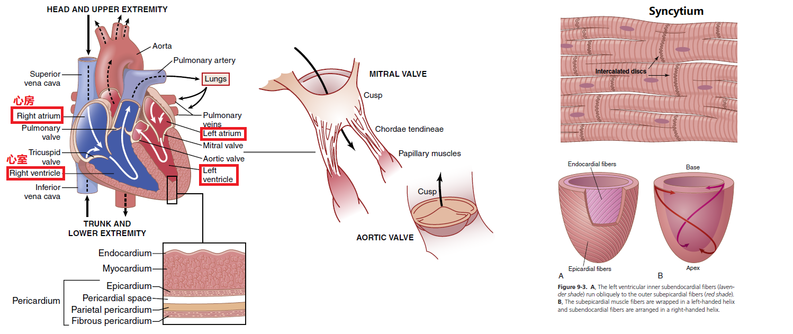 

* 心肌的动作电位扩展至T小管，激活 L-type Ca channel 令钙离子进入细胞，激活肌浆网中的钙离子也泵入胞质；收缩结束后钙离子泵出细胞
    - 有Plateau，因为开启L型钙离子通道使Ca流入细胞，延长了去极化(Depolarization)的时长
    - 骨骼肌中过早的收缩会引起 wave summation；但**心肌在达成复极化(Repolarization)前无法再次激发动作电位**

* Cardiac Muscle
    - Atrial Muscle
    - Ventricular Muscle：Pump
    - Conductive Muscle Fiber：传递电子信号，使心脏模块(atrium、ventricle)内部保持同步缩放（Syncytium：Fibers 互相贴合为一个整体，由 Intercalated discs 传递 ion signals 以保持节律）

* **Cardiac cycle** = Systole + Diastole；心跳加速时，Diastole 部分时长缩短最多
    - Isovolumic: 收缩/舒张导致压力变大，但valve还没有开启，因此血液容量无变化（等容收缩/舒张）
    - Left Heart 视角
       * （----Diastole----）
       1. Mitral valve 打开，血液从 Left atrium 流入 Left ventricle
       * （----Systole----）
       2. Mitral valve 关闭，防止 Left ventricle 血液逆流入 Left atrium （同时等容收缩）
       3. Aortic valve 冲开，开始 ejection
       4. Aortic valve 关闭（同时等容舒张）
    - Phonocardiogram 视角
        * P：S-A node firing，atrium 中信号开始传导、
        * QRS：A-V node firing，ventricle 中信号开始传导、收缩

* 影响心输出量(Cardiac Output)的因素
    - 自主神经系统（见下章）
    - 细胞外过量K离子可能阻断心脏冲动的传导（去极化，使膜电位不那么负，导致动作电位的强度变弱）；相对的，细胞外过量Ca离子可能导致心脏持续痉挛性收缩
    - 动脉压

## Ch 10 心脏节律

* 自主神经系统（autonomic）调节心跳
    - 副交感神经（parasympathetic）：迷走神经（Vagi, Vagus nerves）控制 S-A node、A-V node，控制心率（e.g. acetylcholine 减慢心跳）
    - 交感神经（sympathetic）：直接影响肌肉收缩，可同时控制心率、收缩强度（e.g. Norepinephrine 加速离子置换：K-加速达到电位阈值、Ca-收缩增强）

* 节律传递：Atrium先收缩、随后再Ventricle
    1. （Right Atrium 中）S-A node 产生自主节律脉冲，通过 Internodal pathways 传导至 A-V node
    2. （A-V bundle 处延迟一会儿，随后信号进入ventricles）
    3. （Ventricle 中）信号传递给 Purkinje fibers 的左右 bundle

* 自主节律：S-A node、A-V node 可以受Vagi调节，也可以自主产生节律脉冲（其静息电位不如正常的负）；正常心跳节律由 S-A node 产生；A-V node 的自主节律 S-A node 慢，当外源信号迟迟不至时才起作用（escape beat）；Purkinje fibers 的自主节律更慢

## Ch 11,12 心电图
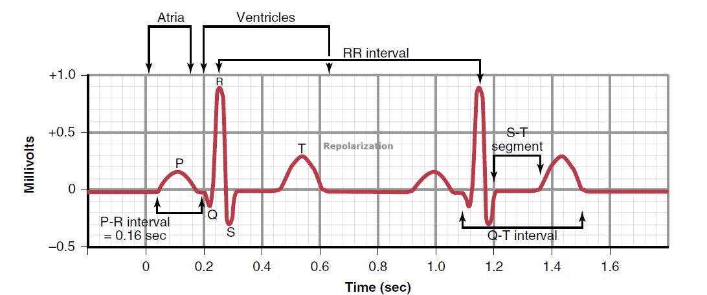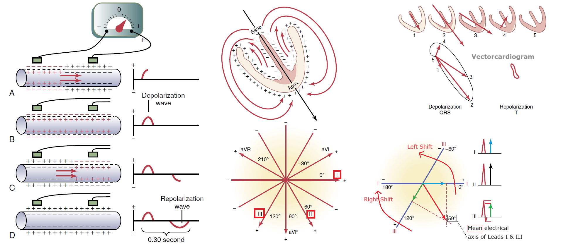  

* PR区间 AV node 慢速传递电信号，QT区间 Ventricle 收缩

* 心肌[去极化(Depolarization)](./Medical_Physiology/9-8.png)时，大量 Na 进入细胞使得胞内正电荷、胞外负电荷(-)；而 极化(Polarized) 后达成静息电位，此时胞外正电荷(+)
    - [PQRS过程中的电荷分布与心电图](Medical_Physiology/12-7.png)
        * P (Atrial P Wave)：**atria** 从 sinus node 开始极化; 其从远端部分开始去极化，产生 Atrial T Wave
        * QRS：信号从 A-V bundle 处进入 **ventricles** 并扩散，使之去极化
        * T：**ventricles** 复极化；注意，因为最先极化的 septum and endocardial areas 收缩时间较长，因此是从 apex 开始复极化
        * 当ventricles极化耗费过长时间传递时，有可能 septum 等已经完成收缩，先进行复极化，（或者是药物导致部分区域加速完成去极化、先行复极化），此时会有[异常的 T wave 图像](Medical_Physiology/12-24.png)
    - 电流趋势方向：负电荷 --> 正电荷

* EKG/ECG Leads 摆法：不同 Leads 都可通过正负极之间的电流测得电信号的大致方向以形成心电图
    - （正负电极测量两个位点电位之间的差别、**方向**，注意图中符号）
    - Bipolar Limb Leads：正负极摆法如图；其中 Leads 2 最符合电信号趋势，因此信号最强
    - Precordial Leads：肢体合并为整个负极，将正极放置于心脏周围不同处，可以分辨出整个信号传导过程
    - Augmented Limb Leads：aVR（Right arm 正极，其余二者负极），aVL（Left arm 正极，其余二者负极），aVF（Left Foot 正极，其余二者负极）；是 Bipolar Limb Leads 的信号加强版

* Vectorcardiogram：趋势向量（不同时间）的轨迹图

* QRS 的 Mean electrical axis：确定 QRS 时 Bipolar Limb Leads 2个方向上的向量长度（所有正数值-所有负数值），二者**顶端的垂线**相交于某一点、连通原点得到一个新的向量轴
    - 对于正常的 ventricles，其标准值是 59°（在 20°-100°之间都是正常的）；改变 apex 的位置会造成一定程度的 axis shifts：躺下（to left）、站起（to right）
    - **单侧**心肌异常/信号传递受阻可能导致 axis 偏移：**因其去极化时间变久，axis转向此侧**，例如-单侧心室肥厚，单侧 Bundle Branch Block

* QRS的范围一般在 0.5mV 至 2mV 之间
    - 高于 4mV 则认为有高血压：心脏的某一部分负荷过重，肌肉量增加，更多电流
    - 过低则可能：有陈旧性心肌梗死导致肌肉量减少；或心包积液(pericardial effusion)过多，使大部分电信号通过积液传递，降低到达身体外表面的心电图电压；或肺气肿形成绝缘体包裹心脏

* 正常QRS复合体持续0.06 ~ 0.08秒，超过0.09则不正常
    - 心室肥大或扩张，QRS延长至0.09 ~ 0.12秒
    - 传导系统（例如-Purkinje system）被阻塞：QRS持续超过0.12秒
    - 疤痕也会减慢传递速度，因为信号需要绕过它

* 损伤电流(current of injury, COI)：部分心肌细胞一直处于去极化状态，使[电流异常，可测得 J point](Medical_Physiology/12-17.png)
    - 不能完全复极化：机械损伤使膜保持透性
    - 感染：肌膜损伤
    - 局部缺血：局部冠状动脉闭塞
    - 以 J point 为 Baseline（排除杂乱电流信号），可结合不同leads的心电图，以确定损伤部位：绘制 [Injury potential 的 Mean electrical axis](Medical_Physiology/12-18.png)，新向量的**负端**指向 ventricles 中损伤的位置
    

## Ch 13 心律失常

| -- | -- | 机制 |
| -- | -- | -- |
| ABNORMAL SINUS RHYTHMS | TACHYCARDIA  (心跳加速) | sympathetic nervous system：体温上升1摄氏度，心跳每分钟加速18下 |
| -- | BRADYCARDIA  (心跳减慢) |  parasympathetic nervous system（Vagal Stimulation）；或，运动员静息状态下心跳较慢 |
| -- | SINUS ARRHYTHMIA | 髓质呼吸中枢的信号外溢到邻近的血管舒缩中枢，影响了sympathetic/vagus传递给sinus的信号：深呼吸加速心跳，呼气减慢心跳 |
| 心内传导通路阻塞 | SINOATRIAL BLOCK  (S-A node block) | 只能依赖更慢的 A-V node 的自主节律产生P wave，导致心率变慢 |
| -- | ATRIOVENTRICULAR BLOCK  (A-V node block) | **First-Degree Block**：P-R逐渐延长后心跳漏拍    **Second-Degree Block**：P-R长度固定，但随机出现dropped beats（P wave无法传导成QRS）   **Third-Degree**/Complete Block：QRS随机出现，与P完全无关联    **病因**：可能由于 A-V node 缺血/疤痕压迫/炎症，或 vagus nerves 极度兴奋，或药物：digitalis/beta-adrenergic拮抗剂   **Stokes-Adams Syndrome**: 突然出现Complete Block，等待Ventricular节律期间缺血昏迷 |
| -- | Ventricular内部阻塞 | 可能由于Purkinje system跟不上加速的心跳（ELECTRICAL ALTERNANS），或者缺血/疤痕压迫/炎症/拮抗剂导致Purkinje system阻塞 |
| PREMATURE CONTRACTIONS  早搏/异位(ectopic)心跳 | 房性早搏(PAC) | P wave过早出现，P-R缩短（**异位信号起源于atria中**靠近A-V node处），与下一个收缩的间隔会稍微延长（因sinus node 激活较晚、所以discharge late） **常见于**：运动员、吸烟、睡眠不足、摄入过多咖啡、酗酒... |
| -- | A-V NODAL OR A-V BUNDLE | **异位信号起源于A-V node**，信号同时传入atria、ventricles；P wave叠加至QRS |
| -- | 室性早搏(PVC) | **异位信号起源于ventricular中**，QRS延长（因为信号不是通过高速Purkinje system传递的）、high voltage；[T wave 总是与QRS极性相反](./Medical_Physiology/13-1.png)  [long QT syndrome (LQTS)](./Medical_Physiology/13-12.png)：增加室性心律失常的易感性；病因：低镁/钾/钙血症... 或服用过量抗心律失常的药物 |
| PAROXYSMAL TACHYCARDIA   （阵发性心动过速） | 心房/Nodal/心室都可能突发快速节律信号，无清晰起因 | 其中，室性心动过速通常源于严重的缺血性损伤，且容易引发 ventricular fibrillation（在一系列早搏的刺激下） |
| [VENTRICULAR FIBRILLATION](./Medical_Physiology/13-16.png)  (室颤) | 致死，需要 1 min内 [除颤](./Medical_Physiology/13-18.png) | 心室肌肉群发生无序的激动，其节律和舒缩功能消失；病因：电击/按压心脏/缺血/... |
| ATRIAL FIBRILLATION | cardic output 降低（但不致死，因为还有passive filling）  | -- |
| CARDIAC ARREST | 失去心脏中所有信号 | 深度麻醉/缺氧/... |

## Ch 14 血液循环

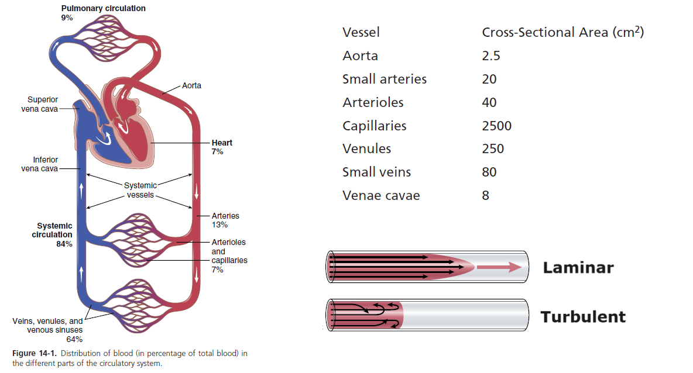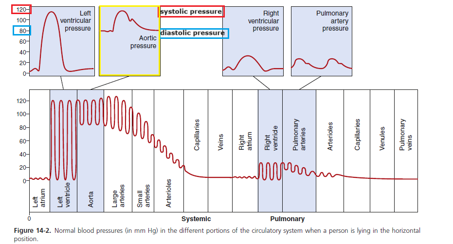

* 血液循环的基本特征
    - 血液可按Tissue的需求调节
    - Cardiac output = 所有 local tissue flows 之总和
    - Arterial pressure regulation **不受** local blood flow control 与 cardiac output control 的**影响**

* Velocity = Flow / Cross-Sectional_Area
    - Flow恒定为Cardiac output，故而横截面小者流速快

* Resistance：以PRU（Peripheral Resistance Unit）为单位，见Ohm’s law
    - 近血管壁处阻力比血管中心处大
    - 增加Viscosity（例如增加细胞）可以提高Resistance

* Conductance = 1/Resistance = 与(Vessel_Diameter^4)成比例
    - 大血管的Conductance = 其所有分枝的Conductance之和
 
* Blood Pressure: the force exerted by the blood **against** any unit area of the **vessel wall**
    - 1 mmHg = 1.36 cm water pressure

* Ohm’s law：压力梯度与阻力决定了流量
    - Flow = (Pressure_1-Pressure_2)/Resistance 
    - 1 ml/sec = (1 mmHg)/(1 PRU)；
    - **由 Ohm’s law 对应 Systemic pressure（100mmHg）与 Cardiac output（100 ml/sec）**

* Poiseuille’s law: 影响流量的各种因素
    - Flow = Pi × (Pressure_1-Pressure_2) × (Vessel_Radius^4) / （8 × Viscosity_coefficient × Vessel_Length）

* Reynolds’ number 判别粘性流体流动状态
    - Re = Velocity × Vessel_Diameter × Density / Viscosity_coefficient
    - 数值越大越趋向于 Turbulence，例如：笔直光滑血管中 >2000、分支血管中 >200~400 （arteries中经常是湍流）
    
* Autoregulation：根据血压调节血管的 dilation/constriction

## Ch 15 动脉-静脉

* Vascular distensibility = Increase_in_volume / (Increase_in_pressure × Original_volume)
    - 扩张性：压力每升高1毫米汞柱，血液量增加的**倍数**
    - 允许血管适应心脏的脉动输出并平均化压力脉动
    - 血管中最易扩张的是静脉（大约是动脉的8倍），储存大量额外血液

* Vascular_compliance = Increase_in_volume / Increase_in_pressure
    - 顺应性：压力每升高1毫米汞柱，血液的**增量**
    - 全身静脉的顺应性约为相应动脉的24倍（8倍扩张性×3倍容积）

* 可以使用 [Volume-pressure curves](Medical_Physiology/15-1.png) 来表示压力与体积的关系
    - 全身动脉系统中，容积通常在700毫升左右，此时平均动脉压是100 mmHg；当容积降至400毫升时，动脉压迅速降为0
    - 全身静脉系统中，容积通常在2000到3500毫升之间；其顺应性很高，故而人体可以承受多达半升的快速输血
    - 交感神经刺激血管张力（vascular tone）升高、降低顺应性，血压升高；交感神经抑制同理

* [Delayed Compliance of Vessels](Medical_Physiology/15-2.png)：容积变动的初期血压大幅变化，但几分钟到几小时内可通过血管壁中平滑肌的渐进延迟拉伸恢复正常

* [Pulsations（脉搏）](Medical_Physiology/15-3.png)：动脉承受着心脏每一次收缩的输出压力，舒张期又无血流
    - 当血液流至毛细血管时，Arterial tree的顺应性将脉搏降低至几乎无，令血流平缓连续
    - 图中 Sharp incisura 是由 valves 开合产生的
    - Pulse pressure = Stroke_volume / Arterial_compliance

* [测血压](Medical_Physiology/15-7.png)：压迫动脉至无血流（脉搏），逐渐松开，过程中记录第一次出现声音时的血压（收缩压）、最后一次出现声音时的血压（舒张压）
    - 平均血压更接近舒张压，因为舒张耗时更长（除非心动过速时、舒张更短）
    - 随着年龄增加，血压也逐渐增加

* Central venous pressure = Right atrial pressure，受以下两个因素的影响
    - 心脏泵血入肺的能力：right atrium -- right ventricle --  lungs （泵血能力更强，造成的压力更高）
    - 血液从 peripheral veins 回收至 right atrium 的趋势（e.g. vessel tone升高，更多血液回流入心）

* 由于其顺应性，Large veins 对血液流动的阻力几乎为零，但在进入胸腔后会有一些压迫点造成一些血流阻力，故而平躺时外周小静脉的压力通常比Right atrial高 4-6 mmHg
    - 例如：大气压使颈静脉塌陷，第一根肋骨压迫手部静脉，不同器官和腹内压力的压迫，...

* [重力也会对静脉压造成影响](Medical_Physiology/15-10.png)，站立时，接近足部的压力最高
    - 腿部的肌肉收缩起到泵血的作用，[Venous valves](Medical_Physiology/15-11.png) 防止过程中静脉血回流
    - 怀孕、长期站立会让腿部静脉持续高压，损伤 Venous valves，血液无法正常泵出、造成静脉曲张（Varicose Veins）

* 人体血液储备包括：（其中静脉存储了约65%的血液）
    - [spleen](Medical_Physiology/15-13.png)：约 100 ml 血液
    - liver：约 几百 ml 血液
    - large abdominal veins：约 300 ml 血液
    - venous plexus beneath the skin：约 几百 ml 血液
    - heart： 50 ~ 100 ml 血液（交感神经刺激时收缩放血）
    - lungs： 100 ~ 200 ml 血液（当肺动脉压降至较低值时）

## Ch 16 微循环-淋巴系统

* 毛细血管(Capillary)的 [Microcirculation](Medical_Physiology/16-1.png): the transport of nutrients to the tissues and removal of cell excreta
    - Capillary Wall 非常薄，仅 1 cell thick，可通过 Caveolae 运输脂溶性物质（例如 氧气、二氧化碳）
    - Precapillary sphincters 控制进入毛细血管的血流量（根据需氧量）
    - Intercellular cleft (内皮细胞之间的‘Pores’)，可通过水溶性物质（例如 sodium ions、glucose）
        * brain：很严格，只允许通过water, oxygen, carbon dioxide
        * liver：很宽松，允许几乎所有plasma中溶质通过，包括蛋白
        * gastrointestinal capillary membranes：中庸
        * glomerular capillaries of the kidney：其内皮细胞有被称为 fenestrae 的孔（仅可通过小分子），故而不需要通过 clefts

* 血管舒缩(Vasomotion): 由于 sphincters 的间歇性收缩，血液在毛细血管中断断续续的流动

* [Interstitium](Medical_Physiology/16-4.png)主要由 Collagen fibers（骨架）与 Proteoglycan filaments（gel-like填充物）组成
    - 水肿(edema)时，会存在大量 free fluid

* [静水压(hydrostatic pressure) v.s. 渗透压(osmotic pressure)](https://www.jishulink.com/post/1910514)
    - 静水压 P = rho × g × height: 流体在接触表面的每单位面积上施加的垂直力（由于重力作用，静水压会在任何时间点施加，在底部最大）
    - 渗透压 π = iCRT；其中 i=Vant_Hoff因子，C=溶质的摩尔浓度，R=通用气体常数，T=温度

* [capillary 通过 Diffusion 实现与 interstitial fluid spaces 之间的物质交换](Medical_Physiology/16-3.png)
    - 由于发生大量水交换（80倍于血流量），最主要的物质交流还是通过 Intercellular cleft
    - 高浓度的物质更有可能被扩散出去，不过同时也需要考虑此物质的渗透性（Permeability）
    - [Net filtration pressure (NFP) 是血管内/外，血压、渗透压的综合效果](Medical_Physiology/16-5.png)（更多液体渗入，或更多液体渗出），统称这四个力为 ‘Starling forces’
    - 液体从血管至间质：Filtration = Kf × NFP，其中capillary filtration coefficient (Kf)衡量渗透性

* 毛细血管的静水压可通过 micropipette cannulation 直接插入血管测量，或测量其周边的松散组织，不同方法得到的数值不同
    - [毛细血管的静水压为 Filtration 提供助力](Medical_Physiology/16-2.png)：血浆胶体(Plasma Colloid)的渗透压约为 28 mmHg（19 mmHg 来自其溶质蛋白，9 mmHg 来自 Donnan effect - 与蛋白结合的阳离子），这大于间质的渗透压、光靠渗透压无法使液体渗出至间质；所以动脉中静水压很高令总体力向外、渗出液体，静脉中则反之回收液体；但总体而言力是向外的，因为还有淋巴系统从间质中抽取液体
    - 大多数组织中，由于淋巴系统的缘故，间质可以维持负压、从血管中抽取液体
    - 在一些被紧密包裹的组织中，间质是正压、但小于其包囊组织对外部的压力（有压力差则可以发生 Filtration）；例如，肾脏被纤维囊包裹，肾间质液压约为 +6 mmHg，纤维囊压约为 +13 mmHg；其他例子如 巩膜包裹的眼球、被 cranial vault 包裹的大脑 

* [淋巴系统(lymphatic system)](Medical_Physiology/16-6.png)从间质中带走多余液体（可以调节 interstitial fluid pressure，保持负压防止结缔组织水肿），带走不能再被吸收的蛋白或其他物质；最终通过返回到静脉系统
    - lymphatic vessels 的 Valves 使得液体只进不出；如果其不堪重负，可能会发生水肿
    - 淋巴液的蛋白浓度很高，且吸收了食物中几乎所有 fats（肠道不能吸收），另外可能还有细菌、病毒等（lymph nodes中有免疫细胞）

* 提高 interstitial fluid pressure 可提高 lymph flow，方法包括：
    - 提高毛细血管的静水压
    - 降低血浆的渗透压
    - 提高间质渗透压
    - 提高血管壁的通透性

* lymph flow 机制：（并且有valves防止回流）
    - 骨骼肌收缩
    - 身体各部位的运动
    - 邻近淋巴管的动脉搏动
    - 体外物体压迫组织

## Ch 17 局部血流调控

* 各 tissue 的血流量都是按需控制的
    - 肾脏起到过滤血液的作用，因此血流量很大
    - 肌肉在放松时代谢弱，因此不充血

* [**Acute control**](Medical_Physiology/17-3.png): Precapillary sphincter 控制 rapid 血管收缩/舒张
    - Vasodilator Theory: 代谢物令血管扩张
    - Oxygen Demand Theory: Precapillary sphincter 存在周期性的开合(造成血管舒缩)，其收缩需要氧气；如果氧含量不足，则血管扩张的状态更持久

* Autoregulation：Arterial Pressure 突然变化，血流初期剧烈变化但逐渐回归正常水平
    - Metabolic theory: 剧烈加强的血流洗去代谢物，令血管舒张
    - Myogenic theory: 剧烈加强的血流拉伸血管壁的平滑肌，使其收缩，导致血流阻力增加，血流减缓
    - 肾中 tubuloglomerular feedback： 当被滤出的液体量过多时，macula densa 发送信号，减少肾脏血流量
    - 大脑血流量不仅受氧含量控制，也受 carbon dioxide、hydrogen ions 的影响
    - 皮肤血流量受温度控制：温度上升，血流增加，出汗增加

* **Long-term control**: 某组织代谢率发生变化，长期需要大量血流，会长出新的血管(angeogenesis)，或发生 [Vascular Remodeling](Medical_Physiology/17-8.png)

| Acute | 血管收缩 Vasoconstrictor | 血管扩张（静脉） Vasodilator |
| -- | -- | -- |
| 代谢物 | -- | ADP   Ions... |
| Endothelium-Derived | Endothelin: 受伤时产生，防止失血过多 | [Nitric Oxide](Medical_Physiology/17-6.png): 因 Shear stress 产生；也可能当 angiotensin II 收缩血管时释放少量 NO 以防过度收缩 |
| Humoral | Norepinephrine and Epinephrine(alpha receptor)   Angiotensin II   Vasopressin | Epinephrine(beta receptor)  Bradykinin   Histamine |
| Ions | calcium                   | potassium   magnesium   hydrogen ion   Anions: acetate and citrate   carbon dioxide |

## Ch 18 自主神经系统

* [交感神经系统(Sympathetic Nervous System)](Medical_Physiology/18-1.png) -- “Fight or Flight”
    - 身体两侧各有一条交感神经链(sympathetic chain)，通过胸脊神经与部分腰脊神经连接脊髓
    - 收缩血管；减少 tissue 血流，令血液流入心脏--升高血压；增强心率、收缩强度
    - Norepinephrine 是交感神经系统血管收缩神经递质，也可以由 Adrenal Medullae 产生

* 副交感神经系统(parasympathetic nervous system) -- “Rest and Digest”
    - 起自迷走神经(vagus nerves)背核，分布于内脏器官
    - 舒张血管；减低血压；减慢心率

* 脑部的[血管舒缩中枢(Vasomotor Center)](Medical_Physiology/18-3.png)自动调节血压：高压时舒张血管、降低心输出量，低压时相反
    - vasoconstrictor area 延伸至脊髓，正常情况下会**持续的**通过交感神经系统发出血管收缩信号（0.5-2/s，称为sympathetic vasoconstrictor tone），令血管维持在半收缩状态
    - vasodilator area 通过抑制 vasoconstrictor area 起作用
    - sensory area 位于 medulla 下侧，通过 vagus 接受循环系统中感知细胞返回的信号、或减慢心率

* Higher Nervous Centers （hypothalamus，cerebral cortex）可控制血管舒缩中枢

* [使动脉压维持在正常水平的反馈机制](Medical_Physiology/18-10.png)
    - carotid sinus 和 the wall of the aortic arch 分布有 感知血压高低（stretch）的 [Baroreceptors](Medical_Physiology/18-5.png) 以及感知 Oxygen Level 的 Chemoreceptors
    - Pulmonary Artery 和 Right Atrium 中有 low-pressure receptors，当其 stretch 时可能心内血液过多，需要加大输出: 
        * Volume Reflex: 信号传递至下丘脑(hypothalamus)，减少抗利尿激素(antidiuretic hormone, ADH)的分泌，减少了肾小管对水的再吸收
        * 产生心房利钠肽(atrial natriuretic peptide)，增加盐、水的排出
        * 通过 Bainbridge Reflex 加速心跳（心跳加速后压力增大，激活 baroreceptors，但这个效果很快被 Bainbridge 覆盖掉）

* CNS Ischemic Response: 当流向大脑的血液降低到危险水平时（血压极低<60 mmHg）的应急反应：心跳加快，血压急速升高（血管收缩造成，可持续约 10 min）

* Cushing Reaction 升高大脑周围的血压：正常情况下脑脊液压力比动脉压稍低，但当二者压力差消失时，会压迫整个大脑并切断大脑的血液供应；此时会唤起 CNS Ischemic Response，提高动脉压

* Abdominal Compression Reflex：压迫腹部，肌肉收缩放出储备血压，升高血压（肌肉紧绷也可以起到同样效果）

* 每一次呼吸循环，动脉压通常以波浪式升降 4-6 mmHg
    - SINUS ARRHYTHMIA（呼吸中枢的信号外溢到邻近的血管舒缩中枢）
    - 呼气时气压变化令胸腔血管扩张，暂时降低动脉压
    - 胸廓血管中的 receptors 受到刺激

* [Vasomotor waves](Medical_Physiology/18-11.png)：除了由呼吸引起的小波外，还有一些由血管舒缩引起的波（有时高达 10-40 mmHg），可能由交感神经/副交感神经拮抗产生

## Ch 19 肾脏与动脉压长期调控

* 动脉压升高时，促使肾脏排出多余水分（pressure diuresis）、盐（pressure natriuresis）；[如图](Medical_Physiology/19-1.png)
    - diuresis只是暂时的，排出最终会与吸收平衡
    - 动脉压升的原因可能有两种：肾脏对压力更加耐受（曲线左移）；或由于盐/水吸收更大，平衡点上移
    - 从长期尺度来看，对于正常的肾脏，盐/水吸收的变化不会影响动脉压的稳定（曲线陡峭）

* [Cardic Output 及 Peripheral Resistance 升高会造成动脉压升高，不过肾脏会进行调节](Medical_Physiology/19-5.png)

* 长期动脉高压会造成预期寿命缩短：
    - 心脏负担加剧
    - 主要血管损坏（主要是脑部血管）
    - 肾脏功能损坏

* 长期动脉高压的原因可能有：
    - [高盐+肾脏功能损坏](Medical_Physiology/19-8.png)：对动物喂食大量盐，初期是由于细胞外液（Extracellular fluid）过多造成动脉压升高，后期则是因为 Peripheral Resistance 保持动脉高压；因此若肾脏功能不佳，应饮食清淡
    - 醛固酮（Aldosterone，促使Na留在体内）过多：可能由于肿瘤等原因

* [Renin-Angiotensin System (RAS)](Medical_Physiology/19-9.png) 应对低压，20 min 内即可完全起效：
    - Angiotensin Levels 正常的情况下，动脉压不会受盐摄入量的影响
    - 当 Angiotensin II 过度表达时，盐摄入量增加会造成动脉压升高
    - 当 ACE inhibition 发生时则没有 RAS（Angiotensin I 由 ACE 转化为 Angiotensin II），动脉压较低

* 一些通过 RAS 达成的动脉高压
    - [One-Kidney Goldblatt Hypertension](Medical_Physiology/19-14.png)：移除一个肾脏后，如果余下的肾脏缺血，则其感知到低压信号，引起 RAS
    - Two-Kidney Goldblatt Hypertension：一个肾脏缺血但另一个肾脏正常，缺血的肾脏引起 RAS，二肾脏都过量保留水、盐
    - 受损的肾脏长期释放 Renin 
    - 主动脉缩窄（Coarctation of the Aorta）：身体下半部分（包括肾脏）供血不足引起 RAS，造成身体上半部分高压，而下半部分血液正常

* Neurogenic Hypertension: 交感神经系统过度兴奋

* Primary/Essential Hypertension: 缘由不知的高压，久坐不动者、超重者最有可能患病：
    - 因脂肪组织更多，Cardiac output 增加
    - 超重者交感神经系统过度兴奋，Angiotensin II and aldosterone levels 也更高
    - 超重者 natriuresis mechanism 受损
    - [对盐摄入的敏感性也与压力调节相关](Medical_Physiology/19-15.png)

* 治疗动脉高压：促使排出多余水、盐
    - Vasodilator drugs：提高肾脏血流
    - natriuretic or diuretic drugs

* [血压突然下降（e.g.出血）后的各种调节](Medical_Physiology/19-16.png)：血管紧缩（Acute）--> RAS

## Ch 20 心输出量-静脉回流

*  [Cardiac Output = Venous Return](Medical_Physiology/20-2.png) = 每分钟泵出心脏的血液量
    - 代谢水平越高，心输出量越高
     - (Ohm’s law) Cardiac_Output = Arterial_pressure / Total_peripheral_resistance     

* 调节心输出量（Acute）
    - (Frank-Starling law) Venous Return 升高使心肌的拉伸程度变大，令其收缩力变大
    - (right atrium) sinus node stretch 令心跳加速
    - (right atrium) stretch 后激活 Bainbridge reflex，信号返回 vasomotor center，令心跳加速
  

* Hypereffective Heart（Chronic）
    - nervous stimulation: sympathetic stimulation and parasympathetic inhibition
    - hypertrophy of the heart muscle

* Hypoeffective Heart（Chronic）
    - Arterial_pressure 过高，心脏泵血阻力大于泵血能力
    - 心脏 nervous excitation 被抑制，而 [nervous control提高控制心率与收缩强度控制心输出量](Medical_Physiology/20-6.png)
    - 引起心律或心跳异常的病理因素
    - 冠状动脉阻塞（导致心脏病发作），心脏瓣膜病，先天性心脏病，心肌炎，心脏缺氧，...

* [一些病理情况下的心输出量](Medical_Physiology/20-7.png)
    - High Cardiac Output (Peripheral Resistance 下降)：Arteriovenous fistula (AV shunt) 中动静脉直接打通；或 Anemia 使局部缺氧令血管扩张
    - Low Cardiac Output (Cardiac Factors 心肌能力下降)：心脏缺氧，...
    - Low Cardiac Output (Decreased Venous Return)：Decreased blood volume, Acute venous dilation, Obstruction of the large veins, Decreased tissue mass, Decreased metabolic rate of the tissues
    
* 胸膜腔内压(Intrapleural pressure)越高（[图示中线条越靠右](Medical_Physiology/20-8.png)），则需要越高的 Arterial_pressure 以提升至相同水平的心输出量
    - [Intrapleural pressure 结合 Hypereffective/Hypoeffective 的情况](Medical_Physiology/20-9.png)

* 影响 Venous Return 的因素，可用 [venous return curve](Medical_Physiology/20-10.png) 展示
    - （终点-静脉回流的阻力）右心房压力 (**PRA**)
    - （起点-静脉回流的动力）[体循环的充盈程度，受血液总量与交感系统影响](Medical_Physiology/20-11.png)，测量 mean systemic filling pressure (**Psf**)
    - （路径-血液流动的阻力）外周血管与右心房之间的血流阻力，称为 resistance to venous return (**RVR**)
    - **Venous Return = (Psf-PRA) / RVR**

* [根据 venous return curve 与 cardiac output curve 的交叉点确定 cardiac output情况](Medical_Physiology/20-15.png)

* 测量 cardiac output 的方法
    - [Oxygen Fick Principle](Medical_Physiology/20-19.png): 测量肺获取的氧气量、血液含氧量变化，可推测参与肺循环的血液量
    - [Indicator Dilution Method](Medical_Physiology/20-20.png): 注射 dye，检测其峰值出现的时间与平均浓度

## Ch 21 骨骼肌、心肌供血

* 运动时大量血液涌入肌肉系统，因此心输出量升高作为补偿
    - 肌肉松弛时血液可以流动，肌肉收缩时血液被挤出肌肉血管
    - 静息时，大部分毛细血管不充血（dormant状态），运动时才打开充血

* （Ch 17）根据需氧量，Precapillary sphincters 控制进入肌肉毛细血管的血流量；也受代谢产物、盐离子等 Vasodilator 的影响

* （Ch 20）[交感系统提高了右心房压力，升高了心输出量，所以提高了涌向肌肉的血液量](Medical_Physiology/21-2.png)
    - Norepinephrine（Vasoconstrictor - alpha receptor）
    - Epinephrine（Vasodilator - beta receptor）

* 冠状动脉（[Coronary arteries](Medical_Physiology/21-3.png)）为心肌供血
    - 收缩时，心内膜下动脉丛（Subendocardial）收缩程度更强；舒张时其重新充血（故而很多时候 ischemia 起始于 Subendocardial，而不是 Epicardial）
    - 交感神经增加供血，副交感神经减少供血
    - **心脏的能量来源是脂肪** (more ATP per molecule)
    - 过量 alpha receptor（导致血管过度收缩），或者其他阻塞因素可能会导致心脏供血不足

* 如果Coronary Ischemia 引起[心肌梗死（myocardial infarction）](Medical_Physiology/21-8.png)，可能致死
    - 心输出量降低
    - 肺水肿（血液滞留肺部，动脉中血液减少，引发增加血液量的反馈机制，进一步恶化情况）
    - 心脏颤动（fibrillation），可能由于
        * 血流减少导致，细胞外钾浓度升高，心肌变得易兴奋
        * 损伤电流
        * 血压降低刺激交感神经，令心肌变得易兴奋
        * 心肌无力常导致心室过度扩张，心脏脉冲传导的路径变长导致[circus movements](./Medical_Physiology/13-16.png) 发生
    - 心脏破裂（rupture）

* 心绞痛（Angina Pectoris / Cardiac Pain）：当冠状动脉不足以供应心脏所需血流时，患者会感受到持续的疼痛，分布于心脏上方的胸骨，乃至左臂/左肩、颈部、侧脸，因这些部位共享同一脊髓节段的疼痛神经纤维
    - 急性心绞痛治疗：硝酸甘油、硝酸盐（Vasodilator 减少泵血阻力，减轻心脏负担）
    - 慢性稳定型心绞痛治疗：减少 Angiotensin 生成或阻塞其受体，阻塞钙离子通道；ranolazine 增强心脏对氧的利用效率
    - 手术治疗：利用腿部静脉新造冠状动脉（Aortic-Coronary
Bypass Surgery），扩张阻塞的血管（Coronary Angioplasty）

## Ch 22 心力衰竭

* 心力衰竭（Cardiac Failure）: 心脏泵血能力不足以支撑身体需求的情况

* [温和的心力衰竭发生后](Medical_Physiology/22-1.png)，心输出量下降，静脉中血液阻塞（damming）
    - Acute: (Ch 18) 交感系统，Baroreceptors 等快速提升心率、心收缩强度、收缩静脉
    - Chronic: 肾脏保存过量液体；作为对无法工作部位的代偿，心脏中有活力的部分会肥大（hypertrophy）
    - [代偿失调（Decompensated）](Medical_Physiology/22-2.png)：如果代偿后，心输出量还是不能达到最低要求，则肾脏进一步储水、心脏负担加剧、陷入恶性循环；其治疗方式：
        * digitalis：block Na出K入，胞内 Na 堆积则不能 Ca出Na入，胞内 Ca 堆积可增加心肌收缩能力
        * diuretic drugs：增加肾脏排水

* 低排出量性心力衰竭（Low-output）会导致心原性休克（Cardiogenic Shock），仅30%存活率：所有器官供血不足导致心脏泵血能力的进一步削弱，血液留存在器官中不能循环

* [高排出量性心力衰竭（High-output）](Medical_Physiology/22-8.png)，参考 [Ch 20](Medical_Physiology/20-10.png)
    - Arteriovenous fistula：动静脉联通导致阻力（RVR）降低
    - beriberi heart disease：削弱心脏泵血能力；扩张血管导致阻力（RVR）降低，肾脏储存过量液体因此 体循环的充盈程度（Psf）升高

* （Ch 19）长期来看，肾脏保留过量液体以应对心力衰竭
    - 减少肾脏血流，降低肾小球滤过率（glomerular filtration rate）
    - 激活 RAS: Angiotensin II
    - Aldosterone 分泌增加
    - 抗利尿激素（ADH）分泌增加
    - 激活交感神经系统：减少肾脏血流；释放 renin；激活 alpha-adrenergic receptors，加强水、盐重吸收

* 当心脏充血过多时收到牵拉时会释放 Natriuretic peptides
    - Atrial natriuretic peptide (ANP) 由 atrial walls 产生
    - Brain natriuretic peptide (BNP)由 ventricular walls 产生
    - 血液中 ANP、BNP 含量过多会增加心力衰竭的风险，它们令肾脏排水

* 左心衰竭发生后，因左心供血能力有限，血液在肺部淤塞，高压下液体开始渗入肺组织，发生肺水肿
    - 血液中氧气降低令外周血管舒张（RVR降低），增加静脉回流，情况进一步恶化；同时心脏泵血能力因缺氧而进一步削弱

* [心力贮备（Cardiac reserve）](Medical_Physiology/22-4.png)：运动时，如果心输出量不能达到新水平，可能会出现呼吸困难（dyspnea）、肌肉缺血、心跳加速

## Ch 23 心音

* Heart valves 闭合时会产生声音，正常心脏会有1st、2nd心音，听诊器中 “lub, dub, lub, dub”；[鉴于心脏杂音与可听阈值](Medical_Physiology/23-1.png)，听诊器可听见的频率在 40~520 cycles/sec

| [Heart Sounds](Medical_Physiology/23-3.png) | 说明，[参考 Heart Anatomy](Medical_Physiology/9-1.png) & [Valves](Medical_Physiology/23-10.png) | 其他 |
| -- | -- | -- |
| 1st | 收缩期，ventricles 收缩使血液回流至 A-V valves, 随后 **A-V valves 闭合**-->向atria紧绷-->将血液反弹回 ventricles | (即 tricuspid and mitral valves) |
| 2nd | 舒张期，**semilunar valves  闭合**时血液回流至动脉中 | (即 aortic and pulmonary valves) |
| 3rd | 舒张期，从 atria 向 ventricles 快速注入血液时，在 ventricle walls 间产生湍流 | 儿童、运动员中正常有此音，systolic heart failure 的老人亦有此音 |
| 4rd | 收缩期，因 ventricular wall compliance 降低、ventricular filling 阻力增加，atrial 收缩以强制向 ventricles 灌注 | 左心室肥厚者有此音；频率<20 cycles/sec 故而听诊器听不见 |

**Phonocardiograms**：Heart valves 病变可以导致心音变化：  

| [Heart Sounds](Medical_Physiology/23-3.png) | - | 说明 | 其他 | 
| -- | -- | -- | -- | 
| A | 正常心脏 Normal | -- | -- | 
| B | 主动脉瓣狭窄 Aortic stenosis | 血液从 left ventricle 泵出至主动脉时发生阻塞 | 可能因衰老导致主动脉瓣肥大 | 
| C | 二尖瓣返流 Mitral regurgitation | 血液从 left ventricle 渗漏流回 left atrium | -- | 
| D | 主动脉瓣返流 Aortic regurgitation | 血液从主动脉渗漏流回 left ventricle | -- | 
| E | 二尖瓣狭窄 Mitral stenosis | left atrium 流向 left ventricle 的单向阀门打开不完全  | Left atrium / Pulmonary artery 高压，可能导致肺水肿 | 
| F | 动脉导管未闭 [Patent ductus arteriosus](Medical_Physiology/23-5.png) | 主动脉和肺动脉之间存在异常通道；由于压力差，血液分流至肺动脉 | Ductus arteriosus 应在出生后4-5天闭合 | 
| - | 法洛四联症 [Tetralogy of Fallot](Medical_Physiology/23-6.png) | 室间隔缺损、肺动脉狭窄 --> 持续缺氧状态 | - 左右心室无间隔，导致动、静脉血液混合 - 由于肺动脉狭窄，大部分血液绕过肺部、直接进入主动脉 - 右心室原先对接肺动脉，此时也直面主动脉的高压，代偿下右心室增大 | 

* Rheumatic fever：Autoimmune 使 valves 渗漏/粘连 (C/E)，通常因 streptococcal toxin 引起
* net stroke volume output 减小 (B/D)，因而导致：
    - 左心室肥厚（代偿）；若最终左心室衰竭无法泵出血液，压力传导至左心房中，进一步传导导致肺动脉高压
    - Increase in blood volume （kidney对血流减小的反应）
    - Increase in red blood cell mass （tissue轻微的缺氧）

## Ch 24 循环衰竭

* 循环衰竭（Circulatory shock）: 由于心输出量降低（[失血](Medical_Physiology/24-1.png)/心脏泵血能力不足），或者代谢需求急剧升高导致严重供血不足，组织有坏死的风险（大脑缺血 5-8 min 后即有永久损伤，10-15 min 便死亡）
    - Nonprogressive stage: 代偿）后可自行恢复（短期/长期增加动脉压
    - Progressive stage: 必须实施治疗才能恢复
    - [Irreversible stage](Medical_Physiology/24-2.png): 即使实施治疗，也无法恢复
        * 组织受损过度
        * 大量腺苷被转换为尿酸，缺乏生成ATP的原料

* [心输出量出现下降后，经过一系列 Positive Feedback Loop，心输出量越来越低、直至无可挽回](Medical_Physiology/24-3.png)，部分途径如下（图示黄色边框）
    - 脑部缺血导致调控血压的 Vasomotor Center 失效
        * 全身器官的功能的下降会进一步恶化情况：肝脏（排毒/抑制代谢），肺（充氧），心（输血）
    - 因血流变慢导致酸性物质堆积，小血管中血液凝结，静脉回流减少，心输出量进一步减少
        * 酸中毒（Acidosis）是由于在缺氧的情况下进行厌氧的糖酵解，生成乳酸
    - 由于缺氧和营养物质，毛细血管通透性增加，液体渗出进一步减少血容量
    - Toxins（来自受损组织--Histamine, serotonin, tissue enzymes）或 Endotoxins（来自细菌）

| 类型 | 原因 | 说明 |
| -- | -- | -- |
| 血容量过低 HYPOVOLEMIA | [失血](Medical_Physiology/24-1.png) Hemorrhage | -- | 
| -- | 血浆流失 Plasma Loss | 肠梗阻，皮肤大面积挫伤导致毛细血管渗透，腹泻或呕吐，液体或电解质摄入不足，肾上腺皮质损坏导致醛固酮分泌减少、重吸收减少 |
| 神经源性 NEUROGENIC | 血管容量增加 | 麻醉、脑损伤等因素抑制 vasomotor，令其血压调节能力失效，血压持续降低  |
| 过敏 Anaphylaxis | Histamine | Histamine 令血管扩张，且增加毛细血管渗透；减少静脉回流 |
| 感染 SEPTIC | Endotoxin/高热/微血栓/血管扩张 | 由部分Gram(-) 菌释放的内毒素（Endotoxin）可导致代谢增加、毛细血管渗透；Gram(+) 菌也是常见的休克原因 |

* 治疗循环衰竭：增加体液（e.g. 输血），头朝下躺（腿部血液回流），Vasoconstrictors，吸氧

## Ch 25 Fluid Compartments

* 身体约1/3是水，[包括细胞内液（Intracellular）、组织液（Interstitial）、血浆（Plasma）](Medical_Physiology/25-1.png)。其来源可能是饮水、碳水化合物代谢；失水的原因可能是：蒸发，出汗，排泄。
    - 血液约占体重7%，其中的水分主要位于血浆与红细胞中（如上图中水分布）；Hematocrit 指红细胞在全血中占比
    - 组织液、血浆 统称为细胞外液（Extracellular）

* [细胞内液中含较多 K、Mg、有机酸、蛋白；细胞外液中含较多 Na、Ca、Cl、碳酸氢根](Medical_Physiology/25-2.png)
    - （Donnan effect）血浆比其余外液含更多带负电的蛋白，易吸引阳离子（cations）
    - 细胞外液容量与浓度由肾脏进行调控

* [Indicator-dilution Method](Medical_Physiology/25-4.png)：注射一定量的指示物，根据指示物浓度计算液体总量
    - 选用穿透细胞膜的指示剂以计算水分总量，选用不穿膜的指示剂以计算细胞外液总量，细胞内液总量为二者之差

* （Ch 16）毛细血管的**静水压**与血浆胶体的**渗透压**之间的平衡决定了组织液与血浆之间的水分流动

* [细胞内/外液之间的水分流动则由二者的渗透压决定](Medical_Physiology/25-5.png)，主要因素是血浆钠浓度：[低/高钠血症（Hypo-/Hyper-natremia）](Medical_Physiology/25-7.png)
    - 细胞外液中Na流失或水过量（肾脏对二者的再吸收）可能导致低钠血症，之后会造成细胞水肿
        * 急性低钠血时很快造成脑肿胀（头痛/恶心/昏睡/迷失方向/癫痫/昏迷）；慢性低钠血时大脑可缓慢运入溶质，减缓肿胀，但如果干预时血浆渗透压提升过快，可能会导致大脑失去运入溶质的功能
    - 高钠血症成因相反，其之后会造成细胞收缩
        * 对于慢性高钠血症，也应缓慢干预，因为慢性疾病很可能激活了某种维持细胞体积的防御机制
    - （Ch 4）注意，细胞膜上有高效水分/溶质交换通道

* Intracellular Edema 指细胞过度吸水，其原因除了低钠血症，还可以是：tissue 代谢系统被抑制（血流受限） --> 细胞缺乏营养（Na-K Pump 没有能量，不能将Na泵出细胞）

* Extracellular Edema 指组织液过度吸水，其原因可以是：血浆渗漏进组织液（[Ch 16 Filtration = Kf × NFP 提高](Medical_Physiology/16-5.png)），淋巴抽取多余液体的功能受阻（各种原因导致的淋巴管堵塞），[详见：Summary of Causes of Extracellular Edema](Medical_Physiology/25-9.png)
    - [当组织液压力变为正时，表示胶体部分储水能力已达到极限，会出现大量的自由液体](Medical_Physiology/25-8.png)，发生凹陷性水肿（pitting edema）即按压会留下凹痕
    - 按压后不会留下凹痕的称为 nonpitting edema，因细胞水肿不会有太多自由流动液体

## Ch 26 (TBA)
## Ch 27 (TBA)
## Ch 28 (TBA)
## Ch 29 (TBA)
## Ch 30 (TBA)
## Ch 31 (TBA)
## Ch 32 (TBA)
## Ch 33 (TBA)
## Ch 34 (TBA)
## Ch 35 (TBA)
## Ch 36 (TBA)
## Ch 37 (TBA)
## Ch 38 (TBA)
## Ch 39 (TBA)
## Ch 40 (TBA)
## Ch 41 (TBA)
## Ch 42 (TBA)
## Ch 43 (TBA)
## Ch 44 (TBA)
## Ch 45 (TBA)
## Ch 46 (TBA)
## Ch 47 (TBA)
## Ch 48 (TBA)
## Ch 49 (TBA)
## Ch 50 (TBA)
## Ch 51 (TBA)
## Ch 52 (TBA)
## Ch 53 (TBA)
## Ch 54 (TBA)
## Ch 55 (TBA)
## Ch 56 (TBA)
## Ch 57 (TBA)
## Ch 58 (TBA)
## Ch 59 (TBA)
## Ch 60 (TBA)
## Ch 61 (TBA)
## Ch 62 (TBA)
## Ch 63 (TBA)
## Ch 64 (TBA)
## Ch 65 (TBA)
## Ch 66 (TBA)
## Ch 67 (TBA)
## Ch 68 (TBA)
## Ch 69 (TBA)
## Ch 70 (TBA)
## Ch 71 (TBA)
## Ch 72 (TBA)
## Ch 73 (TBA)
## Ch 74 (TBA)
## Ch 75 (TBA)
## Ch 76 (TBA)
## Ch 77 (TBA)
## Ch 78 (TBA)
## Ch 79 (TBA)
## Ch 80 (TBA)
## Ch 81 (TBA)
## Ch 82 (TBA)
## Ch 83 (TBA)
## Ch 84 (TBA)
## Ch 85 (TBA)

