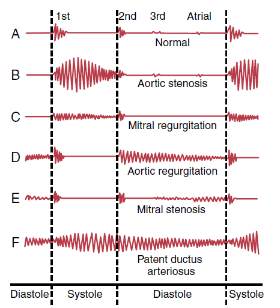

Guyton and Hall Textbook of Medical Physiology 摘要、笔记

## Chapter 1

* **Human Physiology**: explain the specific characteristics and mechanisms of the human body that make it a living being
* The basic living unit of the body is the **cell**. Each **tissue or organ** is an aggregate of many different cells held together by intercellular supporting structures (相同微环境).
* 人体60%是液体，包含：
    - Intracellular fluid：相对静止的；potassium, magnesium, phosphate ions
    - Extracellular fluid：持续流动的；sodium, chloride, bicarbonate ions, nutrients (oxygen, glucose, fatty acids, amino acids), waste products (carbon dioxide, wastes to kidneys....)
        * Interstitial fluid
        * Circulatory system：血液、淋巴液系统
* **Homeostasis**: maintenance of nearly constant conditions in the internal
environment (extracellular fluid)
* **Disease**: A disruption to homeostasis；Extreme dysfunction leads to death; moderate dysfunction leads to sickness
* 代偿：身体为了回归稳态所尝试的努力；有时为了某个tissue的稳态可能会打破另一个地方的稳态，因此有时难以区分primary cause与代偿反应
* 获取nutrients
    - Respiratory System：oxygen
    - Gastrointestinal Tract：carbohydrates, fatty acids, amino acids
    - Liver and Other Organs That Perform Primarily Metabolic Functions：分泌酶、储存 
    - Musculoskeletal System：获取食物
* 排出waste products
    - Lungs：Carbon Dioxide
    - Kidneys：血液中大部分wastes
    - Gastrointestinal Tract：Undigested materials
    - Liver：drugs and chemicals
* 身体机能的调控系统
    - Nervous System：sensory input portion + central nervous system (or integrative portion) + motor output portion
    - Hormone Systems：transported in the extracellular fluid to other parts of the body to help regulate cellular function
* Control Systems
    - Negative Feedback Loop：超出正常范围会有抑制机制；维持稳态
    - Positive Feedback Loop：其提升会刺激进一步提升；(e.g. 受伤召唤凝血因子、Childbirth、nerve signals)；受Negative Feedback抑制、防止升级至危险状态
* Adaptive Control：大脑发送前馈信号控制peripheral parts进行动作，即，信号传递至外围部位后，活动部位返回sensory nerve signals，大脑会依据状况修正后续动作

  

## Chapter 2 (TBA)
## Chapter 3 (TBA)
## Chapter 4 (TBA)
## Chapter 5 (TBA)
## Chapter 6 (TBA)
## Chapter 7 (TBA)
## Chapter 8 (TBA)
## Chapter 9 (TBA)
### Heart Anatomy
  
肌肉纤维由 Intercalated discs 互相连通，传递 ion signals 以保持节律。

## Chapter 10 (TBA)
## Chapter 11 (TBA)
## Chapter 12 (TBA)
## Chapter 13 (TBA)
## Chapter 14 (TBA)
## Chapter 15 (TBA)
## Chapter 16 (TBA)
## Chapter 17 (TBA)
## Chapter 18 (TBA)
## Chapter 19 (TBA)
## Chapter 20 (TBA)
## Chapter 21 (TBA)
## Chapter 22 (TBA)
## Chapter 23
### Heart Sounds
Heart valves 闭合时会产生声音，正常心脏会有1st、2nd心音，听诊器中 “lub, dub, lub, dub”

| Heart Sounds | 说明 | 其它 |
| -- | -- | -- |
| 1st | ventricles 收缩使血液回流至 A-V valves, 随后 A-V valves 闭合-->向atria紧绷-->将血液反弹回 ventricles | (tricuspid and mitral valves) |
| 2nd | semilunar valves  闭合时血液回流至动脉中 | (aortic and pulmonary valves) |
| 3rd | 猜测因 atria 向ventricles 注入血液过快而在 ventricles 中产生湍流 | 儿童、运动员中正常有此音，systolic heart failure 的老人亦有此音 |
| 4rd | 因 ventricular wall compliance 降低、ventricular filling 阻力增加，atrial 收缩以强制向 ventricles 灌注 | 左心室肥厚者有此音；频率<20 cycles/sec 故而听诊器听不见 |

鉴于心脏杂音与可听阈值，听诊器可听见的频率在 40~520 cycles/sec：  

### Phonocardiograms
Heart valves 病变可以导致心音变化：  

* Rheumatic fever：Autoimmune 使 valves 渗漏/粘连 (C/E)，通常因 streptococcal toxin 引起
* 主动脉瓣狭窄：或因衰老导致主动脉瓣肥大 (B)

| - | - | 说明 | 其它 | 
| -- | -- | -- | -- | 
| A | 正常心脏 | -- | -- | 
| B | 主动脉瓣狭窄 | 血液从 left ventricle 泵出至主动脉时发生阻塞 | -- | 
| C | 二尖瓣返流 | 血液从 left ventricle 渗漏流回 left atrium | -- | 
| D | 主动脉瓣返流 | 血液从主动脉渗漏流回 left ventricle | -- | 
| E | 二尖瓣狭窄 | left atrium 流向 left ventricle 的单向阀门打开不完全  | left atrium / Pulmonary artery 高压，可能导致肺水肿 | 
| F | 动脉导管未闭 | 主动脉和肺动脉之间存在异常通道，发生分流 | Ductus arteriosus 应在出生后4-5天闭合 | 

**B/D情况都使 net stroke volume output 减小，因而导致：**

* 左心室肥厚（代偿）；若最终左心室衰竭无法泵出血液，压力传导至左心房中，进一步传导导致肺动脉高压
* Increase in blood volume （kidney对血流减小的反应）
* Increase in red blood cell mass （tissue轻微的缺氧）

**TETRALOGY OF FALLOT (法洛四联症):**室间隔缺损、肺动脉狭窄 --> 持续缺氧状态

* 左右心室无间隔，导致动、静脉血液混合
* 由于肺动脉狭窄，大部分血液绕过肺部、直接进入主动脉
* 右心室原先对接肺动脉，此时也直面主动脉的高压，代偿下右心室增大

## Chapter 24 (TBA)
## Chapter 25 (TBA)
## Chapter 26 (TBA)
## Chapter 27 (TBA)
## Chapter 28 (TBA)
## Chapter 29 (TBA)
## Chapter 30 (TBA)
## Chapter 31 (TBA)
## Chapter 32 (TBA)
## Chapter 33 (TBA)
## Chapter 34 (TBA)
## Chapter 35 (TBA)
## Chapter 36 (TBA)
## Chapter 37 (TBA)
## Chapter 38 (TBA)
## Chapter 39 (TBA)
## Chapter 40 (TBA)
## Chapter 41 (TBA)
## Chapter 42 (TBA)
## Chapter 43 (TBA)
## Chapter 44 (TBA)
## Chapter 45 (TBA)
## Chapter 46 (TBA)
## Chapter 47 (TBA)
## Chapter 48 (TBA)
## Chapter 49 (TBA)
## Chapter 50 (TBA)
## Chapter 51 (TBA)
## Chapter 52 (TBA)
## Chapter 53 (TBA)
## Chapter 54 (TBA)
## Chapter 55 (TBA)
## Chapter 56 (TBA)
## Chapter 57 (TBA)
## Chapter 58 (TBA)
## Chapter 59 (TBA)
## Chapter 60 (TBA)
## Chapter 61 (TBA)
## Chapter 62 (TBA)
## Chapter 63 (TBA)
## Chapter 64 (TBA)
## Chapter 65 (TBA)
## Chapter 66 (TBA)
## Chapter 67 (TBA)
## Chapter 68 (TBA)
## Chapter 69 (TBA)
## Chapter 70 (TBA)
## Chapter 71 (TBA)
## Chapter 72 (TBA)
## Chapter 73 (TBA)
## Chapter 74 (TBA)
## Chapter 75 (TBA)
## Chapter 76 (TBA)
## Chapter 77 (TBA)
## Chapter 78 (TBA)
## Chapter 79 (TBA)
## Chapter 80 (TBA)
## Chapter 81 (TBA)
## Chapter 82 (TBA)
## Chapter 83 (TBA)
## Chapter 84 (TBA)
## Chapter 85 (TBA)

