

Guyton and Hall Textbook of Medical Physiology 摘要、笔记

## Chapter 1

* **Human Physiology**: explain the specific characteristics and mechanisms of the human body that make it a living being
* The basic living unit of the body is the **cell**. Each **tissue or organ** is an aggregate of many different cells held together by intercellular supporting structures (相同微环境).
* 人体60%是液体，包含：
    - Intracellular fluid：相对静止的；potassium, magnesium, phosphate ions
    - Extracellular fluid：持续流动的；sodium, chloride, bicarbonate ions, nutrients (oxygen, glucose, fatty acids, amino acids), waste products (carbon dioxide, wastes to kidneys....)
        * Interstitial fluid
        * Circulatory system：血液、淋巴液系统
* **Homeostasis**: maintenance of nearly constant conditions in the internal
environment (extracellular fluid)
* **Disease**: A disruption to homeostasis；Extreme dysfunction leads to death; moderate dysfunction leads to sickness
* 代偿：身体为了回归稳态所尝试的努力；有时为了某个tissue的稳态可能会打破另一个地方的稳态，因此有时难以区分primary cause与代偿反应
* 获取nutrients
    - Respiratory System：oxygen
    - Gastrointestinal Tract：carbohydrates, fatty acids, amino acids
    - Liver and Other Organs That Perform Primarily Metabolic Functions：分泌酶、储存 
    - Musculoskeletal System：获取食物
* 排出waste products
    - Lungs：Carbon Dioxide
    - Kidneys：血液中大部分wastes
    - Gastrointestinal Tract：Undigested materials
    - Liver：drugs and chemicals
* 身体机能的调控系统
    - Nervous System：sensory input portion + central nervous system (or integrative portion) + motor output portion
    - Hormone Systems：transported in the extracellular fluid to other parts of the body to help regulate cellular function
* Control Systems
    - Negative Feedback Loop：超出正常范围会有抑制机制；维持稳态
    - Positive Feedback Loop：其提升会刺激进一步提升；(e.g. 受伤召唤凝血因子、Childbirth、nerve signals)；受Negative Feedback抑制、防止升级至危险状态
* Adaptive Control：大脑发送前馈信号控制peripheral parts进行动作，即，信号传递至外围部位后，活动部位返回sensory nerve signals，大脑会依据状况修正后续动作

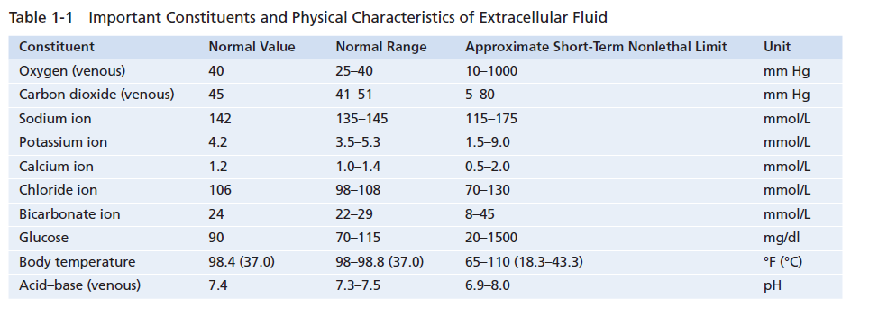  

## Chapter 2
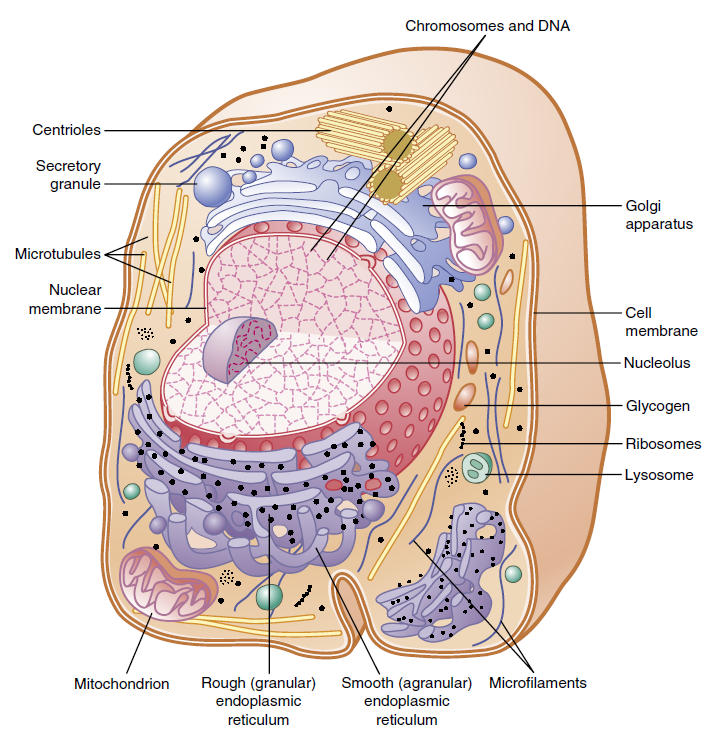    

* Protoplasm
    - water: 占70%~85%
    - electrolytes: potassium, magnesium, phosphate, sulfate, bicarbonate, and sodium, chloride, and calcium
    - proteins: structural, functional
    - lipids: phospholipids, cholesterol
    - carbohydrates: 提供能量或合成glycoprotein
* Cell Membrane：双重磷脂     
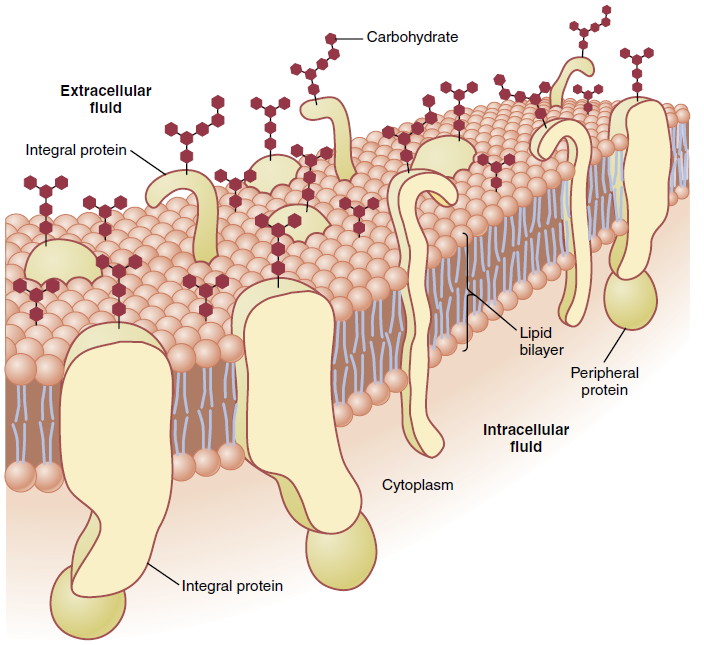
* Endoplasmic Reticulum：Rough ER 合成蛋白，Smooth ER 合成 lipids   
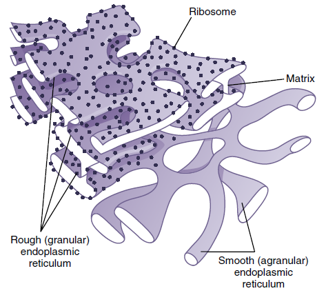
* Golgi apparatus：接收ER生成物，生成碳水化合物，下一步可形成 Lysosomes 等分泌小泡   
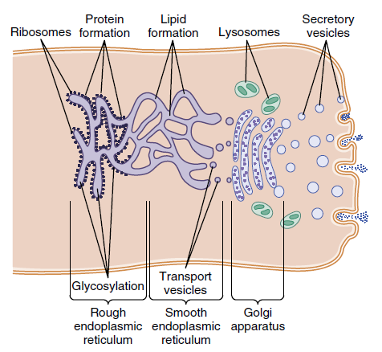
* Mitochondria：数量不定，生成ATP   
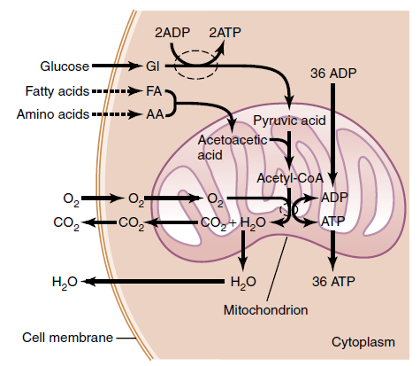
* Cytoskeleton：Filament and Tubular Structures   
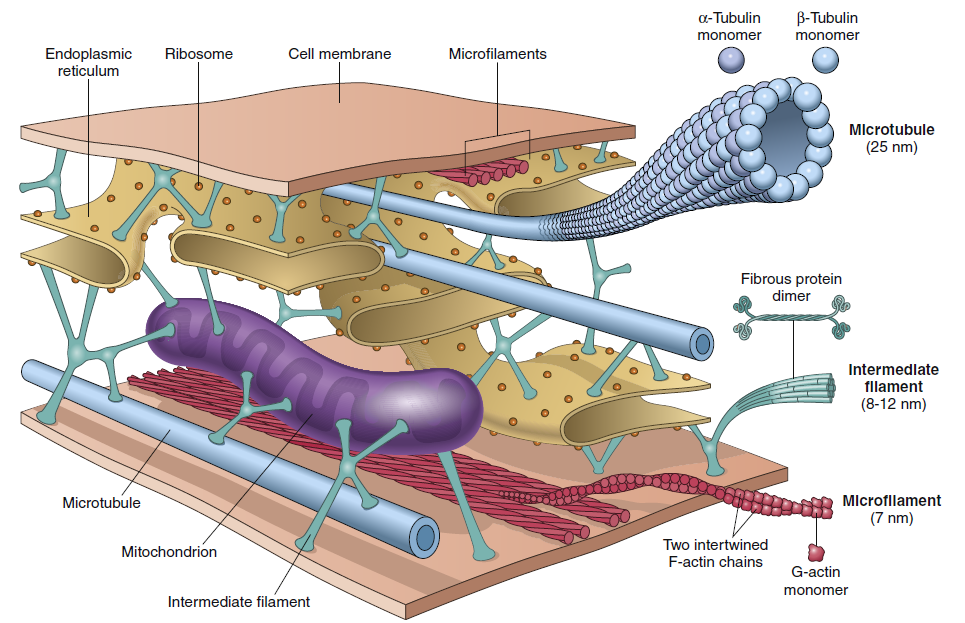
* Nucleus：遗传物质   
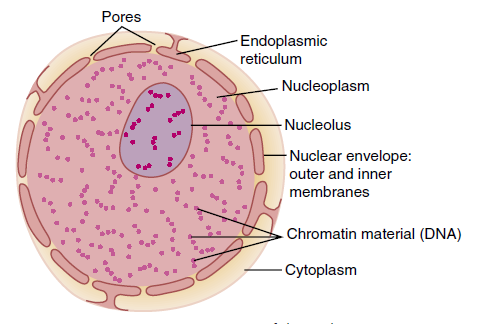
* Endocytosis（胞吞）：Pinocytosis（胞饮），Phagocytosis（胞吃/吞噬）
* Autophagy（自噬）：移除老化organelles
* 细胞移动：
    - Ameboid motion：细胞一端伸出假足将自己固定到新的区域，向这个方向形变（后方发生吞噬、于前方Exocytosis，则成功挪动这一部分细胞膜）
    - Cillary movement 纤毛运动，需要ATP与appropriate ionic conditions；e.g. 呼吸系统分泌粘液

## Chapter 3

<!-- 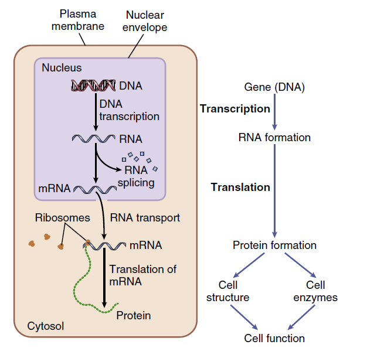   -->
<!--     -->
<!--     -->

* RNAs
    - Small nuclear RNA (**snRNA**) directs the splicing of pre-mRNA
to form mRNA（去除introns）
    - **mRNA** 指导合成蛋白（消耗ATP）：Transfer RNA (**tRNA**) 运输AA，Ribosomal RNA (**rRNA**) 提供核糖体结构框架
    - MicroRNAs (**miRNAs**) 与mRNA结合(blocking)，调节转录和翻译
* Polyribosomes：由多个核糖体串连在一条mRNA分子上高效地进行肽链的合成
* ATCG化学式  
    
* Codon Table 详见 [NCBI-The Genetic Codes](https://www.ncbi.nlm.nih.gov/Taxonomy/Utils/wprintgc.cgi)，同一种氨基酸具有两个或更多个密码子（简并密码子）  
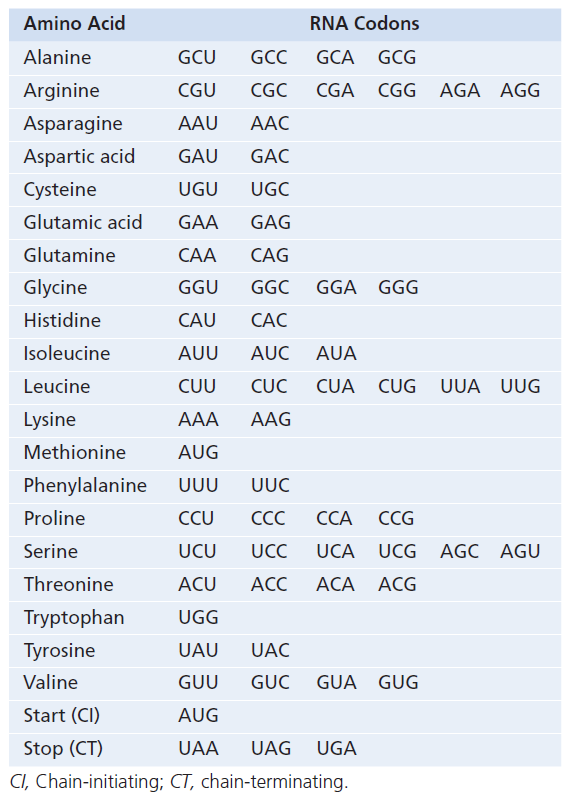   
* Gene transcription in eukaryotic cells  
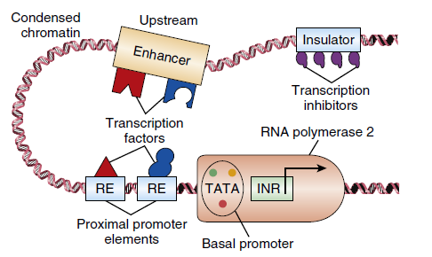  
* 细胞通过 Mitosis 进行复制  
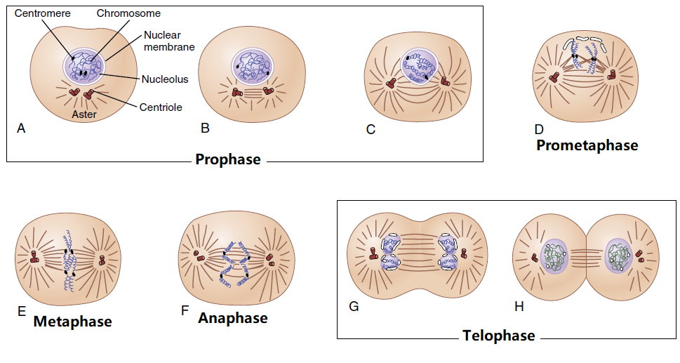  
    - Interphase：interval between mitosis，其占细胞95%以上生命周期。DNA在分裂开始前约10h开始复制，并且需要通过 Proofreading (是否与模板一致) 与 DNA Repair 以降低错误率。不过，假定人类30年一代，预计依旧会累计10个以上的Mutation 给下一代
    - Prophase 前期：纺锤体形成，染色体被压缩
    - Prometaphase 前中期：核膜消失，microtubule aster 结合着丝粒，将成对的chromatids 向两极施加拉力
    - Metaphase 中期：asters 相互挤压、形成纺锤体，chromatids 于赤道面排列
    - Anaphase 后期：chromatids 被拉开
    - Telophase 末期：两边各自形成新的核膜，microfilaments 形成 contractile ring 将细胞分开
    - Mitosis的调节：Growth Factors，细胞密度（相互挤压、环境中 cell's own secretion 的浓度） 
* 细胞寿命：每次复制端粒（Telomeres）会变短，骨髓中的端粒酶可修复端粒长度
* Apoptosis：细胞程序性死亡：shrink，condense，disassemble cytoskeleton，在表白加上标记、以便免疫细胞及时清除
* Necrosis：细胞被动死亡，内容物释放到微环境
* Oncogene 一般是促进细胞生长的基因、缺乏抑制，因此 Cancer 中细胞无度生长、与正常细胞争夺养分；Cancer 可能来源：Ionizing radiation，Chemical substances，Physical irritants 如持续磨损，家族遗传，Certain types of oncoviruses

## Chapter 4

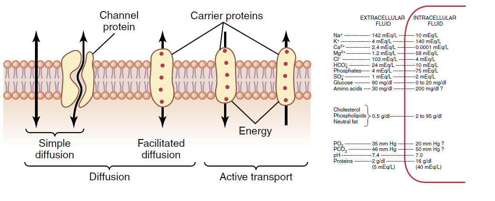   

* Diffusion 由物质浓度、电离浓度综合驱动
    - 脂类可通过细胞膜扩散；水溶性小分子可通过 protein “pores” (aquaporins) 渗透，比水大20%，渗透效率降低1000倍
    - Protein channels 有两个特性：
        1. selectively permeable（e.g. K离子专用通道）
        2. electrical signals / chemicals 控制 gates 开合（voltage-gated / ligand-gated）
    - 受限于Carrier protein 的形变速度，Facilitated diffusion 有速度上限（上图所示Vmax）
    - Nernst equation：EMF (in millivolts) = ±61*log(C1/C2)；EMF 指细胞膜内外 voltage；C1、C2 指细胞膜内外待扩散物质的浓度；此式满足则达成扩散平衡
    - Osmosis：水分子也可以渗透通过细胞膜；由渗透压驱动
        * 1 osmole = 1mol osmotically active solute 存在于1L溶剂中；e.g. 1mol某物质溶于水形成 2mol ions，则 2 osmoles；若不分解成ions，则依旧 1 osmole
        * 区别：Osmolality（osmoles per kilogram），Osmolarity（osmoles per liter of solution）

* Active transport 可逆浓度梯度转运物质，由载体蛋白消耗能量驱动
    - Primary：消耗ATP运输某种物质；e.g. Na-K Pump 维持平衡，Ca Pump 储钙于内质网中，H Pump 胃酸生成   
    
    - Secondary：形成浓度梯度/...，以运输另一种物质
        1. Co-Transport   
            
        2. Counter-transport   
        

## Chapter 5

**本章节关注 Nerve Cells**；Cardiac Cells 也有电位（Ca，此处不述）

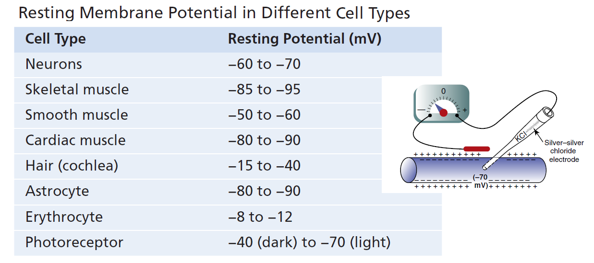  

* 静息状态时达成平衡，Nerve fiber 细胞内部含有大量K，细胞外部含有大量Na。因为多种离子的平衡电位不同 (K:–94 mV,Na:+61mV)，**静息电位**可用 Goldman equation 计算，其值为负，因：
    - Na-K pump: 泵出3 Na+, 泵入2 K+
    - K "leak" channels: 渗出 K+
* 将电位从−70mV提升至10mV的**测试**中，可以发现Na、K 通道的反应速度不同   
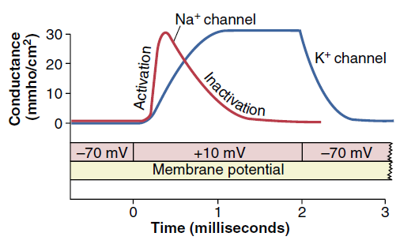
* 标准动作电位示意图（左）；带节律的动作电位（中）调节心脏节律，Hyperpolarization 与 K 流出有关；Plateau（右）延长了去极化的时间（与Ca通道有关），使心脏肌肉的收缩时间相同    

* **动作电位**激发后 Na 涌入细胞，到达电位顶点后通道迅速关闭；随后 K 加速流出细胞，到达平衡电位后通道关闭     

* 动作电位可沿着 conductive fiber 向两侧传导；也可 Saltatory conduction （跳跃式传导，更快）：Schwann cell 包裹 nerve fiber，间隔着留下 Node of Ranvier 以供跳跃式传导       

* 当前一个动作电位未结束时，后一个电位不会被激活，因为激活后不久Na通道就会关闭，直至再次达到静息电位前都不能再激活；下图（B）无法被激活，因为此时正处于 absolute refractory period (1/2500 second for nerve fibers)；下图（A）因为impulse未达到动作电位而未能激活     
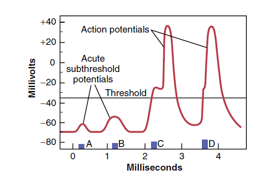
* 细胞外液钙离子浓度高会降低细胞膜对钠离子的通透性，因此 Ca 是 stabilizer
* 一些麻醉药提高Na通道的激活难度（提高 excitability threshold）

## Chapter 6 (TBA)
## Chapter 7 (TBA)
## Chapter 8 (TBA)
## Chapter 9 (TBA)

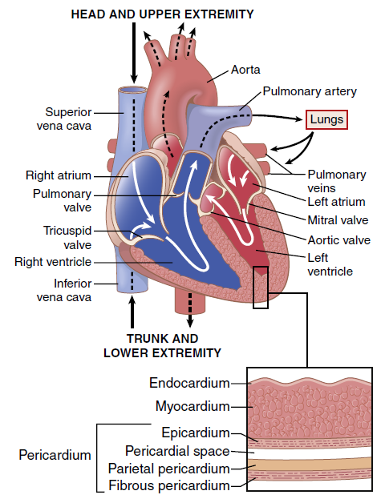  
肌肉纤维由 Intercalated discs 互相连通，传递 ion signals 以保持节律。

## Chapter 10 (TBA)
## Chapter 11 (TBA)
## Chapter 12 (TBA)
## Chapter 13 (TBA)
## Chapter 14 (TBA)
## Chapter 15 (TBA)
## Chapter 16 (TBA)
## Chapter 17 (TBA)
## Chapter 18 (TBA)
## Chapter 19 (TBA)
## Chapter 20 (TBA)
## Chapter 21 (TBA)
## Chapter 22 (TBA)
## Chapter 23
### Heart Sounds
Heart valves 闭合时会产生声音，正常心脏会有1st、2nd心音，听诊器中 “lub, dub, lub, dub”

| Heart Sounds | 说明 | 其它 |
| -- | -- | -- |
| 1st | ventricles 收缩使血液回流至 A-V valves, 随后 A-V valves 闭合-->向atria紧绷-->将血液反弹回 ventricles | (tricuspid and mitral valves) |
| 2nd | semilunar valves  闭合时血液回流至动脉中 | (aortic and pulmonary valves) |
| 3rd | 猜测因 atria 向ventricles 注入血液过快而在 ventricles 中产生湍流 | 儿童、运动员中正常有此音，systolic heart failure 的老人亦有此音 |
| 4rd | 因 ventricular wall compliance 降低、ventricular filling 阻力增加，atrial 收缩以强制向 ventricles 灌注 | 左心室肥厚者有此音；频率<20 cycles/sec 故而听诊器听不见 |

鉴于心脏杂音与可听阈值，听诊器可听见的频率在 40~520 cycles/sec：  
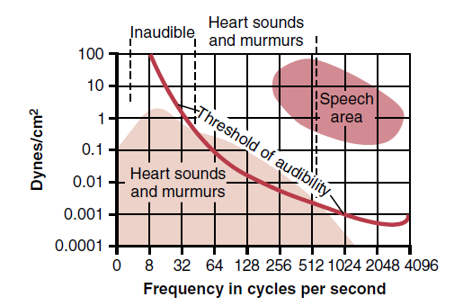

### Phonocardiograms
Heart valves 病变可以导致心音变化：  

* Rheumatic fever：Autoimmune 使 valves 渗漏/粘连 (C/E)，通常因 streptococcal toxin 引起
* 主动脉瓣狭窄：或因衰老导致主动脉瓣肥大 (B)

| - | - | 说明 | 其它 | 
| -- | -- | -- | -- | 
| A | 正常心脏 | -- | -- | 
| B | 主动脉瓣狭窄 | 血液从 left ventricle 泵出至主动脉时发生阻塞 | -- | 
| C | 二尖瓣返流 | 血液从 left ventricle 渗漏流回 left atrium | -- | 
| D | 主动脉瓣返流 | 血液从主动脉渗漏流回 left ventricle | -- | 
| E | 二尖瓣狭窄 | left atrium 流向 left ventricle 的单向阀门打开不完全  | left atrium / Pulmonary artery 高压，可能导致肺水肿 | 
| F | 动脉导管未闭 | 主动脉和肺动脉之间存在异常通道，发生分流 | Ductus arteriosus 应在出生后4-5天闭合 | 

**B/D情况都使 net stroke volume output 减小，因而导致：**

* 左心室肥厚（代偿）；若最终左心室衰竭无法泵出血液，压力传导至左心房中，进一步传导导致肺动脉高压
* Increase in blood volume （kidney对血流减小的反应）
* Increase in red blood cell mass （tissue轻微的缺氧）

**TETRALOGY OF FALLOT (法洛四联症):**室间隔缺损、肺动脉狭窄 --> 持续缺氧状态

* 左右心室无间隔，导致动、静脉血液混合
* 由于肺动脉狭窄，大部分血液绕过肺部、直接进入主动脉
* 右心室原先对接肺动脉，此时也直面主动脉的高压，代偿下右心室增大

## Chapter 24 (TBA)
## Chapter 25 (TBA)
## Chapter 26 (TBA)
## Chapter 27 (TBA)
## Chapter 28 (TBA)
## Chapter 29 (TBA)
## Chapter 30 (TBA)
## Chapter 31 (TBA)
## Chapter 32 (TBA)
## Chapter 33 (TBA)
## Chapter 34 (TBA)
## Chapter 35 (TBA)
## Chapter 36 (TBA)
## Chapter 37 (TBA)
## Chapter 38 (TBA)
## Chapter 39 (TBA)
## Chapter 40 (TBA)
## Chapter 41 (TBA)
## Chapter 42 (TBA)
## Chapter 43 (TBA)
## Chapter 44 (TBA)
## Chapter 45 (TBA)
## Chapter 46 (TBA)
## Chapter 47 (TBA)
## Chapter 48 (TBA)
## Chapter 49 (TBA)
## Chapter 50 (TBA)
## Chapter 51 (TBA)
## Chapter 52 (TBA)
## Chapter 53 (TBA)
## Chapter 54 (TBA)
## Chapter 55 (TBA)
## Chapter 56 (TBA)
## Chapter 57 (TBA)
## Chapter 58 (TBA)
## Chapter 59 (TBA)
## Chapter 60 (TBA)
## Chapter 61 (TBA)
## Chapter 62 (TBA)
## Chapter 63 (TBA)
## Chapter 64 (TBA)
## Chapter 65 (TBA)
## Chapter 66 (TBA)
## Chapter 67 (TBA)
## Chapter 68 (TBA)
## Chapter 69 (TBA)
## Chapter 70 (TBA)
## Chapter 71 (TBA)
## Chapter 72 (TBA)
## Chapter 73 (TBA)
## Chapter 74 (TBA)
## Chapter 75 (TBA)
## Chapter 76 (TBA)
## Chapter 77 (TBA)
## Chapter 78 (TBA)
## Chapter 79 (TBA)
## Chapter 80 (TBA)
## Chapter 81 (TBA)
## Chapter 82 (TBA)
## Chapter 83 (TBA)
## Chapter 84 (TBA)
## Chapter 85 (TBA)

