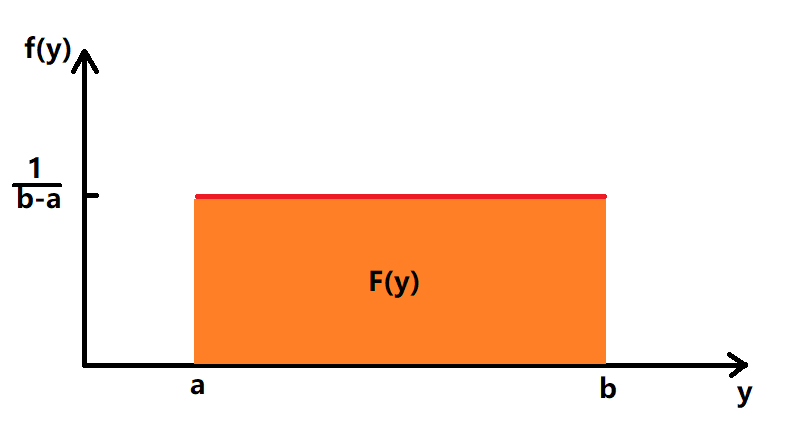
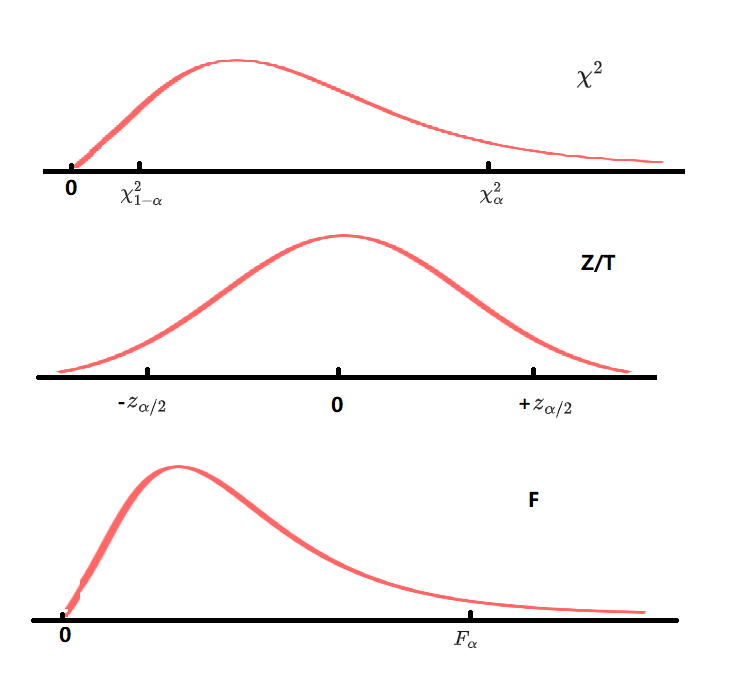
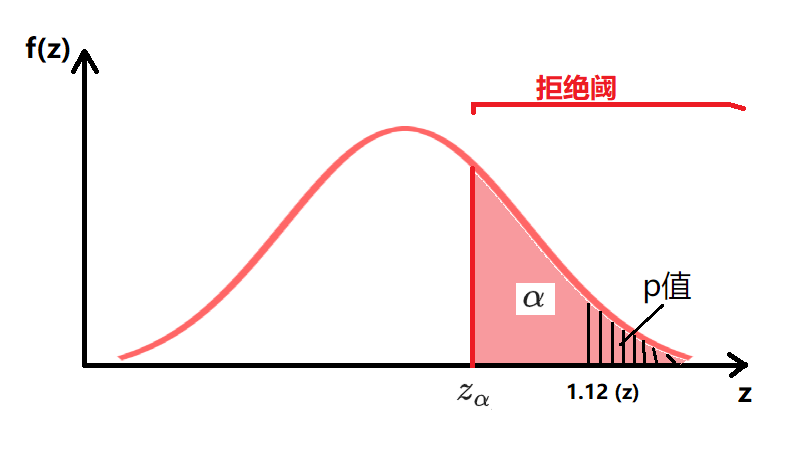
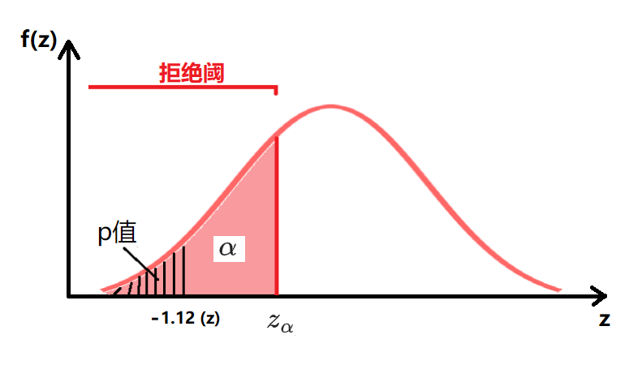
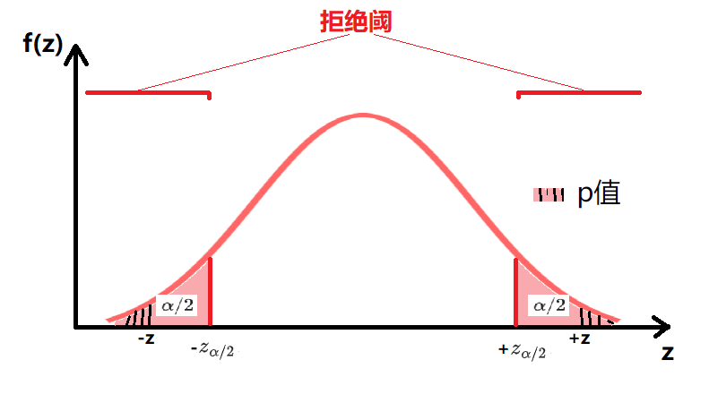

教材：《统计学（原书第五版）》

 

## 描述性统计

| -- | 样本 | 总体 | -- |
| -- | -- | -- | -- |
| 列说明 | 从总体N中取n测量值 | 有n个测量值的有限总体 | -- |
| 均值 | $$\overline{y}=\frac{\sum\limits_{i=1}^{n}y_i}{n}$$ | $\mu$ | -- |
| 方差 | $$s^2=\frac{\sum\limits_{i=1}^{n}(y_i-\overline{y})^2}{n-1}$$ | $$\sigma^2=\frac{\sum\limits_{i=1}^{n}(y_i-\mu)^2}{n}$$ | **方差(Variance)**：$(y_i-均值)$，衡量离散程度   **均方误差(MSE)**：$(y_i-真实值)$，偏离真实值的程度 |
| 标准差 | $$s=\sqrt{s^2}$$ | $$\sigma=\sqrt{\sigma^2}$$ | -- |
| z score | $$z=\frac{y-\overline{y}}{s}$$ | $$z=\frac{y-\mu}{\sigma}$$ | -- |

* 经验法则：68% 观测值位于 $\overline{y}\pm s$，95% 位于 $\overline{y}\pm 2s$，几乎所有位于 $\overline{y}\pm 3s$
* 切比雪夫法则：$(1-\frac{1}{k^2})$观测值位于k个标准差范围内($\overline{y}\pm ks$)
* z score：以标准差为单位，观测值y相对于均值的位置
* IQR=上四分位-下四分位，box plot 内篱笆为 1.5 IQR 范围内，外篱笆为 3 IQR；超出外篱笆者很可能是异常值

## 概率
* **概率**：给定模型参数，结果是否合理：均匀硬币，拋20次得15次正面的概率
* **似然**：给定观测值，描述模型参数是否合理：拋20次得15次正面，硬币均匀的可能性
* **简单事件**是一个试验的基本结果，不能被分解为更简单的结果；试验的**样本空间**是所有可能的简单事件的集合; 
    - e.g. 对于 0-1-2 随机选择，0是一个简单事件，{0,1,2}是样本空间
    - 简单事件的概率在 [0,1] 之间，且样本空间中所有简单事件的概率和等于1
    - **事件A**的概率等于事件A中所包含的简单事件的概率之和；e.g. A：{观测到1或2}
* 事件A的**补**$A^c$指所有不在A中的简单事件组成的事件， $P(A)+P(A^c)= 1$    
* **复合事件**可视为两个或更多事件的组合
    - A或B $= P(A \cup B)$
    - A和B同时发生 $= P(A \cap B) = P(A,B)$，如果A与B**互斥**（不能同时发生），$P(A,B)=0$
    - $P(A \cup B) = P(A) + P(B) - P(A,B)$
* **条件概率** $P(A|B)$：Given B 时，事件A发生的概率
    - $P(A,B) = P(A|B)P(B) = P(B|A)P(A)$
* 贝叶斯法则：通过已知的概率计算未知条件概率
     
    - 先验概率：不依靠观测数据的概率分布
    - 后验概率：基于观测数据得到的条件概率

* 从N中一次取n的不同**排列**个数：$A_N^n=N(N-1)...(N-n+1)=\frac{N!}{(N-n)!}$
* 从N中一次取n的不同**组合**个数：$C_N^n=\binom{N}{n}=\frac{N!}{n!(N-n)!}$
* 从N中取k个集合大小为$n_i$的集合，不同的分割方法个数：$A=\frac{N!}{n_1!n_2!...n_k!}$

* N中每个样本都有相等的被选中概率，如是被选出的n个样本可被称为**随机样本**
* $P(A|B)=P(A)$，B不影响A的概率，则A、B相互**独立**

## 随机变量

### 矩和矩母函数

如果随机变量的各阶矩都存在，可用来**证明两个随机变量具有相同的概率分布**

* 随机变量Y的**k阶原点矩** $\mu'_k=E(Y^k)$,(k=1,2,...)
* 随机变量Y的**k阶中心矩** $\mu_k=E[(Y-\mu)^k$]
* 离散随机变量Y的矩母函数:  
$m(t)=E(e^{tY})$  
$\hspace{2.4em}=\sum{e^{ty}p(y)}$  
$\hspace{2.4em}=\sum[1+ty+\frac{(ty)^2}{2!}+\frac{(ty)^3}{3!}+...]p(y)$  
$\hspace{2.4em}=\sum[p(y)+typ(y)+\frac{(ty)^2}{2!}p(y)+\frac{(ty)^3}{3!}p(y)+...]$  
$\hspace{2.4em}=\sum p(y)+\sum typ(y)+\sum \frac{(ty)^2}{2!}p(y)+\sum \frac{(ty)^3}{3!}p(y)+...$  
$\hspace{2.4em}=\sum p(y)+t\sum yp(y)+ \frac{t^2}{2!}\sum y^2p(y)+\frac{t^3}{3!}\sum y^3p(y)+...$  
$\hspace{2.4em}=1 + t \mu'_1+ \frac{t^2}{2!} \mu'_2+\frac{t^3}{3!} \mu'_3+...$  
$\hspace{2.4em}=1 + \mu'_1 t + \frac{\mu'_2}{2!}t^2 +\frac{\mu'_3}{3!} t^3+...$    
* 如果无法轻易展开$m(t)$，则可令t=0、对$m(t)$关于t进行k阶求导，**求得k阶原点矩**
    - 一阶求导$\frac{dm(t)}{dt}=(0+\mu'_1+ \frac{2t}{2!} \mu'_2 + ...)$，t=0 时 $\frac{dm(t)}{dt}=\mu'_1$
    - 二阶求导$\frac{d^2m(t)}{dt^2}=(0+0+ \mu'_2 + ...)$，t=0 时 $\frac{d^2m(t)}{dt^2}=\mu'_2$
* 连续随机变量的矩母函数的定义方法及应用与离散随机变量一致，只是期望值牵涉到积分

### 离散分布
| -- | 说明 | $p(y)$ | $\mu$ | $\sigma^2$ | 矩母函数 $m(t)$ |
| -- | -- | -- | -- | -- | -- |
| 离散 | (一般) | Y 取值为 y 的概率 | $E(Y)=\sum{yp(y)}$ | $E[(Y-\mu)^2]=E(Y^2)-\mu^2$   $其中E(Y^2)=\sum{y^2p(y)}$ | $E(e^{tY})=\sum{e^{ty}p(y)}$ |
| 伯努利 | 成功概率p、失败概率q，累计成功$y$次(0/1) | $p(y)=p^yq^{1-y}$ | $p$ | $pq$ | $pe^t+q$ |
| 二项 | 一系列（n次）伯努利试验，累计成功$y$次(0-n) | $p(y)=\binom{n}{y}p^yq^{n-y}$ | $np$ | $npq$ | $(pe^t+q)^n$ |
| 多项 | $n=\sum\limits_{i=0}^{k}{y_i}$次独立试验，每次试验都有k个可能结果；$y_i$指出现结果i的试验数目 | $p(y_1,y_2,...,y_k)=$ $\frac{n!}{y_1!y_2!...y_k!}(p_1)^{y_1}(p_2)^{y_2}...(p_k)^{y_k}$ | $\mu_i=np_i$ | $\sigma_i^2=np_i(1-p_i)$ | -- |
| 负二项 | Y表示直至第r次成功时的试验次数（时间） | $p(y)=\binom{y-1}{r-1}p^rq^{y-r}$ | $\frac{r}{p}$ | $\frac{rq}{p^2}$ | $(\frac{pe^t}{1-(1-p)e^t})^r$ |
| 几何 | r=1时的负二项 |$p(y)=pq^{y-1}$ | $\frac{1}{p}$ | $\frac{q}{p^2}$ | $\frac{pe^t}{1-(1-p)e^t}$ |
| 超几何 | 集合N由r个S、(N-r)个F组成；**无放回**地随机抽取n个元素；Y表示n中S的个数 | $p(y)=\frac{\binom{r}{y}\binom{N-r}{n-y}}{\binom{N}{n}}$ | $\frac{nr}{N}$ | $\frac{r(N-r)n(N-n)}{N^2(N-1)}$ | -- |
| 泊松 | 1 unit内发生事件的次数Y(0,1,2,..)；已知 1 unit内平均会发生$\lambda$次事件；发生在每个unit内的事件数独立于其它unit中事件数 | $p(y)=\frac{\lambda^ye^{-\lambda}}{y!}$ | $\lambda$ | $\lambda$ | $e^{\lambda(e^t-1)}$ |

* 二项试验中使用了**有放回**抽样（放回集合后再开始下一次抽取），Y的概率分布近似于二项分布；超几何试验则使用了**无放回**抽样，当N很大时Y分布亦可近似于二项分布，但当N小(e.g. <20n)时希望利用更加精确的超几何分布
* 当（$np \ge 4, nq \ge 4$）时可满足 $\mu \pm 2\sigma \in (0,n)$，此时正态分布可用于近拟二项分布；详见：P196，二项概率正态近拟的连续性修正见P197

### 连续分布

* 随机变量Y的**累积分布函数**(Cumulative Distribution Func): $F(y)=P(Y \le y)$
* 随机变量Y的**概率密度函数**(Probability Density Func): $f(y)=\frac{dF(y)}{dy}$，即 
    - $P(a<Y<b)=\int_{a}^{b}f(y)dy=F(b)-F(a)$
    - $P(\infty)=\int_{-\infty}^{+\infty}f(y)dy=F(\infty)=1$
* $E[g(Y)]=\int_{-\infty}^{+\infty}g(y)f(y)dy$，$g(Y)$是Y的任意函数，例如：
    - $E(Y)=\int_{-\infty}^{+\infty}yf(y)dy$
    - $E(Y^2)=\int_{-\infty}^{+\infty}y^2f(y)dy$

* 使用**累积分布函数法**求$W$的密度函数$g(w)$：
    1. $G(w)=P(W \le w)$
    2. $g(w)=\frac{dG(w)}{dw}$

* 例一：假设已知**Y**的密度函数$f(y)$，求$W=Y^2$的密度函数$g(w)$：
    1. 因Y，W单调性一致，故而：$P(W \le w)=P(Y \le y)=G(w)=F(y)$
    2. $G(w)=F(y)=F(\sqrt{w})=\int_{-\infty}^{\sqrt{w}}f(y)dy$
    3. $g(w)=\frac{dG(w)}{dw}$
* 例二：假设已知**X,Y**的联合密度函数$f(x,y)$，使用**累积分布函数法**求$W=X+Y$的密度函数$g(w)$：P183

| -- |  说明 | 均值 | 方差 | 矩母函数 $m(t)$ |
| -- |  -- | -- | -- | -- |
| 均匀 | --- | $\frac{a+b}{2}$ | $\frac{(b-a)^2}{12}$ | $\frac{e^{tb}-e^{ta}}{t(b-a)}$ |
| 正态 | **正态性检验**：QQ plot，K-S test，S-W test | $\mu$ | $\sigma^2$ | $e^{\mu t + (t^2 \sigma ^2/2)}$ |
| $\Gamma$ | $\Gamma$型概率分布与寿命长度或等待时间有关（非负数） | $\alpha \beta$ | $\alpha \beta^2$ | $(1-\beta t)^{- \alpha}$ |
| 卡方 | $\Gamma$型：$\alpha=\nu/2,\beta=2$ | $\nu$ | $2\nu$ | $(1-2t)^{-\nu/2}$ |
| 指数 | $\Gamma$型：$\alpha=1$，若事件发生（e.g.到达服务器）服从单位时间平均发生$\frac{1}{\beta}$次的泊松概率分布，则任意一对相继发生事件之间的间隔$y$的$f(y)$将是均值为$\beta$的指数分布 | $\beta$ | $\beta^2$ | $(1-\beta t)^{-1}$ |
| 威布尔 | $\Gamma$型：一般用以描述设备、元件的寿命长度（失效时间） | $\beta^{1/\alpha}\Gamma(\frac{\alpha+1}{\alpha})$ | $\beta^{2/\alpha}[\Gamma(\frac{\alpha+2}{\alpha})-\Gamma^2(\frac{\alpha+1}{\alpha})]$ | $\beta^{t/\alpha}\Gamma(1+t/\alpha)$ |
| $\beta$ | $\Gamma$型：将y限制在[0,1]间 | $\frac{\alpha}{\alpha+\beta}$ | $\frac{\alpha \beta}{(\alpha+\beta)^2(\alpha+\beta+1)}$ | -- |

* 均匀概率分布  
$$ f(y)= \begin{cases} \frac{1}{b-a} \quad y \in [a,b]  \\\\ 0 \quad Otherwise \end{cases} $$

* 正态概率分布
$$f(y)=\frac{e^{-(y-\mu)^2/(2\sigma^2)}}{\sigma\sqrt{2 \pi}}   \quad y \in (-\infty，+\infty)$$
* $\Gamma$概率分布
$$ f(y)= \begin{cases} \frac{y^{\alpha-1}e^{-y/\beta}}{\beta^{\alpha}\Gamma(\alpha)} \quad \quad y \in [0,+\infty);\alpha>0;\beta>0 \\\\ 0 \quad Otherwise \end{cases} $$ 
$$\Gamma(\alpha)=\int_0^{\infty}y^{\alpha-1}e^{-y}dy$$
$$当\alpha是整数时, \Gamma(\alpha)=(\alpha-1)\Gamma(\alpha-1)=(\alpha-1)!$$
**参数意义**：$\beta$-尺度参数（类似$\sigma$，控制宽幅），$\alpha$-形状参数
* $\chi^2$卡方概率分布
$$ f(y)= \begin{cases} \frac{y^{(\nu/2)-1}e^{-y/2}}{2^{\nu/2}\Gamma(\nu/2)} \quad y \in [0,+\infty)  \\\\ 0 \quad Otherwise \end{cases} $$
**参数意义**：$\nu$-自由度
* 指数概率分布
$$f(y)=\frac{e^{-y/\beta}}{\beta} \quad y \in [0,+\infty)$$
* 威布尔概率分布
$$ f(y)= \begin{cases} \frac{\alpha}{\beta}y^{\alpha-1}e^{-y\alpha/\beta} \quad y \in [0,+\infty);\alpha>0;\beta>0  \\\\ 0 \quad Otherwise \end{cases} $$
优点：其$F(y)$显式存在，可用于求得威布尔曲线下的面积
* $\beta$概率分布
$$ f(y)= \begin{cases} \frac{y^{\alpha-1}(1-y)^{\beta-1}}{B(\alpha,\beta)} \quad y \in [0,1];\alpha>0;\beta>0  \\\\ 0 \quad Otherwise \end{cases} $$
$$B(\alpha,\beta)=\int_0^1y^{\alpha-1}(1-y)^{\beta-1}dy=\frac{\Gamma(\alpha)\Gamma(\beta)}{\Gamma(\alpha+\beta)}$$
不完全$\beta$函数：$\beta$密度函数的$F(y)$

### 二元概率分布

* **离散**随机变量$X$和$Y$的二元联合概率分布$p(x,y)$满足：$0 \le p(x,y) \le 1$ 且 $\sum\limits_y\sum\limits_xp(x,y)=1$
    - 边缘概率分布：$p_1(x)=\sum\limits_yp(x,y)$，$p_2(y)$同理
    - 条件概率分布：$p_1(x|y)=\frac{p(x,y)}{p_2(y)}$，$p_2(y|x)$同理
    - 设$g(X,Y)$是随机变量$X,Y$的函数，$E[g(X,Y)]=\sum\limits_y\sum\limits_xg(x,y)p(x,y)$
* **连续**随机变量$X$和$Y$的二元联合概率密度函数$f(x,y)$满足：$f(x,y) \geq 0$ 且 $\int_{-\infty}^{+\infty}\int_{-\infty}^{+\infty} f(x,y)dxdy=1$
    - 边缘密度函数：$f_1(x)=\int_{-\infty}^{+\infty}f(x,y)dy$，$f_2(y
    )$同理
    - 条件密度函数：$f_1(x|y)=\frac{f(x,y)}{f_2(y)}$，$f_2(y|x)$同理
    - 设$g(X,Y)$是随机变量$X,Y$的函数，$E[g(X,Y)]=\int_{-\infty}^{+\infty}\int_{-\infty}^{+\infty} g(x,y)f(x,y)dxdy$

* **协方差** $Cov(X,Y)=E[(X-\mu_x)(Y-\mu_y)]=E(XY)-\mu_x\mu_y$
* **相关系数** $\rho=\frac{Cov(X,Y)}{\sigma_x\sigma_y} \in [-1,1]$

* $X,Y$相互**独立**：$p(x,y)=p_1(x)p_2(y)$时（$f(x,y)$同理）；此时$Cov(X,Y)=0$

### 抽样分布

* **蒙特卡罗**为了近似**某个统计量**的抽样分布，不断利用随机数发生器生成这个统计量的观测值：e.g. 随机取样10000次（每次n个数），计算每一次的**均值**，得到均值的抽样分布

| 观测值 | 统计量 | 抽样分布 | 均值E | 标准误V |
| -- | -- | -- | -- | -- |
| -- | -- | 统计量的**抽样分布**是重复抽样时这个统计量的理论概率分布 | **抽样分布的均值E** | 统计量的标准误是**抽样分布的标准差V** |
| 有n个观测值 $y_1,y_2,y_3,...,y_n$，来自于有限均值$\mu$、有限标准差$\sigma$的总体（总体不一定是正态分布） | n个观测值的均值 $\overline{Y}$ | 当n足够大时，$\overline{Y}$的抽样分布可由正态密度函数近似（**中心极限定理**） | $E(\overline{Y})=\mu$ | $V(\overline{Y})=\frac{\sigma}{\sqrt{n}}$ |
| （同上） | n个观测值的和 $Y_{sum}=\sum{(y_1,y_2,y_3,...,y_n)}$ | 当n足够大时，$Y_{sum}$的抽样分布可由正态密度函数近似 | $E(Y_{sum})=n\mu$ | $V(Y_{sum})=n\sigma^2$ |

有$n$个观测值来自参数为$(\mu,\sigma)$的单个**正态分布**:

| 统计量 | 抽样分布 | 说明 |
| -- | -- | -- |
| $\chi^2=\frac{(n-1)s^2}{\sigma^2}$ | 自由度为 $\nu=(n-1)$ 的**卡方分布** | $s^2$表示样本方差 |
| $T=\frac{Z}{\sqrt{\chi^2/\nu}}=\frac{\overline{Y}-\mu}{S/\sqrt{n}}$ | 自由度为$\nu$的学生**T分布** | $Z$是标准正态随机变量，$\chi^2$是自由度为 $\nu$ 的的卡方随机变量；$Z$与$\chi^2$独立；$\overline{Y}$与$s^2$独立 |
| $Z=\frac{\overline{Y}-\mu}{\sigma/\sqrt{n}}$ | **Z分布**近似标准正态分布 | 估计置信区间时，一般大样本用Z分布，小样本(n<30,且来自正态总体)用T分布 |

有$n1,n2$个观测值分别来自参数为$(\mu_1,\sigma_1),(\mu_2,\sigma_2)$的两个**正态分布**:

| 统计量 | 抽样分布 | 说明 | 包含假设 |
| -- | -- | -- | -- |
| $\chi_{\nu_1}^{2}+\chi_{\nu_2}^{2}$ | 自由度为 $\nu_1+\nu_2$ 的**卡方**分布 | -- | -- |
| $\chi^2=\frac{(n_1+n_2-2)S_p^2}{\sigma^2}$ | 自由度为 $n_1+n_2-2$ 的**卡方**分布 | $S_p^2=\frac{(n_1-1)S_1^2+(n_2-1)S_2^2}{n_1+n_2-2}$ | $\sigma_1^2=\sigma_2^2=\sigma^2$ |
| $T=\frac{(\overline{Y_1}-\overline{Y_2})-(\mu_1-\mu_2)}{\sqrt{S_p^2(\frac{1}{n_1}+\frac{1}{n_2})}}$ | 自由度为 $n_1+n_2-2$ 的学生**T分布** | $S_p^2=\frac{(n_1-1)S_1^2+(n_2-1)S_2^2}{n_1+n_2-2}$ | $\sigma_1^2=\sigma_2^2=\sigma^2$ |
| $F=\frac{\chi^2_1/\nu_1}{\chi^2_2/\nu_2}=(\frac{S_1^2}{S_2^2})(\frac{\sigma_2^2}{\sigma_1^2})$ | 分子自由度$\nu_1=n_1-1$，分母自由度$\nu_2=n_2-1$的**F分布** | $\chi^2_1,\chi^2_2$ 是自由度分布分别为$\nu_1,\nu_2$的的卡方随机变量；$\chi^2_1,\chi^2_2$独立 | -- |

### Tips

* $\chi^2$ 分布：检验方差
* F分布：检验方差比，e.g. $F=\frac{SS_{Model}/k}{SS_{E}/(n-k-1)}$检验模型的整体恰当性
* Z/T分布：检验均值，etc.
* $Z/T/\chi^2/F$分布示意图：  

## 置信区间

### 点估计

* **点估计** $\hat{\theta}$ 是对某个总体参数 $\theta$ 的估计值，e.g. 样本方差 $s^2$ 是总体方差 $\sigma^2$ 的点估计，记作 $\hat{\sigma^2}=s^2$
* 一般希望估计量的抽样分布：（MVUE：最小方差无偏估计）
    - 无偏：如果 $E(\hat{\theta})=\theta$，称参数 $\theta$ 的估计值 $\hat{\theta}$ 是**无偏**的，否则是有偏的；**偏** $b(\hat{\theta})=E(\hat{\theta})-\theta$
    - 最小**方差(Variance)**：抽样分布的离散程度尽可能小
    - （最小二乘法**求点估计**）如果不能达成MVUE，可使用最小**均方误差(MSE)**：$E[(\hat{\theta}-\theta)^2]=V(\hat{\theta})+b^2(\hat{\theta})$

* 矩法**求点估计**：
    - 定义：$k$阶总体矩 $E(Y^k)$，$k$阶样本矩 $m_k=\frac{\sum\limits_{i=1}^{n}y_i^k}{n}$
    - 证明：样本$k$阶原点矩是总体$k$阶原点矩的无偏估计量？？    
    - 有n个观察值 $y_1,y_2,y_3,...,y_n$ 来自参数为 $\theta_1,\theta_2,\theta_3,...,\theta_k$ 的分布，矩估计 $\hat{\theta_1},\hat{\theta_2},\hat{\theta_3},...,\hat{\theta_k}$ 可通过使 $E(Y^k)=m_k$ 求得
    - e.g. 当 $k=1$ 时，一阶总体矩 $E(Y)=\mu$，一阶样本矩 $m_1=\overline{y}$；使 $\mu=\overline{y}$
        * 已知：$Y$服从泊松分布
        * 已知：通过n个观察值可计算出 $\overline{y}$
        * 求：$\lambda$
        * 解：对于泊松分布，$E(Y^1)=\mu=\lambda$，$m_1=\overline{y}$，使 $E(Y^k)=m_k$ 可得 $\lambda=\overline{y}$

* 极大似然法**求点估计**：(假设每个$y$独立)，选择使样本的似然函数 $L=p(y_1,y_2,y_3,...,y_n)=p(y_1)p(y_2)p(y_3)...p(y_n)$ 最大的 $\hat{\theta_1},\hat{\theta_2},\hat{\theta_3},...,\hat{\theta_k}$ 作为 $\theta_1,\theta_2,\theta_3,...,\theta_k$ 的估计值
    - 通常通过 $\frac{\partial L}{\partial\theta_i}=0$ 求最大值（注意，此时也可能是最小值）
    - 如果 $L$ 不保证单调递增，argmax目标可以变成 $L$ 的对数：$ln(L)$

* 刀切估计：每次从n中去掉一个观测值、多次估计$\theta$，最后对所有估计值进行线性组合（加权平均）；适用于有偏、有异常值的样本集
* 稳健估计（e.g. M估计）：（略）；不假设n来自正态总体
* 贝叶斯估计：认为参数 $\theta$ 是来自某个**已知先验分布** $p(\theta)$ 的随机变量，样本信息用于修正 $\theta$ 的先验分布、从而得到后验分布 $f(\theta|y_1,y_2,...,y_n)$ 
    - $\theta$ 的贝叶斯估计 $\hat{\theta}$ 就是后验分布的均值 $E(\theta|y_1,y_2,...,y_n)$
    - 对比：极大似然 $P(L|\theta)$ 认为参数是固定，希望根据数据估计这个参数
    - 贝叶斯 $P(\theta|...)$ 认为参数是服从某种概率分布的随机变量，已有的数据只是在这种参数的分布下产生的
    - 贝叶斯的难点在于先验分布 $p(\theta)$ 需要人为设定；由于引入了先验信息，它只需要更少的训练数据

### 区间估计

* **置信区间**：一个以某种置信程度包含被估参数 $\theta$ 的区间
* **置信系数**：在抽样前，置信区间包含被估参数 $\theta$ 的概率
* 可使用一个**枢轴统计量**求参数 $\theta$ 的置信区间，e.g.
    - 令 $\hat{\theta}$ 是抽样分布近似正态分布的统计量，期望为 $E(\hat{\theta})=\theta$，标准误为 $\sigma_{\hat{\theta}}$；
    - 则 $Z=\frac{\hat{\theta}-\theta}{\sigma_{\hat{\theta}}}$ 也来自正态分布；$P(-z_{\alpha/2} \le Z \le z_{\alpha/2})=1-\alpha$
    -  
    - $Z$ 的 $(1-\alpha)$ 置信区间是 $[-z_{\alpha/2},+z_{\alpha/2}]$
    - 则 $\theta$ 的 $(1-\alpha)$ 置信区间是 $[\hat{\theta} - (z_{\alpha/2})\sigma_{\hat{\theta}},\hat{\theta} + (z_{\alpha/2})\sigma_{\hat{\theta}}]$
    - （等效于双侧检验）

### 常见参数置信区间

下表列出一些常见参数的 $1-\alpha$ 置信区间

| 参数 | 点估计 | $\sigma_{\hat{\theta}}$ | $s_{\hat{\theta}}$ | $1-\alpha$ 置信区间（的近似） | 样本容量 |
| -- | -- | -- | -- | -- | -- |
| $\theta$ | $\hat{\theta}$ | $\sigma_{\hat{\theta}}$ | $\sigma_{\hat{\theta}}$ 的近似：$s_{\hat{\theta}}$ | $\hat{\theta} \pm (D_{\alpha/2})\sigma_{\hat{\theta}} \approx \hat{\theta} \pm (D_{\alpha/2})s_{\hat{\theta}} $ | -- |
| 总体均值 $\mu$ | $\overline{y}$ | $\frac{\sigma}{\sqrt{n}}$ | $\frac{s}{\sqrt{n}}$ | $\overline{y} \pm (z_{\alpha/2})\frac{s}{\sqrt{n}}$ | $n \ge 30$ |
|  |  |  |  | $\overline{y} \pm (t_{\alpha/2})\frac{s}{\sqrt{n}} $ | n < 30，来自正态总体 |
| **独立**样本总体均值差 $(\mu_1-\mu_2)$ | $(\overline{y_1}-\overline{y_2})$ 样本均值的差 | $\sqrt{\frac{\sigma^2_1}{n_1}+\frac{\sigma^2_2}{n_2}}$ | $\sqrt{\frac{s^2_1}{n_1}+\frac{s^2_2}{n_2}}$ | $(\overline{y_1}-\overline{y_2}) \pm (z_{\alpha/2})\sqrt{\frac{s^2_1}{n_1}+\frac{s^2_2}{n_2}} $ | $n_1 \ge 30, n_2 \ge 30$ |
|  |  | $\sqrt{\sigma^2(\frac{1}{n_1}+\frac{1}{n_2})}$ | $\sqrt{S_p^2(\frac{1}{n_1}+\frac{1}{n_2})}$，其中 $$S_p^2=\frac{(n_1-1)s^2_1+(n_2-1)s^2_2}{n_1+n_2-2}$$ | $(\overline{y_1}-\overline{y_2}) \pm (t_{\alpha/2})\sqrt{S_p^2(\frac{1}{n_1}+\frac{1}{n_2})} $ | $n_1<30,or,n_2<30；\sigma^2_1=\sigma^2_2$；来自两个正态总体 |
| **配对**样本总体均值差 $\mu_d$ | $\overline{d}=\frac{\sum d_i}{n}$ 每一对样本差 $d_i$ 的均值 | $\frac{\sigma_d}{\sqrt{n_d}}$ | $\frac{s_d}{\sqrt{n_d}}$ | $\overline{d} \pm (z_{\alpha/2})\frac{s_d}{\sqrt{n_d}} $ | $n_d \ge 30$ |
|  |  |  |  | $\overline{d} \pm (t_{\alpha/2})\frac{s_d}{\sqrt{n_d}} $ | $n_d \le 30，d_i来自正态总体$ |
| 二项分布成功比率 $p$ | $\hat{p}=\frac{y}{n}$ | $\sqrt{\frac{pq}{n}}$ | $\sqrt{\frac{\hat{p}\hat{q}}{n}}$ | $\hat{p} \pm (z_{\alpha/2})\sqrt{\frac{\hat{p}\hat{q}}{n}} $ | $n\hat{p} \ge 4,n\hat{q} \ge 4$ |
| 二项分布成功比率之差 $(p_1-p_2)$ | $(\hat{p_1}-\hat{p_2})=(\frac{y_1}{n_1}-\frac{y_2}{n_2})$ | $\sqrt{\frac{p_1q_1}{n_1}+\frac{p_2q_2}{n_2}}$ | $\sqrt{\frac{\hat{p_1}\hat{q_1}}{n_1}+\frac{\hat{p_2}\hat{q_2}}{n_2}}$ | $(\hat{p_1}-\hat{p_2}) \pm (z_{\alpha/2})\sqrt{\frac{\hat{p_1}\hat{q_1}}{n_1}+\frac{\hat{p_2}\hat{q_2}}{n_2}} $ | $n_1\hat{p_1} \ge 4,n_1\hat{q_1} \ge 4,n_2\hat{p_2} \ge 4,n_2\hat{q_2} \ge 4$；独立样本 |
| 总体方差 $\sigma^2$ | $s^2$ | -- | -- | $[\frac{(n-1)s^2}{\chi^2_{\alpha/2}},\frac{(n-1)s^2}{\chi^2_{1-\alpha/2}}]$ | 来自正态总体 |
| 总体方差比 $\frac{\sigma^2_1}{\sigma^2_2}$ | $\frac{s^2_1}{s^2_2}$ | -- | -- | $[(\frac{s^2_1}{s^2_2})\frac{1}{F_{\alpha/2}(\nu_1,\nu_2)},(\frac{s^2_1}{s^2_2})\frac{1}{F_{\alpha/2}(\nu_2,\nu_1)}]$ | 来自两个正态总体的独立样本 |

* 自由度 $\nu=n-1$，或者 $\nu=(n_1-1)+(n_2-1)$
* 关于F分布的置信区间：
    - $F=(\frac{S_1^2}{S_2^2})(\frac{\sigma_2^2}{\sigma_1^2})$
    - $(\frac{S_1^2}{S_2^2})\frac{1}{F}=\frac{\sigma_1^2}{\sigma_2^2}$
    - $[(\frac{s^2_1}{s^2_2})\frac{1}{F_{U=\alpha/2}},(\frac{s^2_1}{s^2_2})\frac{1}{F_{L=1-\alpha/2}}]$

* 选择样本容量：
    - 估计总体参数时（P250）：根据所期望的置信区间半宽 H 计算所需要的样本容量 n
    - 对于设计的试验（P533）：根据所期望的置信区间半宽 B 计算所需要的重复试验次数 r
    - 例：指定 B , $B=t_{\alpha/2}(\frac{s_{\hat{\theta}}}{\sqrt{r}})$ 解得 r
    

## 假设检验

### 检验方法
检验统计量 $z_c=1.12$ 已知符合某种先验分布（例如：Z分布），设定一个可以接受的 $\alpha$

* (假设正在进行上侧检验，见下表图示)
* **方法一**：通过 $\alpha$ 得到拒绝阈的范围，如果 $z_c$ 落入拒绝阈，则拒绝**原假设** $H_0$，接收**备择假设** $H_a$；否则不能拒绝 $H_0$
* **方法二**：计算显著性水平 $p值=P(Z \ge z_c)=P(Z \ge 1.12)$，如果 $p值 < \alpha$ 则说明 $z_c$ 位于拒绝阈中，于是拒绝原假设 $H_0$  

| -- | 说明 | 图示 | $\chi^2,F$ 拒绝阈 |
| -- | -- | -- | -- |
| 单侧检验（上侧） | $H_0: \theta=\theta_0$   $H_a: \theta>\theta_0$   拒绝阈：$Z > z_{\alpha}$    $p值=P(Z > z_c)=P(Z > 1.12)$ |  | $\chi^2>\chi^2_{\alpha}$ $F>F_{\alpha}$ |
| 单侧检验（下侧） | $H_0: \theta=\theta_0$   $H_a: \theta<\theta_0$    拒绝阈：$Z < -z_{\alpha}$    $p值=P(Z < z_c)=P(Z < -1.12)$   |  | $\chi^2<\chi^2_{1-\alpha}$ $F无$ |
| 双侧检验 | $H_0: \theta=\theta_0$   $H_a: \theta \neq \theta_0$   拒绝阈：$ \|Z\| > z_{\alpha/2}$    $p值=2P(\|Z\| > z_c)=2P(\|Z\| > 1.12)$ |  | $(0,\chi^2_{1-\alpha/2}]\cup[\chi^2_{\alpha/2},\infty)$ $F>F_{\alpha/2}$ |

* 上述 $\alpha$ 检验都**基于** $H_0$ 为真的**前提**
* $H_0$ 一般假设两个统计量相同，i.e. 假设 $\theta$,$\theta_0$ 来自同一分布
* $p值$的理解：
    * “观测到检验统计量一个值至少如从样本数据计算的统计量那样与原假设矛盾，且支持备择假设的概率”，即：
    * （$H_0$ 为真时）随机从统计量的分布中选取一个值，比所得到的样本观察结果更极端的结果出现的概率
* 注：$F的H_0是\frac{\sigma^2_1}{\sigma^2_2}=1$（见[常见参数检验](./#_15)），由于$F=\frac{大s_1^2}{小s_2^2} \ge1$，故而只有上侧检验

### I/II型错误

| -- | $H_0$ 真 |$H_0$ 假 | -- |
| -- | -- | -- | -- |
| 拒绝 $H_0$ | $\alpha$ | $1-\beta$ | I型错误（$\alpha$）：去真 |
| 接收 $H_0$ | -- | $\beta$ | II型错误（$\beta$）：取伪 |

* 检验**功效**：$1-\beta$
* 因为 $\beta$ 很难计算，而 $\alpha$ 是人为选取（且拒绝阈相对确定），所以一般努力证明数据不支持 $H_0$ 来证明 $H_a$ 为真
* 关于$\beta$的说明：
    - 有一个错误的假设 Fake_ $H_0: z=72$；实际 $z=78$；不能拒绝 Fake_ $H_0$的概率 $\beta$ 如下图所示
    - 
    - 先按照 $\alpha$ 检验求得 Fake_ $H_0$ 的拒绝阈， $\beta$ 就是从真值 $z=78$ 的所属的真实分布中抽样时、抽样结果没有落在 Fake_ $H_0$ 拒绝阈的概率

### 常见参数检验

$s_{\hat{\theta}}$与样本要求参考上文 [常见参数置信区间](./#_12)；同时参考上文 [抽样分布](./#_8)

| 参数 $\theta$ | 原假设 $H_0:\theta=\theta_0$ | 点估计 $\hat{\theta}$ | 检验统计量 |
| -- | -- | -- | -- |
|  |  |  | $ZorT=\frac{\hat{\theta}-\theta_0}{\sigma_{\hat{\theta}}} \approx \frac{\hat{\theta}-\theta_0}{s_{\hat{\theta}}}$ |
| 总体均值 $\mu$ | $\mu=\mu_0$ | $\overline{y}$ | $Z\approx\frac{\overline{y}-\mu_0}{s/\sqrt{n}}$ $T$ 略 |
| **独立**样本总体均值差 $(\mu_1-\mu_2)$ | $(\mu_1-\mu_2)=D_0$ | $(\overline{y_1}-\overline{y_2})$ 样本均值的差 | $Z\approx\frac{(\overline{y_1}-\overline{y_2})-D_0}{\sqrt{\frac{s^2_1}{n_1}+\frac{s^2_2}{n_2}}}$ $T\approx\frac{(\overline{y_1}-\overline{y_2})-D_0}{\sqrt{S_p^2(\frac{1}{n_1}+\frac{1}{n_2})}}$ |
| **配对**样本总体均值差 $\mu_d$ | $\mu_d=D_0$ | $\overline{d}=\frac{\sum d_i}{n}$ 每一对样本差 $d_i$ 的均值 | $Z\approx\frac{\overline{d}-D_0}{s_d/\sqrt{n_d}}$ $T$ 略 |
| 二项分布成功比率 $p$ | $p=p_0$ | $\hat{p}=\frac{y}{n}$ | *$Z=\frac{\hat{p}-p_0}{\sqrt{\frac{p_0q_0}{n}}}$ |
| 二项分布成功比率之差 $(p_1-p_2)$ | $(p_1-p_2)=D_0$ | $(\hat{p_1}-\hat{p_2})=(\frac{y_1}{n_1}-\frac{y_2}{n_2})$ | $Z \approx \frac{(\hat{p_1}-\hat{p_2})-D_0}{\sqrt{\frac{\hat{p_1}\hat{q_1}}{n_1}+\frac{\hat{p_2}\hat{q_2}}{n_2}}}$ |
| 总体方差 $\sigma^2$ | $\sigma^2=\sigma_0^2$ | $s^2$ | *$\chi^2=\frac{(n-1)s^2}{\sigma_0^2}$ |
| 总体方差比 $\frac{\sigma^2_1}{\sigma^2_2}$ | $\frac{\sigma^2_1}{\sigma^2_2}=1$ | $\frac{s^2_1}{s^2_2}$ | *$F=\frac{大s_1^2}{小s_2^2}$ |

* 标识\*的统计量使用了总体参数、而不仅仅点估计，故而使用$=$而非$\approx$
* $\sigma_1^2 \neq \sigma_2^2$ 情况下 **独立**样本总体均值差 的修正：P286
* 总体方差比 $\frac{\sigma^2_1}{\sigma^2_2}$ 补充说明：
    - $H_a: \sigma^2_1>\sigma^2_2；则 F=\frac{s_1^2}{s_2^2}1 $
    - $H_a: \sigma^2_1<\sigma^2_2；则 F=\frac{s_2^2}{s_1^2}1$
    - $H_a: \sigma^2_1 \neq \sigma^2_2；则 F=\frac{大s_1^2}{小s_2^2}1$

### 常见非参数检验

上文介绍了一些常规的参数检验（因涉及总体参数的推断而得名），它们依赖于抽样总体数据正态分布的假设，当符合正态假设时，这些检验达到最大功效（$1-\beta$）；但如果严重背离正态假设，I型错误可能大于选定的$\alpha$值、同时功效（$1-\beta$）没有达成最大

**分布自由检验**不依赖抽样总体数据分布的假设，又称**非参数检验**；其中，基于数据排序（秩）进行的非参数检验称为秩检验（使用：秩统计量）p614

| 检验对象 | $H_0$ | 检验统计量 | 说明 | 检验对象说明 | 补充说明 |
| -- | -- | -- | -- | -- | -- |
| 中位数$\tau$ | $\tau=\tau_0$ | **上侧检验**：S=观测值中大于$\tau_0$的个数   **双侧检验**：S=观测值中大于/小于$\tau_0$的个数（取二者间较大值）   **注**：忽略恰好等于$\tau_0$的个数，并相应的减小样本大小 n | -- | **符号检验**（位置检验）专门用于检验任一连续总体中中位数的假设 | **x服从n和p=0.5的二项分布**   **上侧检验$H_a$**：$\tau > \tau_0$, $p=P(x \ge S)$   **下侧检验$H_a$**：$\tau < \tau_0$, $p=P(x \ge S)$   **双侧检验$H_a$**：$\tau \neq \tau_0$, $p=2P(x \ge S)$ |
|   |   | $Z=\frac{S-E(S)}{\sqrt{V(S)}}=\frac{S-0.5n}{\sqrt{(0.5)(0.5)n}}$ | 双侧检验的**S**可以视为**二项分布**中成功的个数；因此**大样本**($n \ge 10$)时，可以近似正态分布、利用Z统计量进行符号检验 | -- | -- |
|   |   | 中位数$\tau$也可以使用Wilcoxon符号秩检验：配对样本的差（$y_i - \tau_0$） | -- | -- | -- |
| **两个独立随机设计总体**的相对频率分布 $D_1$, $D_2$ | $D_1$, $D_2$相同 | $T_1$ if $n_1 < n_2$   $T_2$ if $n_1 > n_2$   | 将所有观测值混合后进行从小到大排序，分别计算两组样本的秩和（排序之和）$T_1$, $T_2$ | Wilcoxon**秩和**检验：比较两个**独立随机**设计的总体 | **上侧检验$H_a$**：$D_1$在右(1排序较大)，拒绝阈 $T_1 \ge T_U$，$T_2 \le T_L$   **下侧检验$H_a$**：$D_2$在右(2排序较大)，拒绝阈 $T_1 \le T_L$，$T_2 \ge T_U$   **双侧检验$H_a$**：$D_1 \neq D_2$，拒绝阈 $T \le T_L$ or $T \ge T_U$    |
|   |   | $Z=\frac{T_1-E(T_1)}{\sqrt{V(T_1)}}$，其中$E(T_1)=\frac{n_1n_2+n_1(n_1+1)}{2}$，$V(T_1)=\frac{n_1n_2(n_1+n_2+1)}{12}$ | **大样本**($n \ge 10$)时，可使用Z统计量 | -- | -- |
| **两个配对设计总体**的相对频率分布 $D_1$, $D_2$ | $D_1$, $D_2$相同 | 正差秩和 $T_+$   负差秩和 $T_-$   双侧: $T=min(T_-,T_+)$ | 将配对样本的差（$x_{D1}-x_{D2}$，得到正数或负数）的绝对值进行从小到大排序，随后统计正数的秩和($T_+$)、负数的秩和($T_-$) | Wilcoxon**符号秩**检验：比较两个**配对**设计的总体 | **上侧检验$H_a$**：$D_1$在右($T_-$较小)，拒绝阈 $T_- \le T_0$   **下侧检验$H_a$**：$D_2$在右，拒绝阈 $T+ \le T_0$   **双侧检验$H_a$**：$D_1 \neq D_2$，拒绝阈$T \le T_0$   |
|   |   | $Z=\frac{T_+ -[n(n+1)/4]}{\sqrt{[n(n+1)(2n+1)]/24}}$ | **大样本**($n \ge 10$)时，可使用Z统计量 | -- | -- |
| **多个完全随机设计总体** | k个总体概率分布相同 | $H=\frac{12}{n(n+1)}\sum\limits_{i=1}^k \frac{T_i^2}{n_i}-3(n+1)$ | 有k个总体，有$n_i \ge 5$个观察值来自总体i，$T_i$是总体i的秩和 | Kruskal-Wallis检验可用于比较多个**完全随机**设计的总体 | **$H_a$**：k个总体中至少有两个位置不同，拒绝阈 $H > \chi^2_{\alpha}$ |
| **多个随机化区组设计总体** | k个总体的相对频率分布相同 | $F_r=\frac{12}{bk(k+1)}\sum T_i^2 -3b(k+1)$ | 有b个区组、k个处理（总体），对每个区组内的k个观测值从小到大排序，得到第i个处理的秩和$T_{i \in [1,k]}$  **假定**(p630): b>5 or k>5；相等观测值的秩等于它们不相等时指派给这些观测值秩的平均(???) | Friedman Fr检验可用于比较多个**随机化区组**设计的总体 | **$H_a$**：k个总体中至少有两个位置不同，拒绝阈 $Fr > \chi^2_{\alpha}$ |

完全随机/随机化区组设计 参考： [试验设计](../Basis_Regression/#_18)

## 参考
先验概率、后验概率、似然概率：https://zhuanlan.zhihu.com/p/397960221  
概率中的PDF\PMF\CDF\PPF\ISF：https://blog.csdn.net/dkkfff/article/details/115912758   
正态性检验：https://zhuanlan.zhihu.com/p/656009843    
有限一阶矩（有限均值）？？？   

