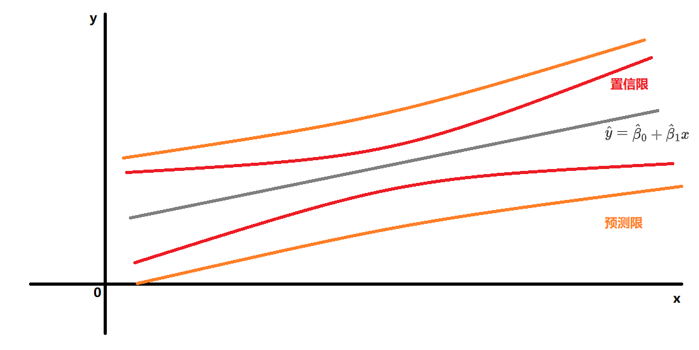
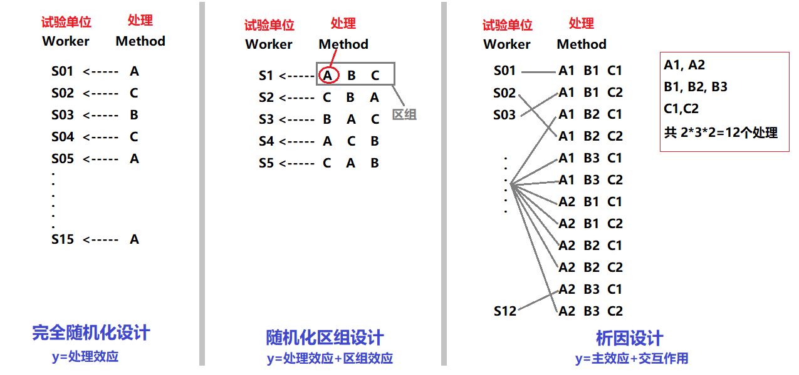
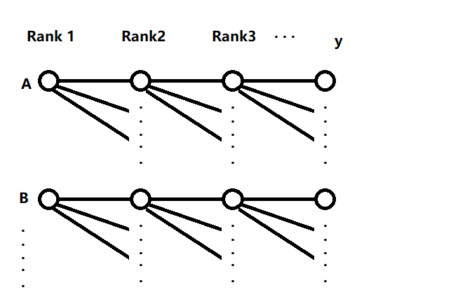

教材：《统计学（原书第五版）》    
**关联：[点估计$\hat{\theta}$、置信区间](Basis.md#10)，[离散分布](Basis.md#5)**，[非参数检验](Basis.md#16)**

* 因变量：被预测的变量，也称响应变量；一般用符号 $y$ 表示
* 自变量：用来预测因变量 $y$ 的变量；一般用符号 $x_1, x_2, x_3, ...$ 表示

* 笔记一
    - 误差(Error)：模型的$\epsilon$
    - 离差(Deviation)：$d_i = y_i - \overline{y}$，与均值的差
    - 残差(Residual)：$e_i = y_i - \hat{y}$，与预测值的差

* 笔记二
    - $SSE=\sum\limits_{i=1}^{n}w_i(y_i-\hat{y_i})^2$，和方差、残差平方和
    - $MSE=SSE/n$，均方误差
    - $RMSE=\sqrt{MSE}$，均方根误差
    - $RMS=\sqrt{\frac{\sum\limits^n_{i=1}{x_i}}{n}}$，均方根值、有效值

* 笔记三
    - ANOVA：一次针对**单个**因变量**y**进行方差分析
    - MANOVA：一次针对**多个**因变量**y**进行方差分析，可参考 [IBM-SPSS](https://www.ibm.com/docs/zh/spss-statistics/beta?topic=statistics-multivariate-analysis-variance-manova), [Slide 7](http://staff.ustc.edu.cn/~zwp/teach/MVA/Lec8_slides.pdf)

* n阶模型：模型中最高含有$\beta x^n$项；不是指套式设计中的n阶
* k元模型：模型中有多少个$x_i$
* 二元三阶模型示例：$E(y)=\beta_0 + \beta_1x_1+ \beta_2x_2 + \beta_3x_1^2x_2$

## 简单线性回归

 

* n为样本大小
* $SS_{xy}=\sum\limits_{i=1}^{n}(x_i-\overline{x})(y_i-\overline{y})$
* $SS_{xx}=\sum\limits_{i=1}^{n}(x_i-\overline{x})^2$
* $SS_{yy}=\sum\limits_{i=1}^{n}(y_i-\overline{y})^2$
* $SSE=\sum\limits_{i=1}^{n}(y_i-\hat{y_i})^2=\sum\limits_{i=1}^{n}(y_i-(\hat\beta_0+\hat\beta_1x))^2$；误差平方和 

### 分析步骤

1. 假设联系y与x的概率模型 $y=\beta_0+\beta_1x+\epsilon$
2. 最小二乘法估计模型参数 $\beta_0$, $\beta_1$，得到最小二乘模型 $\hat{y}=\hat\beta_0+\hat\beta_1x$
3. 估计误差 $\epsilon$ 的分布的标准差 $\sigma_{\epsilon} \approx s_{\epsilon}$
4. 评估（最小二乘）模型效用：相关系数$r$，决定系数$r^2$，斜率$\beta_1$
5. 使用（最小二乘）模型

### 参数估计

使用最小二乘法：令 $SSE$ 最小

* $\frac{\partial SSE}{\partial \hat{\beta_1}}=0$
* $\frac{\partial SSE}{\partial \hat{\beta_0}}=0$

化简得到 $\beta_0$, $\beta_1$ 的点估计：

* $\hat{\beta_1}=\frac{SS_{xy}}{SS_{xx}}$
* $\hat{\beta_0}=\overline{y}-\hat{\beta_1}\overline{x}$

### 标准差估计

$\epsilon$ 的 假定

1. $\epsilon$ 概率分布的均值为0，i.e.对无限长试验序列误差的平均是0 
2. $\epsilon$ 概率分布的方差为一个常数，即 $\sigma^2$
3. $\epsilon$ 概率分布是正态的
4. 任意两个不同观测值关联的误差是独立的，即：与一个y值关联的$\epsilon$不会影响与其它y值关联的$\epsilon$

推断（见363）

* $\sigma^2$ 的点估计 $s^2=\frac{SSE}{df}=\frac{SSE}{n-2}$
* y值符合正态分布：均值为 $E(y)=\beta_0+\beta_1x $，方差为 $\sigma^2$
* $\hat\beta_0$, $\hat\beta_1$ 符合正态分布的抽样分布：均值为0，方差为 $\sigma^2_{\hat{\beta_0}}=\frac{\sigma^2}{n}\frac{\sum x^2_i}{SS_{xx}}$，$\sigma^2_{\hat{\beta_1}}=\frac{\sigma^2}{SS_{xx}}$

### 评估模型效用

| $\hat\theta$ | $\sigma_{\hat\theta}$ | $H_0$ | 统计检验量 | $(1-\alpha)$置信区间 |
| -- | -- | -- | -- | -- |
| $\hat\beta_1$ | $\sigma_{\hat{\beta_1}}=\sqrt\frac{\sigma^2}{SS_{xx}}\approx\frac{s}{\sqrt{SS_{xx}}}=s_{\hat{\beta_1}}$ | $\beta_1=0$，x对y的预测不贡献信息 | $T=\frac{\hat\beta_1 -0}{s_{\hat{\beta_1}}}$ | $\hat\beta_1 \pm t_{\alpha/2}s_{\hat\beta_1}$ |
| $r$ | -- | $r=0$，x与y无相关性，意味着$\beta_1=0$ | $T=\frac{r\sqrt{n-2}}{\sqrt{1-r^2}}$ | -- |

* Pearson 相关系数 $r=\frac{SS_{xy}}{\sqrt{ SS_{xx}SS_{yy} }}=\hat{\beta_1}\sqrt{SS_{xx}/SS{yy}}$  表示x与y间线性关系强度；与$\hat{\beta_1}$**只是尺度不同**
* 决定系数 $r^2=\frac{SSR回归平方和}{SST离差平方和}=\frac{SS_{yy}-SSE}{SS_{yy}}=1-\frac{SSE}{SS_{yy}}$；$r^2=0.6$表示模型可以解释60%的Variance

### 非参数分析

在非参数回归分析中(p633)，不需要对 $\epsilon$ 的概率分布进行假定

#### Spearman

1. 对 X，Y 的值**分别**进行从小到大排序，得到的排序称为**秩**
2. Spearman 相关系数 $r_s = 1- \frac{6\sum d_i^2}{n(n^2-1)}$，第i个观测值中，$d_i = (x_i秩-y_i秩)$
3. 统计检验
    - 无假定
    - $H0: \rho=0$ （总体相关系数）
    - 上侧$Ha: \rho>0$，拒绝阈：$r_s > r_{\alpha}$
    - 下侧$Ha: \rho<0$，拒绝阈：$r_s < -r_{\alpha}$
    - 双侧$Ha: \rho \neq 0$，拒绝阈：$|r_s| > r_{\alpha/2}$

#### 泰尔零斜率检验

1. 按 X 的值从小到大排序，得到有序对$(x_i,y_i)$
2. 对$y_i$，计算$j>i$中(i.e.比yi更低秩的yj中)，负差$(y_j-y_i)<0$的个数、正差$(y_j-y_i)>0$的个数
3. $C = 正差个数 - 负差个数$
4. 统计检验
    - 假定 $\epsilon$ 是独立的
    - 上侧$H_a: \beta_1>0$，p值 = $P(x \ge C)$
    - 下侧$H_a: \beta_1<0$，p值 = $P(x \le C)$
    - 双侧$H_a: \beta_1 \neq 0$，p值 = $2*min(P(x \ge C),P(x \le C))$

### 使用模型

对单个x值$x=x_p$，估计**y的均值**E(y)

| $E(y)$的估计量$\hat{y}$的抽样分布的标准差 |  $(1-\alpha)$**置信区间** |
| -- | -- |
| $\sigma_{\hat{y}}=\sigma\sqrt{\frac{1}{n}+\frac{(x_p-\overline{x})^2}{SS_{xx}}} \approx s_{\hat{y}}=s\sqrt{\frac{1}{n}+\frac{(x_p-\overline{x})^2}{SS_{xx}}}$ | $\hat{y} \pm t_{\alpha/2}s_{\hat{y}}$ |

对单个x值$x=x_p$，预测**单个y值**$\hat{y}$

| 单次预测误差$(y-\hat{y})$的抽样分布的标准差 |  $(1-\alpha)$**预测区间** |
| -- | -- |
| $\sigma_{(y-\hat{y})}=\sigma\sqrt{1+\frac{1}{n}+\frac{(x_p-\overline{x})^2}{SS_{xx}}} \approx s_{(y-\hat{y})}=s\sqrt{1+\frac{1}{n}+\frac{(x_p-\overline{x})^2}{SS_{xx}}}$ | $\hat{y} \pm t_{\alpha/2}s_{(y-\hat{y})}$ |

其中$\sigma$指误差 $\epsilon$ 的标准差

## 多重回归

### 分析步骤

1. 选择与y相关的自变量x...(e.g. 对参数$\beta$进行统计检验)
2. 假设**一般线性模型** $y=\beta_0+\beta_1x_1+\beta_2x_2+...+\beta_kx_k+\epsilon$；或含**交互**作用项、**高阶**项的模型 $y=\beta_0+\beta_1x_1x_2+\beta_2x_2^2+...+\beta_kx_k^k+\epsilon$
3. 最小二乘法估计模型参数 $\beta_0,\beta_1,...,\beta_k$
4. 估计误差 $\epsilon$ 的标准差 $\sigma_{\epsilon} \approx s_{\epsilon}$
5. 评估（最小二乘）模型效用
6. 使用（最小二乘）模型

### 参数估计

使用最小二乘法：令 $SSE$ 最小

* $\frac{\partial SSE}{\partial \hat{\beta_1}}=0$
* $\frac{\partial SSE}{\partial \hat{\beta_0}}=0$
* ....

解法：将一般线性模型表示为矩阵形式：$Y=XB+E$

$
\begin{bmatrix}
y_1 \\\\
y_2 \\\\
y_3 \\\\
... \\\\
y_n
\end{bmatrix} = \begin{bmatrix}
1 & x_{11} & x_{12} & ... & x_{1k} \\\\
1 & x_{21} & x_{22} & ... & x_{2k} \\\\
... \\\\
1 & x_{n1} & x_{n2} & ... & x_{nk} 
\end{bmatrix}
\begin{bmatrix}
\hat\beta_0 \\\\
\hat\beta_1 \\\\
... \\\\
\hat\beta_k
\end{bmatrix} +
\begin{bmatrix}
\epsilon_1 \\\\
\epsilon_2 \\\\
\epsilon_3 \\\\
... \\\\
\epsilon_n
\end{bmatrix}
$ 

转写为最小二乘矩阵方程：$(X'X)\hat{B}=X'Y$

得到最小二乘矩解：$\hat{B}=(X'X)^{-1}X'Y$

### 标准差估计

$\epsilon$ 的假定[同上文](#_4)，$SSE=Y'Y-\hat{B}'X'Y'$，$\epsilon$ 标准差的点估计为 $s=\frac{SSE}{n-模型中\beta参数个数}$

将矩阵记为：$ (X'X)^{-1} = 
\begin{bmatrix}
c_{00} & c_{01} & c_{02} & ... & c_{0k} \\\\
c_{10} & c_{11} & c_{12} & ... & c_{1k} \\\\
c_{20} & c_{21} & c_{22} & ... & c_{2k} \\\\
... \\\\
c_{k0} & c_{k1} & c_{k2} & ... & c_{kk} 
\end{bmatrix}
$

$\hat\beta_i$的抽样分布是正态分布，且有：$E(\hat\beta_i)=\beta_i$，$\sigma_{\hat\beta_i}=\sigma\sqrt{c_{ii}}$，$Cov(\hat\beta_i,\hat\beta_j)=c_{ij}\sigma^2$

### 评估模型效用

| $\hat\theta$ | $\sigma_{\hat\theta}$ | $H_0$ | 统计检验量 | $(1-\alpha)$置信区间 | -- |
| -- | -- | -- | -- | -- | -- |
| $\hat\beta_i$ | $\sigma_{\hat\beta_i}=\sigma\sqrt{c_{ii}}$ $\approx s_{\hat\beta_i}=s\sqrt{c_{ii}}$ | $\beta_i=0$ | $T=\frac{\hat\beta_i}{s_{\hat\beta_i}}$ | $\hat\beta_i \pm t_{\alpha/2}s_{\hat\beta_i}$ | 单个模型参数的检验 |
| $R^2$ | -- | $R^2=0$，意味着$\beta_1=..=\beta_k=0$ | $F=\frac{MS_{Model}}{MSE}$ $=\frac{(SS_{yy}-SSE)/k}{SSE/(n-k-1)}$ $=\frac{R^2/k}{(1-R^2)/[n-(k+1)]}$ | （拒绝阈：$F > F_{\alpha}$） | 全局检验 |

* 样本多重决定系数 $R^2=1-\frac{SSE}{SS_{yy}}$ 定义同上文[决定系数 $r^2$](#_5)
* 调整后的多重决定系数 $R_a^2 = 1- \frac{(n-1)}{n-(k+1)}(\frac{SSE}{SS_{yy}})= 1- \frac{(n-1)}{n-(k+1)}(1-R^2)$

### 使用模型

一组样本$(y,a)$的参数的记为：$a=[1,x_1,x_2,...,x_k]$，代入最小二乘模型后得到 $\hat{y}=\hat\beta_0+\hat\beta_1x_1+...+\hat\beta_kx_k$

估计E(y)

| $E(y)$的估计量$\hat{y}$的抽样分布的标准差 |  $(1-\alpha)$**置信区间** |
| -- | -- |
| $\sigma_{\hat{y}}\approx s_{\hat{y}}=s\sqrt{a'(X'X)^{-1}a}$ | $\hat{y} \pm t_{\alpha/2}s_{\hat{y}}$ |

预测**单个y值**$\hat{y}$

| 单次预测误差$(y-\hat{y})$的抽样分布的标准差 |  $(1-\alpha)$**预测区间** |
| -- | -- |
| $\sigma_{y-\hat{y}}\approx s_{y-\hat{y}}=s\sqrt{1+a'(X'X)^{-1}a}$ | $\hat{y} \pm t_{\alpha/2}s_{(y-\hat{y})}$ |

其中$\sigma、s$指误差 $\epsilon$ 的标准差、的点估计

### Tips

* 模型效力的显著性可以通过F检验计算
* $x_k=p$ 时 $y$ 的**边际** 指 $E(y)=\beta_0+\beta_1x_1x_2+\beta_2x_2^2+...+\beta_kx_k^k$ 关于 $x_k$ 的变化率在 $x_k=p$ 的估值：$\frac{dE(y)}{dx_k}$ 代入$x_k=p$
* 异方差性（见463）：**残差** $e_i = y_i - \hat{y}$ 随 $\hat{y}$ 的增大而增大 (即$y$的方差随之增大)；此时考虑变换$y$：
    - $y$ 服从泊松分布：$y^{\ast}=\sqrt{y}$
    - $y$ 服从二项分布：$y^{\ast}=sin^{-1}\sqrt{y}$
    - $y$ 服从乘积分布：$y^{\ast}=ln(y)$
* 绝对值大于$3s$的**残差**是异常的，可以切除这个样本来评价它对回归分析的影响（刀切法）
* 数据为**时间序列**时，误差$\epsilon$ 的**独立性经常不成立**（**残差分布**可看出趋势），故模型受到怀疑
* 参数的**可估性**：不同数值的$x$至少比 $\beta_{0,1,2,..k}$数目多1，即 $\ge (k+1)$
* 参数解释：相关性不保证因果，需要通过[试验设计](#_14)确定$y$变化的真正原因
* **多重共线性**：当两个及以上自变量相关时候，可能它们单个$\beta$的t值不显著、但交互项的$\beta$的t值显著，此时应该保留它们
* **外推**至样本数据范围外的预测可能会有各种问题

## 模型设计

* 各种示例见467-
* **编码**指将一个自变量集变换为一个新的自变量集，例如：$Normalize(x)$

* 数据分离（或交叉确认）评估模型：模型的**有效性**(Validation) 需要通过新数据进行评估，可以考虑用新数据进行预测后得到的$\hat{y}$计算$R^2_{pred}, MSE_{pred}$等 （见505）
* 刀切估计评估模型：用删除观察值 $i$ 后计算得到的 $\hat{y_{(i)}}$ 代替$\hat{y}$以计算$R^2_{jackknife}, MSE_{jackknife}$等
* 逐步回归筛选潜在自变量（见506）：一步一步加入使新模型最优（根据每个$\beta_i$的T值，或模型F值）的$\beta_i$，过程中还会删除不再显著的$\beta_i$

### 定性变量
* 对于**定性**变量，可以0/1组合编码，例如：（见486）
    - 描写$k个水平(A,B,C,...)$的一阶定性变量模型$E(y)=\beta_0+\beta_1x_1+...+\beta_{k-1}x_{k-1}$
    - 其中虚拟变量 $ x_i= \begin{cases} 1 \quad 定性变量取i水平  \\\\ 0 \quad Otherwise \end{cases} $，若$x_{1...(k-1)}$=0则表示取中基准水平k（即对应$\beta_0$的水平，例如可以是Z）
* （见492）主效应($\beta_1x_1+\beta_2x_2$)、交互作用($\beta_3x_1x_2+\beta_4x_2x_3$)
* 使用嵌套模型的F检验（下文）来检验此变量

### 嵌套模型
* 嵌套：完全模型包括了简化模型及至少一个附加项
    - 简化模型：$E(y)=\beta_0+\beta_1x_1+...+\beta_gx_g$
    - 完全模型：$E(y)=\beta_0+\beta_1x_1+...+\beta_gx_g+\beta_{g+1}x_{g+1}+...+\beta_{k}x_{k}$

| F检验 | -- | 嵌套模型间的比较可以用F检验 |
| -- | -- | -- |
| -- | -- | $H_0: \beta_{g+1}=...=\beta_{k}=0$ |
| -- | -- | $H_a: \beta_{g+1},...,\beta_{k}$ 至少一个不为0 |
| $SSE_R$ | 简化模型的[误差平方和](#_1) | $SSE_R=\sum(y-\hat{y_R})^2$ |
| $SSE_C$ | 完全模型的[误差平方和](#_1) | $SSE_C=\sum(y-\hat{y_C})^2$ |
| $F$ | -- | $F=\frac{（SSE_R-SSE_C）/(k-g)}{SSE_C/[n-(k+1)]}$ |
| 其它写法 | -- | $F=\frac{MS_{模型}}{MSE_C} =\frac{SS_{模型}/(k-g)}{MSE_C}$ |

- 如果不能拒绝$H_0$，基于节俭原则，选择简化模型（虽然II型错误率未知）
- 注意，**非**嵌套模型间的比较**不**能使用F检验！！，必须基于$R_a^2,s$等统计量选择最优模型
- $\beta_1=...=\beta_i=0$ 意味着 $\mu_1=...=\mu_i$（定性变量），即 这些项对应的因素（变量）对y的预测无作用

## 试验设计
* 选择样本容量: 见 [Basis](Basis.md#12)
* 与响应变量y可能有联系的自变量x称为**因素**，一次试验中（多个/单个）因素取值（**水平**）的某种组合称为**处理**，用来测量响应变量y的对象称为**试验单位**(e.g.一名工人)

 

* 收集到试验数据后，就可以对与各种处理相联系的总体均值进行推断；用于**比较**处理**均值**的方法传统上称为**方差分析(ANOVA)**，原理是$F=\frac{组间方差}{组内方差}=\frac{SST/df_{SST}}{SSE/df_{SSE}}$

* **检验ANOVA的假定**(p595)
    - 正态总体
    - 方差齐次性（组间方差相等）：巴特利特检验(Bartlett)，莱文检验(Levene, F=MST/MSE)

* 多重比较的矫正(p589)
    - 后续检验（Post-hoc test），也称两两比较分析：e.g.A=B=C=D不成立，所以比较它们的两两组合、找出有差异的组
    - 进行多次检验后累计的I型错误将大于可接受的$\alpha$值，因此需要对p值进行矫正（一般称矫正后的p值为q值）
    - Tukey（样本数相同）、Bonferroni、S-N-K (Student-Newman-Keuls)、Dunnett、...

### 完全随机化设计

将处理随机指派给试验单位；若有p处理（水平）的**单因素**，模型设计为p水平的[一阶定性变量模型](#_13)：

$$ E(y)=\beta_0+\beta_1x_1+...+\beta_{p-1}x_{p-1} \text{ 其中 } x_i= \begin{cases} 1 \quad 取水平i  \\\\ 0 \quad Otherwise \end{cases} $$

| F检验 | 见上文[嵌套模型](#_15) | 单因素p处理（水平）r重复 共 $n=rp$ 观测值 |
| -- | -- | -- |
| 比较处理均值 | H0：简化模型=完全模型删除(p-1)个处理项 | $F=\frac{(SSE_R-SSE_C)/(p-1)}{SSE_C/df_C}$ |
| -- | -- | $df_C=(n-1)-(p-1)=n-p$ |

| ANOVA参数 | -- | 单因素p处理（水平）r重复 共 $n=rp$ 观测值 |
| -- | -- | -- |
| $CM$ | 均值的修正 | $CM=\frac{(所有观测值的和)^2}{所有观测值个数}=\frac{(\sum{y_i})^2}{n}$ |
| $SS_{总}$ | 总平方和 | $SS_{总}=(所有观测值的平方和)-CM=\sum{y_i}^2-CM$ |
| $SST$ | 处理平方和 | $SST=\sum{\frac{(T_p)^2}{n_p}}-CM$，$T_p$表示**处理p**中观测值的和，$n_p=b$表示**处理p**中观测值个数 |

| ANOVA检验目标 | df | SS | MS=SS/df | F=MS/MSE |
| -- | -- | -- | -- | -- |
| 处理 | $(p-1)$ | $SST$ | $MST=\frac{SST}{p-1}$ | $F=\frac{MST}{MSE}$ |
| **误差** | $(n-p)$ | $SSE=SS_{总}-SST$ | $MSE=\frac{SSE}{n-p}$ | -- |
| **总和** | $(n-1)$ | $SS_{总}$ | -- | -- |

### 随机化区组设计

（为减小处理本身性质的干扰，设计中包含处理因素与区组因素）将处理随机指派给每个区组中的试验单位；**单因素**p处理（水平） $\times$ b区组 的模型设计为：

$$ E(y)=\beta_0+\beta_1x_1+...+\beta_{p-1}x_{p-1}+...+\beta_{p+b-2}x_{p+b-2}   \text{ 其中 }$$ 
 $$ \text{ 处理变量 } x_{i \in [1,p-1]}= \begin{cases} 1 \quad 取处理i  \\\\ 0 \quad Otherwise \end{cases} \text{ 区组变量 } x_{j \in [p,p+b-2]}= \begin{cases} 1 \quad 取区组j  \\\\ 0 \quad Otherwise \end{cases} $$

| F检验 | 见上文[嵌套模型](#_15) | 单因素p处理（水平） $\times$ b区组(重复) ，共 $n=bp$ 观测值 |
| -- | -- | -- |
| 比较处理均值 | H0：简化模型=完全模型删除(p-1)个处理项，保留(b-1)个区组项 | $F=\frac{(SSE_R-SSE_C)/(p-1)}{SSE_C/df_C}$ |
| 比较区组均值 | H0：简化模型=完全模型删除(b-1)个区组项，保留(p-1)个处理项 | $F=\frac{(SSE_R-SSE_C)/(b-1)}{SSE_C/df_C}$ |
| -- | -- | $df_C=(n-1)-(p-1)-(b-1)=n-p-b+1$ |

| ANOVA参数 | -- | 单因素p处理（水平） $\times$ b区组(重复) ，共 $n=bp$ 观测值 |
| -- | -- | -- |
| $CM$ | 均值的修正 | $CM=\frac{(所有观测值的和)^2}{所有观测值个数}=\frac{(\sum{y_i})^2}{n}$ |
| $SS_{总}$ | 总平方和 | $SS_{总}=(所有观测值的平方和)-CM=\sum{y_i}^2-CM$ |
| $SST$ | 处理平方和 | $SST=\sum{\frac{(T_p)^2}{n_p}}-CM$，$T_p$表示**处理p**中观测值的和，$n_p=b$表示**处理p**中观测值个数 |
| $SSB$ | 区组平方和 | $SSB=\sum{\frac{(B_b)^2}{n_b}}-CM$，$B_b$表示**区组b**中观测值的和，$n_b=p$表示**区组b**中观测值个数 |

| ANOVA检验目标 | df | SS | MS=SS/df | F=MS/MSE |
| -- | -- | -- | -- | -- |
| 处理 | $(p-1)$ | $SST$ | $MST=\frac{SST}{p-1}$ | $F=\frac{MST}{MSE}$ |
| 区组 | $(b-1)$ | $SSB$ | $MSB=\frac{SSB}{b-1}$ | $F=\frac{MSB}{MSE}$ |
| **误差** | $(n-p-b+1)$ | $SSE=SS_{总}-SST-SSB$ | $MSE=\frac{SSE}{n-p-b+1}$ | -- |
| **总和** | $(n-1)$ | $SS_{总}$ | -- | -- |

### 析因设计

选择所有可能的处理（**多因素**的取值组合），随机指派给试验单位；若有三因素共 $a \times b \times c$ 处理（水平）（分别来自[示意图](./Basis/13.1.png)中因素A,B,C）：

$$ E(y)=\beta_0+\beta_1x_1+...+\beta_{d}x_{1}x_{3}+...+\beta_{e}x_{1}x_{3}x_{4}   \text{ 其中 }$$ 
 $$ \text{ 处理变量（主效应） } x_{i}= \begin{cases} 1 \quad 取X因素水平i  \\\\ 0 \quad Otherwise \end{cases} \text{ 交互变量 } x_{j}= \begin{cases} 1 \quad 取交互项j  \\\\ 0 \quad Otherwise \end{cases} $$

，其中主效应A有(a-1)项，主效应b有(b-1)项，主效应c有(c-1)项；AB交互作用项有(a-1)$\times$(b-1)项,其余同理；ABC交互作用项有(a-1)$\times$(b-1)$\times$(c-1)项；共计k=(abc-1)个$x$项

| F检验 | 见上文[嵌套模型](#_15) | 3因素$a \times b \times c$ 处理（水平）r重复，共 $n=abcr$ 观测值 |
| -- | -- | -- |
| 检验主效应A | H0：简化模型=完全模型删除(a-1)个主效应A项 | $F=\frac{(SSE_R-SSE_C)/(a-1)}{SSE_C/df_C}$ |
| 检验AB交互作用 | H0：简化模型=完全模型删除(a-1)(b-1)个AB交互项 | $F=\frac{(SSE_R-SSE_C)/[(a-1)(b-1)]}{SSE_C/df_C}$ |
| 检验ABC交互作用 | H0：简化模型=完全模型删除(a-1)(b-1)(c-1)个ABC交互项 | $F=\frac{(SSE_R-SSE_C)/[(a-1)(b-1)(c-1)]}{SSE_C/df_C}$ |
| -- | -- | $df_C=n-1-k=(abcr-abc)=abc(r-1)$ |

#### 双因素 ANOVA

| ANOVA参数 | -- | **双因素**$a \times b$ 处理（水平）r重复，共 $n=abr$ 观测值 |
| -- | -- | -- |
| $CM$ | 均值的修正 | $CM=\frac{(所有观测值的和)^2}{所有观测值个数}=\frac{(\sum{y_i})^2}{n}$ |
| $SS_{总}$ | 总平方和 | $SS_{总}=(所有观测值的平方和)-CM=\sum{y_i}^2-CM$ |
| $SS_A$ | 主变量因素A的平方和 | $SS_A=\sum{\frac{(A_i)^2}{n_i}}-CM$，$A_i$表示**因素A 处理i**中观测值的和，$n_i=br$表示 **因素A 处理i** 中观测值个数 |
| $SS_{AB}$ | AB交互作用的平方和 | $SS_{AB}=\frac{\sum\sum (A_iB_j)^2}{r}-SS_A-SS_B-CM$ |
| $SSE$ | 误差平方和| $SSE=SS_{总}-SS_A-SS_B-SS_{AB}$ |

| Two-way ANOVA | df | SS | MS=SS/df | F=MS/MSE |
| -- | -- | -- | -- | -- |
| 主效应A | $(a-1)$ | $SS_A$ | $MS_A$ | 略 |
| 主效应B | $(b-1)$ | $SS_B$ | $MS_B$ | 略 |
| AB交互作用 | $(a-1)(b-1)$ | $SS_{AB}$ | $MS_{AB}$ | 略 |
| 误差 | $ab(r-1)$ | $SSE$ | $MSE$ | -- |
| 总和 | $abr-1$ | $SS_{总}$ | -- | -- |

双因素ANOVA可能有用的参考：[minitab](https://support.minitab.com/en-us/minitab/20/help-and-how-to/statistical-modeling/doe/how-to/factorial/analyze-factorial-design/methods-and-formulas/analysis-of-variance/)

#### 多因素 ANOVA

书中只提供了析因设计双因素的ANOVA方法，p573提供了三因素情况下的参数示意

| ANOVA检验目标 | df | SS | MS=SS/df | F=MS/MSE |
| -- | -- | -- | -- | -- |
| 主效应A | $(a-1)$ | $SS_A$ | $MS_A$ | 略 |
| AB交互作用 | $(a-1)(b-1)$ | ? | 略 | 略 |
| ABC交互作用 | $(a-1)(b-1)(c-1)$ | ? | 略 | 略 |
| 误差 | $abc(r-1)$ | $SSE$ | $MSE$ | -- |
| 总和 | $abcr-1$ | $SS_{总}$ | -- | -- |

### 套式设计

见580

 

将$n_1$个样本随机分配给Rank1(A,B,...)，然后分别对A、B、...组内样本进行$n_2$次测量/试验 得到Rank2，然后对分别对Rank2组内样本进行$n_3$次测量/试验 得到Rank3，...

#### 二阶套式
令$y_{ij}$表示第i个一阶单位中，第j个二阶单位的相应；二阶套式模型设计为：

$$E(y_{ij})=\mu+两个随机分量=\mu+E(\alpha_i)+E(\epsilon_{ij})=\mu+0+0=\mu$$

| ANOVA参数 | -- | -- |
| -- | -- | -- |
| $CM$ | 均值的修正 | $CM=\frac{(所有观测值的和)^2}{所有观测值个数}=\frac{(\sum\sum{y_{ij}})^2}{n}$ |
| $SS_{总}$ | 总平方和 | $SS_{总}=(所有观测值的平方和)-CM=\sum\sum{y_{ij}}^2-CM$ |
| $SS(A)$ | -- | $SS(A)=\sum\limits^{n_1}\frac{(A_i)^2}{n_2}-CM$ |
| $SS(B_{\in A})$ | -- | $SS(B_{\in A})=SS_{总}-SS(A)$ |

| ANOVA检验目标 | df | SS | MS=SS/df | E(MS) | F |
| -- | -- | -- | -- | -- | -- |
| 第一阶：A | $(n_1-1)$ | $SS(A)$ | $MS(A)$ | $V(\epsilon_{ij})+n_2V(\alpha_i)$ | $MS(A)/MS(B_{\in A})$ |
| 第二阶：B in A | $n_1(n_2-1)$ | $SS(B_{\in A})$ | $MS(B_{\in A})$ | $V(\epsilon_{ij})$ | -- |
| 总和 | $n_1n_2-1$ | $SS_{总}$ | -- | -- | -- |

#### 三阶套式
令$y_{ijk}$表示第i个一阶单位中，第j个二阶单位的相应，第k个三阶单位的相应；三阶套式模型设计为：

$$E(y_{ijk})=\mu+三个随机分量=\mu+E(\alpha_i)+E(\gamma_{ij})+E(\epsilon_{ijk})=\mu+0+0+0=\mu$$

| ANOVA参数 | -- | -- |
| -- | -- | -- |
| $CM$ | 均值的修正 | $CM=\frac{(所有观测值的和)^2}{所有观测值个数}=\frac{(\sum\sum\sum{y_{ijk}})^2}{n}$ |
| $SS_{总}$ | 总平方和 | $SS_{总}=(所有观测值的平方和)-CM=\sum\sum\sum{y_{ijk}}^2-CM$ |
| $SS(A)$ | -- | $SS(A)=\sum\limits^{n_1}\frac{(A_i)^2}{n_2n_3}-CM$ |
| $SS(B_{\in A})$ | -- | $SS(B_{\in A})=\sum\limits^{i=n_1}\sum\limits^{j=n_2}\frac{B^2_{ij}}{n_3}-SS(A)-CM$ |
| $SS(C_{\in B})$ | -- | $SS(C_{\in B})=SS_{总}-SS(A)-SS(B_{\in A})$ |

| ANOVA检验目标 | df | SS | MS=SS/df | E(MS) | F |
| -- | -- | -- | -- | -- | -- |
| 第一阶：A | $(n_1-1)$ | $SS(A)$ | $MS(A)$ | $V(\epsilon_{ijk})+n_3V(\gamma_{ij})+n_2n_3V(\alpha_i)$ | $MS(A)/MS(B_{\in A})$ |
| 第二阶：B in A | $n_1(n_2-1)$ | $SS(B_{\in A})$ | $MS(B_{\in A})$ | $V(\epsilon_{ijk})+n_3V(\gamma_{ij})$ | $MS(B_{\in A})/MS(C_{\in B})$ |
| 第三阶：C in B | $n_1n_2(n_3-1)$ | $SS(C_{\in B})$ | $MS(C_{\in B})$ | $V(\epsilon_{ijk})$ | -- |
| 总和 | $n_1n_2n_3-1$ | $SS_{总}$ | -- | -- | -- |

