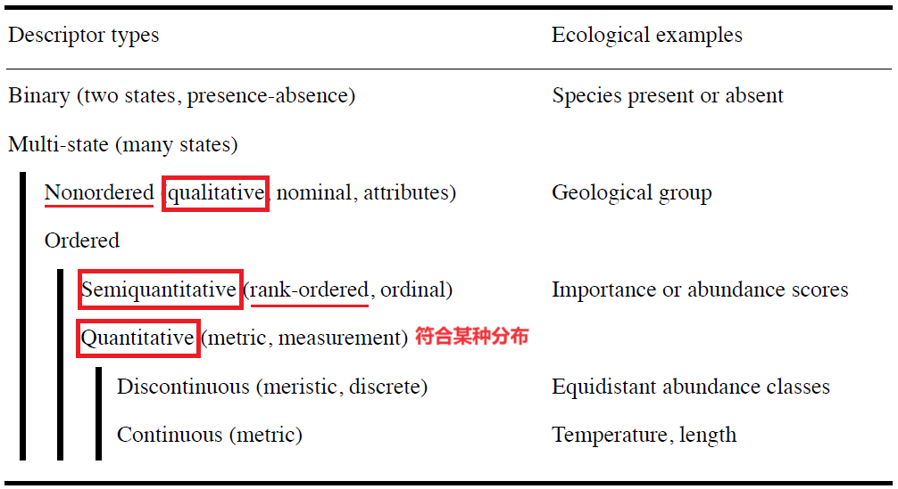
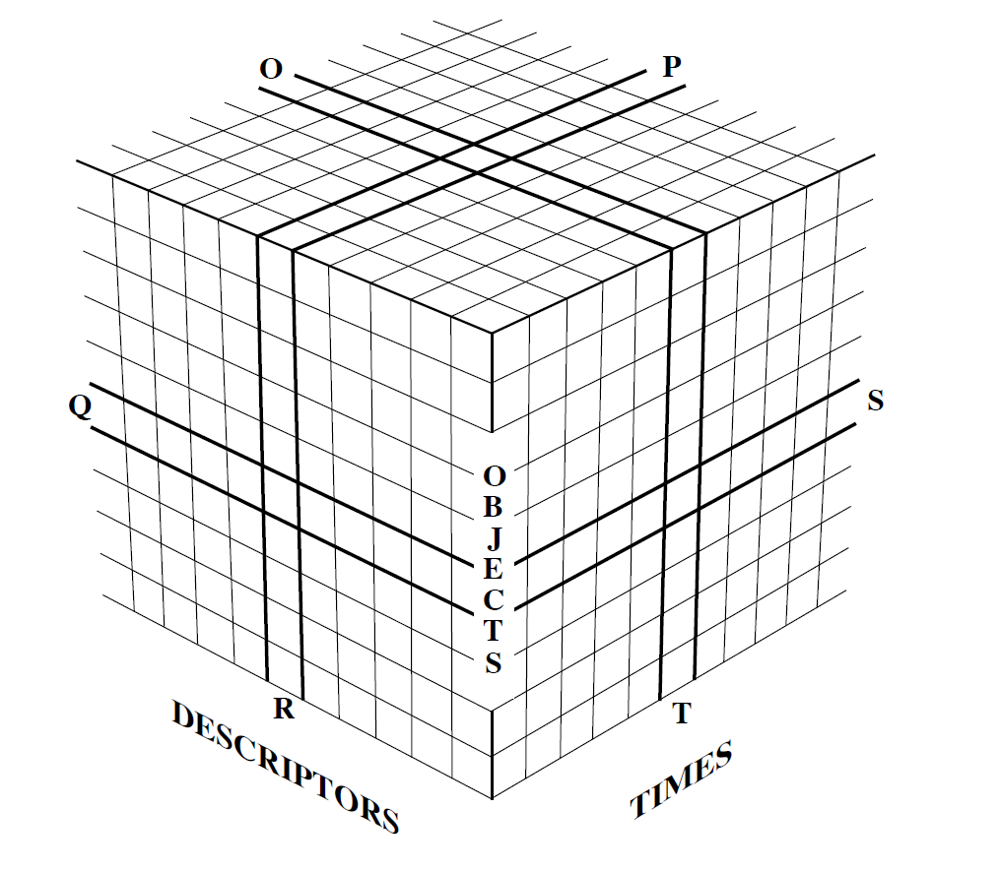

<script>
MathJax = {
  tex: {
    inlineMath: [['$', '$'], ['\\(', '\\)']]
  },
  svg: {
    fontCache:   'global'   // 'local',or 'global' or 'none'
  }
};
</script>
<script type="text/javascript" id="MathJax-script" async
  src="https://cdn.jsdelivr.net/npm/mathjax@3/es5/tex-svg.js">
</script>

<style>
img{
    width: 60%;
}
</style>

教材：《Numerical Ecology》        

R示例: [David Zelený: Analysis of community ecology data in R](https://davidzeleny.net/anadat-r/doku.php/en:start)

参考: [Linear_Algebra笔记-常见矩阵分解](../Course/Linear_Algebra.md#_12)

略：Ch10.4（Causal Path），Ch10.6（Fourth-corner Analysis）

| Condition -> Observation | 根据数据的不同特征，选择不同Model |
| -- | -- |
| Deterministic | 确定性的观测结果 |
| **Random**（[本书概览](./Ecology/t5_1.png)） | 个体结果无法预测，其可计算其出现的probabilities |
| Strategic | 结果同时受个体策略与所处环境的影响 |
| Chaotic | 短期可预测，但长期无法预测；e.g.蝴蝶效应 |
| Uncertain | 完全无法预测 |


## 概览

生态系统是动态的，持续发生着各种process，一个相对稳定的系统一般是分层的（由于能量/地理隔离/生态位/...）；并且一直保持 spatial heterogeneity（个体需要聚集以繁殖/自卫/采食/..）


因此在生态学数据中，考虑到[周边环境、周边族群的影响](./Ecology/f1_5.png)，各采样(y) 很有可能并不是相互独立的：对于正相关的数据(r>0)，直接使用可能会造成 Type I error 上升 (i.e.置信区间比实际窄、过多显著结果)，因此可以：

1. 去除强关联的样本（不推荐）
2. detrending（通过回归去除空间趋势造成的关联）
3. Corrected tests (基于修正后的variable estimates 或 df 进行分析) ； ...


## 数据类型

生态学描述类型常见：
```
intensive/extensive（抽样unit增大，其值不变/等比例增，例如：水温/个数）
additive/non-additive（统计时数值可否相加后取均值，例如：密度/PH） 
```



### Quantitative 数据预处理

一些操作可以令数据转换为正态分布/方差齐次，包括：
```
Linear transformation          y'= ay+b
non-Linear transformation      y'= a^y     y'= log(y)    y'= sqrt(y)
Ranging (将y'限制在某个区间内)：    
        y'= y/max(y)  in [0,1]       
        y'= [y-min(y)]/[max(y)-min(y)] in [0,1]   
        z = [y - mean(y)]/SD(y)         Standardization
-----------------------常见---------------------------------
Box-Cox method
Taylor’s power law
omnibus normalizing procedure     p51
------------------------------------------------------------
pi theory：不同量纲的数据可以用基本量重新表达为无量纲形式
```

可以通过直方图或参数大致估计数据分布的形态：
```
Skewness for asymmetry                   公式 p188
Kurtosis for flatness/peakedness
```


满足统计检验的假设（正态性检验/方差齐次性检验/...）后可以计算置信度或进行假设检验，需要注意多重比较的矫正；此外，也可通过permutation得到某统计量的随机分布
```
用例：n个样本var1-var2之间的相关性r是否显著区别于随机？
 - 可通过permutation获取随机分布，也可以假设它遵循F分布
```

| 常见统计量 | 本书中符号 | Matrix一般大写表示 |
| -- | -- | -- |
| 样本$i$ 特征$j$ | $y_{ij}$ | 原始matrix中，一行是一个样本，一列是一特征 |
| Mean $\mu$ | $\overline{y_j}$ | -- |
| Normalized $y_{ij}$ | $z_{ij} = y_{ij}-\overline{y_j}$ | -- |
| Variance | $s_j^2=s_{jj}$ | -- |
| Standard Deviation | $s_j=\sqrt{s_j^2}$ | -- |
| Covariance $\sigma$, $cov$ | $s_{jk}=\frac{1}{n-1}\sum\limits_{i=1}^n(y_{ij}-\overline{y_j})(y_{ik}-\overline{y_k})$  |  [Covariance Matrix](./Ecology/covariance.png) |
| Coefficient of Variation | $CV_j=s_j/\overline{y_j}$ | 消除均值大小不同/单位的影响 |


**如果数据中有缺失值，可以在算法中进行设定，或填充预测值**

### Matrix 类型

假设有这些类型的数据：

| Matrix Type | rowX $\times$ columnsY |
| -- | -- |
| Raw | L = sample $\times$ species |
| Raw | R = sample $\times$ environmental variables |
| Raw | Q = species $\times$ traits |
| Distance | D = sample $\times$ sample |


1. 填充/删除 缺失值
2. 去除 Outliers，一般指超出 Q1/Q3 1.5 IQR（箱式图）
3. Transformation：
    - 常见 sqrt()，log()，Arcsin()，取倒数，**Hellinger** $\sqrt{\frac{y_{ij}}{rowsum_i}}$
4. Standardization：
    - 常见 Centring to 0，z-scores $\frac{y_{ij}-mean}{sd}$，Ranging to 0~1

### Modes



* 关键词：Similarity(Q), Distance(Q), Dependence(R) coefficients
    - R mode: 寻找 descriptors 间的关系，例如 Pearson's r
    - Q mode: 寻找 objects/samples 间的关系

* 物种会更倾向于分布在某种Niche中：have unimodal distributions along environmental variables；故物种分布相似说明两个site相似
* Double zero problem: 假如有2个site，Species_A 在二者中都是0；则此数据不能提供关于这两个site的生态学信息
    - Skip Double zeros when computing coefficients（Asymmetrical）
    - Not Skip（Symmetrical）

（p273-p350 & [Ch8_Clustering](./Ecology/Clustering.png) 略 TBA），其中常用的是 UPGMA (p354，根据进化树距离)

* A-space: The descriptor, or attribute space


## 假设检验 & 相关性评估
|  | Quantitative | Semiquantitative | Qualitative |
| -- | -- | -- | -- |
| [**假设检验 H0:无差异**](./Ecology/t5_2.png) | 参数检验（假定数据符合某种背景分布） | rank statistics | -- |
| Correlation(2 var) | [Pearson r](./Ecology/Pearson_r.png) | [Spearman r](./Ecology/Spearman_r.png) (without tie), [Kendall Tau](./Ecology/Kendall_Tau.png) | [Fisher 精确检验](Basis_Categorical.md#_6)，[Entropy](./Ecology/Entropy.png)，[二维列联表的 $\chi^2$ ](./Ecology/Contingency.png) 与 [Contingency Coefficient](./Ecology/Contingency_coeff.png)） |
| Concordance(m var) | -- |  [Kendall W](./Ecology/Kendall_W.png) | [多维列联表的 Log-linear model](./Ecology/Contingency.png) |

* (p175) Partial correlation coefficient $r_{12|3}=\frac{r_{12}-r_{13}r_{23}}{\sqrt{1-r_{13}^2}\sqrt{1-r_{23}^2}}$ 限制 var3 的情况下，var1、var2 间的关联


## 其它常用检验

### Mantel test

假设需要研究 variable X 与 Y 是否相关，可以分别计算样本间距离矩阵 $D_X$, $D_Y$（e.g. genetic / geographic distances），随后用 Mantel test 判断 $D_X$ 与 $D_Y$ 是否相关。

1. H0: $D_X$ 与 $D_Y$ 不相关
2. [Mantel statistic](./Ecology/f10_19.png): $Z_M=\sum\limits_{i=1}^{n-1} \sum\limits_{j=i+1}^{n} D_{X_{ij}}D_{Y_{ij}}$ 
    - 除了 Cross Product，也可以将 Spearman r/ Kendall Tau/ Pearson r 用作 statistic
3. Permutations：打乱 $D_{X_{ij}}$, $D_{Y_{ij}}$ 的对应关系；重复多次得到 $Z_M$ 的随机分布


### Partial Mantel test

在控制 Z 影响的前提下，研究 variable X 与 Y 是否相关

1. H0: $D_X$ 与 $D_Y$ 不相关，while controling $D_Z$
2. Statistic 同上 & Partial correlation coefficient
    - regress $D_Z$ on $D_X$、regress $D_Z$ on $D_Y$，计算 X、Y 每一个残差之间的相关性


### ANOSIM test

假设样品基于某种信息进行了分组，ANOSIM 用来检验组间的差异是否显著大于组内差异

1. 计算样本间距离矩阵 $D_X$
2. 对 $D_{X_{ij}}$ 排序，将 $D_X$ 转化为秩矩阵 $R_X$ (其元素为从大到小排序的rank)
3. 计算 Statistic $R=\frac{\overline{r_B}-\overline{r_W}}{n(n-1)/4}$
    - $\overline{r_{Between}} = \overline{r_{ij}}$ when i,j 不同组
    - $\overline{r_{Within}} = \overline{r_{ij}}$ when i,j 属于同一组
4. Permutations：打乱排序；重复多次获得 Statistic 的随机分布

如果 $R > 0$ 且显著，说明 组间距离B > 组内距离W，分组有效


### Procrustes test

假设每个样本分别有 2 组属性，存放于 $Y_1$, $Y_2$ 中。


1. 对 $Y_1$, $Y_2$ 进行降维，且缩放/旋转：直到降维空间中，二者对应元素点（i.e.同一个样本的 var1 var2 属性点）的距离平方和最小
2. 计算 fitting $Y_2$ to $Y_1$ 情况下的 Statistic $m^2_{Y1,Y2} = Trace(Y_1Y_1') - Trace(W)^2/Trace(Y_2Y_2')$
    - $Y_1'Y_2 = VWU'$ 以 获得 W (SVD)
    - $m^2_{Y1,Y2} = m^2_{Y2,Y1} = 1 - Trace(W)^2$
    - 对形状一致性的度量
3. Permutations：打乱观测值的排序；重复多次获得 Statistic 的随机分布


## Biodiversity

* **Alpha** diversity is the diversity in species composition at individual sites i
* **Gamma** diversity is the diversity of the whole region of interest in a study
* **Beta** diversity is the variation in species composition among sites in the geographic area of interest


| Alpha | -- | -- |
| -- | -- | -- |
| **Diversity** 常用 [Renyi entropy](./Ecology/Renyi_entropy.png) 的三个度量 | Number of species ($N_0$) | $q$ |
| -- | Shannon’s entropy ($H_1$) | $ H= -\sum p_i\log(p_i)$ |
| xx | Simpson’s concentration index ($N_2^{-1}$): 随机选的2样本属于同一species的几率 | $\lambda=\sum\frac{n_i(n_i-1)}{n(n-1)}$ |
| -- | Simpson’s Diversity index | $1-\lambda$ |
| **Evenness** | Pielou’s evenness 对比假想完全平均群体的Shannon’s entropy | $J=H_{real}/H_{even}$ |
| -- | Hurlbert’s evenness 假想 min Diversity (一个site只包含一个物种，若sites有多余则用同一种物种填充) 和 max Diversity | $J = (D-D_{min})/(D_{max}-D_{min})$ |
| xx | Patten’s redundancy | $1-J_{Hurlbert}$ |
| -- | 用 Broken stick model 将n个体随机切割给q物种，得到均匀的模拟数据 | $J=H_{real}/H_{model}$ |
| -- | [Functional evenness](./Ecology/Functional_evenness.png) | -- |


但目前，Alpha分析常用 Shannon，Ace，Simpson，Pielou_J 等 Mothur 提供的计算；Beta分析一般是计算Bray-Curtis，Weighted Unifrac，Weighted Unifrac距离后进行聚类分析或差异检验


## Regression

评估模型效用见 [Basis_Regression](Basis_Regression.md)

| [Simple Linear Regression](./Ecology/f10_6.png)  | Model I | Model II |
| -- | -- | -- |
| 场景 | X 是实验设计的一部分，Y 是观测值 | X，Y 都是观测值 |
| 假设 | Error $\sigma_{X_i}=0$；Error $\epsilon_{Y_i}$ 相互独立且服从正态分布 | Error $\sigma_{X_i}$ or Error $\epsilon_{Y_i}$ 相互独立且服从正态分布 |
| [用法](./Ecology/t10_4.png) | 预测 Y | 验证 X，Y 之间的关系 |
| 预测斜率 | OLS | Major Axis  |
| 其它 | Coefficient of Determination: $r^2=SS_{regress}/SS_{total}=S_{\hat{y}}^2/S_{y}^2$   of the variation in y is explained by x | Permutation test 计算斜率的置信区间 (C.I.) |
| Dimensionally Homogeneous | Yes: 缩放Y，即等比例缩放斜率b | if No: 改用 SMA(p549), RMA(p551)  |


* Multiple linear regression
    - $\hat{y} = b_0 + b_1x_1 + ... + b_mx_m$
    - Variance Inflation Factors: VIF=1 说明此变量与其它所有变量的相关性为0
        1. regress variable $j$ on all the other variables: $x_j = c_0 + \sum c_ix_i$
        2. calculate Coefficient of Determination $R^2$（同上文$r^2$）
        3. $VIF_{j} = \frac{1}{1-R^2_j}$ 
    - Ockham’s razor: 逐步去除贡献度小的变量
    - Adjusted Coefficient of Determination $R_a^2 = 1-(1-R^2)(\frac{n-1}{n-m-1})$


* Polynomial regression
    - $\hat{y} = b_0 + b_1x_1^n + ... + b_mx_m^n$


* Logistic regression
    - $\hat{z} = b_0 + b_1x_1 + ... + b_mx_m$
    - $\hat{y} = \frac{1}{1+e^{\hat{z}}}$

* Nonlinear regression
    - $y = \frac{K}{1+e^{a-rx}}$


* [Partial linear regression](./Ecology/f10_10.png) (p570): 控制一组变量后再探究另一组变量对Y的影响


## Ordination

| 概览 | Raw | Raw | Transformation-based | Distance-based |
| -- | -- | -- | -- | -- |
| [Assumption](./Ecology/Ordination_Assumption.png) | **Linear** | **Unimodal** | -- | -- |
| **Unconstrained** <br> L or D only | PCA | CA, DCA | tb-PCA | PCoA, NMDS |
| **Constrained** <br> plus R/Q | RDA | CCA | **tb**-RDA | **db**-RDA |
| -- | -- | 依据 DCA 第一轴轴长，选择 Unimodal（> 4 SD）或 Linear（< 3 SD）方法 | 一般用 Hellinger 处理后的数据作为输入 | 常见 Jaccard, Bray-Curtis, Unifrac 距离 |


### Unconstrained

Ordination时不必考虑（环境/traits等）分组信息

| [Unconstrained Ordination](./Ecology/UnC_Ordination.png) | 解说 |
| -- | -- |
| [PCA](https://nbviewer.org/github/Jiarong-L/notes/blob/main/docs/Statistics/Ecology/NumEco_PCA.ipynb) | 一般直接用于丰度矩阵，但也可以用于correlation matrix；保留输入中的欧式距离信息，注意 [U 的 Scaling](./Ecology/PCA.png) |
| [Correspondence analysis (CA/DCA)](https://nbviewer.org/github/Jiarong-L/notes/blob/main/docs/Statistics/Ecology/NumEco_CA.ipynb) | 对频率矩阵进行SVD，对稀有物种敏感；CA-axis中的欧式距离对应输入中的$\chi^2$距离 |
| [MDS/PCoA](https://nbviewer.org/github/Jiarong-L/notes/blob/main/docs/Statistics/Ecology/NumEco_PCoA.ipynb) | 对距离矩阵进行特征值分解，Scaling同PCA |
| [nMDS](https://nbviewer.org/github/Jiarong-L/notes/blob/main/docs/Statistics/Ecology/NumEco_nMDS.ipynb) | nMDS空间中保留了距离的秩次信息；stress < 0.2 较为合适 |


### Canonical Analysis

[典型相关分析（Canonical Analysis）](https://www.sciencedirect.com/science/article/abs/pii/B9780444538680500113) 


| Asymmetric | 解说 |
| -- | -- |
| [RDA](./Ecology/.png) | -- |
| [CCA](./Ecology/.png) | -- |
| [LDA](./Ecology/.png) | -- |


| Symmetric | 解说 |
| -- | -- |
| CCorA | -- |
| CoIA | -- |
| Proc | -- |
