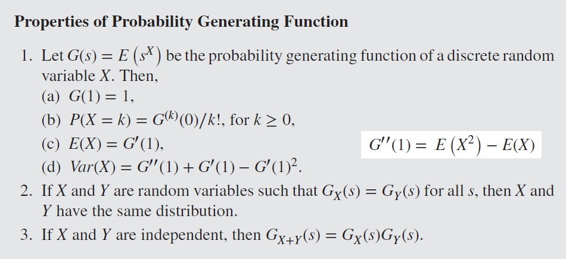
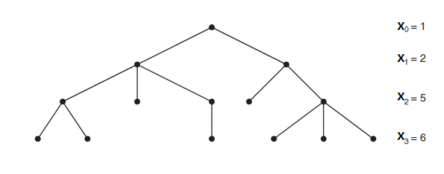

## 参考

课本：INTRODUCTION TO STOCHASTIC PROCESSES WITH R

参考：https://zhuanlan.zhihu.com/p/591192586   
参考：https://zhuanlan.zhihu.com/p/151683887    
母函数和矩母函数的联系和区别？https://www.zhihu.com/question/24952770 

https://math.stackexchange.com/questions/4533142/transition-matrix-of-a-single-type-branching-process    

https://www.stat.berkeley.edu/~aldous/Networks/lec2.pdf    

## Review

* 随机过程（Stochastic Process）是一系列随机动作产生的状态的集合 {$X_t \in S$}，其中 {$t \in I$} 是随机过程的索引，$S$是状态空间（State space）

* Monte Carlo Simulation 是指重复实验多次后取结果的均值作为近拟

* Conditional Expectation
$$Var(Y)=E(Y^2)-E(Y)^2    \quad\quad\quad\quad\quad (1)$$
$$Var(Y|X)=E(Y^2|X)-E(Y|X)^2    \quad (2)$$

$$E(Var(Y|X))+Var(E(Y|X))  \quad\quad\quad (3)$$
$$=E(E(Y^2|X)-E(Y|X)^2) + E(E(Y|X)^2)-E(E(Y|X))^2$$
$$=E(Y^2)-E(Y)^2$$
$$=Var(Y)$$

* 概率母函数 Probability generating function $G_x(s)=E(s^x)=\sum\limits_{x=0}^{\infty}s^xP(x)$
    - $G^{(j)}(0)=j!P(j)$
    - $G''(0)=2P(2)$

## Markov Chain

Markov Chain 是随机过程的一种，约定各时刻的状态表示为 {$X_1...X_n$}，下一时刻的状态只由当前时刻决定，即：$P(X_n|X_{n-1},...,X_1)=P(X_n|X_{n-1})$

| -- | [Algoritm](./Stochastic/2-5.png) | -- | $n$ Step 时处于各状态的概率 $=\overrightarrow{\alpha}P^n$ |
| -- | -- | -- | -- |
| n | Timestep | -- | -- |
| $P$ | [Transition Matrix](./Stochastic/2-1.png) | 为半正定矩阵，其**行和为1**   $P^n = \prod\limits^nP$表示$n$次跳转的概率 | $P_{ij}=P(X_n=j\|X_{n-1}=i)$ 表示单次跳转时，从状态 $i$ 跳转到状态 $j$ 的概率 |
| $\overrightarrow{\alpha}$ | 初始状态向量 | -- | -- |

* Joint Distribution 计算：
$$P(X_{t_1}=s_1,X_{t_2}=s_2,...,X_{t_n}=s_n)$$
$$=Prob(1 \rightarrow s_1)Prob(s_1 \rightarrow s_2) ... Prob(s_{n-1} \rightarrow s_n)$$
$$=(\alpha P^{t1})_{s_1} (P^{t_2-t_1})\_{s_1,s_2} ... (P^{t_n-t\_{n-1}})\_{s\_{n-1},s_n}$$

* **Limiting** Distribution $\lim\limits_{n \rightarrow \infty}P^n_{ij}=\overrightarrow{\lambda_j}$ 即 $\lim\limits_{n \rightarrow \infty}\overrightarrow{\alpha}P^n=\overrightarrow{\lambda}$，此时 $\lim\limits_{n \rightarrow \infty}P^n=\Lambda$ 的每一行都等于$\overrightarrow{\lambda}$

* **Stationary** Distribution 满足 $\overrightarrow{\pi} = \overrightarrow{\pi}P$

* Limiting Distribution 意味着 Stationary Distribution：$\overrightarrow{\lambda} = \lim\limits_{n \rightarrow \infty}\overrightarrow{\alpha}P^n = \lim\limits_{n \rightarrow \infty}\overrightarrow{\alpha}P^{n-1}P=\overrightarrow{\lambda}P$，**反之却不一定**（除非 Ergodic）

* 如果存在$n \ge 1$ 使 $P^n$ 为正定矩阵（所有元素>0），则 $P^n$ 是 **Regular** Transition Matrix，此时存在对应的 Limiting Distribution 

* State $j$ **Recurrent** 意味着在有限时间内**必定**再度访问State $j$：$\sum\limits_{n=0}^{\infty}P^n_{jj} = \infty$ 

* State $j$ **Transient** 意味着**可能**永**不**再访问State $j$：$\sum\limits_{n=0}^{\infty}P^n_{jj} < \infty$ 
    - 即 "Started in i, the expected number of visits to i is finite"
    - （因 $\lim\limits_{n \rightarrow \infty}P^n_{jj} = 0$）

* 连通图（同一个communication class，元素相互连通）的 Markov Chain 是 **Irreducible** 的，有限元素（State）的情况下称为 **Finite**
    - **Irreducible** 时各 State 全部 Recurrent，或全部 Transient
        * （注：对于 Infinite Irreducible，可能有 Infinite return time，此时 state 称为 null recurrent）
    - **Finite Irreducible** 时各 State 全部 Recurrent
        * 设 $T_j$是再次回归 $j$ 所需的时间（first passage time to $j$），此时 Stationary Distribution 的元素 $\pi_j=\frac{1}{E(T_j|X_0=j)}$ 
        - 对于任意 State $i$，$\pi_j=\lim\limits_{n \rightarrow \infty}\frac{1}{n}\sum\limits_{m=0}^{n-1}P^m_{ij}$

* 有一组 State $C$，如果所有$C$中元素都不能访问$C$外元素，则称$C$是**closed**，即 $P_{ij}=0$ for all $i \in C,j \notin C$
    - Recurrent 意味着 closed

* $d(i)=gcd$ {$n >0 : P^n_{ii}>0$} 是 $i \rightarrow i$ 状态重现所有可能步数的最大公约数（greatest common ancestor），即**周期**（period）
    - 若 可能步数集 为空，则 $d(i)=+\infty$
    - 若 $d(i)=1$则 state $i$ 是 **aperiodic**
    - 若 $d(i)>1$则 state $i$ 是 **periodic**
    - [示例](./Stochastic/3-7.png)
    - **Irreducible** 时各States周期相同，故而可以谈论 Markov Chain 的 periodic / aperiodic

* **Ergodic** Markov Chain 的条件: Irreducible, aperiodic, finite recurrence time
    - 此时存在一个 Stationary Distribution，同时也是 Limit Distribution

* **Reversible** Markov Chain 的条件： $\pi_iP_{ij}=\pi_jP_{ji}$ for all $i,j$；其中 $\pi$ 是Stationary Distribution

* **Absorbing State** $i$ 满足：$P_{ii}=1$，如果 Markov Chain 含有多个 Absorbing State，则称其为 **Absorbing Chain**
    - [计算 Absorbing Chain 跳转到 Absorbing State 的长期概率或时间](./Stochastic/3-11.png)
    - [用法1：计算第一次遇见某个节点：将此节点视为Absorbing State](./Stochastic/3-30.png)
    - [用法2：计算第一次遇见某个Pattern：改写包含得到此Pattern路径的$P$，将Pattern视为Absorbing State](./Stochastic/3-33.png)

## Branching Processes

Branching Processes {$X_n$} 常用于模拟 Population growth；它是一种 Markov Chain，因为子代个数 $X_{n+1}$ 仅取决于其父代个数 $X_{n}$ （以及 offspring 分布）

* 假设 
    - $Y_{n,i}$ 表示第 $n$ 代第 $i$ 个个体的后代数
    - $X_{n+1}=\sum\limits_{i=1}^{X_{n}}Y_{n,i}$ 表示第 $n+1$ 代的个体数目
    - 已知 $P[X_{n+1}=S_{n+1} | X_{n}=S_{n} ] = P[\sum\limits_{r=1}^{X_{n}} Y_{n,r}=S_{n+1} | X_{n}=S_{n} ]= P[\sum\limits_{r=1}^{S_{n}} Y_{n,r}=S_{n+1}]$
    - Transition matrix 元素 $P^n_{ij} = P(\sum\limits_{r=1}^{i}Y_{n,r}=j)$ 表示第 $n$ 代时 $i$ 个个体累计产生 $j$ 个后代的概率；设定 $P^n_{00}=1$
    - Absorbing state = 0，即当 $X_n=0$ 时发生灭绝事件，其余 all nonzero states are transient

* 假设单个个体的后代数目遵从某种概率分布（offspring 分布），用 $a_k$ 表示 单个个体产生 $k$ 个后代的概率
    - $a_0=0$ 则 Population 永远增加；
    - $a_0=1$ 则 $X_n = 0$ for $n \ge 1$
    - 因此假设 $0 < a_0 < 1$ 且 $a_0+a_1 <1$ （即，有一定概率产生多个后代）

* 单个个体后代数目分布的均值 $\mu = \sum\limits_{k=0}^{\infty}ka_k$，则第 $n$ 代个数的均值 $E(X_n)=\mu^n$ （[推导过程](./Stochastic/4-2.png)）
    - 灭绝事件 $E: X_n=0$ 最终发生的概率 $P(E)=\lim\limits_{n \rightarrow \infty}P(X_n=0)=\lim\limits_{n \rightarrow \infty}1-\mu^n$
    - 故而，依据 $\mu$ 的取值，$X_n$最终可能趋向 $0,1,\infty$ 三种可能

* offspring 分布 $Y$的母函数是 $G(s)=\sum\limits_{k=0}^{\infty}s^ka_k$，$G^n(s)$是 $G(s)$ 的 $n$ 重复合：
    - $G^n(s)=G^{n-1}(G(s))=G(...G(G(s))...)$
    - $G^n(s)=\sum\limits_{k=0}^{\infty}s^kP(X_n=k)$
    - $X_0=i$ 时，$X_n$的母函数 $=\sum\limits_{k=0}^{\infty}P^n_{ik}S^k=[G^n(s)]^i$ （可用于推算Transition matrix）
    - 当 $\mu>1$ 时，方程 $s=G_Y(s)$ 的最小解 $s=min(roots)$ 是走向灭绝结局的概率，[示例](./Stochastic/4-7.png)
    - （当 $\mu \leq 1$ 时灭绝结局概率=1）

