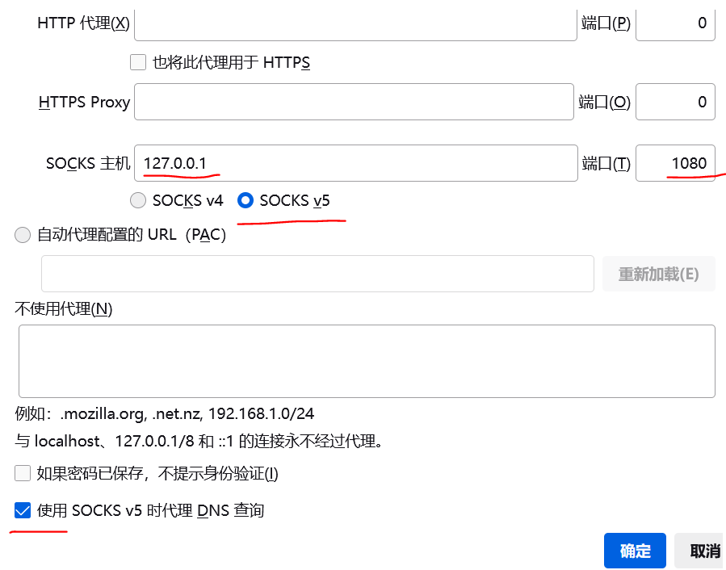
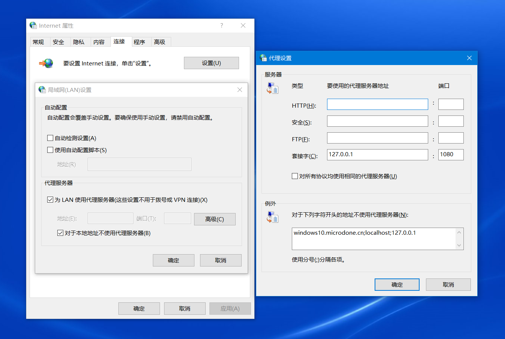
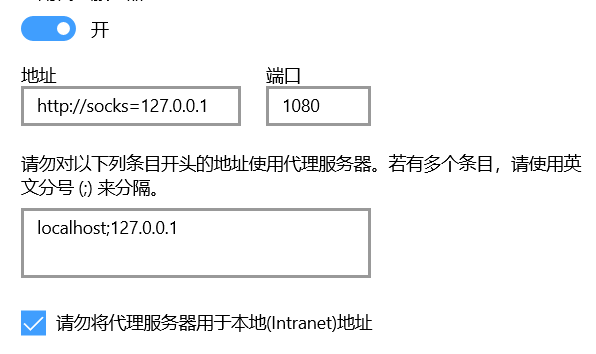

<style>
img{
    width: 60%;
}
</style>


## 准备VM

创建一个azure linux vm, ./ssh/config示例:
```
Host vm1
    HostName xx.xx.xx.xx
    User L001
    IdentityFile azure001_key.pem
    Compression yes
    DynamicForward 1080
    ServerAliveCountMax 60
    ServerAliveInterval 30
```


## 设置代理
### 火狐浏览器
火狐浏览器中，网址栏输入"about:preferences"，随后下拉至最下方"网络设置"-->"设置"-->"手动配置代理"  
  
### 所有浏览器(Win10)
网络设置-->连接  
  
然后此处会显示   
   
注意，不能直接搜索代理、然后设置，否则不生效

## 链接
保持与vm的链接，正常使用(火狐)浏览器就行了
```
ssh -vvv vm1
```

## 查看IP
vm中: 
```
## 外网
curl ifconfig.me
curl cip.cc
## 内网？
ip route show
```
看下浏览器访问ifconfig.me是否已经变为远程地址


## Python SSH Tunnel
比方说链接SQL数据库啥的

### Install Packages
```
sudo apt-get update
sudo apt install python3-pip
python3 -m pip install sshtunnel

ssh-keygen              ## /home/L001/.ssh/id_rsa
```

### Example
```py
from sshtunnel import SSHTunnelForwarder

server = SSHTunnelForwarder(
    SSH_SERVER,                             #Step 2 连接远端服务器SSH端口
    ssh_username=USERNAME,
    ssh_password=USERPWD,
    local_bind_address=LOCAL_ADDR,          #Step 1 连接本地地址，若不配置则随机绑定
    remote_bind_address=REMOTE_ADDR)        #Step 3 跳转到远端服务器

server.start()

print(server.local_bind_port)          
```
### 其余参考
* SSH Tunnel: https://zhuanlan.zhihu.com/p/46243205
* SSH Forwarder: http://www.voidcc.com/project/sshtunnel

```
server = SSHTunnelForwarder(
    ssh_address_or_host=None, 
    ssh_config_file='~/.ssh/config', 
    ssh_host_key=None, 
    ssh_password=None, 
    ssh_pkey=None, 
    ssh_private_key_password=None, 
    ssh_proxy=None, 
    ssh_proxy_enabled=True, 
    ssh_username=None, 
    local_bind_address=None, 
    local_bind_addresses=None, 
    logger=None, 
    mute_exceptions=False, 
    remote_bind_address=None, 
    remote_bind_addresses=None, 
    set_keepalive=5.0, 
    threaded=True, 
    compression=None, 
    allow_agent=True, 
    host_pkey_directories=None)

```


## 参考
ProxyChains https://zhuanlan.zhihu.com/p/166375631
